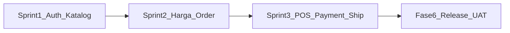
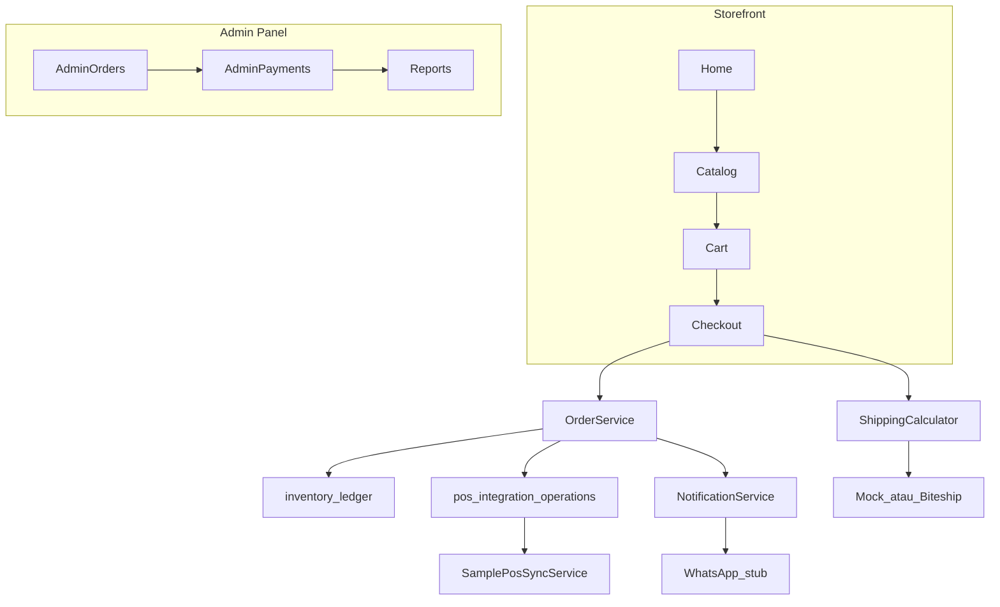

# Dokumen Handover Proyek Pixel Komunika

| Atribut | Nilai |
|---|---|
| Versi dokumen | 1.0 |
| Tanggal handover | Selasa, 1 September 2026 |
| Penulis | Kris Adiwinata — Webekspres |
| Repo | [Webekspres/pixel-komunika](https://github.com/Webekspres/pixel-komunika) |
| Branch aktif pengembangan | `dev` |
| Alur promosi | `dev` → `staging` → `main` |
| Versi PDF | [HANDOVER.pdf](HANDOVER.pdf) (diagram sudah di-render) |

---

## Daftar Isi

1. [Identitas Proyek](#1-identitas-proyek)
2. [Ringkasan Eksekutif](#2-ringkasan-eksekutif)
3. [Scope Produk & Referensi Dokumen](#3-scope-produk--referensi-dokumen)
4. [Progress per Sprint & Fase](#4-progress-per-sprint--fase)
5. [Matriks MVP: Selesai vs Belum](#5-matriks-mvp-selesai-vs-belum)
6. [Fitur Belum Diimplementasi / Ditunda](#6-fitur-belum-diimplementasi--ditunda)
7. [Arsitektur Teknis](#7-arsitektur-teknis)
8. [Panduan Setup & Operasional](#8-panduan-setup--operasional)
9. [Testing](#9-testing)
10. [Halaman & Modul (Quick Reference)](#10-halaman--modul-quick-reference)
11. [Data Contoh vs Production](#11-data-contoh-vs-production)
12. [Risiko & Rekomendasi untuk Pengganti](#12-risiko--rekomendasi-untuk-pengganti)
13. [Glosarium & Kontak](#13-glosarium--kontak)
14. [Checklist Serah Terima](#14-checklist-serah-terima)

---

## 1. Identitas Proyek

| Peran | Nama / Entitas |
|---|---|
| Klien | Pixel Komunika |
| Perwakilan klien (Product Owner) | Sylvi |
| Vendor pengembang | PT Webekspres Teknologi Indonesia |
| System Analyst | Sultan |
| Project Manager | Pak Endang |
| PIC POS (vendor eksternal) | Kak Rio |
| Developer handover | Kris Adiwinata |

**Deskripsi singkat:** Website e-commerce B2B untuk pelanggan/reseller terverifikasi. Sistem mengelola katalog, harga partai/grosir, stok, order, invoice, pembayaran transfer manual, pengiriman, PPh 22, dan laporan. Website menjadi *source of truth* transaksi dan invoice; data produk/stok production bersumber dari POS; estimasi ongkir memakai Biteship Maps + Rates.

**Stack teknologi:**

- PHP 8.3+ / Laravel 13
- Blade + Livewire 4 + Tailwind CSS 4 + Vite
- MySQL / MariaDB
- Pest (testing)
- Queue, cache, session berbasis database/file (tanpa Redis di baseline)
- Production baseline: **shared hosting** milik klien

---

## 2. Ringkasan Eksekutif

### Apa yang sudah bisa dilakukan hari ini

Alur penjualan website sudah **dapat dijalankan end-to-end** dengan data contoh: pelanggan mendaftar → admin menyetujui akun → pelanggan aktif melihat harga → menambah ke keranjang → checkout dengan perhitungan PPh 22 dan ongkir → order + invoice (HTML dan PDF) terbit → pelanggan mengunggah bukti transfer → admin memverifikasi pembayaran → admin memproses fulfillment (processing → packed → shipped → completed) → konfirmasi penerimaan via tautan publik atau auto-complete 5 hari kerja. Panel admin mencakup review pelanggan, pesanan, pembayaran, katalog, laporan omzet, audit log, dan pengaturan toko.

### Progress MVP

| Indikator | Nilai |
|---|---|
| Estimasi kelengkapan MVP | **~75%** |
| Test otomatis | **146/146 lulus** (706 assertions, per 1 September 2026) |
| Sprint 1–2 | Selesai |
| Sprint 3 | ~95% (integrasi live pending) |
| Fase 6 (release/UAT) | Persiapan |

**Artinya praktis:** fondasi bisnis dan teknis sudah kuat untuk demo, staging, dan UAT internal. Go-live production **belum aman** tanpa integrasi eksternal final.

### Tiga blocker utama go-live

1. **POS production** — adapter saat ini masih *sample/mock*; kontrak HTTP final belum ditandatangani dengan vendor POS (PIC: Kak Rio).
2. **WhatsApp produksi** — notifikasi order baru dan tautan konfirmasi penerimaan masih driver `log`/`fake`, bukan provider sungguhan.
3. **Biteship live** — kode siap, tetapi default driver `mock`; aktivasi live membutuhkan `BITESHIP_API_KEY` dan verifikasi `BITESHIP_ORIGIN_AREA_ID`.

### Rekomendasi prioritas next steps

1. Koordinasi Kak Rio untuk kontrak POS + *contract test* (lihat [POS_FOLLOW_UP.md](POS_FOLLOW_UP.md)).
2. Smoke test di staging (`dev.store.pixelkomunika.com`) dengan skenario UAT.
3. Dapatkan keputusan klien untuk provider WhatsApp, template, dan credential.
4. Verifikasi origin area Biteship dengan alamat toko aktual.
5. Finalisasi keputusan terbuka OPN-006 (tarif/pembulatan PPh 22) dan OPN-008/OPN-022 (format invoice/reseller).
6. Sign-off daftar P0 di [MVP.md](requirements/MVP.md) — saat ini masih **Pending review** dari Sylvi, Sultan, dan Pak Endang.

---

## 3. Scope Produk & Referensi Dokumen

### Hierarki dokumen

| Dokumen | Peran | Lokasi |
|---|---|---|
| BRD | Tujuan bisnis, scope, business rules, risiko, keputusan terbuka | [requirements/BRD.md](requirements/BRD.md) |
| FRD | Fungsi per modul, aktor, acceptance criteria | [requirements/FRD.md](requirements/FRD.md) |
| SRS | Arsitektur, stack, integrasi, keamanan, deployment | [requirements/SRS.md](requirements/SRS.md) |
| MVP | Daftar P0/Must Have dan acceptance gate 45 hari | [requirements/MVP.md](requirements/MVP.md) |
| ERD, Data Dictionary, User Flows, Sitemap | Desain data dan alur | [design/](design/) |
| Sprint demo & checklist | Histori delivery per iterasi | [SPRINT_1_DEMO.md](SPRINT_1_DEMO.md), [SPRINT_2_DEMO.md](SPRINT_2_DEMO.md), [sprints/SPRINT_3.md](sprints/SPRINT_3.md) |
| Progress harian | Log iterasi dan blocker | [PROGRESS.md](PROGRESS.md) |
| Review klien | Dokumen client-facing | [client/DOKUMEN_REVIEW_DAN_PERSETUJUAN_KLIEN.md](client/DOKUMEN_REVIEW_DAN_PERSETUJUAN_KLIEN.md) |

BRD, FRD, dan SRS berstatus **Approved Working Baseline** sejak 27 Juli 2026. MVP masih **Candidate P0** — menunggu persetujuan final klien.

### Tidak termasuk MVP (Out of Scope)

| Kategori | Item |
|---|---|
| Infrastruktur | Microservices, Kubernetes, Redis wajib, VPS (kecuali shared hosting tidak cukup) |
| Produk | Aplikasi mobile native, marketplace multivendor, payment gateway |
| Integrasi | Perubahan internal POS, endpoint baru di sisi POS, Biteship order/pickup/label/tracking/webhook |
| Fitur P1 | Reset password, pencarian/filter katalog lanjutan, export laporan CSV/XLSX |
| Fitur P2 | Optimasi scale-out lanjutan di luar baseline traffic |
| Belum disetujui | Promo/voucher, skema poin loyalitas (OPN-020), pencatatan order channel WhatsApp (OPN-002) |

---

## 4. Progress per Sprint & Fase



| Fase / Sprint | Status | Bukti / Referensi |
|---|---|---|
| **Fase 1** — Identity & access | Selesai | Registrasi, login, approval, guard akses |
| **Fase 2** — Catalog, pricing, stok, data contoh | Selesai | Import sample, PPh 22 admin UI, partai/grosir |
| **Fase 3** — Cart, checkout, shipping, order, invoice | Selesai | PDF invoice, gratis ongkir, konfirmasi penerimaan |
| **Fase 4** — Payment, cancel/return, admin workflow | Selesai | Livewire admin payments, transisi status FRD |
| **Fase 5** — Reporting, audit, sync resilience, security | Fondasi selesai | Audit UI, throttle; CI dependency scan belum |
| **Fase 6** — Release readiness | Persiapan | CI deploy ada; UAT/sign-off belum |
| **Sprint 1** — Auth, approval, katalog | Selesai | [SPRINT_1_DEMO.md](SPRINT_1_DEMO.md) |
| **Sprint 2** — Harga, PPh22, cart, checkout, invoice | Selesai | [SPRINT_2_DEMO.md](SPRINT_2_DEMO.md) |
| **Sprint 3** — POS outbox, payment, shipping, reports | ~95% | [sprints/SPRINT_3.md](sprints/SPRINT_3.md) |

---

## 5. Matriks MVP: Selesai vs Belum

Legenda status:

- **Selesai** — implementasi kode + test relevan lulus; siap UAT internal.
- **Parsial** — fondasi ada, tetapi go-live butuh keputusan/konfigurasi/integrasi eksternal.
- **Belum** — tidak ada implementasi atau sengaja ditunda (P1/P2).

| MVP ID | Kapabilitas | Status | Catatan Implementasi |
|---|---|---|---|
| MVP-001 | Registrasi dan autentikasi | **Selesai** | `RegisteredUserController`, `AuthenticatedSessionController`, rate limit login/register |
| MVP-002 | Approval dan status pelanggan | **Selesai** | `CustomerVerificationService`, status pending/active/rejected/suspended |
| MVP-003 | Hak akses guest, pending, reseller, admin | **Selesai** | Middleware `EnsureActiveCustomer`, `EnsureAdmin`; harga disembunyikan untuk guest/pending |
| MVP-004 | Katalog dan pelengkap produk | **Selesai** | Import sample POS-like, enrichment admin, media library; sync POS real belum |
| MVP-005 | Harga eceran, partai, dan grosir | **Selesai** | `PriceCalculator`, minimum partai global (default 5 unit/SKU), partai menang atas grosir |
| MVP-006 | Integrasi master data dan inventory POS | **Parsial** | Scheduler + `SamplePosSyncService`; **bukan HTTP POS production** |
| MVP-007 | Stok efektif dan rekonsiliasi | **Parsial** | `inventory_ledger` + outbox sale/return; ack masih sample simulator |
| MVP-008 | Keranjang dan checkout | **Selesai** | `CartService`, `Checkout` Livewire, breakdown subtotal/PPh22/ongkir server-side |
| MVP-009 | Order, invoice, riwayat, expiry | **Parsial** | Invoice HTML + PDF selesai; kirim via WhatsApp/email **belum** (OPN-022) |
| MVP-010 | Pembayaran transfer manual | **Selesai** | Upload bukti, verifikasi admin, audit, signed URL preview |
| MVP-011 | Pembatalan, retur, rekonsiliasi stok | **Selesai** | Cancel admin same-day + auto system; retur + restore stok + outbox return |
| MVP-012 | Pengiriman kurir toko dan Biteship | **Parsial** | Kurir toko + gratis ongkir ≥ Rp1jt selesai; Biteship live butuh aktivasi driver |
| MVP-013 | Laporan dasar | **Selesai** | `/admin/reports`, omzet dari status shipped/completed |
| MVP-014 | Audit dan penanganan gangguan | **Parsial** | `AuditLogger` + UI search; modul audit FRD penuh masih Proposed |
| MVP-015 | Security dan authorization | **Selesai** | CSRF, policies, rate limit, private upload, throttle checkout/upload |
| MVP-016 | Release readiness | **Parsial** | CI deploy staging/main ada; UAT, training, sign-off, contract test belum |
| MVP-017 | Ambang klasifikasi dan PPh 22 | **Parsial** | Formula `(basis / 1,11) × tarif` selesai; tarif multi-klasifikasi & pembulatan OPN-006 |
| MVP-018 | Notifikasi order baru admin | **Parsial** | Badge merah + notifikasi DB selesai; WhatsApp **stub** (`log`/`fake`) |
| MVP-019 | Reseller dan channel pemesanan | **Parsial** | Reseller via website selesai; order WhatsApp OPN-002 belum diputuskan |
| MVP-020 | Retensi bukti pembayaran | **Selesai** | `retain_until` 5 tahun, disk privat `payment-proofs` |

**Ringkasan numerik:** 11 selesai · 9 parsial · 0 belum total (semua P0 punya fondasi kode).

---

## 6. Fitur Belum Diimplementasi / Ditunda

### A. Integrasi eksternal (blocker go-live)

| Integrasi | Status kode | Yang dibutuhkan |
|---|---|---|
| **POS HTTP production** | `SamplePosSyncService` + outbox | Kontrak endpoint, auth, payload, contract test — [POS_FOLLOW_UP.md](POS_FOLLOW_UP.md) |
| **WhatsApp produksi** | `LogWhatsAppNotifier` / `FakeWhatsAppNotifier` | Provider, template, credential, retry — OPN-023 |
| **Biteship live** | `BiteshipShippingService` siap | Set `SHIPPING_DRIVER=biteship`, API key, origin area ID — OPN-021 |
| **Email transactional** | Mailer Laravel default (`log`) | Provider + template kirim invoice — OPN-022 |

### B. Requirement FRD status Proposed / P1

| Item | Prioritas | Keterangan |
|---|---|---|
| Reset password | P1 | Route belum ada — [SITEMAP.md](design/SITEMAP.md) §6 |
| Search/filter katalog lanjutan | P1 | Filter dasar ada di `/produk`; halaman terpisah ditunda |
| Export laporan CSV/XLSX | P1/TBD | Format belum disepakati |
| Audit modul lengkap (FR-AUD-001–004) | Proposed | `AuditLogger` partial; correlation ID & redaksi secret belum penuh |
| Idempotency checkout (FR-CART-007) | Proposed | `orders.idempotency_key` ada; UI/retry belum |

### C. Keputusan bisnis terbuka (OPN)

| ID | Topik | Status | Dampak ke kode |
|---|---|---|---|
| OPN-002 | Pencatatan order WhatsApp | Partially resolved | Channel WA order belum diimplementasi |
| OPN-005 | Kontrak API POS final | Partially resolved | Adapter sample; ganti saat kontrak final |
| OPN-006 | Tarif PPh 22 multi-klasifikasi & pembulatan | Formula resolved; rate/rounding open | `config/store.php` — strategy `max`, rounding `half_up` provisional |
| OPN-008 | Format nomor invoice | Partially resolved | Penomoran otomatis ada; awalan/format final TBD |
| OPN-010 | Tarif kurir toko per area | Threshold/H+1 resolved | `StoreCourierRate` — nilai per kecamatan perlu data klien |
| OPN-014 | Order gabungan — ongkir & propagasi resi | Partially resolved | `shipment_group_code` otomatis; pembebanan ongkir TBD |
| OPN-015 | Audit trail & scaling baseline | Open | BR-027–029 belum disetujui penuh |
| OPN-019 | Koneksi POS production + contract test | Partially resolved | Go-live diblokir tanpa ini |
| OPN-020 | Provider WA konfirmasi, kalender libur, poin | Partially resolved | Tautan konfirmasi ada; poin belum; `holidays` array kosong |
| OPN-021 | Produk besar, fallback berat/dimensi Biteship | Partially resolved | Origin default ada di `.env.example` |
| OPN-022 | Format NPWP/reseller, channel kirim invoice | Partially resolved | PDF + preview web selesai; kirim WA/email belum |
| OPN-023 | Provider WhatsApp notifikasi admin | Partially resolved | Stub driver aktif |

Detail lengkap: [BRD §15](requirements/BRD.md#15-keputusan-terbuka).

### D. Fase 6 belum selesai

- Contract test POS dan Biteship
- Smoke test staging terstruktur
- Dependency vulnerability scan di CI (NFR-SEC-010)
- UAT dengan Sylvi + training admin
- Go-live sign-off formal
- Verifikasi shared hosting: cron, log, backup, rollback

---

## 7. Arsitektur Teknis

### Diagram alur data



### Layer kode

| Layer | Lokasi | Isi |
|---|---|---|
| UI (Livewire) | `app/Livewire/` | 17 komponen — storefront, customer, admin |
| Controllers | `app/Http/Controllers/` | Auth, account, invoice, receipt, admin, API area/POS |
| Domain services | `app/Domains/` | Pricing, Order, POS, Audit, Reporting, Notifications, Catalog, Customer |
| Application services | `app/Services/` | Cart, Order, Payment, Shipping |
| Models | `app/Models/` | 33 model Eloquent |
| Routes | `routes/web.php`, `routes/api.php` | Web + POS read-only API |
| Commands | `app/Console/Commands/` | 8 command terjadwal |
| Views | `resources/views/` | Blade + Livewire templates |
| Tests | `tests/` | 42 file test Pest (Feature + Unit) |

### Domain services utama

| Service | File | Fungsi |
|---|---|---|
| PriceCalculator | `app/Domains/Pricing/PriceCalculator.php` | Harga grosir/partai, PPh 22 |
| OrderService | `app/Services/OrderService.php` | Place order, cancel, retur, stok |
| PaymentService | `app/Services/PaymentService.php` | Upload & verifikasi bukti |
| FulfillmentService | `app/Domains/Order/FulfillmentService.php` | Transisi status, shipment |
| PosOutboxService | `app/Domains/PosIntegration/PosOutboxService.php` | Antrean laporan ke POS |
| SamplePosSyncService | `app/Domains/PosIntegration/SamplePosSyncService.php` | Adapter sample (ganti untuk production) |
| ReportingService | `app/Domains/Reporting/ReportingService.php` | Omzet & PPh 22 |
| AuditLogger | `app/Domains/Audit/AuditLogger.php` | Jejak audit aksi kritis |
| NotificationService | `app/Domains/Notifications/NotificationService.php` | Notifikasi DB + WhatsApp stub |

### Pola arsitektural penting

- **Modular monolith** — bukan microservices; domain logic di `app/Domains/`.
- **Stok efektif** — `inventory_snapshots` + `inventory_ledger`; mutasi pakai `DB::transaction` + `lockForUpdate()`.
- **POS outbox** — laporan penjualan/retur ke `pos_integration_operations`; dispatcher tiap 5 menit; idempotency via `external_reference`.
- **Enrichment lokal** — nama tampilan, media, berat, dimensi tidak ditimpa sync POS.
- **Shipping driver switch** — binding di `AppServiceProvider`: `mock` (default) atau `biteship`.
- **WhatsApp driver switch** — `log` (default) atau `fake` untuk testing.

### Middleware & keamanan

| Middleware | Fungsi |
|---|---|
| `EnsureAdmin` | Guard panel admin |
| `EnsureActiveCustomer` | Guard checkout & riwayat pesanan |
| `VerifyPosApiToken` | Auth API POS read-only |
| Throttle | Login/register 5/menit; checkout 10/menit; upload bukti 5/menit |

Policies: `OrderPolicy`, `PaymentProofPolicy`, `CustomerProfilePolicy`.

---

## 8. Panduan Setup & Operasional

### Prasyarat

- PHP 8.3+, Composer, Node.js, MySQL/MariaDB
- Database: `pixelkomunika_db` (default)

### Setup development

```bash
git clone https://github.com/Webekspres/pixel-komunika.git
cd pixel-komunika
git checkout dev

composer install
cp .env.example .env
php artisan key:generate
# Sesuaikan DB_* di .env jika perlu
php artisan migrate
npm install
npm run build

# Jalankan server + queue + vite sekaligus
composer run dev

# Import data contoh (idempotent)
php artisan catalog:import-sample

# Verifikasi
composer test
curl http://localhost:8000/health
```

### Environment variables kunci

| Variable | Fungsi | Default dev |
|---|---|---|
| `DB_*` | Koneksi database | mysql / pixelkomunika_db |
| `APP_TIMEZONE` | Zona waktu order/expiry | `Asia/Jakarta` |
| `POS_API_TOKEN` | Auth API baca order POS | kosong |
| `BITESHIP_API_KEY` | API key Biteship | kosong |
| `BITESHIP_ORIGIN_AREA_ID` | Origin pengiriman | ada di `.env.example` |
| `SHIPPING_DRIVER` | `mock` atau `biteship` | `mock` |
| `WA_DRIVER` | `log` atau `fake` | `log` |
| `STORE_*` | Identitas toko | Pixel Komunika defaults |
| `PPH22_DIVISOR` | Pembagi dasar PPh 22 | `1.11` |
| `STORE_FREE_SHIPPING_THRESHOLD` | Ambang gratis ongkir kurir toko | `1000000` |
| `ORDER_AUTO_COMPLETE_WORKDAYS` | Auto-complete setelah shipped | `5` |
| `PAYMENT_PROOF_RETAIN_YEARS` | Retensi bukti bayar | `5` |

Kredensial production **tidak** disimpan di repository.

### Scheduler / cron production

Wajib di shared hosting via cron:

```bash
* * * * * cd /path/to/app && php artisan schedule:run >> /dev/null 2>&1
```

Jadwal di [`routes/console.php`](../routes/console.php):

| Command | Frekuensi | Fungsi |
|---|---|---|
| `orders:auto-cancel-unpaid` | Harian 00:05 | Batalkan order unpaid kemarin |
| `orders:auto-complete-shipped` | Harian 00:15 | Auto-complete shipped (skip TERKENDALA) |
| `pos:sync-masters` | Harian 01:00 | Sync master data POS |
| `pos:sync-stock` | Harian 01:30 | Sync stok POS |
| `pos:dispatch-sale-reports` | Tiap 5 menit | Kirim laporan penjualan |
| `pos:dispatch-return-reports` | Tiap 5 menit | Kirim laporan retur |
| `notifications:dispatch-pending` | Tiap 5 menit | Kirim notifikasi WhatsApp pending |

Queue worker (bounded, shared hosting):

```bash
php artisan queue:work --stop-when-empty --tries=3
```

### Deploy

Push ke branch `staging` atau `main` memicu GitHub Actions:

1. `composer install`
2. `php artisan test` (146 test)
3. Deploy via cPanel API ke path repository

| Branch | Environment | Path repository |
|---|---|---|
| `staging` | Staging | `/home/pixelkom/repositories/dev.store.pixelkomunika.com` |
| `main` | Production | `/home/pixelkom/repositories/store.pixelkomunika.com` |

Workflow: [`.github/workflows/deploy.yml`](../.github/workflows/deploy.yml).

**Kebijakan branch:** jangan push ke `dev`/`staging`/`main` tanpa permintaan eksplisit. Alur promosi: `dev` → `staging` → `main`.

### Command artisan berguna

| Command | Fungsi |
|---|---|
| `catalog:import-sample` | Import/upsert data contoh POS-like |
| `pos:sync-masters` | Sync master (manual) |
| `pos:sync-stock` | Sync stok (manual) |
| `orders:auto-cancel-unpaid` | Cancel unpaid (manual) |
| `orders:auto-complete-shipped` | Auto-complete (manual) |

---

## 9. Testing

| Atribut | Nilai |
|---|---|
| Framework | Pest 4 + Laravel plugin |
| File test | 42 file (36 Feature, 5 Unit, 1 Example) |
| Total test | **146 passed**, 706 assertions |
| Perintah | `composer test` atau `php artisan test` |

### Area coverage kuat

- Auth, registrasi, rate limit
- Akses pelanggan (guest/pending/active)
- Storefront, katalog, harga grosir/partai
- Cart, checkout end-to-end, charge components, inventory ledger
- Pembayaran upload/approve/reject, retur stok
- Invoice PDF download & authorization
- Konfirmasi penerimaan publik (token)
- Shipping mock & Biteship error mapping
- Admin: dashboard, pelanggan, pesanan, pembayaran, katalog, pajak, laporan, settings, notifikasi, audit
- POS API read-only
- Auto-cancel unpaid, rate limit checkout/upload
- Import katalog idempotent, health check

### Gap coverage

- Integrasi POS HTTP production (real adapter)
- WhatsApp provider production
- Email transactional
- Contract test Biteship live end-to-end di staging
- Dependency vulnerability scan CI

---

## 10. Halaman & Modul (Quick Reference)

### Storefront & auth

| Halaman | Path | Akses |
|---|---|---|
| Beranda | `/` | Semua |
| Katalog | `/produk` | Semua (harga sesuai hak) |
| Detail produk | `/produk/{product}` | Semua |
| Keranjang | `/cart` | Login (checkout: reseller aktif) |
| Daftar | `/daftar` | Guest |
| Masuk | `/masuk` | Guest |
| Konfirmasi penerimaan | `/konfirmasi-penerimaan/{order}?token=…` | Publik (token) |

### Area pelanggan

| Halaman | Path | Akses |
|---|---|---|
| Ringkasan akun | `/akun` | Login |
| Profil | `/akun/profil` | Login |
| Alamat | `/akun/alamat` | Login |
| Checkout | `/checkout` | Reseller aktif |
| Daftar pesanan | `/akun/pesanan` | Reseller aktif |
| Detail pesanan + bukti bayar | `/akun/pesanan/{order}` | Pemilik order |
| Invoice / PDF | `/akun/pesanan/{order}/invoice` | Pemilik order |

### Area admin (`/admin/*`)

| Halaman | Path |
|---|---|
| Dashboard | `/admin` |
| Pelanggan | `/admin/customers` |
| Pesanan | `/admin/orders` |
| Pembayaran | `/admin/payments` |
| Produk & enrichment | `/admin/products` |
| Media | `/admin/media` |
| Kategori / Merek | `/admin/categories`, `/admin/brands` |
| Aturan PPh 22 | `/admin/tax-rules` |
| Laporan | `/admin/reports` |
| Audit log | `/admin/audit-logs` |
| Pengaturan | `/admin/settings` |

### API

| Endpoint | Auth | Fungsi |
|---|---|---|
| `GET /api/areas/search` | Login | Cari area pengiriman |
| `GET /api/areas/districts` | Login | Daftar kecamatan |
| `GET /api/pos/orders/{order_number}` | `POS_API_TOKEN` | Baca order untuk POS |
| `GET /health` | Publik | Health check DB |

### Halaman ditunda (bukan P0)

- Lupa/reset password (P1)
- Wishlist, notifikasi pelanggan
- About, FAQ, Contact terpisah

Detail lengkap: [SITEMAP.md](design/SITEMAP.md).

---

## 11. Data Contoh vs Production

| Konteks | Sumber data | Cara |
|---|---|---|
| Local development | Data contoh | `php artisan catalog:import-sample`, seeder |
| Staging / demo / UAT | Data contoh | Sama — boleh diulang (idempotent) |
| **Production** | **POS real wajib** | Ganti `SamplePosSyncService` dengan adapter HTTP final |

**Aturan penting:**

- Data contoh **tidak boleh** menjadi sumber produk/stok production.
- SKU dan external ID data contoh stabil; import berulang tidak duplikasi atau menimpa enrichment lokal.
- Go-live diblokir tanpa contract test POS (OPN-019).
- Trigger akses POS: alur website berbasis data contoh sudah berjalan — koordinasi via Kak Rio.

---

## 12. Risiko & Rekomendasi untuk Pengganti

### Prioritas berurutan

1. **POS** — Dapatkan dokumen kontrak dari Kak Rio; implementasi adapter HTTP; jalankan contract test master, stok, sale report, return report, acknowledgement, idempotency.
2. **Biteship** — Verifikasi `BITESHIP_ORIGIN_AREA_ID` dengan alamat toko; uji rates live di staging; set `SHIPPING_DRIVER=biteship`.
3. **WhatsApp** — Pilih provider; implementasi driver production; template "Cek Order masuk" dan tautan konfirmasi penerimaan.
4. **UAT staging** — Jalankan skenario dari SPRINT_1/2/3 demo docs dengan Sylvi.
5. **Keputusan bisnis** — Tutup OPN-006, OPN-008, OPN-010, OPN-014, OPN-020, OPN-022.
6. **Sign-off MVP** — Dapatkan persetujuan tertulis daftar P0 di MVP.md.
7. **Release** — Smoke test production, backup/rollback, training admin, go-live sign-off.

### Risiko teknis

| Risiko | Mitigasi |
|---|---|
| POS timeout → laporan ganda | Outbox + idempotency + external_reference sudah ada; uji skenario timeout |
| Shared hosting queue terbatas | `--stop-when-empty` worker; scheduler-based dispatch |
| PPh 22 salah setelah keputusan klien | Config `store.pph22` + admin tax rules; update test setelah OPN-006 final |
| Biteship down saat checkout | Fallback: minta pelanggan hubungi admin (OPN-016 resolved) |

### File penting untuk dibaca pertama

1. [PROGRESS.md](PROGRESS.md) — log iterasi terbaru
2. [sprints/SPRINT_3.md](sprints/SPRINT_3.md) — checklist verifikasi Sprint 3
3. [POS_FOLLOW_UP.md](POS_FOLLOW_UP.md) — daftar konfirmasi ke vendor POS
4. [AGENTS.md](../AGENTS.md) — aturan agent, branch policy, destructive actions
5. [README.md](../README.md) — setup cepat

---

## 13. Glosarium & Kontak

### Istilah domain

| Istilah | Arti |
|---|---|
| Reseller | Akun terdaftar yang disetujui admin; dapat melihat harga dan checkout |
| Partai | Harga khusus jika ≥1 SKU mencapai minimum global (default 5 unit); berlaku cart-wide |
| Grosir | Harga dengan minimum kuantitas per produk; kalah prioritas dari partai |
| PPh 22 | Pajak penghasilan; `(subtotal_klasifikasi / 1,11) × tarif` |
| TERKENDALA | Penanda order shipped yang menahan auto-complete scheduler |
| Outbox POS | Antrean operasi `WEB_SALE_REPORT` / `WEB_RETURN_REPORT` ke POS |
| Enrichment | Data lokal website (nama tampilan, media, berat) yang tidak ditimpa sync POS |

### Kontak

| Peran | PIC | Catatan |
|---|---|---|
| Product Owner klien | Sylvi | Persetujuan scope, UAT, go-live |
| PIC POS | Kak Rio | Kontrak API, akses sandbox/production |
| System Analyst | Sultan | Requirement, traceability |
| Project Manager | Pak Endang | Timeline, release governance |
| Developer handover | Kris Adiwinata | `ka.webekspres@gmail.com` |

---

## 14. Checklist Serah Terima

Centang saat handover selesai:

- [ ] Akses repo GitHub dan branch policy (`dev` → `staging` → `main`) dijelaskan
- [ ] Perbedaan `.env.example` vs secret production dipahami
- [ ] Demo flow end-to-end dapat dijalankan di local/staging
- [ ] Test suite lulus (`composer test` — 146/146)
- [ ] Blocker eksternal terdokumentasi dengan PIC masing-masing
- [ ] Link ke BRD, FRD, SRS, MVP, ERD, user flows valid
- [ ] Cron/scheduler production dikonfigurasi di hosting
- [ ] Kredensial staging/production diserahkan via channel aman (bukan repo)
- [ ] Sylvi / Pak Endang / Sultan menerima dokumen ini

---

*Dokumen ini adalah snapshot status per 1 September 2026. Untuk log iterasi harian, lihat [PROGRESS.md](PROGRESS.md). Untuk requirement detail, selalu rujuk BRD/FRD/SRS sebagai sumber kebenaran.*
