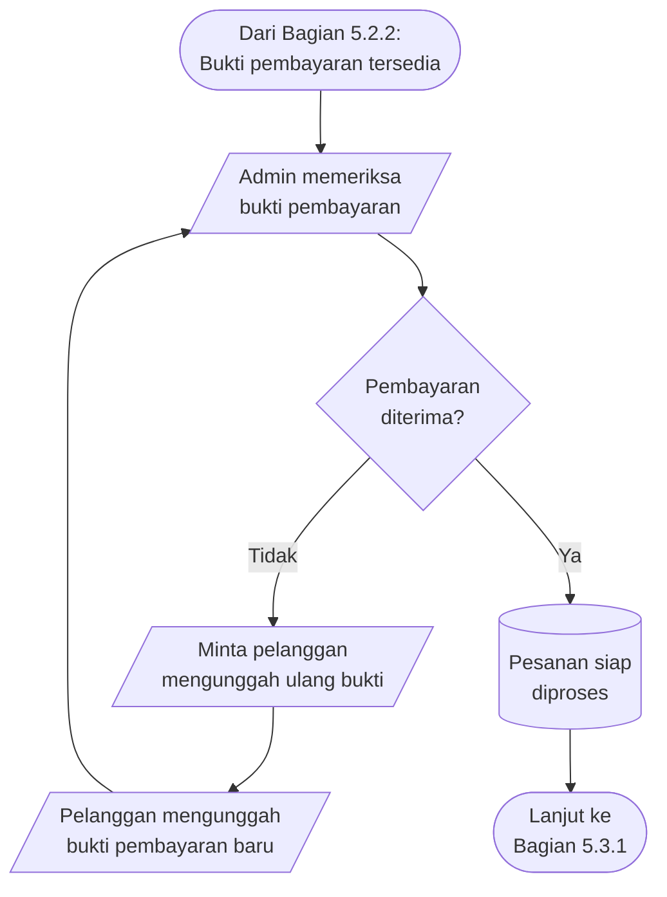
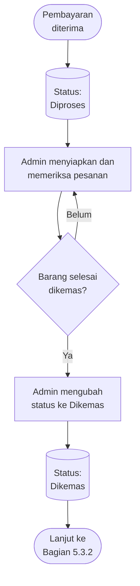
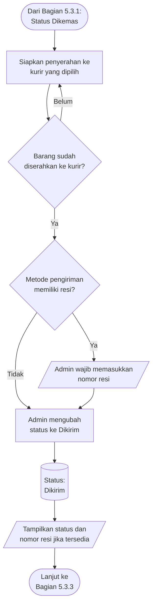
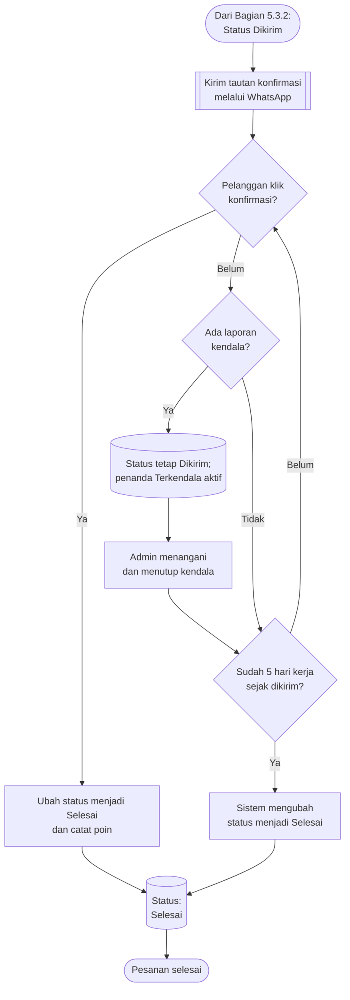
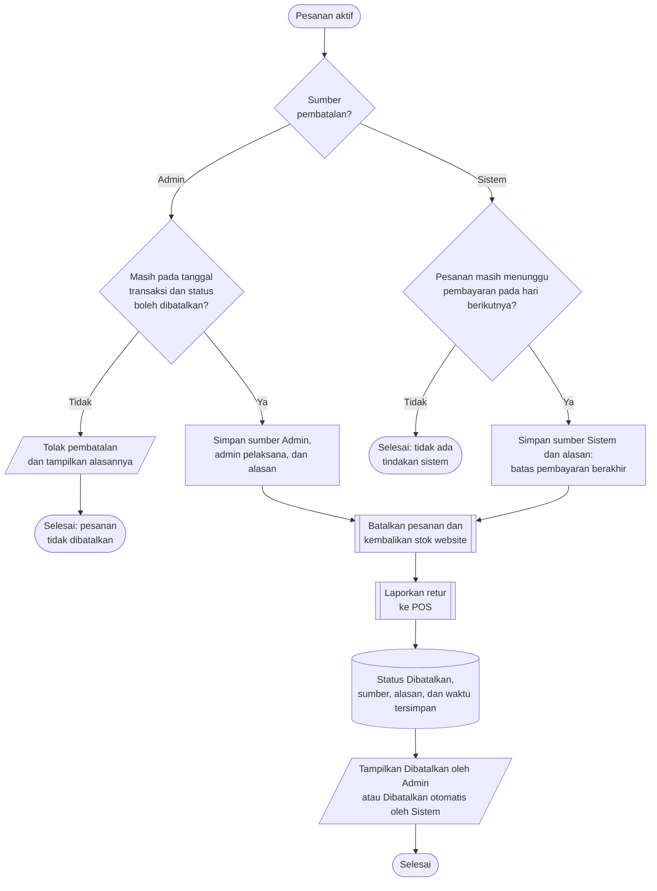
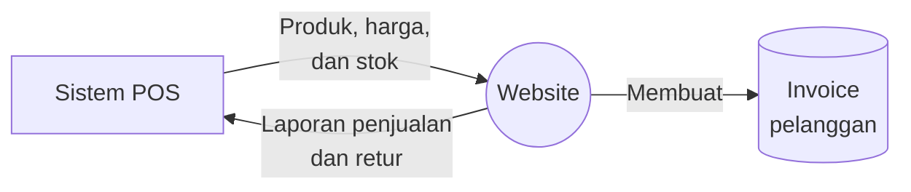

# Ringkasan Ruang Lingkup dan Persetujuan Pengembangan Website

## Pixel Komunika

| Keterangan | Isi |
|---|---|
| Dokumen | Ringkasan untuk pemeriksaan dan persetujuan klien |
| Versi | 1.12 |
| Tanggal | Selasa, 11 Agustus 2026 |
| Klien | Pixel Komunika |
| Perwakilan klien | Sylvi |
| Pengembang | PT Webekspres Teknologi Indonesia |
| Target pengerjaan | 45 hari kerja |
| Status | Menunggu pemeriksaan dan persetujuan klien |

## Pemberitahuan Penting: Kedudukan Dokumen

> **Dokumen ini merupakan pelengkap dari proposal penawaran dan kesepakatan
> komersial yang telah dibuat sebelumnya. Dokumen ini tidak menggantikan,
> mengubah, membatalkan, atau mengambil alih kedudukan proposal penawaran
> maupun kesepakatan komersial tersebut.**

Dokumen ini hanya digunakan untuk memberitahukan dan mengonfirmasi:

- fitur, aturan, dan alur yang akan dikerjakan oleh pengembang;
- batas pekerjaan yang termasuk dan tidak termasuk dalam versi pertama; serta
- kondisi yang digunakan untuk menilai apakah versi pertama telah selesai
  sesuai ruang lingkup fungsional.

Persetujuan klien terhadap dokumen ini hanya berarti persetujuan atas pemahaman
ruang lingkup fungsional versi pertama. Persetujuan tersebut **bukan**
kesepakatan komersial baru dan tidak mengubah harga, termin pembayaran, jangka
waktu, atau ketentuan komersial lain yang telah disepakati sebelumnya.

Apabila terdapat perbedaan antara dokumen ini dengan proposal penawaran atau
kesepakatan komersial sebelumnya, proposal penawaran dan kesepakatan komersial
tersebut tetap berlaku, kecuali perubahan telah dinyatakan secara tertulis dan
disetujui oleh Pixel Komunika dan PT Webekspres Teknologi Indonesia.

## 1. Tujuan Dokumen

Dokumen ini merangkum pemahaman Webekspres mengenai website yang akan
dikembangkan untuk Pixel Komunika. Tujuannya adalah memastikan bahwa fitur,
aturan bisnis, alur kerja, dan hasil akhir yang diharapkan sudah sesuai dengan
kebutuhan operasional Pixel Komunika.

Istilah **versi pertama** pada dokumen ini berarti kumpulan fitur utama yang
wajib tersedia agar website dapat digunakan dari proses pendaftaran pelanggan
sampai pesanan selesai.

Klien diharapkan:

1. memeriksa apakah ringkasan kebutuhan sudah benar;
2. menjawab bagian yang masih memerlukan keputusan;
3. memberi koreksi jika ada alur yang tidak sesuai; dan
4. menyetujui ruang lingkup versi pertama sebagai dasar pengerjaan.

Kedudukan dan batas fungsi dokumen dijelaskan pada
[Pemberitahuan Penting](#pemberitahuan-penting-kedudukan-dokumen).

### TL;DR

Untuk pemeriksaan paling cepat:

1. pahami terlebih dahulu
   [kedudukan dan batas fungsi dokumen](#pemberitahuan-penting-kedudukan-dokumen);
2. periksa [fitur yang termasuk dalam versi pertama](#3-fitur-yang-termasuk-dalam-versi-pertama);
3. sampaikan persetujuan, revisi, penolakan, atau pilihan lain dengan mengikuti
   [cara memberikan tanggapan melalui grup WhatsApp](#11-cara-memberikan-tanggapan-melalui-grup-whatsapp);
4. jawab [keputusan yang masih diperlukan dari klien](#8-keputusan-yang-masih-diperlukan-dari-klien),
   termasuk [cara memastikan barang telah diterima](#811-perubahan-status-pengiriman-dan-konfirmasi-barang-diterima);
5. periksa [kriteria penerimaan versi pertama](#9-kriteria-penerimaan-versi-pertama);
   dan
6. berikan [persetujuan akhir](#11-persetujuan) melalui grup WhatsApp proyek.

### 1.1 Cara Memberikan Tanggapan melalui Grup WhatsApp

Klien **tidak perlu mengisi, mengedit, menandatangani, atau mengirimkan ulang
dokumen ini**. Seluruh tanggapan cukup disampaikan secara tertulis melalui grup
WhatsApp proyek.

Klien dapat memberikan tanggapan dengan cara:

1. menyetujui seluruh dokumen atau poin tertentu;
2. memberikan daftar poin yang perlu direvisi;
3. menolak saran tertentu dan, jika memungkinkan, menjelaskan alasannya;
4. memberikan pilihan atau solusi lain yang lebih sesuai dengan operasional
   Pixel Komunika; dan
5. menjawab pertanyaan pada
   [Bagian 8](#8-keputusan-yang-masih-diperlukan-dari-klien).

Jawaban dapat diberikan sekaligus atau bertahap. Format berikut **hanya contoh
dan tidak wajib digunakan**. Format ini disediakan agar poin tanggapan mudah
dipahami dan dirujuk kembali oleh klien maupun Webekspres. Klien tetap boleh
memberikan tanggapan tertulis dengan kalimat bebas melalui grup WhatsApp selama
bagian atau keputusan yang dimaksud cukup jelas.

Contoh format tanggapan:

> **Status:** Setuju / Setuju dengan revisi / Belum setuju
>
> **Bagian atau poin:** Contoh, Bagian 8.1
>
> **Jawaban atau revisi:** ...
>
> **Saran yang ditolak:** ...
>
> **Pilihan lain:** ...

Webekspres akan mencatat jawaban tersebut, memperbarui dokumentasi proyek, dan
mengirimkan ringkasan apabila diperlukan. Pesan persetujuan dari perwakilan
klien di grup WhatsApp menjadi arahan tertulis dari pihak klien. Keputusan baru
efektif menjadi dasar pengerjaan setelah dikonfirmasi oleh Webekspres pada hari
kerja.

## 2. Ringkasan Website

Website akan digunakan sebagai kanal penjualan untuk reseller yang telah
terdaftar dan disetujui oleh admin Pixel Komunika.

Pengunjung dan pelanggan yang belum disetujui tetap dapat melihat katalog,
tetapi tidak dapat melihat harga atau melakukan pembelian. Setelah akun
disetujui, pelanggan dapat melihat harga yang berlaku, membuat pesanan,
memilih pengiriman, menerima invoice, mengirim bukti pembayaran, dan memantau
status pesanannya.

Website membuat transaksi dan invoice. Sistem POS menyediakan SKU, data dasar
produk, harga, dan stok, kemudian menerima laporan penjualan atau retur dari
website. Nama tampilan produk dapat diperbarui mandiri melalui website.

## 3. Fitur yang Termasuk dalam Versi Pertama

| Area | Hasil yang Akan Tersedia |
|---|---|
| Pendaftaran reseller | Reseller dapat mendaftar, masuk, dan keluar dari akun. |
| Persetujuan akun | Admin dapat menyetujui, menolak, menangguhkan, atau mengaktifkan kembali akun pelanggan. |
| Hak akses | Pengunjung dan pelanggan yang belum disetujui dapat melihat katalog tanpa harga. Hanya pelanggan aktif yang dapat melihat harga, melakukan pembelian, dan melihat riwayat transaksinya sendiri. |
| Katalog produk | Website menampilkan produk, kategori, merek, SKU, deskripsi, gambar, dan video produk. |
| Sumber data produk | SKU, data dasar produk, kategori, merek, harga, dan stok mengikuti POS. Nama tampilan produk serta informasi presentasi lain dapat diperbarui mandiri melalui website. |
| Tiga jenis harga | Setiap produk memiliki harga eceran, partai, dan grosir. Harga eceran disiapkan tetapi belum ditampilkan kepada pelanggan pada versi pertama. |
| Harga partai | Minimum awal adalah lima unit dari satu jenis produk dan dapat diubah admin. Jika terpenuhi, harga partai berlaku untuk seluruh produk dalam pesanan. Jika satu produk juga memenuhi harga grosir, harga partai digunakan. |
| Harga grosir | Batas minimum dan harga grosir dapat berbeda untuk setiap produk dan mengikuti data dari POS. |
| PPh 22 | Jika subtotal klasifikasi melewati batas, seluruh subtotal klasifikasi tersebut masuk perhitungan. Nilai semua klasifikasi terpicu digabung, dibagi `1,11`, lalu dikalikan persentase PPh 22. |
| Stok | Website memperbarui stok ketika terjadi penjualan atau retur, kemudian mencocokkannya dengan data POS secara berkala. |
| Keranjang dan penyelesaian pembelian | Pelanggan dapat memilih produk, jumlah barang, alamat, dan layanan pengiriman serta melihat rincian total sebelum membuat pesanan. |
| Pesanan dan invoice | Website membuat pesanan dan invoice. Invoice dapat dilihat di website, diunduh sebagai PDF, dan dikirim melalui WhatsApp atau email sesuai pilihan. |
| Pembayaran | Pembayaran dilakukan melalui transfer bank. Pelanggan mengunggah bukti pembayaran dan admin menerima atau menolaknya. |
| Masa berlaku pesanan | Pesanan yang belum dibayar hanya berlaku pada tanggal pembuatannya dan otomatis dibatalkan pada hari berikutnya. |
| Pemrosesan pesanan | Setelah pembayaran diterima, statusnya Diproses, Dikemas, Dikirim, lalu Selesai. Pelanggan dapat mengonfirmasi penerimaan melalui tautan WhatsApp. Sistem menyelesaikan otomatis setelah lima hari kerja sejak dikirim jika tidak ada kendala. |
| Nomor resi | Resi wajib diisi sebelum Dikirim hanya untuk metode yang memiliki resi; kurir toko tidak memerlukan resi. |
| Pengiriman | Kurir toko melayani seluruh kecamatan Kota/Kabupaten Bandung dengan target H+1 hari kerja atau H+2 bila kurir tidak tersedia. Biteship menyediakan pilihan termasuk Grab/Gojek same-day. |
| Penggabungan pengiriman | Beberapa pesanan dapat digabung jika alamat tujuannya sama; nomor pesanan dan invoice tetap terpisah. |
| Pembatalan dan retur | Admin dapat membatalkan pesanan secara manual hanya pada tanggal transaksi. Pesanan yang belum dibayar dibatalkan otomatis oleh sistem pada hari berikutnya. Keduanya memakai status `Dibatalkan`, disertai keterangan apakah pembatalan dilakukan oleh admin atau sistem. Pembatalan mengembalikan stok website dan dilaporkan ke POS sebagai retur. |
| Notifikasi admin | Order baru menampilkan tanda merah dan mengirim pesan `Cek Order masuk` ke `081546407702`. Tanda dibaca saat admin membuka daftar pesanan yang akan diproses. |
| Laporan | Admin dapat melihat laporan transaksi, omzet, dan PPh 22 berdasarkan periode/wilayah. Pesanan mulai dihitung sebagai omzet saat dikirim. |
| Retensi bukti pembayaran | Bukti pembayaran disimpan selama lima tahun. |
| Reseller | Akun yang disetujui admin menjadi reseller aktif, dapat melihat harga, dan dapat memesan lewat website atau WhatsApp. |
| Keamanan dan pencatatan | Hak akses pengguna dibatasi sesuai perannya. Tindakan penting admin dan gangguan pertukaran data dicatat agar dapat diperiksa kembali. |

## 4. Keputusan yang Sudah Disepakati

1. Website produksi menggunakan shared hosting milik klien. Klien akan
   memberikan akses yang diperlukan kepada developer Webekspres untuk
   menyiapkan dan memasang website. Detail akses akan diserahkan secara aman
   sebelum proses pemasangan.
2. SKU, data dasar produk, kategori, merek, harga, dan stok bersumber dari POS.
3. Website dapat mengubah nama tampilan produk dan melengkapi gambar, video,
   deskripsi, serta informasi presentasi lain.
4. Setiap produk memiliki harga eceran, partai, dan grosir.
5. Harga eceran disiapkan tetapi belum ditampilkan pada versi pertama.
6. Minimum harga partai bernilai awal lima unit dari satu jenis produk dan dapat
   diubah admin. Jika terpenuhi, harga partai berlaku untuk seluruh pesanan dan
   diprioritaskan terhadap harga grosir.
7. Aturan PPh 22 diatur melalui website dan dapat dinonaktifkan dengan
   persentase `0%`.
8. PPh 22 ditampilkan terpisah pada keranjang, halaman konfirmasi pembelian,
   invoice, dan laporan.
9. Seluruh subtotal klasifikasi yang melewati ambang digabung, dibagi `1,11`,
   lalu dikalikan persentase PPh 22 menjadi satu nilai.
10. Website membuat transaksi dan invoice.
11. POS menerima laporan penjualan untuk mencatat penjualan dan mengurangi
    stok, serta laporan retur untuk mencatat retur dan menambah stok.
12. Pesanan yang belum dibayar otomatis dibatalkan oleh sistem pada hari
    berikutnya.
13. Pembatalan manual oleh admin hanya dapat dilakukan pada tanggal transaksi.
    Website membedakan sumber pembatalan `Admin` dan `Sistem` sebagai keterangan,
    tanpa membuat dua status pembatalan yang berbeda.
14. Setelah pembayaran diterima, urutan statusnya Diproses, Dikemas, Dikirim,
    lalu Selesai. Resi wajib hanya untuk pengiriman yang memilikinya. Pelanggan
    mengonfirmasi melalui tautan WhatsApp; sistem menyelesaikan otomatis setelah
    lima hari kerja jika tidak ada penanda Terkendala.
15. Admin menerima indikator website dan pesan `Cek Order masuk` melalui
    WhatsApp `081546407702` untuk order baru.
16. Akses POS akan dibuka setelah alur website dengan data contoh sudah
    berjalan. Koordinasi akses dilakukan dengan Kak Rio.
17. Invoice tampil di website, dapat diunduh sebagai PDF, dan dapat dikirim
    melalui WhatsApp atau email sesuai pilihan pelanggan.
18. Reseller aktif dapat melihat harga dan memesan melalui website atau
    WhatsApp.
19. Pesanan dengan alamat tujuan sama dapat digabung menjadi satu pengiriman.
20. Pesanan mulai dihitung sebagai omzet ketika berstatus Dikirim.
21. Bukti pembayaran disimpan selama lima tahun.

## 5. Alur Utama

Panah pada diagram berikut menunjukkan urutan proses.

### 5.1 Pendaftaran dan Persetujuan Pelanggan

### 5.2 Pemesanan dan Pembayaran

#### 5.2.1 Memilih Produk dan Pengiriman

#### 5.2.2 Membuat Pesanan dan Mengirim Bukti Pembayaran

#### 5.2.3 Memverifikasi Pembayaran

### 5.3 Pemrosesan dan Pengiriman

Diagram berikut menerapkan keputusan klien pada Bagian 8.11.

#### 5.3.1 Menyiapkan dan Mengemas Pesanan

#### 5.3.2 Menyerahkan Pesanan kepada Kurir

#### 5.3.3 Mengonfirmasi Penerimaan dan Menyelesaikan Pesanan

Melihat nomor resi **tidak** otomatis mengubah status menjadi `Selesai`.
Konfirmasi pelanggan atau auto-complete setelah lima hari kerja menyelesaikan
pesanan. Penanda `Terkendala` menahan auto-complete sampai admin menutup kendala.

### 5.4 Pembatalan oleh Admin atau Sistem

`Dibatalkan` tetap menjadi satu status pesanan. Rincian pesanan menampilkan
sumber, alasan, dan waktu pembatalan. Untuk pembatalan admin, sistem juga
mencatat admin yang melakukan tindakan tersebut.

### 5.5 Hubungan Website dengan POS

Diagram berikut menunjukkan pertukaran data, bukan urutan waktu.

Invoice pelanggan dibuat oleh website, bukan oleh POS.

## 6. Isi Minimum Invoice

Invoice sekurang-kurangnya menampilkan:

- pada bagian atas: nama toko, alamat toko, dan nomor kontak toko;
- jumlah setiap barang;
- nama barang;
- SKU;
- harga satuan;
- total harga setiap barang;
- total pembelian keseluruhan; dan
- nilai rupiah PPh 22 apabila transaksi terkena PPh 22;
- pada bagian bawah: nama legal perusahaan, NPWP perusahaan, dan nomor akun
  reseller terdaftar.

Nilai awal yang sudah diberikan klien:

| Data | Nilai |
|---|---|
| Nama toko | Pixel Komunika |
| Alamat | Jl. Sawahkurung IV No. 18B, Bandung |
| Nomor kontak/WhatsApp | 081546407702 |
| NPWP perusahaan | 0821.4146.0442.4000 |
| Nama legal perusahaan | Belum diberikan |

Identitas ini dapat diubah admin melalui pengaturan website. Invoice dapat
dilihat di website, diunduh sebagai PDF, serta dikirim melalui WhatsApp atau
email sesuai pilihan pelanggan.

Data pada invoice disimpan sesuai kondisi pada saat transaksi sehingga
perubahan data produk atau identitas toko setelahnya tidak mengubah invoice
lama.

## 7. Belum Menjadi Komitmen Versi Pertama

Fitur berikut belum menjadi komitmen versi pertama sampai ada keputusan
tertulis:

1. aturan penggunaan poin selain pencatatan poin dari konfirmasi penerimaan;
2. pembuatan order kurir, permintaan penjemputan, pencetakan label, dan
   pelacakan otomatis melalui Biteship;
3. pembayaran otomatis melalui virtual account, kartu, atau dompet digital;
4. pengembalian dana otomatis di luar proses pembatalan dan pengembalian stok;
5. reset kata sandi mandiri;
6. pencarian dan penyaringan katalog lanjutan;
7. ekspor laporan ke CSV atau Excel; dan
8. fitur tambahan di luar ruang lingkup yang disepakati dalam dokumen ini.

## 8. Rekap Jawaban dan Keputusan yang Masih Diperlukan

Jawaban dapat diberikan bertahap. Klien dapat memberi tanda pada pilihan yang
sesuai atau menuliskan jawaban sendiri.

### 8.1 Perhitungan PPh 22

Rumus yang dipilih sebaiknya telah dikonfirmasi oleh pihak keuangan atau
perpajakan Pixel Komunika. Website akan menerapkan rumus yang disetujui klien.

Keputusan klien:

- [x] gunakan seluruh nilai belanja pada klasifikasi yang melewati batas;
- [x] gabungkan nilai semua klasifikasi yang terpicu;
- [x] hitung dengan rumus `(nilai gabungan / 1,11) × persentase PPh 22`.

Masih perlu dipastikan: jika klasifikasi yang terpicu memiliki persentase
berbeda, persentase mana yang dipakai, dan bagaimana pembulatan rupiahnya?

### 8.2 Harga Partai dan Grosir

Keputusan klien:

- [x] minimum awal lima unit harus berasal dari satu jenis produk;
- [x] minimum tersebut dapat diubah admin melalui website;
- [x] setelah syarat terpenuhi, harga partai berlaku untuk seluruh produk dalam
  pesanan; dan
- [x] jika satu produk memenuhi partai dan grosir, harga partai digunakan.

### 8.3 Nomor dan Penyampaian Invoice

1. Format atau awalan nomor invoice masih diperlukan:
   ______________________________________________________________.
2. Ketersediaan invoice:
   - [x] tampilan di website;
   - [x] file PDF.
3. Penyampaian invoice sesuai pilihan pelanggan:
   - [x] website;
   - [x] WhatsApp;
   - [x] email.
4. Identitas invoice:
   - [x] diambil dari pengaturan website dan dapat diubah admin.
5. Identitas yang telah diberikan:

   | Data | Nilai |
   |---|---|
   | Nama toko | Pixel Komunika |
   | Alamat | Jl. Sawahkurung IV No. 18B, Bandung |
   | Nomor kontak | 081546407702 |
   | NPWP perusahaan | 0821.4146.0442.4000 |

### 8.4 Perhitungan Omzet

Transaksi mulai dihitung sebagai omzet ketika:

- [x] pesanan telah dikirim.

### 8.5 Kurir Toko

1. Area: seluruh kecamatan di Kota Bandung dan Kabupaten Bandung.
2. Tarif per area: masih dalam evaluasi.
3. Perkiraan: H+1 hari kerja; dapat menjadi H+2 jika kurir tidak tersedia.
   Minggu dan tanggal merah tidak dihitung.

### 8.6 Pengiriman melalui Biteship

Mohon melengkapi:

1. alamat asal: Jl. Sawahkurung IV No. 18B, Bandung;
2. sumber berat: berat masing-masing produk;
3. apakah ukuran panjang, lebar, dan tinggi paket digunakan?
   - [x] Ya, untuk produk berkapasitas besar
   - [ ] Tidak
4. kurir atau layanan yang ingin ditampilkan:
   Grab dan Gojek untuk layanan same-day;
5. pihak yang menyediakan dan menanggung akun Biteship:
   ______________________________________________________________.

Jika pengecekan ongkir Biteship sedang tidak dapat digunakan, pelanggan:

- [x] diminta menghubungi admin;
- [ ] menggunakan tarif manual yang ditentukan admin;
- [ ] diminta mencoba kembali;
- [ ] menggunakan cara lain: ___________________________________.

### 8.7 Bukti Pembayaran

Berapa lama bukti pembayaran perlu disimpan?

- [ ] 1 tahun;
- [ ] 2 tahun;
- [x] 5 tahun;
- [ ] mengikuti kebijakan lain: _________________________________.

### 8.8 Notifikasi Order Baru

1. Nomor WhatsApp penerima: `081546407702`.
2. Isi minimum: `Cek Order masuk`.
3. Tanda notifikasi merah pada website dianggap sudah dibaca ketika:
   - [x] admin membuka daftar pesanan yang akan diproses;
   - [ ] admin membuka detail pesanan;
   - [ ] admin menandainya secara manual;
   - [ ] cara lain: _____________________________________________.

### 8.9 Reseller

Apakah reseller termasuk dalam versi pertama?

- [ ] Tidak, disiapkan untuk tahap berikutnya.
- [x] Ya, pemesanan dilakukan melalui website.
- [x] Ya, pemesanan dilakukan melalui WhatsApp.
- [ ] Aturan lain: _____________________________________________.

Jika reseller termasuk, apakah reseller dapat melihat harga?

- [x] Ya, untuk reseller terdaftar yang disetujui admin
- [ ] Tidak

### 8.10 Penggabungan Pesanan

Apakah beberapa pesanan boleh digabungkan menjadi satu pengiriman?

- [ ] Tidak.
- [x] Ya, hanya jika alamat tujuan pengiriman sama.

Nomor order dan invoice tetap terpisah. Masih perlu dipastikan: cara membagi
ongkir serta apakah satu resi dan perubahan status diterapkan sekaligus ke
seluruh order dalam grup.

### 8.11 Perubahan Status Pengiriman dan Konfirmasi Barang Diterima

Usulan alur perubahan status:

1. status `Diproses` dimulai setelah pembayaran diterima;
2. admin mengubah status menjadi `Dikemas` setelah seluruh barang selesai
   disiapkan, diperiksa, dan dikemas;
3. admin mengubah status menjadi `Dikirim` setelah barang diserahkan kepada
   kurir; dan
4. status `Selesai` hanya diberikan setelah penerimaan barang dikonfirmasi.

Apakah usulan tersebut disetujui?

- [x] Ya.
- [ ] Perlu revisi: ____________________________________________.

Apakah nomor resi wajib diisi sebelum status menjadi `Dikirim`?

- [ ] Ya, untuk seluruh metode pengiriman.
- [x] Ya, hanya untuk pengiriman yang memang memiliki nomor resi.
- [ ] Tidak.
- [ ] Aturan lain: _____________________________________________.

Siapa atau proses apa yang mengonfirmasi bahwa barang telah diterima?

- [x] pelanggan membuka tautan WhatsApp dan menekan konfirmasi penerimaan;
- [ ] admin mengubah status setelah memperoleh konfirmasi pelanggan atau kurir;
- [ ] sistem otomatis menyelesaikan pesanan setelah ______ hari sejak dikirim;
- [x] sistem otomatis menyelesaikan setelah lima hari kerja sejak dikirim jika
      tidak ada kendala;
- [ ] cara lain: _______________________________________________.

Jika barang belum diterima atau pelanggan melaporkan kendala:

- [x] status tetap `Dikirim` sampai admin menyelesaikan kendala;
- [x] gunakan penanda tambahan: `Terkendala`;
- [ ] penanganan lain: _________________________________________.

Konfirmasi pelanggan memberikan poin. Masih perlu dipastikan: jumlah poin,
masa berlaku, kegunaan poin, provider/template tautan WhatsApp, kalender hari
kerja untuk auto-complete, dan apakah admin boleh menyelesaikan order manual.

## 9. Kriteria Penerimaan Versi Pertama

Versi pertama dapat diterima apabila:

- pelanggan dapat mendaftar dan admin dapat memutuskan status akunnya;
- pengunjung dan pelanggan yang belum disetujui tidak dapat melihat harga atau
  bertransaksi;
- pelanggan aktif dapat memilih barang, memperoleh harga yang benar, memilih
  pengiriman, dan membuat pesanan;
- harga partai berlaku untuk seluruh pesanan saat satu SKU mencapai minimum
  yang dikonfigurasi, dan diprioritaskan terhadap grosir;
- PPh 22 memakai dasar gabungan, pembagi `1,11`, dan tarif/pembulatan yang
  disepakati serta ditampilkan terpisah;
- invoice menampilkan seluruh informasi wajib, nomor akun reseller, dapat
  dilihat di website, diunduh PDF, dan dikirim melalui channel pilihan;
- pelanggan dapat mengirim bukti pembayaran dan admin dapat memeriksanya;
- pesanan yang tidak dibayar otomatis dibatalkan pada hari berikutnya dan
  rincian pesanan menunjukkan bahwa pembatalan dilakukan oleh sistem;
- pesanan yang dibayar dapat diproses sampai selesai melalui konfirmasi
  pelanggan atau auto-complete lima hari kerja; `Terkendala` menahan
  auto-complete dan resi diwajibkan hanya untuk metode yang memilikinya;
- data produk, harga, dan stok dapat dipertukarkan dengan POS tanpa
  menggandakan transaksi;
- penjualan dan retur dari website tercatat pada POS;
- pilihan dan ongkir pengiriman berjalan sesuai keputusan final;
- order dengan alamat sama dapat digabung sesuai aturan ongkir/resi/status yang
  disepakati;
- laporan transaksi, omzet sejak status Dikirim, dan PPh 22 dapat dilihat admin;
- notifikasi order baru tampil pada website admin;
- notifikasi WhatsApp berjalan setelah nomor penerima dan isi pesan
  disepakati;
- reseller aktif dapat melihat harga dan memakai channel pemesanan yang
  disepakati;
- bukti pembayaran tetap tersedia secara privat selama lima tahun;
- data pelanggan dan bukti pembayaran tidak dapat diakses oleh pihak yang
  tidak berwenang; dan
- tidak ada masalah kritis yang menghalangi penggunaan alur penjualan utama.

Pengujian penerimaan dilakukan bersama klien sebelum website dinyatakan siap
digunakan.

## 10. Perubahan Setelah Persetujuan

Persetujuan dokumen ini menetapkan ruang lingkup versi pertama. Ide atau
perubahan baru tetap dapat dibahas selama pengerjaan.

Jika perubahan memengaruhi fitur utama, perhitungan, integrasi POS, jadwal, atau
biaya, Webekspres akan menyampaikan dampaknya terlebih dahulu. Perubahan mulai
berlaku setelah disetujui secara tertulis oleh klien dan Webekspres pada hari
kerja.

## 11. Persetujuan

Klien tidak perlu mengisi atau mengirimkan ulang tabel di bawah ini.
Persetujuan cukup disampaikan oleh perwakilan klien melalui grup WhatsApp
proyek. Webekspres akan mengisi tabel ini sebagai rekap berdasarkan pesan
persetujuan dan konfirmasi kedua pihak pada hari kerja.

Dengan memberikan persetujuan, para pihak menyatakan bahwa:

1. ringkasan kebutuhan pada dokumen ini telah dipahami;
2. bagian yang belum jelas telah diberi jawaban atau dicatat sebagai keputusan
   lanjutan;
3. ruang lingkup versi pertama dapat digunakan sebagai dasar pengerjaan dan
   pengujian; dan
4. perubahan berikutnya akan mengikuti proses persetujuan bersama; serta
5. persetujuan dokumen ini tidak menggantikan atau mengubah proposal penawaran
   maupun kesepakatan komersial sebelumnya.

| Peran | Nama | Tanggal | Status/Persetujuan |
|---|---|---|---|
| Perwakilan Klien | Sylvi |  |  |
| Analis Sistem Webekspres | Sultan |  |  |
| Manajer Proyek Webekspres | Pak Endang |  |  |
