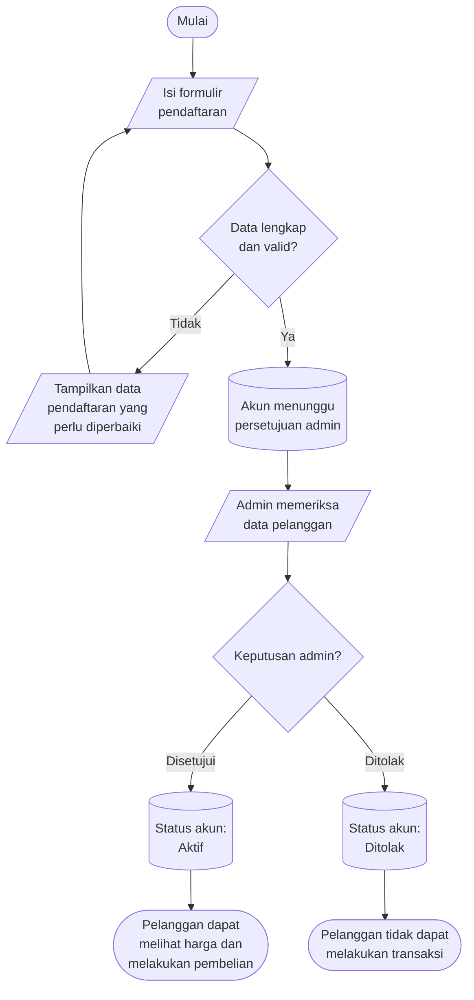
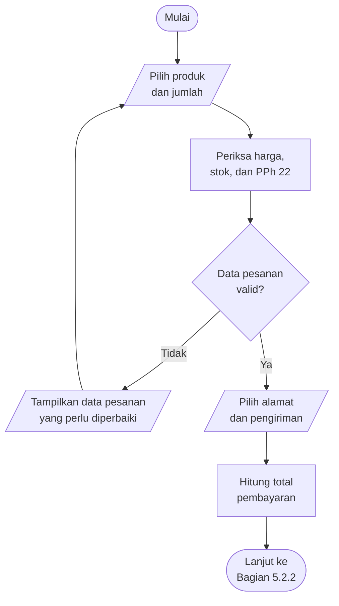
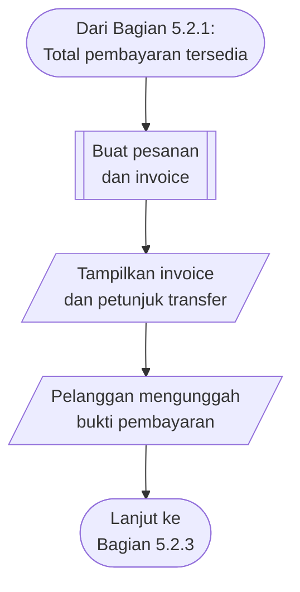
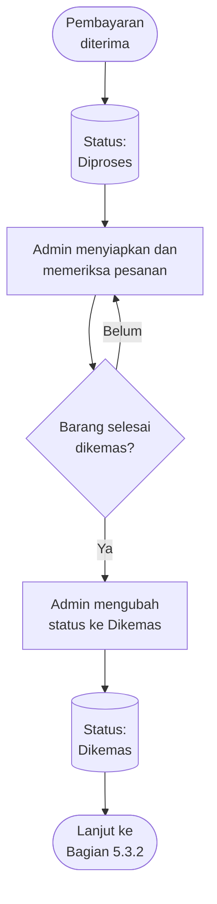
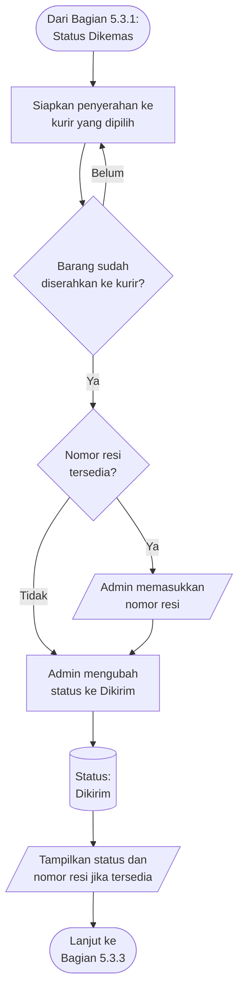
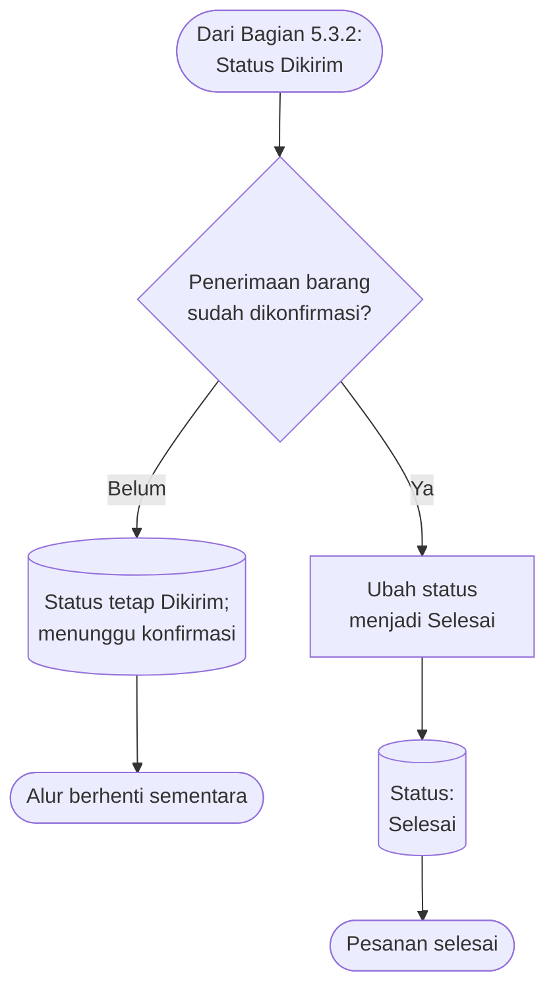
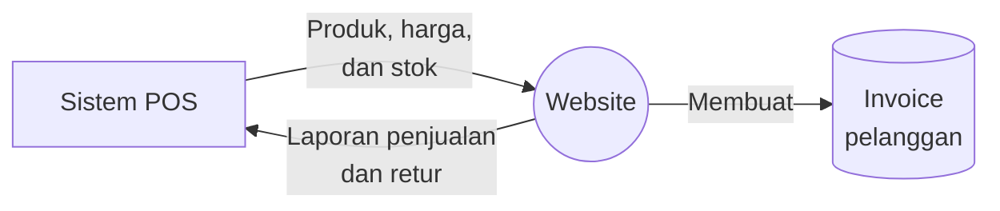

# Ringkasan Ruang Lingkup dan Persetujuan Pengembangan Website

## Pixel Komunika

| Keterangan | Isi |
|---|---|
| Dokumen | Ringkasan untuk pemeriksaan dan persetujuan klien |
| Versi | 1.9 |
| Tanggal | Rabu, 29 Juli 2026 |
| Klien | Pixel Komunika |
| Perwakilan klien | Sylvi |
| Pengembang | PT Webekspres Teknologi Indonesia |
| Target pengerjaan | 45 hari kerja |
| Status | Menunggu pemeriksaan dan persetujuan klien |

## Pemberitahuan Penting: Kedudukan Dokumen

> **Dokumen ini merupakan pelengkap dari proposal penawaran dan kesepakatan
> komersial yang telah dibuat sebelumnya. Dokumen ini tidak menggantikan,
> mengubah, membatalkan, atau mengambil alih kedudukan proposal penawaran
> maupun kesepakatan komersial tersebut.**

Dokumen ini hanya digunakan untuk memberitahukan dan mengonfirmasi:

- fitur, aturan, dan alur yang akan dikerjakan oleh pengembang;
- batas pekerjaan yang termasuk dan tidak termasuk dalam versi pertama; serta
- kondisi yang digunakan untuk menilai apakah versi pertama telah selesai
  sesuai ruang lingkup fungsional.

Persetujuan klien terhadap dokumen ini hanya berarti persetujuan atas pemahaman
ruang lingkup fungsional versi pertama. Persetujuan tersebut **bukan**
kesepakatan komersial baru dan tidak mengubah harga, termin pembayaran, jangka
waktu, atau ketentuan komersial lain yang telah disepakati sebelumnya.

Apabila terdapat perbedaan antara dokumen ini dengan proposal penawaran atau
kesepakatan komersial sebelumnya, proposal penawaran dan kesepakatan komersial
tersebut tetap berlaku, kecuali perubahan telah dinyatakan secara tertulis dan
disetujui oleh Pixel Komunika dan PT Webekspres Teknologi Indonesia.

## 1. Tujuan Dokumen

Dokumen ini merangkum pemahaman Webekspres mengenai website yang akan
dikembangkan untuk Pixel Komunika. Tujuannya adalah memastikan bahwa fitur,
aturan bisnis, alur kerja, dan hasil akhir yang diharapkan sudah sesuai dengan
kebutuhan operasional Pixel Komunika.

Istilah **versi pertama** pada dokumen ini berarti kumpulan fitur utama yang
wajib tersedia agar website dapat digunakan dari proses pendaftaran pelanggan
sampai pesanan selesai.

Klien diharapkan:

1. memeriksa apakah ringkasan kebutuhan sudah benar;
2. menjawab bagian yang masih memerlukan keputusan;
3. memberi koreksi jika ada alur yang tidak sesuai; dan
4. menyetujui ruang lingkup versi pertama sebagai dasar pengerjaan.

Kedudukan dan batas fungsi dokumen dijelaskan pada
[Pemberitahuan Penting](#document-position).

### TL;DR

Untuk pemeriksaan paling cepat:

1. pahami terlebih dahulu
   [kedudukan dan batas fungsi dokumen](#document-position);
2. periksa [fitur yang termasuk dalam versi pertama](#first-version-scope);
3. sampaikan persetujuan, revisi, penolakan, atau pilihan lain dengan mengikuti
   [cara memberikan tanggapan melalui grup WhatsApp](#whatsapp-response);
4. jawab [keputusan yang masih diperlukan dari klien](#client-decisions),
   termasuk [cara memastikan barang telah diterima](#delivery-confirmation);
5. periksa [kriteria penerimaan versi pertama](#first-version-acceptance);
   dan
6. berikan [persetujuan akhir](#client-approval) melalui grup WhatsApp proyek.

### 1.1 Cara Memberikan Tanggapan melalui Grup WhatsApp

Klien **tidak perlu mengisi, mengedit, menandatangani, atau mengirimkan ulang
dokumen ini**. Seluruh tanggapan cukup disampaikan secara tertulis melalui grup
WhatsApp proyek.

Klien dapat memberikan tanggapan dengan cara:

1. menyetujui seluruh dokumen atau poin tertentu;
2. memberikan daftar poin yang perlu direvisi;
3. menolak saran tertentu dan, jika memungkinkan, menjelaskan alasannya;
4. memberikan pilihan atau solusi lain yang lebih sesuai dengan operasional
   Pixel Komunika; dan
5. menjawab pertanyaan pada
   [Bagian 8](#client-decisions).

Jawaban dapat diberikan sekaligus atau bertahap. Format berikut **hanya contoh
dan tidak wajib digunakan**. Format ini disediakan agar poin tanggapan mudah
dipahami dan dirujuk kembali oleh klien maupun Webekspres. Klien tetap boleh
memberikan tanggapan tertulis dengan kalimat bebas melalui grup WhatsApp selama
bagian atau keputusan yang dimaksud cukup jelas.

Contoh format tanggapan:

> **Status:** Setuju / Setuju dengan revisi / Belum setuju
>
> **Bagian atau poin:** Contoh, Bagian 8.1
>
> **Jawaban atau revisi:** ...
>
> **Saran yang ditolak:** ...
>
> **Pilihan lain:** ...

Webekspres akan mencatat jawaban tersebut, memperbarui dokumentasi proyek, dan
mengirimkan ringkasan apabila diperlukan. Pesan persetujuan dari perwakilan
klien di grup WhatsApp menjadi arahan tertulis dari pihak klien. Keputusan baru
efektif menjadi dasar pengerjaan setelah dikonfirmasi oleh Webekspres pada hari
kerja.

## 2. Ringkasan Website

Website akan digunakan sebagai kanal penjualan untuk pelanggan yang telah
terdaftar dan disetujui oleh admin Pixel Komunika.

Pengunjung dan pelanggan yang belum disetujui tetap dapat melihat katalog,
tetapi tidak dapat melihat harga atau melakukan pembelian. Setelah akun
disetujui, pelanggan dapat melihat harga yang berlaku, membuat pesanan,
memilih pengiriman, menerima invoice, mengirim bukti pembayaran, dan memantau
status pesanannya.

Website membuat transaksi dan invoice. Sistem POS menyediakan data produk,
harga, dan stok, kemudian menerima laporan penjualan atau retur dari website.

## 3. Fitur yang Termasuk dalam Versi Pertama

| Area | Hasil yang Akan Tersedia |
|---|---|
| Pendaftaran pelanggan | Pelanggan dapat mendaftar, masuk, dan keluar dari akun. |
| Persetujuan akun | Admin dapat menyetujui, menolak, menangguhkan, atau mengaktifkan kembali akun pelanggan. |
| Hak akses | Pengunjung dan pelanggan yang belum disetujui dapat melihat katalog tanpa harga. Hanya pelanggan aktif yang dapat melihat harga, melakukan pembelian, dan melihat riwayat transaksinya sendiri. |
| Katalog produk | Website menampilkan produk, kategori, merek, SKU, deskripsi, gambar, dan media produk. |
| Sumber data produk | Nama produk, SKU, kategori, merek, harga, dan stok mengikuti data yang tersedia di POS. Informasi tambahan yang belum tersedia di POS dapat dilengkapi melalui website. |
| Tiga jenis harga | Setiap produk memiliki harga eceran, partai, dan grosir. Harga eceran disiapkan tetapi belum ditampilkan kepada pelanggan pada versi pertama. |
| Harga partai | Transaksi memenuhi syarat harga partai jika sedikitnya satu jenis produk dibeli minimal lima unit. Jumlah dari produk yang berbeda tidak digabungkan. |
| Harga grosir | Batas minimum dan harga grosir dapat berbeda untuk setiap produk dan mengikuti data dari POS. |
| PPh 22 | Admin dapat memilih klasifikasi produk yang terkena PPh 22 serta mengatur batas nilai belanja dan persentasenya melalui website. Jika beberapa klasifikasi terkena PPh 22, hasilnya ditampilkan sebagai satu total PPh 22. |
| Stok | Website memperbarui stok ketika terjadi penjualan atau retur, kemudian mencocokkannya dengan data POS secara berkala. |
| Keranjang dan penyelesaian pembelian | Pelanggan dapat memilih produk, jumlah barang, alamat, dan layanan pengiriman serta melihat rincian total sebelum membuat pesanan. |
| Pesanan dan invoice | Website membuat pesanan dan invoice serta menyimpan rincian harga pada saat transaksi terjadi. |
| Pembayaran | Pembayaran dilakukan melalui transfer bank. Pelanggan mengunggah bukti pembayaran dan admin menerima atau menolaknya. |
| Masa berlaku pesanan | Pesanan yang belum dibayar hanya berlaku pada tanggal pembuatannya dan otomatis dibatalkan pada hari berikutnya. |
| Pemrosesan pesanan | Setelah pembayaran diterima, urutan status pesanan adalah Diproses, Dikemas, Dikirim, dan Selesai. Syarat perpindahan status dan cara mengonfirmasi barang diterima harus diputuskan pada [Bagian 8.11](#delivery-confirmation). |
| Nomor resi | Nomor resi ditampilkan kepada pelanggan ketika sudah tersedia. |
| Pengiriman | Website mendukung kurir toko dan pilihan layanan serta perkiraan ongkir dari Biteship. |
| Pembatalan dan retur | Admin dapat membatalkan pesanan secara manual hanya pada tanggal transaksi. Pesanan yang belum dibayar dibatalkan otomatis oleh sistem pada hari berikutnya. Keduanya memakai status `Dibatalkan`, disertai keterangan apakah pembatalan dilakukan oleh admin atau sistem. Pembatalan mengembalikan stok website dan dilaporkan ke POS sebagai retur. |
| Notifikasi admin | Order baru menampilkan tanda notifikasi merah pada website admin dan mengirim pemberitahuan WhatsApp. |
| Laporan | Admin dapat melihat laporan transaksi, omzet, dan PPh 22 berdasarkan periode dan wilayah. |
| Keamanan dan pencatatan | Hak akses pengguna dibatasi sesuai perannya. Tindakan penting admin dan gangguan pertukaran data dicatat agar dapat diperiksa kembali. |

## 4. Keputusan yang Sudah Disepakati

1. Website produksi menggunakan shared hosting milik klien.
2. Produk, SKU, kategori, merek, harga, dan stok bersumber dari POS.
3. Website dapat melengkapi gambar, video, deskripsi, dan informasi lain yang
   belum tersedia di POS.
4. Setiap produk memiliki harga eceran, partai, dan grosir.
5. Harga eceran disiapkan tetapi belum ditampilkan pada versi pertama.
6. Syarat harga partai terpenuhi jika minimal satu jenis produk dibeli sebanyak
   lima unit.
7. Aturan PPh 22 diatur melalui website dan dapat dinonaktifkan dengan
   persentase `0%`.
8. PPh 22 ditampilkan terpisah pada keranjang, halaman konfirmasi pembelian,
   invoice, dan laporan.
9. Jika lebih dari satu klasifikasi terkena PPh 22, hasilnya digabungkan menjadi
   satu nilai PPh 22.
10. Website membuat transaksi dan invoice.
11. POS menerima laporan penjualan untuk mencatat penjualan dan mengurangi
    stok, serta laporan retur untuk mencatat retur dan menambah stok.
12. Pesanan yang belum dibayar otomatis dibatalkan oleh sistem pada hari
    berikutnya.
13. Pembatalan manual oleh admin hanya dapat dilakukan pada tanggal transaksi.
    Website membedakan sumber pembatalan `Admin` dan `Sistem` sebagai keterangan,
    tanpa membuat dua status pembatalan yang berbeda.
14. Setelah pembayaran diterima, urutan statusnya adalah Diproses, Dikemas,
    Dikirim, lalu Selesai; nomor resi ditampilkan ketika tersedia. Pemicu setiap
    perubahan status belum termasuk dalam keputusan ini.
15. Admin menerima pemberitahuan order baru melalui website dan WhatsApp.
16. Akses POS akan dibuka setelah alur website dengan data contoh sudah
    berjalan. Koordinasi akses dilakukan dengan Kak Rio.

## 5. Alur Utama

Panah pada diagram berikut menunjukkan urutan proses.

### 5.1 Pendaftaran dan Persetujuan Pelanggan

### 5.2 Pemesanan dan Pembayaran

#### 5.2.1 Memilih Produk dan Pengiriman

#### 5.2.2 Membuat Pesanan dan Mengirim Bukti Pembayaran

#### 5.2.3 Memverifikasi Pembayaran

### 5.3 Pemrosesan dan Pengiriman

Diagram berikut merupakan usulan alur yang masih memerlukan konfirmasi klien
pada Bagian 8.11.

#### 5.3.1 Menyiapkan dan Mengemas Pesanan

#### 5.3.2 Menyerahkan Pesanan kepada Kurir

#### 5.3.3 Mengonfirmasi Penerimaan dan Menyelesaikan Pesanan

Melihat nomor resi **tidak** otomatis mengubah status pesanan menjadi
`Selesai`. Pesanan tetap berstatus `Dikirim` sampai penerimaan barang telah
dikonfirmasi dengan cara yang disetujui klien. Pilihan cara konfirmasi dibahas
pada [Bagian 8.11](#delivery-confirmation).

### 5.4 Pembatalan oleh Admin atau Sistem

`Dibatalkan` tetap menjadi satu status pesanan. Rincian pesanan menampilkan
sumber, alasan, dan waktu pembatalan. Untuk pembatalan admin, sistem juga
mencatat admin yang melakukan tindakan tersebut.

### 5.5 Hubungan Website dengan POS

Diagram berikut menunjukkan pertukaran data, bukan urutan waktu.

Invoice pelanggan dibuat oleh website, bukan oleh POS.

## 6. Isi Minimum Invoice

Invoice sekurang-kurangnya menampilkan:

- nama toko;
- alamat toko;
- nomor kontak toko;
- NPWP toko;
- jumlah setiap barang;
- nama barang;
- SKU;
- harga satuan;
- total harga setiap barang;
- total pembelian keseluruhan; dan
- nilai rupiah PPh 22 apabila transaksi terkena PPh 22.

Data pada invoice disimpan sesuai kondisi pada saat transaksi sehingga
perubahan data produk atau identitas toko setelahnya tidak mengubah invoice
lama.

## 7. Belum Menjadi Komitmen Versi Pertama

Fitur berikut belum menjadi komitmen versi pertama sampai ada keputusan
tertulis:

1. segmentasi khusus reseller;
2. pemesanan reseller melalui WhatsApp;
3. penggabungan beberapa pesanan menjadi satu pengiriman;
4. pembuatan order kurir, permintaan penjemputan, pencetakan label, dan
   pelacakan otomatis melalui Biteship;
5. pembayaran otomatis melalui virtual account, kartu, atau dompet digital;
6. pengembalian dana otomatis di luar proses pembatalan dan pengembalian stok;
7. reset kata sandi mandiri;
8. pencarian dan penyaringan katalog lanjutan;
9. ekspor laporan ke CSV atau Excel; dan
10. fitur tambahan di luar ruang lingkup yang disepakati dalam dokumen ini.

## 8. Keputusan yang Masih Diperlukan dari Klien

Jawaban dapat diberikan bertahap. Klien dapat memberi tanda pada pilihan yang
sesuai atau menuliskan jawaban sendiri.

### 8.1 Perhitungan PPh 22

Rumus yang dipilih sebaiknya telah dikonfirmasi oleh pihak keuangan atau
perpajakan Pixel Komunika. Website akan menerapkan rumus yang disetujui klien.

Ketika nilai belanja pada klasifikasi tertentu melewati batas yang ditetapkan,
PPh 22 dihitung dari:

- [ ] seluruh nilai belanja pada klasifikasi tersebut;
- [ ] hanya bagian nilai belanja yang melebihi batas;
- [ ] cara lain: _______________________________________________.

Jika lebih dari satu klasifikasi terkena PPh 22, cara menghitungnya:

- [ ] hitung setiap klasifikasi terlebih dahulu, lalu jumlahkan hasilnya;
- [ ] gabungkan nilai belanjanya terlebih dahulu, lalu hitung PPh 22;
- [ ] cara lain: _______________________________________________.

### 8.2 Harga Partai dan Grosir

Jika satu jenis produk dibeli minimal lima unit dan syarat harga partai
terpenuhi, harga partai berlaku untuk:

- [ ] hanya produk yang jumlahnya minimal lima unit;
- [ ] seluruh produk dalam pesanan;
- [ ] aturan lain: _____________________________________________.

Jika satu produk memenuhi syarat harga partai sekaligus harga grosir:

- [ ] harga grosir digunakan;
- [ ] harga partai digunakan;
- [ ] harga termurah digunakan;
- [ ] aturan lain: _____________________________________________.

### 8.3 Nomor dan Penyampaian Invoice

1. Format atau awalan nomor invoice yang diinginkan:
   ______________________________________________________________.
2. Invoice perlu tersedia sebagai:
   - [ ] tampilan di website;
   - [ ] file PDF;
   - [ ] keduanya.
3. Invoice perlu disampaikan melalui:
   - [ ] website;
   - [ ] WhatsApp;
   - [ ] email;
   - [ ] media lain: ___________________________________________.
4. Identitas toko pada invoice diambil dari:
   - [ ] pengaturan di website;
   - [ ] data POS;
   - [ ] sumber lain: __________________________________________.
5. Mohon melengkapi identitas yang akan ditampilkan:

   | Data | Nilai |
   |---|---|
   | Nama toko |  |
   | Alamat |  |
   | Nomor kontak |  |
   | NPWP |  |

### 8.4 Perhitungan Omzet

Transaksi mulai dihitung sebagai omzet ketika:

- [ ] pembayaran telah diterima;
- [ ] pesanan telah dikirim;
- [ ] pesanan telah selesai;
- [ ] kondisi lain: ____________________________________________.

### 8.5 Kurir Toko

Mohon melengkapi:

1. area yang dilayani: __________________________________________;
2. tarif per area: ______________________________________________;
3. perkiraan waktu pengiriman: __________________________________.

### 8.6 Pengiriman melalui Biteship

Mohon melengkapi:

1. alamat asal pengiriman: ______________________________________;
2. sumber berat produk: _________________________________________;
3. apakah ukuran panjang, lebar, dan tinggi paket digunakan?
   - [ ] Ya
   - [ ] Tidak
4. kurir atau layanan yang ingin ditampilkan:
   ______________________________________________________________;
5. pihak yang menyediakan dan menanggung akun Biteship:
   ______________________________________________________________.

Jika pengecekan ongkir Biteship sedang tidak dapat digunakan, pelanggan:

- [ ] diminta menghubungi admin;
- [ ] menggunakan tarif manual yang ditentukan admin;
- [ ] diminta mencoba kembali;
- [ ] menggunakan cara lain: ___________________________________.

### 8.7 Bukti Pembayaran

Berapa lama bukti pembayaran perlu disimpan?

- [ ] 1 tahun;
- [ ] 2 tahun;
- [ ] 5 tahun;
- [ ] mengikuti kebijakan lain: _________________________________.

### 8.8 Notifikasi Order Baru

1. Nomor WhatsApp penerima notifikasi:
   ______________________________________________________________.
2. Contoh isi pesan yang diinginkan:
   ______________________________________________________________
   ______________________________________________________________.
3. Tanda notifikasi merah pada website dianggap sudah dibaca ketika:
   - [ ] admin membuka daftar pesanan;
   - [ ] admin membuka detail pesanan;
   - [ ] admin menandainya secara manual;
   - [ ] cara lain: _____________________________________________.

### 8.9 Reseller

Apakah reseller termasuk dalam versi pertama?

- [ ] Tidak, disiapkan untuk tahap berikutnya.
- [ ] Ya, pemesanan dilakukan melalui website.
- [ ] Ya, pemesanan dilakukan melalui WhatsApp.
- [ ] Aturan lain: _____________________________________________.

Jika reseller termasuk, apakah reseller dapat melihat harga?

- [ ] Ya
- [ ] Tidak

### 8.10 Penggabungan Pesanan

Apakah beberapa pesanan boleh digabungkan menjadi satu pengiriman?

- [ ] Tidak.
- [ ] Ya, dengan ketentuan: ____________________________________.

Jika diperbolehkan, mohon jelaskan pengaruhnya terhadap ongkir dan invoice:
__________________________________________________________________.

### 8.11 Perubahan Status Pengiriman dan Konfirmasi Barang Diterima

Usulan alur perubahan status:

1. status `Diproses` dimulai setelah pembayaran diterima;
2. admin mengubah status menjadi `Dikemas` setelah seluruh barang selesai
   disiapkan, diperiksa, dan dikemas;
3. admin mengubah status menjadi `Dikirim` setelah barang diserahkan kepada
   kurir; dan
4. status `Selesai` hanya diberikan setelah penerimaan barang dikonfirmasi.

Apakah usulan tersebut disetujui?

- [ ] Ya.
- [ ] Perlu revisi: ____________________________________________.

Apakah nomor resi wajib diisi sebelum status menjadi `Dikirim`?

- [ ] Ya, untuk seluruh metode pengiriman.
- [ ] Ya, hanya untuk pengiriman yang memang memiliki nomor resi.
- [ ] Tidak.
- [ ] Aturan lain: _____________________________________________.

Siapa atau proses apa yang mengonfirmasi bahwa barang telah diterima?

- [ ] pelanggan menekan tombol **Pesanan Diterima** pada website;
- [ ] admin mengubah status setelah memperoleh konfirmasi pelanggan atau kurir;
- [ ] sistem otomatis menyelesaikan pesanan setelah ______ hari sejak dikirim;
- [ ] pelanggan atau admin dapat mengonfirmasi, kemudian sistem otomatis
      menyelesaikan setelah ______ hari jika belum ada tindakan;
- [ ] cara lain: _______________________________________________.

Jika barang belum diterima atau pelanggan melaporkan kendala:

- [ ] status tetap `Dikirim` sampai admin menyelesaikan kendala;
- [ ] gunakan status tambahan: _________________________________;
- [ ] penanganan lain: _________________________________________.

## 9. Kriteria Penerimaan Versi Pertama

Versi pertama dapat diterima apabila:

- pelanggan dapat mendaftar dan admin dapat memutuskan status akunnya;
- pengunjung dan pelanggan yang belum disetujui tidak dapat melihat harga atau
  bertransaksi;
- pelanggan aktif dapat memilih barang, memperoleh harga yang benar, memilih
  pengiriman, dan membuat pesanan;
- PPh 22 dihitung sesuai keputusan final dan ditampilkan secara terpisah;
- invoice menampilkan seluruh informasi wajib;
- pelanggan dapat mengirim bukti pembayaran dan admin dapat memeriksanya;
- pesanan yang tidak dibayar otomatis dibatalkan pada hari berikutnya dan
  rincian pesanan menunjukkan bahwa pembatalan dilakukan oleh sistem;
- pesanan yang dibayar dapat diproses sampai selesai sesuai pemicu status yang
  disetujui pada
  [Bagian 8.11](#delivery-confirmation),
  dan nomor resi dapat dilihat pelanggan;
- data produk, harga, dan stok dapat dipertukarkan dengan POS tanpa
  menggandakan transaksi;
- penjualan dan retur dari website tercatat pada POS;
- pilihan dan ongkir pengiriman berjalan sesuai keputusan final;
- laporan transaksi, omzet, dan PPh 22 dapat dilihat admin;
- notifikasi order baru tampil pada website admin;
- notifikasi WhatsApp berjalan setelah nomor penerima dan isi pesan
  disepakati;
- data pelanggan dan bukti pembayaran tidak dapat diakses oleh pihak yang
  tidak berwenang; dan
- tidak ada masalah kritis yang menghalangi penggunaan alur penjualan utama.

Pengujian penerimaan dilakukan bersama klien sebelum website dinyatakan siap
digunakan.

## 10. Perubahan Setelah Persetujuan

Persetujuan dokumen ini menetapkan ruang lingkup versi pertama. Ide atau
perubahan baru tetap dapat dibahas selama pengerjaan.

Jika perubahan memengaruhi fitur utama, perhitungan, integrasi POS, jadwal, atau
biaya, Webekspres akan menyampaikan dampaknya terlebih dahulu. Perubahan mulai
berlaku setelah disetujui secara tertulis oleh klien dan Webekspres pada hari
kerja.

## 11. Persetujuan

Klien tidak perlu mengisi atau mengirimkan ulang tabel di bawah ini.
Persetujuan cukup disampaikan oleh perwakilan klien melalui grup WhatsApp
proyek. Webekspres akan mengisi tabel ini sebagai rekap berdasarkan pesan
persetujuan dan konfirmasi kedua pihak pada hari kerja.

Dengan memberikan persetujuan, para pihak menyatakan bahwa:

1. ringkasan kebutuhan pada dokumen ini telah dipahami;
2. bagian yang belum jelas telah diberi jawaban atau dicatat sebagai keputusan
   lanjutan;
3. ruang lingkup versi pertama dapat digunakan sebagai dasar pengerjaan dan
   pengujian; dan
4. perubahan berikutnya akan mengikuti proses persetujuan bersama; serta
5. persetujuan dokumen ini tidak menggantikan atau mengubah proposal penawaran
   maupun kesepakatan komersial sebelumnya.

| Peran | Nama | Tanggal | Status/Persetujuan |
|---|---|---|---|
| Perwakilan Klien | Sylvi |  |  |
| Analis Sistem Webekspres | Sultan |  |  |
| Manajer Proyek Webekspres | Pak Endang |  |  |
