# Entity Relationship Diagram (ERD)

## Pixel Komunika E-Commerce

| Metadata | Nilai |
|---|---|
| Versi | 0.1 - Working Baseline |
| Tanggal | Selasa, 28 Juli 2026 |
| Status | Internal - siap menjadi dasar migration MVP |
| Sumber | [BRD](../requirements/BRD.md), [FRD](../requirements/FRD.md), [SRS](../requirements/SRS.md), dan [MVP](../requirements/MVP.md) |
| Detail field | [Data Dictionary](DATA_DICTIONARY.md) |

## 1. Batasan Model

ERD ini sudah cukup untuk implementasi MVP. Bagian berikut masih
`Provisional` dan tidak boleh diartikan sebagai keputusan bisnis final:

- formula dasar pengenaan dan agregasi PPh 22
  ([OPN-006](../requirements/BRD.md#opn-006));
- cakupan item yang memperoleh harga partai serta prioritas partai terhadap
  grosir ([OPN-013](../requirements/BRD.md#opn-013));
- nama field, payload, autentikasi, error, dan idempotency API POS
  ([OPN-005](../requirements/BRD.md#opn-005));
- lifecycle fulfillment dan kebutuhan nomor resi
  ([OPN-020](../requirements/BRD.md#opn-020));
- sumber identitas toko, format PDF, dan channel invoice
  ([OPN-022](../requirements/BRD.md#opn-022));
- origin, berat/dimensi, area, tarif, dan fallback pengiriman
  ([OPN-010](../requirements/BRD.md#opn-010),
  [OPN-016](../requirements/BRD.md#opn-016), dan
  [OPN-021](../requirements/BRD.md#opn-021)).

Kolom snapshot dipertahankan agar transaksi dan invoice historis tidak berubah
ketika master POS, profil toko, harga, alamat, atau konfigurasi PPh 22 berubah.

## 2. ERD Working Baseline

```mermaid
erDiagram
    ROLES {
        BIGINT id PK
        VARCHAR code UK
        VARCHAR name
    }

    USERS {
        BIGINT id PK
        BIGINT role_id FK
        VARCHAR name
        VARCHAR email UK
        VARCHAR phone UK
        VARCHAR password
    }

    CUSTOMER_PROFILES {
        BIGINT id PK
        BIGINT user_id FK,UK
        VARCHAR business_name
        VARCHAR verification_status
        BIGINT reviewed_by FK
        DATETIME reviewed_at
    }

    ADDRESSES {
        BIGINT id PK
        BIGINT user_id FK
        VARCHAR label
        VARCHAR recipient_name
        VARCHAR district
        VARCHAR postal_code
        BOOLEAN is_default
    }

    CATEGORIES {
        BIGINT id PK
        VARCHAR pos_category_id UK
        VARCHAR name
        BOOLEAN is_active
    }

    BRANDS {
        BIGINT id PK
        VARCHAR pos_brand_id UK
        VARCHAR name
        BOOLEAN is_active
    }

    PRODUCTS {
        BIGINT id PK
        BIGINT category_id FK
        BIGINT brand_id FK
        VARCHAR pos_product_id UK
        VARCHAR sku UK
        VARCHAR name
        BOOLEAN is_active
    }

    PRODUCT_ENRICHMENTS {
        BIGINT id PK
        BIGINT product_id FK,UK
        VARCHAR slug UK
        TEXT description
        BOOLEAN is_visible
    }

    PRODUCT_MEDIA {
        BIGINT id PK
        BIGINT product_id FK
        VARCHAR media_type
        VARCHAR object_key UK
        INT sort_order
    }

    PRODUCT_PRICES {
        BIGINT id PK
        BIGINT product_id FK
        VARCHAR price_type
        DECIMAL amount
        INT minimum_quantity
        DATETIME synced_at
    }

    CATEGORY_TAX_RULES {
        BIGINT id PK
        BIGINT category_id FK
        BIGINT updated_by FK
        DECIMAL threshold_amount
        DECIMAL rate_percent
        BOOLEAN is_active
    }

    INVENTORY_SNAPSHOTS {
        BIGINT id PK
        BIGINT product_id FK,UK
        INT quantity
        INT low_stock_threshold
        VARCHAR stock_status
        DATETIME synced_at
    }

    INVENTORY_LEDGER {
        BIGINT id PK
        BIGINT product_id FK
        BIGINT sync_run_id FK
        BIGINT pos_return_id FK
        VARCHAR source_type
        INT quantity_before
        INT quantity_after
        VARCHAR external_reference
    }

    CARTS {
        BIGINT id PK
        BIGINT user_id FK
        VARCHAR status
        DATETIME expires_at
    }

    CART_ITEMS {
        BIGINT id PK
        BIGINT cart_id FK
        BIGINT product_id FK
        INT quantity
    }

    STORE_PROFILES {
        BIGINT id PK
        VARCHAR store_name
        TEXT address
        VARCHAR contact_number
        VARCHAR npwp
        BOOLEAN is_active
    }

    BANK_ACCOUNTS {
        BIGINT id PK
        VARCHAR bank_name
        VARCHAR account_number
        VARCHAR account_holder
        BOOLEAN is_active
    }

    ORDERS {
        BIGINT id PK
        BIGINT user_id FK
        BIGINT source_address_id FK
        VARCHAR order_number UK
        VARCHAR idempotency_key UK
        VARCHAR pos_sales_order_id UK
        VARCHAR status
        DECIMAL grand_total
    }

    ORDER_ITEMS {
        BIGINT id PK
        BIGINT order_id FK
        BIGINT product_id FK
        VARCHAR sku_snapshot
        VARCHAR product_name_snapshot
        VARCHAR price_type
        INT quantity
        DECIMAL line_total
    }

    ORDER_CHARGE_COMPONENTS {
        BIGINT id PK
        BIGINT order_id FK
        BIGINT category_tax_rule_id FK
        VARCHAR component_code
        DECIMAL basis_amount
        DECIMAL rate_percent
        DECIMAL amount
    }

    INVOICES {
        BIGINT id PK
        BIGINT order_id FK,UK
        BIGINT store_profile_id FK
        VARCHAR pos_invoice_id UK
        VARCHAR invoice_number UK
        VARCHAR store_name_snapshot
        VARCHAR store_npwp_snapshot
        DECIMAL grand_total
    }

    PAYMENTS {
        BIGINT id PK
        BIGINT order_id FK,UK
        BIGINT bank_account_id FK
        BIGINT verified_by FK
        VARCHAR status
        DECIMAL amount
        DATETIME verified_at
    }

    PAYMENT_PROOFS {
        BIGINT id PK
        BIGINT payment_id FK
        VARCHAR object_key UK
        VARCHAR mime_type
        BIGINT file_size
    }

    STORE_COURIER_RATES {
        BIGINT id PK
        VARCHAR area_code
        VARCHAR area_name
        DECIMAL rate_amount
        BOOLEAN is_active
    }

    SHIPMENTS {
        BIGINT id PK
        BIGINT order_id FK,UK
        BIGINT store_courier_rate_id FK
        VARCHAR method
        VARCHAR service_code
        VARCHAR district_snapshot
        DECIMAL shipping_amount
        VARCHAR status
    }

    POS_INTEGRATION_OPERATIONS {
        BIGINT id PK
        BIGINT order_id FK
        BIGINT sync_run_id FK
        VARCHAR operation
        VARCHAR external_reference UK
        VARCHAR status
        VARCHAR correlation_id
    }

    POS_RETURNS {
        BIGINT id PK
        BIGINT order_id FK,UK
        VARCHAR pos_return_id UK
        VARCHAR pos_sales_order_id
        VARCHAR reason
        VARCHAR status
    }

    SYNC_RUNS {
        BIGINT id PK
        VARCHAR sync_type
        VARCHAR status
        DATETIME started_at
        DATETIME finished_at
    }

    SYNC_ERRORS {
        BIGINT id PK
        BIGINT sync_run_id FK
        VARCHAR entity_type
        VARCHAR external_id
        VARCHAR error_code
    }

    AUDIT_LOGS {
        BIGINT id PK
        BIGINT actor_user_id FK
        VARCHAR action
        VARCHAR auditable_type
        BIGINT auditable_id
        VARCHAR request_id
    }

    ROLES ||--o{ USERS : assigns
    USERS ||--o| CUSTOMER_PROFILES : owns
    USERS ||--o{ ADDRESSES : owns
    USERS ||--o{ CARTS : owns
    USERS ||--o{ ORDERS : places
    USERS ||--o{ CATEGORY_TAX_RULES : updates
    USERS o|--o{ PAYMENTS : verifies
    USERS o|--o{ AUDIT_LOGS : performs

    CATEGORIES ||--o{ PRODUCTS : classifies
    BRANDS o|--o{ PRODUCTS : brands
    CATEGORIES ||--o{ CATEGORY_TAX_RULES : governs
    PRODUCTS ||--o| PRODUCT_ENRICHMENTS : enriches
    PRODUCTS ||--o{ PRODUCT_MEDIA : has
    PRODUCTS ||--o{ PRODUCT_PRICES : prices
    PRODUCTS ||--o| INVENTORY_SNAPSHOTS : stocks
    PRODUCTS ||--o{ INVENTORY_LEDGER : changes

    CARTS ||--|{ CART_ITEMS : contains
    PRODUCTS ||--o{ CART_ITEMS : selected_as
    ADDRESSES o|--o{ ORDERS : sourced_from

    ORDERS ||--|{ ORDER_ITEMS : contains
    PRODUCTS o|--o{ ORDER_ITEMS : snapshotted_as
    ORDERS ||--o{ ORDER_CHARGE_COMPONENTS : charges
    CATEGORY_TAX_RULES o|--o{ ORDER_CHARGE_COMPONENTS : snapshotted_from
    ORDERS ||--o| INVOICES : billed_as
    STORE_PROFILES o|--o{ INVOICES : snapshotted_from
    ORDERS ||--o| PAYMENTS : paid_by
    BANK_ACCOUNTS ||--o{ PAYMENTS : receives
    PAYMENTS ||--o{ PAYMENT_PROOFS : evidenced_by
    ORDERS ||--o| SHIPMENTS : shipped_by
    STORE_COURIER_RATES o|--o{ SHIPMENTS : quoted_from

    ORDERS o|--o{ POS_INTEGRATION_OPERATIONS : synchronized_by
    ORDERS ||--o| POS_RETURNS : cancelled_as
    SYNC_RUNS o|--o{ POS_INTEGRATION_OPERATIONS : groups
    SYNC_RUNS ||--o{ SYNC_ERRORS : records
    SYNC_RUNS o|--o{ INVENTORY_LEDGER : produces
    POS_RETURNS o|--o{ INVENTORY_LEDGER : restores
```

## 3. Aturan Relasi Utama

1. Satu pengguna dapat memiliki banyak alamat, keranjang historis, dan order;
   hanya pelanggan `ACTIVE` yang boleh checkout.
2. Kombinasi `product_id + price_type` pada `product_prices` harus unik.
3. Satu produk memiliki paling banyak satu inventory snapshot aktif dan satu
   enrichment lokal.
4. Satu keranjang aktif memiliki maksimal satu baris per produk.
5. Satu order memiliki minimal satu item dan maksimal satu invoice, payment
   aktif, shipment, serta retur POS.
6. `order_items`, `order_charge_components`, `invoices`, dan `shipments`
   menyimpan snapshot transaksi; foreign key ke master hanya untuk
   traceability.
7. `external_reference` operasi POS, `order_number`, `idempotency_key`, SKU,
   invoice reference, dan return reference harus unik ketika nilainya tersedia.
8. Audit log menggunakan relasi polymorphic logis melalui
   `auditable_type + auditable_id`; database tidak membuat foreign key dinamis
   untuk pasangan tersebut.

## 4. Keputusan Minimal untuk Implementasi

- Hak akses MVP memakai `roles` dan Laravel Policy. Tabel permission granular
  belum dibuat karena role baseline hanya admin dan pelanggan.
- Satu order hanya memiliki satu shipment. Split shipment dan penggabungan
  beberapa order belum menjadi baseline.
- Harga partai dihitung dari kuantitas per SKU pada cart/order; kuantitas
  antar-SKU tidak dijumlahkan.
- Data laporan dibaca dari tabel transaksi dan snapshot. Tabel agregasi khusus
  ditambahkan hanya jika pengukuran production membuktikan query terlalu berat.
- Payload integrasi disimpan teredaksi dan terbatas untuk rekonsiliasi; token,
  password, dan credential tidak boleh disimpan pada tabel operasi.
