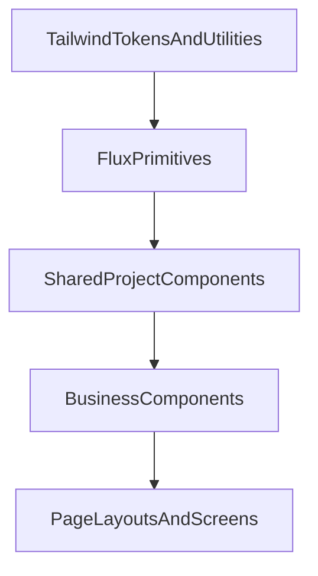

# Frontend UI Architecture

## Pixel Komunika

Dokumen ini menjadi pedoman resmi arsitektur UI frontend untuk Pixel Komunika.
Fokus utamanya adalah menjaga dua hal sekaligus:

1. storefront publik tetap terasa seperti **brand Pixel Komunika**, bukan aplikasi Laravel generik;
2. area app/internal seperti auth, account, customer panel, dan admin tetap **cepat dibangun, konsisten, dan maintainable**.

Dokumen ini melengkapi:
- [DESIGN.md](../../DESIGN.md) untuk brand direction, tokens, dan font;
- [SRS.md](../requirements/SRS.md) untuk stack, performance, dan deployment constraints;
- [USER_FLOWS.md](USER_FLOWS.md) untuk alur bisnis yang akan diwujudkan ke layar.

## 1. UI Layer Architecture

Frontend Pixel Komunika memakai layered architecture berikut.



### Layer 1 — Tailwind tokens and utilities

Fondasi visual dan utilitas global.

Isi layer ini:
- `@theme` tokens warna, font, spacing, radius, shadow;
- utility kelas global yang memang reusable;
- reset kecil, animation utility, dan helper class yang ringan.

Tanggung jawab:
- mendefinisikan bahasa visual dasar;
- memastikan semua komponen bicara dalam token yang sama;
- mencegah hardcoded value menyebar ke banyak file.

Sumber utama saat ini:
- `resources/css/app.css`
- [DESIGN.md](../../DESIGN.md)

### Layer 2 — Flux primitives

Komponen primitive siap pakai untuk application UI.

Contoh:
- input
- select
- checkbox
- radio
- switch
- modal
- dialog
- drawer
- dropdown
- tooltip
- pagination
- table
- tabs
- badge
- avatar
- toast

Tanggung jawab:
- mempercepat pembangunan screen internal;
- menyediakan behavior dasar yang konsisten;
- mengurangi duplikasi markup form/table/state handling.

Batasan:
- Flux **bukan** fondasi tampilan storefront;
- Flux dipakai terutama untuk auth/account/admin/internal workflows;
- jika styling brand storefront mulai terasa seperti “framework demo”, itu berarti Flux dipakai terlalu tinggi di layer yang salah.

### Layer 3 — Shared project components

Wrapper dan adapter internal project di atas primitive.

Contoh:
- `x-ui.page-header`
- `x-ui.section-card`
- `x-ui.filter-bar`
- `x-ui.stat-card`
- `x-ui.empty-state`
- `x-ui.status-badge`
- `x-ui.confirm-dialog`

Tanggung jawab:
- menyatukan pola project agar developer tidak memakai primitive secara liar;
- menyisipkan copy, spacing, label style, error style, dan accessibility pattern yang konsisten;
- menjadi tempat adaptasi jika nanti primitive di bawah berubah.

Prinsip:
- bila dua screen memakai kombinasi Flux yang sama berulang kali, bungkus di layer ini;
- jangan lompat langsung memakai primitive di semua tempat kalau pola bisnisnya sudah jelas.

### Layer 4 — Business components

Komponen yang memahami domain Pixel Komunika.

Contoh:
- product card
- category card
- cart summary
- checkout timeline
- order status pill
- payment proof panel
- customer approval card
- inventory status badge
- report summary widgets

Tanggung jawab:
- menerjemahkan aturan bisnis ke UI;
- mengikat data, state, dan presentasi domain ke komponen reusable;
- membedakan komponen “form generik” vs “komponen e-commerce Pixel”.

Prinsip:
- business components boleh memakai Flux di dalamnya;
- tapi API komponen yang diekspos ke page harus bicara dalam istilah domain, bukan primitive UI.

### Layer 5 — Page layouts and screens

Komposisi screen utuh.

Contoh:
- home
- product catalog
- login/register
- customer dashboard
- admin customers
- admin orders
- checkout

Tanggung jawab:
- mengatur struktur halaman;
- mengorkestrasi komponen bisnis;
- menangani state halaman, route, permission, dan data loading.

Prinsip:
- page layout tidak boleh menjadi tempat styling acak yang sulit dipakai ulang;
- semakin sering block yang sama muncul lintas halaman, turunkan ke layer 3 atau 4.

## 2. Flux Adoption Matrix

Rule utama:
- **Flux First** = area app/internal, data-dense, form-heavy, operation-heavy;
- **Hybrid** = pakai Flux untuk form/state primitive, tapi shell visual dan card utama tetap custom;
- **Fully Custom** = brand-first, marketing-first, visual merchandising-first.

### Public screens

| Screen | Mode | Reasoning |
| --- | --- | --- |
| Landing Page | Fully Custom | Brand/marketing surface; tidak boleh terlihat seperti dashboard kit. |
| Homepage | Fully Custom | Hero, promo, kategori, dan storytelling harus brand-driven. |
| Product Catalog | Hybrid | Filter/search/pagination bisa Flux; grid, card, empty state, merchandising tetap custom. |
| Product Detail | Hybrid | Tabs/accordion/action primitives bisa Flux; gallery, product summary, trust blocks tetap custom. |
| Search | Hybrid | Search bar, filter drawer, sorting dapat memakai Flux; hasil dan visual listing tetap custom. |
| Category | Hybrid | Secara teknis mirip catalog; shell bisa custom, controls boleh Flux. |
| Cart | Hybrid | Quantity controls, drawer/modal/action buttons bisa Flux; line item row dan summary tetap komponen bisnis custom. |
| Checkout | Hybrid | Form alamat, radio layanan, validation, dialog cocok Flux; stepper/timeline/summary tetap custom. |
| Login | Flux First | Untuk iterasi saat ini login memakai Flux primitive di dalam auth shell internal. |
| Register | Flux First | Register customer mengikuti pola auth shell internal dengan copy project-specific. |
| Registration Pending | Fully Custom | Ini status experience, bukan form-heavy app screen. |
| Forgot Password | Hybrid | Form sederhana, aman memakai Flux di dalam shell custom. |
| Contact | Fully Custom | Lebih dekat ke informational/brand page. |
| FAQ | Fully Custom | Accordion boleh mirip primitive, tapi halaman tetap content-driven brand page. |
| About | Fully Custom | Brand/story page. |
| 404 | Fully Custom | Harus terasa bagian dari storefront, bukan default app error sheet. |
| Empty State | Fully Custom | Empty state public sebaiknya punya ilustrasi/copy khas Pixel. |
| Order Success | Hybrid | CTA dan summary block custom; dialog/buttons/alert elements boleh Flux. |

### Customer screens

| Screen | Mode | Reasoning |
| --- | --- | --- |
| Dashboard | Flux First | Dashboard account/customer sudah masuk internal app shell dan memprioritaskan consistency. |
| Orders | Flux First | Tabel/list/filter/status views dominan app-like. |
| Order Detail | Hybrid | Metadata, tabs, timeline pieces bisa Flux; summary dan status storytelling tetap custom. |
| Wishlist | Hybrid | Grid item custom; controls/filter/dialog boleh Flux. |
| Address Book | Flux First | Form-heavy, CRUD-heavy, cocok sekali untuk primitive Flux. |
| Profile | Flux First | Form account/settings lebih penting konsisten daripada unik visual. |
| Notifications | Flux First | List/status/action pattern murni application UI. |

### Admin screens

| Screen | Mode | Reasoning |
| --- | --- | --- |
| Dashboard | Flux First | KPI/stat/filter/list pattern internal. |
| Products | Flux First | Data management screen. |
| Categories | Flux First | CRUD/admin table screen. |
| Brands | Flux First | CRUD/admin table screen. |
| Orders | Flux First | Dense operational screen. |
| Payments | Flux First | Verification queue + detail action screen. |
| Customers | Flux First | Search/filter/status actions dominan app primitives. |
| Reports | Flux First | Table, chart shell, filter, export actions lebih cocok app UI. |
| Settings | Flux First | Form-heavy internal screen. |
| CRUD Forms | Flux First | Konsistensi, speed, dan maintainability lebih penting daripada visual uniqueness. |

## 3. Component Strategy

### Flux components

Komponen berikut disarankan berasal dari Flux atau dibungkus tipis di atas Flux:

- Input
- Textarea
- Select
- Checkbox
- Radio
- Switch
- Modal
- Drawer
- Tooltip
- Dropdown
- Table
- Tabs
- Pagination
- Toast
- Dialog
- Avatar
- Badge
- Alert
- Empty shell for app states

Kenapa:
- problem yang diselesaikan bersifat UI generik;
- dipakai berulang di auth/account/admin;
- behavior dan accessibility lebih baik bila distandarkan;
- mengurangi waktu styling ulang komponen dasar.

### Pixel components

Komponen berikut harus tetap custom:

- Hero
- Navbar storefront
- Footer storefront
- Product Card
- Category Card
- Brand Card
- Feature Card
- Promo Banner
- CTA Section
- Product Gallery
- Empty State storefront
- Loading Illustration storefront
- Shopping Cart Summary
- Checkout Timeline
- Testimonial Card

Kenapa:
- komponen ini membawa identitas brand dan rasa storefront;
- kebutuhan layout/copy/gambar lebih spesifik ke Pixel Komunika;
- jika dipaksa memakai kit generic, tampilannya akan cepat terasa “template”;
- komponen ini sering menyatukan merchandising, storytelling, trust, dan conversion.

### Rule of thumb

- Bila komponen menjawab pertanyaan “bagaimana user mengisi/memilih/mengelola data?”, mulai dari Flux.
- Bila komponen menjawab pertanyaan “bagaimana Pixel Komunika terlihat dan terasa?”, buat custom.

## 4. Folder Structure

Struktur yang direkomendasikan:

```text
resources/views/
  components/
    ui/
    pixel/
    ecommerce/
    marketing/
    layout/
  flux/
  livewire/
    pages/
    admin/
    customer/
```

### `resources/views/components/ui/`

Wrapper komponen shared di atas primitive.

Contoh:
- form-field
- page-header
- section-card
- stat-card
- filter-bar
- empty-state
- status-badge

### `resources/views/components/pixel/`

Komponen visual brand-specific.

Contoh:
- hero
- pixel-navbar
- pixel-footer
- mascot-panel
- promo-banner

### `resources/views/components/ecommerce/`

Komponen domain storefront/customer.

Contoh:
- product-card
- cart-summary
- order-status
- checkout-timeline
- address-card

### `resources/views/components/marketing/`

Komponen halaman publik yang sifatnya content/brand.

Contoh:
- faq-item
- about-section
- feature-grid
- trust-strip

### `resources/views/components/layout/`

Shell dan section wrappers.

Contoh:
- app-page
- auth-shell
- admin-page
- storefront-shell
- page-container

### `resources/views/flux/`

Tempat override Flux **hanya jika benar-benar perlu publish/customize**.

Aturan:
- jangan dianggap folder komponen custom biasa;
- isinya hanya komponen Flux yang dipublish dari package;
- seminimal mungkin supaya maintenance upgrade tetap ringan.

### `resources/views/livewire/pages/`, `resources/views/livewire/admin/`, `resources/views/livewire/customer/`

Tempat screen Livewire per area.

Prinsip:
- page files tipis;
- komponen reusable turun ke `components/*`;
- jangan biarkan logic markup reusable menumpuk di page.

## 5. Design System

### Spacing system

Gunakan skala Tailwind standar sebagai baseline dan disiplinkan pemakaiannya:

- `2`, `3`, `4` untuk micro spacing
- `6`, `8` untuk card/form spacing
- `10`, `12`, `16` untuk section spacing
- `20+` untuk hero/layout besar

Rule:
- hindari angka custom acak bila token bawaan cukup;
- jarak section storefront lebih lega daripada admin pages.

### Typography

Font utama tetap **Plus Jakarta Sans**.

Hierarchy yang direkomendasikan:
- Hero: `text-4xl` sampai `text-6xl`, `font-bold`
- Page title: `text-2xl` sampai `text-3xl`, `font-bold`
- Card title: `text-lg` sampai `text-xl`, `font-semibold`
- Body: `text-sm` sampai `text-base`
- Meta/label: `text-xs` sampai `text-sm`, `font-medium`

Rule:
- storefront boleh lebih ekspresif;
- admin prioritaskan keterbacaan dan density.

### Border radius

Pakai radius yang konsisten:
- controls kecil: `rounded-xl`
- cards/forms: `rounded-2xl`
- major sections/hero cards: `rounded-3xl`

Hindari campuran radius liar per screen.

### Shadows

Gunakan shadow ringan:
- `shadow-sm` untuk card dasar
- `shadow-md` hanya untuk elemen yang butuh elevasi lebih
- storefront boleh sedikit lebih ekspresif, admin tetap tenang

Hindari shadow berat yang terasa seperti template SaaS generik.

### Colors

Ikuti [DESIGN.md](../../DESIGN.md):
- primary yellow: `#F8B818`
- soft yellow: `#F8D820`
- black: `#181818`
- white: `#FFFFFF`
- red accent: `#F81818`

Rule:
- kuning = CTA/highlight
- merah = accent sekunder atau alert tertentu
- admin tidak perlu memakai kuning berlebihan di semua surface

### Iconography

Baseline saat ini: **Lucide**.

Rule:
- satu keluarga ikon lintas project;
- storefront dan admin boleh pakai ikon yang sama;
- ukuran default konsisten (`size-4`, `size-5`, `size-6`);
- ikon hanya membantu scan, bukan dekorasi berlebihan.

### Animation principles

- ringan
- cepat
- tidak menghambat input
- tidak memecah focus
- tidak bergantung pada JS besar untuk hal yang bisa selesai dengan CSS

### Interaction principles

- feedback harus cepat dan jelas
- form state selalu terbaca
- destructive action selalu butuh konfirmasi
- loading state harus terlihat
- empty state harus informatif
- auth/account/admin prioritaskan utility dan clarity

## 6. Animation Guidelines

Storefront boleh terasa modern, tetapi tetap ringan untuk shared hosting dan SSR.

### Cocok dianimasikan

- Hero reveal
- Scroll reveal untuk section publik
- Product hover
- Button hover/press
- Cart drawer
- Toast
- Loading state

### Teknologi yang dipakai

- **CSS/Tailwind animation**: default pertama
- **Alpine.js**: untuk toggle state kecil, drawer, modal glue
- **Livewire**: untuk loading/transition state yang berhubungan dengan request
- **GSAP**: hanya untuk interaction publik yang benar-benar butuh choreography lebih kaya

### Rekomendasi pemakaian

#### Hero reveal
- cocok untuk homepage/storefront
- gunakan fade/translate ringan
- jangan blok rendering awal

#### Scroll reveal
- cocok untuk section publik
- gunakan selektif, bukan semua elemen

#### Product hover
- aman untuk storefront
- scale kecil, shadow kecil, atau image zoom halus

#### Button interaction
- dipakai lintas app
- tetap cepat dan subtle

#### Cart drawer
- cocok untuk Hybrid storefront/app
- Alpine untuk open/close
- isi cart tetap berasal dari Livewire/server state

#### Toast
- cocok untuk auth, profile update, add to cart, admin action
- baik bila primitive toast berasal dari Flux/internal wrapper

#### Loading state
- `wire:loading`, skeleton, disabled state, progress copy

### Yang harus dihindari

- animasi berat di admin pages
- parallax berlebihan
- page transition kompleks
- library scroll-smoothing global
- animation yang memaksa full-page repaint

## 7. Performance Considerations

Kondisi target:
- shared hosting
- Laravel + Blade + Livewire + Alpine
- asset dibuild statis

### Best practices

1. **SSR first**
   - halaman publik dan app shell tetap Blade/Livewire SSR
   - jangan ubah jadi SPA hanya demi UI kit

2. **Flux seperlunya**
   - pakai di screen yang butuh, bukan inject ke seluruh storefront tanpa alasan

3. **Minimalkan JavaScript**
   - Alpine untuk interaction kecil
   - GSAP hanya di screen publik penting
   - hindari dependency yang menambah runtime global tanpa impact jelas

4. **Route-level thinking**
   - halaman admin yang berat jangan membebani public storefront
   - kalau ada widget mahal, lazy load

5. **Image discipline**
   - WebP/AVIF bila tersedia
   - ukuran sesuai konteks
   - lazy loading untuk area bawah fold
   - storefront images harus punya dimensi yang stabil

6. **Livewire discipline**
   - komponen Livewire hanya untuk state yang benar-benar perlu interaksi server
   - jangan pecah halaman jadi terlalu banyak komponen kecil bila tidak ada manfaat
   - gunakan loading state dan defer bila perlu

7. **CSS discipline**
   - tetap berbasis token
   - hindari utility liar yang menghasilkan banyak variant unik tanpa reuse

8. **Table and list discipline**
   - admin lists gunakan pagination server-side
   - jangan render ratusan row sekaligus

## 8. Development Rules

1. Never modify Flux source components directly.
2. Jika perlu ubah Flux, publish komponen spesifik saja ke `resources/views/flux/`.
3. Flux adalah untuk **application UI**, bukan identitas storefront.
4. Pixel components adalah untuk branding dan customer-facing experience.
5. Storefront harus memprioritaskan identitas brand di atas tampilan framework.
6. Wrap reusable business components bila pola sudah muncul di lebih dari satu screen.
7. Jangan menambah dependency JavaScript tanpa alasan product/performance yang jelas.
8. Default pertama selalu: Laravel/Blade/Livewire/Alpine/Tailwind native dulu.
9. Jangan biarkan page view memuat markup reusable besar; turunkan ke component layer.
10. Komponen harus reusable, maintainable, dan bicara dalam istilah domain bila berada di layer bisnis.
11. Admin pages mengutamakan clarity, density, speed, consistency.
12. Public pages mengutamakan brand, merchandising, clarity, performance.
13. Empty/loading/error states harus dianggap komponen resmi, bukan sisa styling belakangan.
14. Jangan mengorbankan accessibility demi animasi atau gimmick visual.
15. Gunakan Flux free components only untuk internal UI sampai ada keputusan eksplisit untuk Pro.
16. Reuse wrapper internal yang sudah ada (`auth-shell`, `app-page`, `admin-page`, `page-header`, `section-card`, `filter-bar`, `stat-card`, `empty-state`, `status-badge`) sebelum membuat pola baru.
17. Baseline internal rollout saat ini adalah light theme; jangan aktifkan auto dark mode tanpa keputusan UX yang eksplisit.

## 9. Internal Rollout Baseline

Baseline implementasi internal saat ini:

- shell global internal: `resources/views/components/layouts/app.blade.php`
- auth shell: `resources/views/components/layout/auth-shell.blade.php`
- generic app page: `resources/views/components/layout/app-page.blade.php`
- admin page wrapper: `resources/views/components/layout/admin-page.blade.php`
- reusable wrappers:
  - `resources/views/components/ui/page-header.blade.php`
  - `resources/views/components/ui/section-card.blade.php`
  - `resources/views/components/ui/filter-bar.blade.php`
  - `resources/views/components/ui/stat-card.blade.php`
  - `resources/views/components/ui/empty-state.blade.php`
  - `resources/views/components/ui/status-badge.blade.php`

Screen yang sudah mengikuti baseline ini:

- `/masuk`
- `/daftar`
- `/akun`
- `/admin/customers`
- `/admin/customers/{customerProfile}`

Pattern yang harus dipakai ulang untuk future admin modules:

1. list page: `admin-page` + `page-header` + `filter-bar` + `section-card` + `flux:table`
2. detail page: `admin-page` + stat summary + `section-card` kiri/kanan
3. CRUD form page: `app-page`/`admin-page` + `section-card` + Flux form primitives
4. dashboard page: `admin-page` + grid `stat-card` + optional list section

## Adoption Recommendation

Keputusan arsitektur jangka panjang untuk project ini adalah:

- **Flux dipakai sebagai internal UI foundation**
- **storefront publik tetap custom dan brand-driven**
- **Pixel Komunika tidak dibangun sebagai generic Laravel app**

Rule paling sederhananya:

- Admin / Account / Internal = **Flux First**
- Storefront / Marketing / Merchandising = **Fully Custom**
- Commerce screens campuran seperti catalog, cart, checkout = **Hybrid**

Itu memberi hasil yang paling seimbang antara:
- kecepatan delivery
- konsistensi komponen
- kontrol brand
- performa
- maintainability jangka panjang
