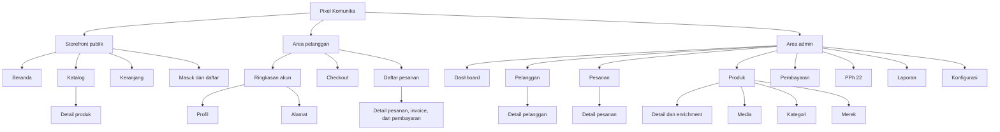

# Sitemap dan Kontrol Halaman

## Pixel Komunika E-Commerce

| Atribut | Nilai |
|---|---|
| Versi | 1.1 |
| Tanggal | 18 Agustus 2026 |
| Status | Working baseline |
| Cakupan | Halaman website pelanggan dan admin |
| Implementasi route | [`routes/web.php`](../../routes/web.php) |
| Requirement | [MVP](../requirements/MVP.md), [FRD](../requirements/FRD.md) |
| Alur | [User Flows](USER_FLOWS.md) |

## 1. Tujuan dan Aturan Status

Dokumen ini menjadi peta halaman sekaligus kontrol scope pengembangan. Sitemap
tidak menggantikan requirement atau user flow; dokumen ini menentukan **di
halaman mana** suatu kapabilitas ditempatkan.

Status yang digunakan:

- **Route tersedia**: route `GET` sudah ada. Status ini tidak berarti seluruh
  acceptance criteria halaman sudah selesai.
- **Rencana P0**: halaman diperlukan untuk memenuhi MVP, tetapi route belum
  tersedia.
- **Ditunda**: bukan kebutuhan P0 saat ini dan tidak boleh menghambat MVP.

## 2. Struktur Situs

## 3. Halaman Storefront dan Autentikasi

| ID | Halaman | Path | Akses | Status | Keterkaitan |
|---|---|---|---|---|---|
| PUB-001 | Beranda | `/` | Semua | Route tersedia | [UF-01](USER_FLOWS.md#uf-01-akses-katalog-publik) |
| PUB-002 | Katalog produk | `/produk` | Semua; harga mengikuti hak akses | Route tersedia | UF-01; FR-CAT-001 - FR-CAT-009 |
| PUB-003 | Detail produk | `/produk/{product}` | Semua; aksi beli untuk reseller aktif | Route tersedia | [UF-05](USER_FLOWS.md#uf-05-detail-produk-dan-cart) |
| PUB-004 | Keranjang | `/cart` | Semua; checkout untuk reseller aktif | Route tersedia | UF-05 - UF-06; FR-CART-001 - FR-CART-003 |
| AUTH-001 | Daftar | `/daftar` | Guest | Route tersedia | [UF-02](USER_FLOWS.md#uf-02-registrasi-pelanggan) |
| AUTH-002 | Masuk | `/masuk` | Guest | Route tersedia | [UF-04](USER_FLOWS.md#uf-04-login-dan-routing-akses) |

Pencarian, filter, kategori, dan merek ditempatkan di **PUB-002 Katalog** pada
versi pertama. Halaman terpisah hanya dibuat jika kebutuhan URL, SEO, atau alur
pengguna yang terukur memang muncul.

## 4. Area Pelanggan

| ID | Halaman | Path | Akses | Status | Keterkaitan |
|---|---|---|---|---|---|
| CUS-001 | Ringkasan akun | `/akun` | Pengguna login | Route tersedia | FR-AUTH-005 |
| CUS-002 | Profil | `/akun/profil` | Pengguna login | Route tersedia | FR-AUTH-005 |
| CUS-003 | Alamat | `/akun/alamat` | Pengguna login | Route tersedia | [UF-07](USER_FLOWS.md#uf-07-alamat-dan-pengiriman) |
| CUS-004 | Checkout | `/checkout` | Reseller aktif | Route tersedia | UF-07 - UF-09; FR-CART-004 - FR-CART-007 |
| CUS-005 | Daftar pesanan | `/akun/pesanan` | Reseller aktif | Route tersedia | FR-ORD-003 - FR-ORD-005 |
| CUS-006 | Detail pesanan | `/akun/pesanan/{order}` | Pemilik pesanan yang login | Route tersedia | UF-09 - UF-13 |

Invoice, unggah bukti pembayaran, status fulfillment, pembatalan yang diizinkan,
dan konfirmasi penerimaan ditempatkan di **CUS-006 Detail Pesanan**. Order
success cukup mengarahkan pelanggan ke detail pesanan; tidak perlu halaman baru
untuk versi pertama. `/orders` dan `/orders/{order}` tetap tersedia sebagai
alias kompatibilitas, tetapi bukan path utama navigasi.

## 5. Area Admin

| ID | Halaman | Path | Status | Kapabilitas utama | Keterkaitan |
|---|---|---|---|---|---|
| ADM-001 | Dashboard | `/admin` | Route tersedia | Ringkasan operasional | UF-03; UF-18 - UF-19 |
| ADM-002 | Pelanggan | `/admin/customers` | Route tersedia | Daftar dan antrean review pelanggan | [UF-03](USER_FLOWS.md#uf-03-review-dan-status-pelanggan) |
| ADM-003 | Detail pelanggan | `/admin/customers/{customerProfile}` | Route tersedia | Review dan perubahan status | UF-03; FR-AUTH-006 - FR-AUTH-009 |
| ADM-004 | Pesanan | `/admin/orders` | Route tersedia | Daftar, pemrosesan, dan pembatalan pesanan | UF-11 - UF-13; UF-19 |
| ADM-005 | Detail pesanan | `/admin/orders/{order}` | Route tersedia | Item, invoice, pembayaran, dan fulfillment | UF-11 - UF-13 |
| ADM-006 | Produk | `/admin/products` | Route tersedia | Daftar dan pencarian produk | [UF-16](USER_FLOWS.md#uf-16-enrichment-dan-visibilitas-produk) |
| ADM-007 | Detail produk | `/admin/products/{product}` | Route tersedia | Enrichment dan presentasi produk | UF-16 |
| ADM-008 | Media | `/admin/media` | Route tersedia | Pustaka dan penggunaan media produk | UF-16 |
| ADM-009 | Kategori | `/admin/categories` | Route tersedia | Visibilitas kategori | UF-14; UF-16 |
| ADM-010 | Merek | `/admin/brands` | Route tersedia | Visibilitas merek | UF-14; UF-16 |
| ADM-011 | Aturan PPh 22 | `/admin/tax-rules` | Route tersedia | Daftar ambang dan tarif per klasifikasi | [UF-17](USER_FLOWS.md#uf-17-konfigurasi-operasional) |
| ADM-012 | Edit aturan PPh 22 | `/admin/tax-rules/{category}/edit` | Route tersedia | Perubahan ambang dan tarif | UF-17 |
| ADM-013 | Pembayaran | `/admin/payments` | Route tersedia | Antrean dan verifikasi bukti pembayaran | [UF-11](USER_FLOWS.md#uf-11-verifikasi-pembayaran) |
| ADM-014 | Laporan | `/admin/reports` | Route tersedia | Transaksi, omzet, PPh 22 | [UF-18](USER_FLOWS.md#uf-18-laporan-dan-audit) |
| ADM-015 | Audit log | `/admin/audit-logs` | Route tersedia | Pencarian jejak audit aksi kritis | UF-18; FR-AUD-002 |
| ADM-016 | Konfigurasi | `/admin/settings` | Route tersedia | Pengiriman, identitas Pixel Komunika, rekening, POS, dan notifikasi | UF-17 |

## 6. Halaman yang Ditunda

| Halaman | Status | Alasan |
|---|---|---|
| Lupa/reset password | Ditunda | P1 pada MVP baseline |
| Wishlist | Ditunda | Tidak termasuk P0 |
| Notifikasi pelanggan | Ditunda | Tidak termasuk P0 |
| About, FAQ, dan Contact terpisah | Ditunda | Belum ada requirement P0; informasi minimum dapat berada di footer/beranda |

## 7. Endpoint Pendukung, Bukan Halaman

Endpoint berikut tidak dihitung sebagai halaman sitemap:

- `POST /daftar`, `POST /masuk`, dan `POST /logout` untuk autentikasi;
- `PATCH /akun/profil` serta `POST`, `PATCH`, dan `DELETE` alamat untuk
  pengelolaan akun;
- seluruh endpoint `PATCH`, `POST`, dan `DELETE` di area admin untuk menyimpan
  review, enrichment, aturan, dan konfigurasi;
- `GET /admin/payments/{paymentProof}` untuk menampilkan file bukti pembayaran,
  bukan halaman detail terpisah;
- `GET /api/pos/orders/{order_number}` untuk integrasi POS;
- `GET /health` untuk pemeriksaan teknis aplikasi.

## 8. Kontrol Perubahan

Sebelum halaman baru masuk sprint:

1. tentukan ID, induk navigasi, aktor, tujuan, dan prioritasnya di sitemap ini;
2. tautkan minimal satu requirement atau user flow;
3. putuskan apakah kebutuhan dapat ditempatkan pada halaman yang sudah ada;
4. tentukan proteksi akses dan keadaan loading, kosong, error, serta sukses;
5. setelah route dibuat atau diubah, perbarui path dan status di dokumen ini.

Sebuah halaman tidak dianggap selesai hanya karena route tersedia. Penyelesaian
tetap mengikuti acceptance criteria FRD, Definition of Done, test relevan, dan
hasil UAT.
