# User Flows

## Pixel Komunika E-Commerce

| Metadata | Nilai |
|---|---|
| Versi | 0.6 - Cancellation Source Clarification |
| Tanggal | Rabu, 29 Juli 2026 |
| Status | Internal - granular MVP flow |
| Sumber | [BRD](../requirements/BRD.md), [FRD](../requirements/FRD.md), [SRS](../requirements/SRS.md), dan [MVP](../requirements/MVP.md) |
| Model data | [ERD](ERD.md) dan [Data Dictionary](DATA_DICTIONARY.md) |

## 1. Konvensi

- Setiap diagram menangani satu tujuan operasional dan memiliki ID stabil.
- Arah alur utama adalah atas-ke-bawah (`flowchart TD`).
- Setiap keputusan menggunakan diamond dan setiap cabangnya memiliki label.
- Node lingkaran `UF-xx` adalah konektor ke flow lain, bukan proses baru.
- Konektor dapat diklik pada renderer Mermaid yang mengizinkan link lokal;
  tautan Markdown tetap disediakan setelah diagram sebagai fallback.
- Label `Provisional` menunjukkan cabang yang bergantung pada open question.
- Validasi dan kalkulasi kritis selalu dilakukan server-side.
- Flow reseller, refund, booking kurir Biteship, split shipment, dan
  penggabungan order tidak dimasukkan karena belum menjadi baseline MVP.

### 1.1 Notasi Flowchart

| Makna | Bentuk | Sintaks Mermaid |
|---|---|---|
| Mulai/selesai | Terminator/stadium | `A(["Mulai"])` |
| Input pengguna atau output sistem | Jajar genjang | `B[/"Masukkan atau tampilkan data"/]` |
| Proses/aktivitas | Persegi panjang | `C["Validasi data"]` |
| Keputusan/kondisi | Diamond | `D{"Valid?"}` |
| Data persisten/snapshot | Silinder | `E[("Data tersimpan")]` |
| Subprocess atau panggilan sistem eksternal | Predefined process | `F[["Panggil API"]]` |
| Referensi ke user flow lain | Lingkaran | `C_UF01((UF-01))` |

Referensi sintaks: <https://mermaid.js.org/syntax/flowchart.html>.

Notasi memakai sintaks bentuk Mermaid klasik agar tetap kompatibel dengan
renderer yang belum memakai Mermaid 11.3+. Bentuk baru melalui sintaks
`@{ shape: ... }`, swimlane native, document, manual-input, dan manual-operation
tidak dipakai karena versi Mermaid pada GitHub atau preview Markdown lokal
belum dijamin seragam. Mermaid mendukung jajar genjang dan trapezoid, tetapi
auto-layout tidak menjamin posisi, ukuran, atau jalur panah presisi. Klik pada
konektor juga dapat dinonaktifkan oleh renderer dengan security mode ketat.

## 2. Indeks Flow

| ID | Flow | Aktor Utama | Output |
|---|---|---|---|
| [UF-01](#uf-01-akses-katalog-publik) | Akses katalog publik | Guest, pending, aktif | Katalog sesuai hak akses |
| [UF-02](#uf-02-registrasi-pelanggan) | Registrasi pelanggan | Guest | Akun pending |
| [UF-03](#uf-03-review-dan-status-pelanggan) | Review dan status pelanggan | Admin | Akun aktif/rejected/suspended |
| [UF-04](#uf-04-login-dan-routing-akses) | Login dan routing akses | Pengguna | Sesi sesuai role/status |
| [UF-05](#uf-05-detail-produk-dan-cart) | Detail produk dan cart | Pelanggan aktif | Cart terisi |
| [UF-06](#uf-06-rekalkulasi-harga-dan-pph-22) | Rekalkulasi harga dan PPh 22 | Sistem | Total cart server-side |
| [UF-07](#uf-07-alamat-dan-pengiriman) | Alamat dan pengiriman | Pelanggan aktif, Biteship Maps/Rates | Snapshot ongkir terpilih |
| [UF-08](#uf-08-validasi-checkout) | Validasi checkout | Pelanggan aktif, sistem | Draft order idempotent |
| [UF-09](#uf-09-pembuatan-order-invoice-dan-pelaporan-pos) | Pembuatan order, invoice, dan pelaporan POS | Sistem, POS | Order/invoice aktif dan laporan penjualan tercatat |
| [UF-10](#uf-10-pengajuan-pembayaran) | Pengajuan pembayaran | Pelanggan aktif | Bukti pembayaran submitted |
| [UF-11](#uf-11-verifikasi-pembayaran) | Verifikasi pembayaran | Admin | Pembayaran verified/rejected |
| [UF-12](#uf-12-fulfillment-dan-penyelesaian) | Fulfillment dan penyelesaian | Admin, pelanggan, sistem | Order completed atau menunggu konfirmasi penerimaan |
| [UF-13](#uf-13-pembatalan-dan-pelaporan-retur) | Pembatalan dan pelaporan retur | Admin, scheduler, POS | Order cancelled, stok kembali, dan retur dilaporkan |
| [UF-14](#uf-14-sinkronisasi-master-dan-harga-pos) | Sinkronisasi master dan harga | Worker, POS/seeder | Master produk terkini |
| [UF-15](#uf-15-sinkronisasi-dan-stok-efektif) | Sinkronisasi dan stok efektif | Worker, POS | Snapshot dan ledger stok |
| [UF-16](#uf-16-enrichment-dan-visibilitas-produk) | Enrichment dan visibilitas | Admin | Presentasi produk terkini |
| [UF-17](#uf-17-konfigurasi-operasional) | Konfigurasi operasional | Admin | Aturan bisnis aktif |
| [UF-18](#uf-18-laporan-dan-audit) | Laporan dan audit | Admin | Laporan snapshot dan audit trail |
| [UF-19](#uf-19-notifikasi-order-baru-admin) | Notifikasi order baru admin | Sistem, admin | Indikator website dan pesan WhatsApp |

## 3. Customer-facing Flows

### UF-01 Akses Katalog Publik

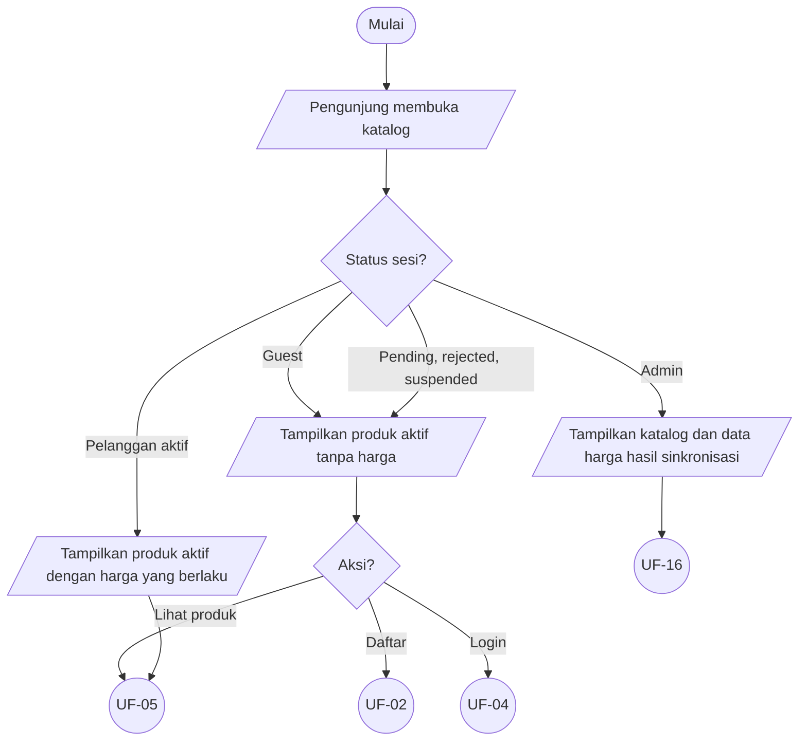
```mermaid
flowchart TD
    A(["Mulai"]) --> B[/"Pengunjung membuka katalog"/]
    B --> C{"Status sesi?"}
    C -->|Guest| D[/"Tampilkan produk aktif tanpa harga"/]
    C -->|Pending, rejected, suspended| D
    C -->|Pelanggan aktif| E[/"Tampilkan produk aktif dengan harga yang berlaku"/]
    C -->|Admin| F[/"Tampilkan katalog dan data harga hasil sinkronisasi"/]
    D --> G{"Aksi?"}
    G -->|Lihat produk| C_UF05((UF-05))
    G -->|Daftar| C_UF02((UF-02))
    G -->|Login| C_UF04((UF-04))
    E --> C_UF05
    F --> C_UF16((UF-16))

    click C_UF02 "#uf-02-registrasi-pelanggan"
    click C_UF04 "#uf-04-login-dan-routing-akses"
    click C_UF05 "#uf-05-detail-produk-dan-cart"
    click C_UF16 "#uf-16-enrichment-dan-visibilitas-produk"
```

Lanjutan: [UF-02 Registrasi](#uf-02-registrasi-pelanggan),
[UF-04 Login](#uf-04-login-dan-routing-akses),
[UF-05 Detail Produk](#uf-05-detail-produk-dan-cart), atau
[UF-16 Enrichment](#uf-16-enrichment-dan-visibilitas-produk).

### UF-02 Registrasi Pelanggan

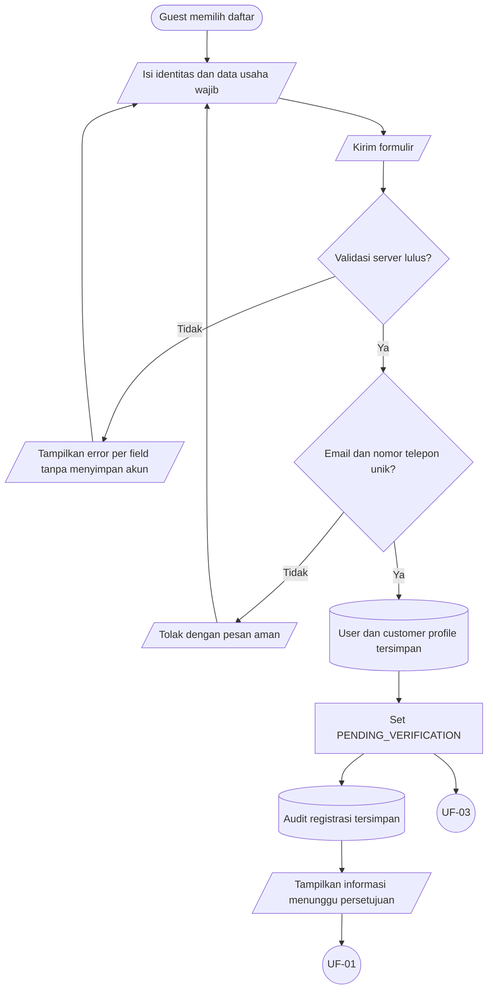
```mermaid
flowchart TD
    A(["Guest memilih daftar"]) --> B[/"Isi identitas dan data usaha wajib"/]
    B --> C[/"Kirim formulir"/]
    C --> D{"Validasi server lulus?"}
    D -->|Tidak| E[/"Tampilkan error per field tanpa menyimpan akun"/]
    E --> B
    D -->|Ya| F{"Email dan nomor telepon unik?"}
    F -->|Tidak| G[/"Tolak dengan pesan aman"/]
    G --> B
    F -->|Ya| H[("User dan customer profile tersimpan")]
    H --> I["Set PENDING_VERIFICATION"]
    I --> J[("Audit registrasi tersimpan")]
    J --> K[/"Tampilkan informasi menunggu persetujuan"/]
    K --> C_UF01((UF-01))
    I --> C_UF03((UF-03))

    click C_UF01 "#uf-01-akses-katalog-publik"
    click C_UF03 "#uf-03-review-dan-status-pelanggan"
```

Lanjutan: pelanggan kembali ke
[UF-01 Katalog Publik](#uf-01-akses-katalog-publik); admin memproses melalui
[UF-03 Review Pelanggan](#uf-03-review-dan-status-pelanggan).

### UF-03 Review dan Status Pelanggan

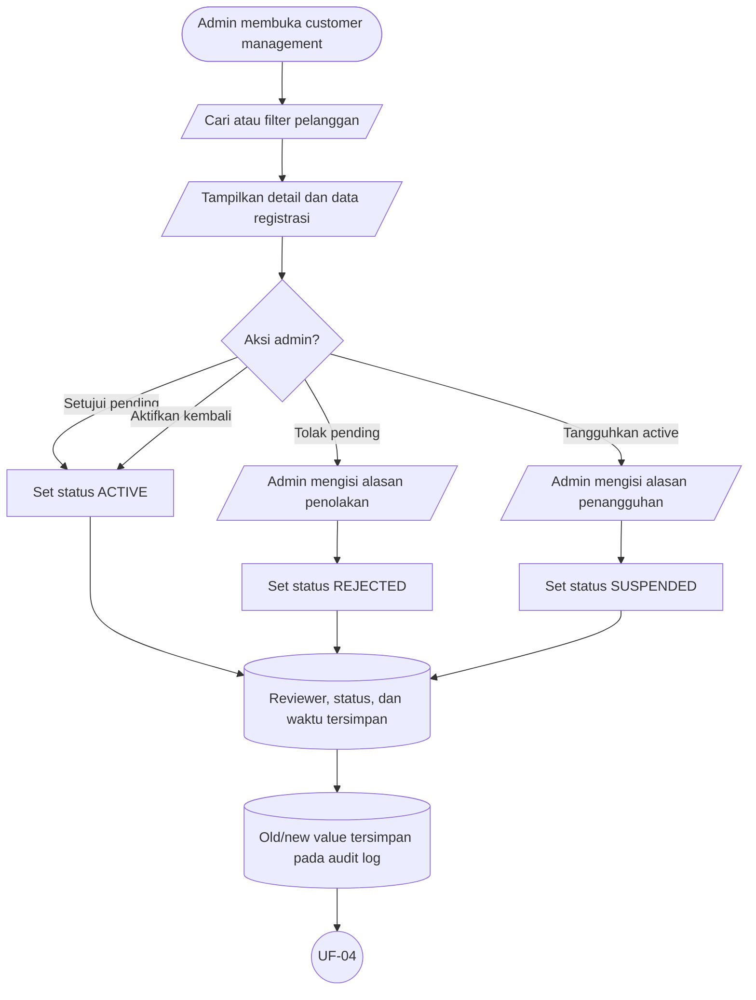
```mermaid
flowchart TD
    A(["Admin membuka customer management"]) --> B[/"Cari atau filter pelanggan"/]
    B --> C[/"Tampilkan detail dan data registrasi"/]
    C --> D{"Aksi admin?"}
    D -->|Setujui pending| E["Set status ACTIVE"]
    D -->|Tolak pending| F[/"Admin mengisi alasan penolakan"/]
    F --> G["Set status REJECTED"]
    D -->|Tangguhkan active| H[/"Admin mengisi alasan penangguhan"/]
    H --> I["Set status SUSPENDED"]
    D -->|Aktifkan kembali| E
    E --> J[("Reviewer, status, dan waktu tersimpan")]
    G --> J
    I --> J
    J --> K[("Old/new value tersimpan pada audit log")]
    K --> C_UF04((UF-04))

    click C_UF04 "#uf-04-login-dan-routing-akses"
```

Lanjutan: status baru diterapkan pada
[UF-04 Login dan Routing](#uf-04-login-dan-routing-akses).

### UF-04 Login dan Routing Akses

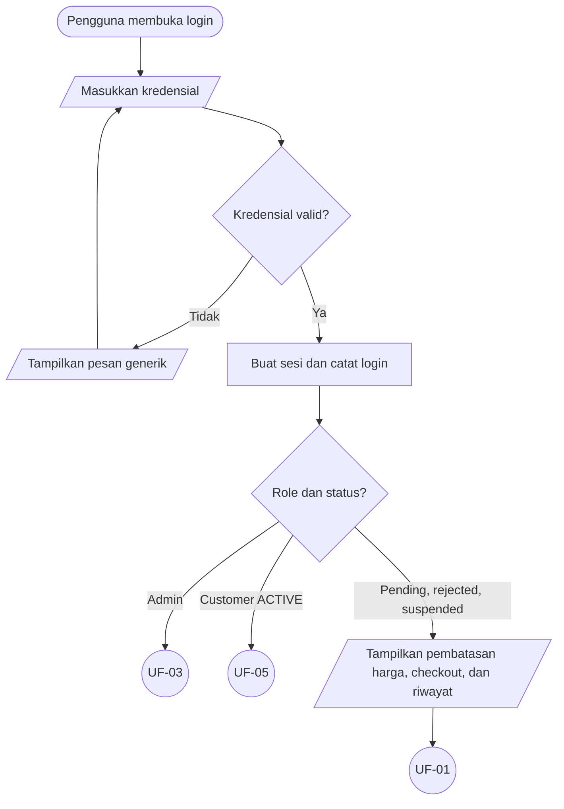
```mermaid
flowchart TD
    A(["Pengguna membuka login"]) --> B[/"Masukkan kredensial"/]
    B --> C{"Kredensial valid?"}
    C -->|Tidak| D[/"Tampilkan pesan generik"/]
    D --> B
    C -->|Ya| E["Buat sesi dan catat login"]
    E --> F{"Role dan status?"}
    F -->|Admin| C_UF03((UF-03))
    F -->|Customer ACTIVE| C_UF05((UF-05))
    F -->|Pending, rejected, suspended| G[/"Tampilkan pembatasan harga, checkout, dan riwayat"/]
    G --> C_UF01((UF-01))

    click C_UF01 "#uf-01-akses-katalog-publik"
    click C_UF03 "#uf-03-review-dan-status-pelanggan"
    click C_UF05 "#uf-05-detail-produk-dan-cart"
```

Lanjutan: [UF-01 Katalog Publik](#uf-01-akses-katalog-publik),
[UF-03 Customer Management](#uf-03-review-dan-status-pelanggan), atau
[UF-05 Produk dan Cart](#uf-05-detail-produk-dan-cart).

### UF-05 Detail Produk dan Cart

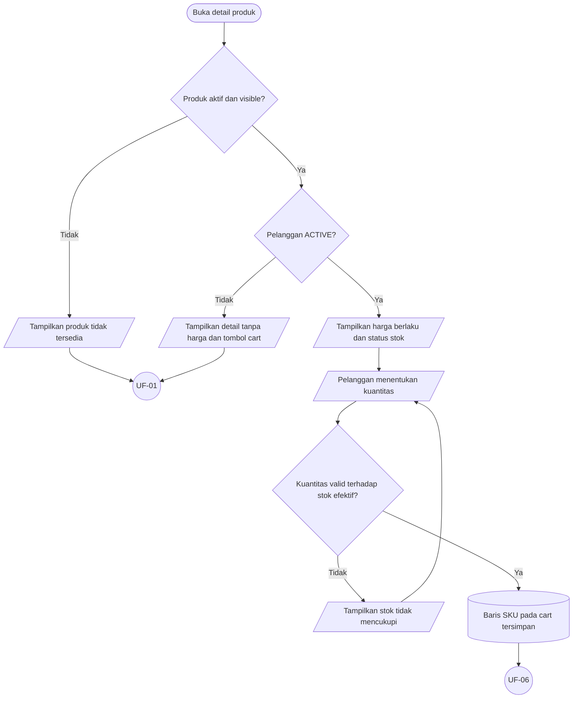
```mermaid
flowchart TD
    A(["Buka detail produk"]) --> B{"Produk aktif dan visible?"}
    B -->|Tidak| C[/"Tampilkan produk tidak tersedia"/]
    C --> C_UF01((UF-01))
    B -->|Ya| D{"Pelanggan ACTIVE?"}
    D -->|Tidak| E[/"Tampilkan detail tanpa harga dan tombol cart"/]
    E --> C_UF01
    D -->|Ya| F[/"Tampilkan harga berlaku dan status stok"/]
    F --> G[/"Pelanggan menentukan kuantitas"/]
    G --> H{"Kuantitas valid terhadap stok efektif?"}
    H -->|Tidak| I[/"Tampilkan stok tidak mencukupi"/]
    I --> G
    H -->|Ya| J[("Baris SKU pada cart tersimpan")]
    J --> C_UF06((UF-06))

    click C_UF01 "#uf-01-akses-katalog-publik"
    click C_UF06 "#uf-06-rekalkulasi-harga-dan-pph-22"
```

Lanjutan: [UF-06 Rekalkulasi Cart](#uf-06-rekalkulasi-harga-dan-pph-22).

### UF-06 Rekalkulasi Harga dan PPh 22

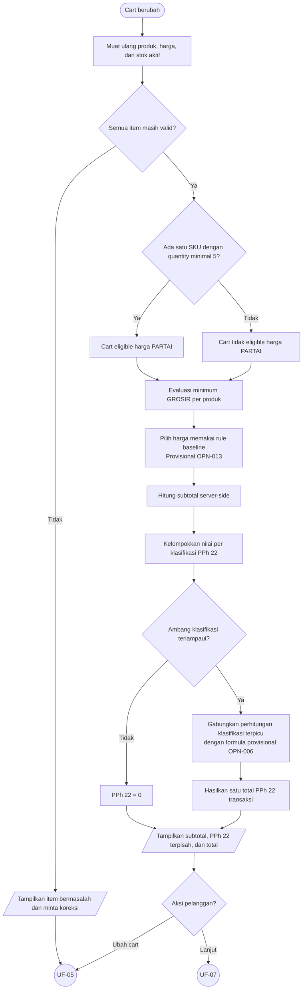
```mermaid
flowchart TD
    A(["Cart berubah"]) --> B["Muat ulang produk, harga, dan stok aktif"]
    B --> C{"Semua item masih valid?"}
    C -->|Tidak| D[/"Tampilkan item bermasalah dan minta koreksi"/]
    D --> C_UF05((UF-05))
    C -->|Ya| E{"Ada satu SKU dengan quantity minimal 5?"}
    E -->|Ya| F["Cart eligible harga PARTAI"]
    E -->|Tidak| G["Cart tidak eligible harga PARTAI"]
    F --> H["Evaluasi minimum GROSIR per produk"]
    G --> H
    H --> I["Pilih harga memakai rule baseline<br/>Provisional OPN-013"]
    I --> J["Hitung subtotal server-side"]
    J --> K["Kelompokkan nilai per klasifikasi PPh 22"]
    K --> L{"Ambang klasifikasi terlampaui?"}
    L -->|Tidak| M["PPh 22 = 0"]
    L -->|Ya| N["Gabungkan perhitungan klasifikasi terpicu<br/>dengan formula provisional OPN-006"]
    N --> N1["Hasilkan satu total PPh 22 transaksi"]
    M --> O[/"Tampilkan subtotal, PPh 22 terpisah, dan total"/]
    N1 --> O
    O --> P{"Aksi pelanggan?"}
    P -->|Ubah cart| C_UF05
    P -->|Lanjut| C_UF07((UF-07))

    click C_UF05 "#uf-05-detail-produk-dan-cart"
    click C_UF07 "#uf-07-alamat-dan-pengiriman"
```

Kuantitas SKU berbeda tidak pernah dijumlahkan untuk memenuhi syarat lima unit.
Cakupan item yang memperoleh harga partai dan prioritas terhadap grosir tetap
[OPN-013](../requirements/BRD.md#opn-013). Multi-klasifikasi menghasilkan satu
total gabungan; dasar pengenaan dan urutan agregasi tetap
[OPN-006](../requirements/BRD.md#opn-006).

Lanjutan: [UF-07 Alamat dan Pengiriman](#uf-07-alamat-dan-pengiriman).

### UF-07 Alamat dan Pengiriman

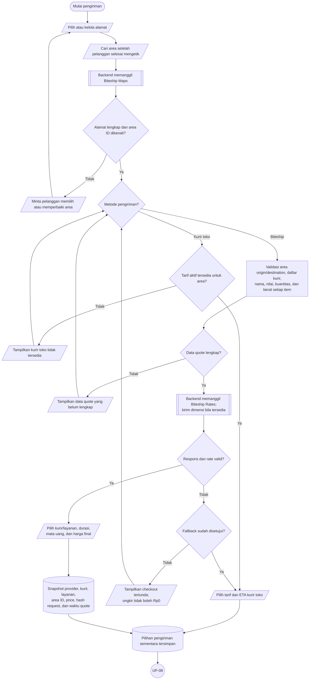
```mermaid
flowchart TD
    A(["Mulai pengiriman"]) --> B[/"Pilih atau kelola alamat"/]
    B --> B1[/"Cari area setelah pelanggan selesai mengetik"/]
    B1 --> B2[["Backend memanggil Biteship Maps"]]
    B2 --> C{"Alamat lengkap dan area ID dikenali?"}
    C -->|Tidak| D[/"Minta pelanggan memilih atau memperbaiki area"/]
    D --> B
    C -->|Ya| E{"Metode pengiriman?"}
    E -->|Kurir toko| F{"Tarif aktif tersedia untuk area?"}
    F -->|Tidak| G[/"Tampilkan kurir toko tidak tersedia"/]
    G --> E
    F -->|Ya| H[/"Pilih tarif dan ETA kurir toko"/]
    E -->|Biteship| I["Validasi area origin/destination, daftar kurir,<br/>nama, nilai, kuantitas, dan berat setiap item"]
    I --> J{"Data quote lengkap?"}
    J -->|Tidak| K[/"Tampilkan data quote yang belum lengkap"/]
    K --> E
    J -->|Ya| L[["Backend memanggil Biteship Rates;<br/>kirim dimensi bila tersedia"]]
    L --> M{"Respons dan rate valid?"}
    M -->|Ya| N[/"Pilih kurir/layanan, durasi,<br/>mata uang, dan harga final"/]
    M -->|Tidak| O{"Fallback sudah disetujui?"}
    O -->|Tidak| P[/"Tampilkan checkout tertunda;<br/>ongkir tidak boleh Rp0"/]
    P --> E
    O -->|Ya| H
    H --> Q[("Pilihan pengiriman sementara tersimpan")]
    N --> R[("Snapshot provider, kurir, layanan,<br/>area ID, price, hash request, dan waktu quote")]
    R --> Q
    Q --> C_UF08((UF-08))

    click C_UF08 "#uf-08-validasi-checkout"
```

Data operasional dan fallback mengikuti
[OPN-010](../requirements/BRD.md#opn-010),
[OPN-016](../requirements/BRD.md#opn-016), dan
[OPN-021](../requirements/BRD.md#opn-021).
Biteship di flow ini adalah external Maps/Rates provider; flow tidak membuat
order, pickup, label, atau tracking di Biteship.

Lanjutan: [UF-08 Validasi Checkout](#uf-08-validasi-checkout).

### UF-08 Validasi Checkout

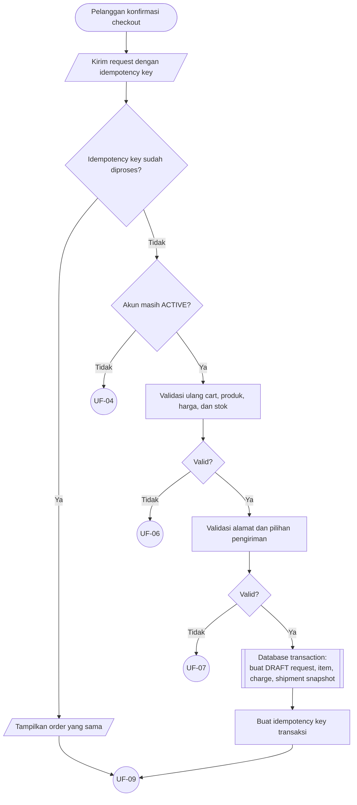
```mermaid
flowchart TD
    A(["Pelanggan konfirmasi checkout"]) --> B[/"Kirim request dengan idempotency key"/]
    B --> C{"Idempotency key sudah diproses?"}
    C -->|Ya| D[/"Tampilkan order yang sama"/]
    D --> C_UF09((UF-09))
    C -->|Tidak| E{"Akun masih ACTIVE?"}
    E -->|Tidak| C_UF04((UF-04))
    E -->|Ya| F["Validasi ulang cart, produk, harga, dan stok"]
    F --> G{"Valid?"}
    G -->|Tidak| C_UF06((UF-06))
    G -->|Ya| H["Validasi alamat dan pilihan pengiriman"]
    H --> I{"Valid?"}
    I -->|Tidak| C_UF07((UF-07))
    I -->|Ya| J[["Database transaction:<br/>buat DRAFT request, item, charge, shipment snapshot"]]
    J --> K["Buat idempotency key transaksi"]
    K --> C_UF09

    click C_UF04 "#uf-04-login-dan-routing-akses"
    click C_UF06 "#uf-06-rekalkulasi-harga-dan-pph-22"
    click C_UF07 "#uf-07-alamat-dan-pengiriman"
    click C_UF09 "#uf-09-pembuatan-order-invoice-dan-pelaporan-pos"
```

Lanjutan: [UF-09 Pembuatan Order dan Invoice](#uf-09-pembuatan-order-invoice-dan-pelaporan-pos).

### UF-09 Pembuatan Order, Invoice, dan Pelaporan POS

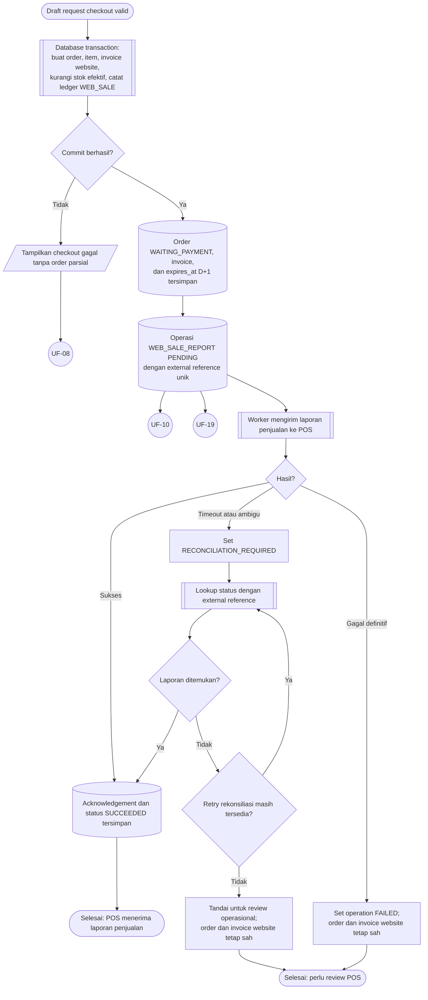
```mermaid
flowchart TD
    A(["Draft request checkout valid"]) --> B[["Database transaction:<br/>buat order, item, invoice website,<br/>kurangi stok efektif, catat ledger WEB_SALE"]]
    B --> C{"Commit berhasil?"}
    C -->|Tidak| D[/"Tampilkan checkout gagal tanpa order parsial"/]
    D --> C_UF08((UF-08))
    C -->|Ya| E[("Order WAITING_PAYMENT, invoice,<br/>dan expires_at D+1 tersimpan")]
    E --> F[("Operasi WEB_SALE_REPORT PENDING<br/>dengan external reference unik")]
    F --> C_UF10((UF-10))
    F --> C_UF19((UF-19))
    F --> G[["Worker mengirim laporan penjualan ke POS"]]
    G --> H{"Hasil?"}
    H -->|Sukses| I[("Acknowledgement dan status SUCCEEDED tersimpan")]
    I --> J(["Selesai: POS menerima laporan penjualan"])
    H -->|Timeout atau ambigu| K["Set RECONCILIATION_REQUIRED"]
    K --> L[["Lookup status dengan external reference"]]
    L --> M{"Laporan ditemukan?"}
    M -->|Ya| I
    M -->|Tidak| N{"Retry rekonsiliasi masih tersedia?"}
    N -->|Ya| L
    N -->|Tidak| O["Tandai untuk review operasional;<br/>order dan invoice website tetap sah"]
    O --> P(["Selesai: perlu review POS"])
    H -->|Gagal definitif| Q["Set operation FAILED;<br/>order dan invoice website tetap sah"]
    Q --> P

    click C_UF08 "#uf-08-validasi-checkout"
    click C_UF10 "#uf-10-pengajuan-pembayaran"
    click C_UF19 "#uf-19-notifikasi-order-baru-admin"
```

Website adalah source of truth order dan invoice. Gangguan POS tidak menggagalkan
commit website; kontrak operasi, payload, acknowledgement/lookup, autentikasi,
error, dan idempotency final mengikuti
[OPN-005](../requirements/BRD.md#opn-005).

Lanjutan: [UF-10 Pengajuan Pembayaran](#uf-10-pengajuan-pembayaran) dan
[UF-19 Notifikasi Admin](#uf-19-notifikasi-order-baru-admin).

### UF-10 Pengajuan Pembayaran

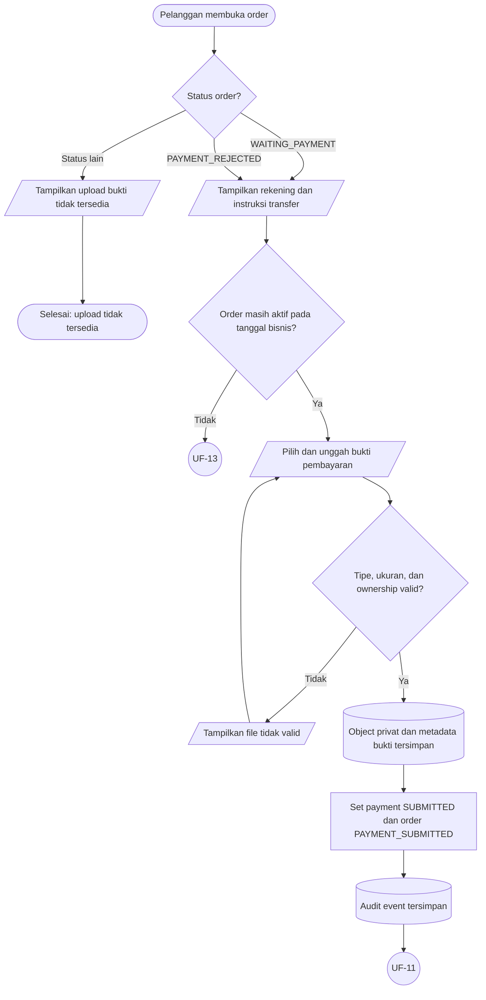
```mermaid
flowchart TD
    A(["Pelanggan membuka order"]) --> B{"Status order?"}
    B -->|WAITING_PAYMENT| C[/"Tampilkan rekening dan instruksi transfer"/]
    B -->|PAYMENT_REJECTED| C
    B -->|Status lain| D[/"Tampilkan upload bukti tidak tersedia"/]
    D --> D1(["Selesai: upload tidak tersedia"])
    C --> E{"Order masih aktif pada tanggal bisnis?"}
    E -->|Tidak| C_UF13((UF-13))
    E -->|Ya| F[/"Pilih dan unggah bukti pembayaran"/]
    F --> G{"Tipe, ukuran, dan ownership valid?"}
    G -->|Tidak| H[/"Tampilkan file tidak valid"/]
    H --> F
    G -->|Ya| I[("Object privat dan metadata bukti tersimpan")]
    I --> J["Set payment SUBMITTED dan order PAYMENT_SUBMITTED"]
    J --> K[("Audit event tersimpan")]
    K --> C_UF11((UF-11))

    click C_UF11 "#uf-11-verifikasi-pembayaran"
    click C_UF13 "#uf-13-pembatalan-dan-pelaporan-retur"
```

Lanjutan: [UF-11 Verifikasi Pembayaran](#uf-11-verifikasi-pembayaran) atau
[UF-13 Pembatalan](#uf-13-pembatalan-dan-pelaporan-retur).

### UF-11 Verifikasi Pembayaran

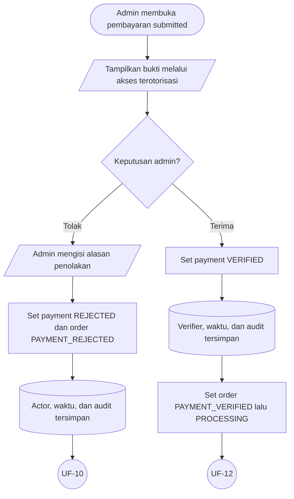
```mermaid
flowchart TD
    A(["Admin membuka pembayaran submitted"]) --> B[/"Tampilkan bukti melalui akses terotorisasi"/]
    B --> C{"Keputusan admin?"}
    C -->|Tolak| D[/"Admin mengisi alasan penolakan"/]
    D --> E["Set payment REJECTED dan order PAYMENT_REJECTED"]
    E --> F[("Actor, waktu, dan audit tersimpan")]
    F --> C_UF10((UF-10))
    C -->|Terima| G["Set payment VERIFIED"]
    G --> H[("Verifier, waktu, dan audit tersimpan")]
    H --> I["Set order PAYMENT_VERIFIED lalu PROCESSING"]
    I --> C_UF12((UF-12))

    click C_UF10 "#uf-10-pengajuan-pembayaran"
    click C_UF12 "#uf-12-fulfillment-dan-penyelesaian"
```

Lanjutan: pelanggan mengunggah ulang melalui
[UF-10](#uf-10-pengajuan-pembayaran), atau order diteruskan ke
[UF-12 Fulfillment](#uf-12-fulfillment-dan-penyelesaian).

### UF-12 Fulfillment dan Penyelesaian

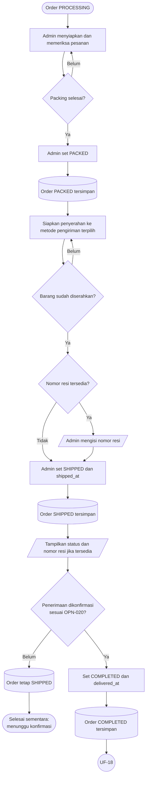
```mermaid
flowchart TD
    A(["Order PROCESSING"]) --> B["Admin menyiapkan dan memeriksa pesanan"]
    B --> C{"Packing selesai?"}
    C -->|Belum| B
    C -->|Ya| D["Admin set PACKED"]
    D --> E[("Order PACKED tersimpan")]
    E --> F["Siapkan penyerahan ke metode pengiriman terpilih"]
    F --> G{"Barang sudah diserahkan?"}
    G -->|Belum| F
    G -->|Ya| H{"Nomor resi tersedia?"}
    H -->|Ya| I[/"Admin mengisi nomor resi"/]
    H -->|Tidak| J["Admin set SHIPPED dan shipped_at"]
    I --> J
    J --> K[("Order SHIPPED tersimpan")]
    K --> L[/"Tampilkan status dan nomor resi jika tersedia"/]
    L --> M{"Penerimaan dikonfirmasi<br/>sesuai OPN-020?"}
    M -->|Belum| N[("Order tetap SHIPPED")]
    N --> O(["Selesai sementara:<br/>menunggu konfirmasi"])
    M -->|Ya| P["Set COMPLETED dan delivered_at"]
    P --> Q[("Order COMPLETED tersimpan")]
    Q --> C_UF18((UF-18))

    click C_UF18 "#uf-18-laporan-dan-audit"
```

Lifecycle fulfillment adalah `PROCESSING` -> `PACKED` -> `SHIPPED` ->
`COMPLETED`. Urutannya telah disetujui, tetapi kondisi packing selesai,
kewajiban nomor resi, pihak yang mengonfirmasi penerimaan, trigger
`COMPLETED`, dan penanganan barang belum diterima masih provisional melalui
[OPN-020](../requirements/BRD.md#opn-020). Melihat nomor resi tidak memicu
`COMPLETED`. Booking/pickup Biteship tidak dilakukan website.

Lanjutan: [UF-18 Laporan](#uf-18-laporan-dan-audit).

### UF-13 Pembatalan dan Pelaporan Retur

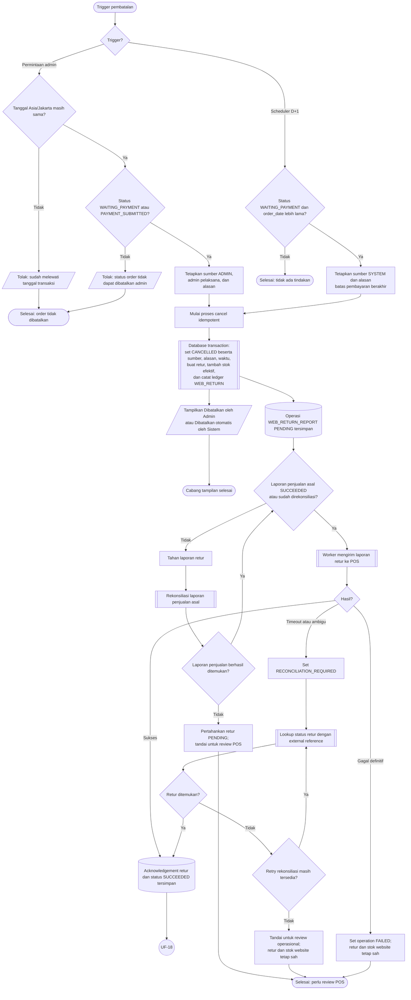
```mermaid
flowchart TD
    A(["Trigger pembatalan"]) --> B{"Trigger?"}
    B -->|Permintaan admin| C{"Tanggal Asia/Jakarta masih sama?"}
    C -->|Tidak| D1[/"Tolak: sudah melewati tanggal transaksi"/]
    D1 --> T(["Selesai: order tidak dibatalkan"])
    C -->|Ya| E{"Status WAITING_PAYMENT atau PAYMENT_SUBMITTED?"}
    E -->|Tidak| D2[/"Tolak: status order tidak dapat dibatalkan admin"/]
    D2 --> T
    E -->|Ya| F1["Tetapkan sumber ADMIN,<br/>admin pelaksana, dan alasan"]
    B -->|Scheduler D+1| G{"Status WAITING_PAYMENT dan order_date lebih lama?"}
    G -->|Tidak| H(["Selesai: tidak ada tindakan"])
    G -->|Ya| F2["Tetapkan sumber SYSTEM dan alasan<br/>batas pembayaran berakhir"]
    F1 --> F["Mulai proses cancel idempotent"]
    F2 --> F
    F --> I[["Database transaction:<br/>set CANCELLED beserta sumber, alasan, waktu,<br/>buat retur, tambah stok efektif,<br/>dan catat ledger WEB_RETURN"]]
    I --> J[("Operasi WEB_RETURN_REPORT PENDING tersimpan")]
    I --> J1[/"Tampilkan Dibatalkan oleh Admin<br/>atau Dibatalkan otomatis oleh Sistem"/]
    J1 --> J2(["Cabang tampilan selesai"])
    J --> K{"Laporan penjualan asal SUCCEEDED<br/>atau sudah direkonsiliasi?"}
    K -->|Tidak| L["Tahan laporan retur"]
    L --> M[["Rekonsiliasi laporan penjualan asal"]]
    M --> M1{"Laporan penjualan berhasil ditemukan?"}
    M1 -->|Ya| K
    M1 -->|Tidak| M2["Pertahankan retur PENDING;<br/>tandai untuk review POS"]
    M2 --> T2
    K -->|Ya| N[["Worker mengirim laporan retur ke POS"]]
    N --> O{"Hasil?"}
    O -->|Sukses| P[("Acknowledgement retur dan status SUCCEEDED tersimpan")]
    P --> C_UF18((UF-18))
    O -->|Timeout atau ambigu| Q["Set RECONCILIATION_REQUIRED"]
    Q --> R[["Lookup status retur dengan external reference"]]
    R --> S{"Retur ditemukan?"}
    S -->|Ya| P
    S -->|Tidak| S1{"Retry rekonsiliasi masih tersedia?"}
    S1 -->|Ya| R
    S1 -->|Tidak| S2["Tandai untuk review operasional;<br/>retur dan stok website tetap sah"]
    S2 --> T2(["Selesai: perlu review POS"])
    O -->|Gagal definitif| U["Set operation FAILED;<br/>retur dan stok website tetap sah"]
    U --> T2

    click C_UF18 "#uf-18-laporan-dan-audit"
```

Auto-cancel baseline hanya menargetkan `WAITING_PAYMENT` dari hari kalender
sebelumnya dan selalu dijalankan otomatis oleh scheduler. Penolakan pada cabang
admin hanya menolak permintaan pembatalan operasional yang melewati tanggal
transaksi atau tidak memenuhi status. Kedua cabang memakai status `CANCELLED`;
perbedaannya disimpan pada `cancellation_source`, `cancelled_by_user_id`,
`cancellation_reason`, dan `cancelled_at`, lalu ditampilkan sebagai keterangan
order. Refund setelah pembayaran terverifikasi berada di luar flow ini.

Lanjutan: [UF-18 Laporan](#uf-18-laporan-dan-audit).

## 4. Back-office dan Integration Flows

### UF-14 Sinkronisasi Master dan Harga POS

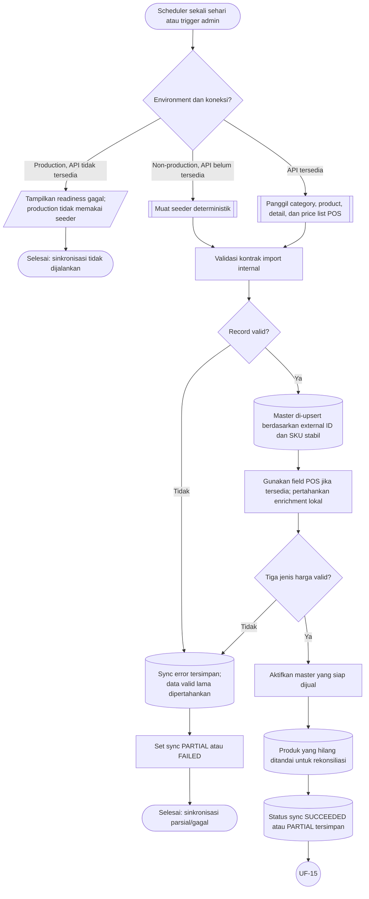
```mermaid
flowchart TD
    A(["Scheduler sekali sehari atau trigger admin"]) --> B{"Environment dan koneksi?"}
    B -->|Non-production, API belum tersedia| C[["Muat seeder deterministik"]]
    B -->|Production, API tidak tersedia| D[/"Tampilkan readiness gagal;<br/>production tidak memakai seeder"/]
    D --> D1(["Selesai: sinkronisasi tidak dijalankan"])
    B -->|API tersedia| E[["Panggil category, product, detail, dan price list POS"]]
    C --> F["Validasi kontrak import internal"]
    E --> F
    F --> G{"Record valid?"}
    G -->|Tidak| H[("Sync error tersimpan;<br/>data valid lama dipertahankan")]
    G -->|Ya| I[("Master di-upsert berdasarkan external ID dan SKU stabil")]
    I --> J["Gunakan field POS jika tersedia; pertahankan enrichment lokal"]
    J --> K{"Tiga jenis harga valid?"}
    K -->|Tidak| H
    K -->|Ya| L["Aktifkan master yang siap dijual"]
    L --> M[("Produk yang hilang ditandai untuk rekonsiliasi")]
    H --> N["Set sync PARTIAL atau FAILED"]
    N --> N1(["Selesai: sinkronisasi parsial/gagal"])
    M --> O[("Status sync SUCCEEDED atau PARTIAL tersimpan")]
    O --> C_UF15((UF-15))

    click C_UF15 "#uf-15-sinkronisasi-dan-stok-efektif"
```

Akses POS dibuka setelah alur website berbasis data contoh berjalan; Kak Rio
adalah PIC. Go-live tetap memerlukan contract test POS.

Lanjutan: [UF-15 Inventory](#uf-15-sinkronisasi-dan-stok-efektif).

### UF-15 Sinkronisasi dan Stok Efektif

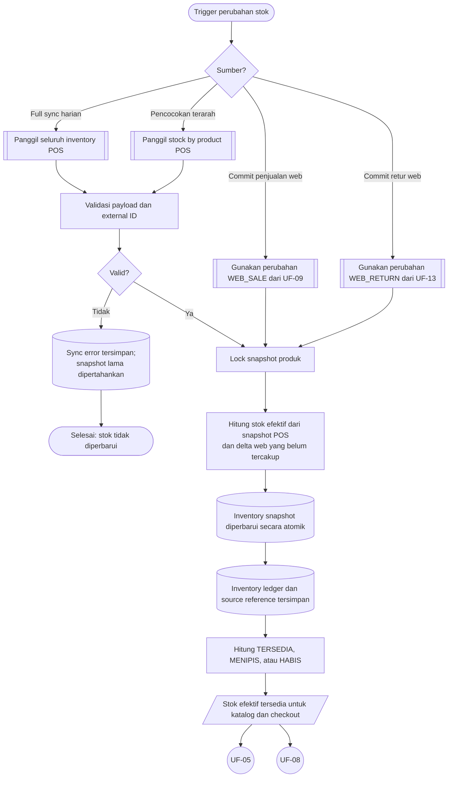
```mermaid
flowchart TD
    A(["Trigger perubahan stok"]) --> B{"Sumber?"}
    B -->|Full sync harian| C[["Panggil seluruh inventory POS"]]
    B -->|Pencocokan terarah| D[["Panggil stock by product POS"]]
    B -->|Commit penjualan web| E[["Gunakan perubahan WEB_SALE dari UF-09"]]
    B -->|Commit retur web| F[["Gunakan perubahan WEB_RETURN dari UF-13"]]
    C --> G["Validasi payload dan external ID"]
    D --> G
    E --> H["Lock snapshot produk"]
    F --> H
    G --> I{"Valid?"}
    I -->|Tidak| J[("Sync error tersimpan;<br/>snapshot lama dipertahankan")]
    J --> J1(["Selesai: stok tidak diperbarui"])
    I -->|Ya| H
    H --> K["Hitung stok efektif dari snapshot POS<br/>dan delta web yang belum tercakup"]
    K --> L[("Inventory snapshot diperbarui secara atomik")]
    L --> M[("Inventory ledger dan source reference tersimpan")]
    M --> N["Hitung TERSEDIA, MENIPIS, atau HABIS"]
    N --> O[/"Stok efektif tersedia untuk katalog dan checkout"/]
    O --> C_UF05((UF-05))
    O --> C_UF08((UF-08))

    click C_UF05 "#uf-05-detail-produk-dan-cart"
    click C_UF08 "#uf-08-validasi-checkout"
```

Lanjutan: [UF-05 Produk dan Cart](#uf-05-detail-produk-dan-cart) dan
[UF-08 Checkout](#uf-08-validasi-checkout).

### UF-16 Enrichment dan Visibilitas Produk

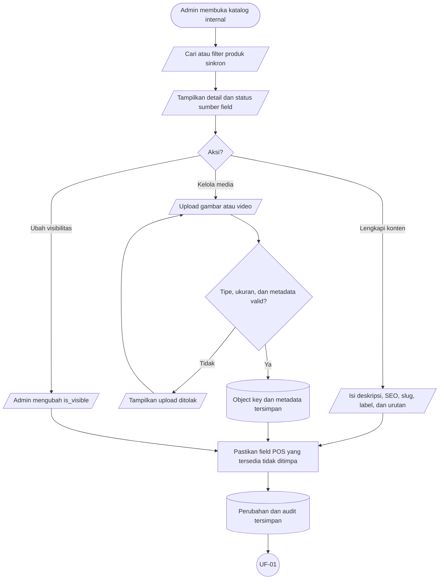
```mermaid
flowchart TD
    A(["Admin membuka katalog internal"]) --> B[/"Cari atau filter produk sinkron"/]
    B --> C[/"Tampilkan detail dan status sumber field"/]
    C --> D{"Aksi?"}
    D -->|Lengkapi konten| E[/"Isi deskripsi, SEO, slug, label, dan urutan"/]
    D -->|Kelola media| F[/"Upload gambar atau video"/]
    F --> G{"Tipe, ukuran, dan metadata valid?"}
    G -->|Tidak| H[/"Tampilkan upload ditolak"/]
    H --> F
    G -->|Ya| I[("Object key dan metadata tersimpan")]
    D -->|Ubah visibilitas| J[/"Admin mengubah is_visible"/]
    E --> K["Pastikan field POS yang tersedia tidak ditimpa"]
    I --> K
    J --> K
    K --> L[("Perubahan dan audit tersimpan")]
    L --> C_UF01((UF-01))

    click C_UF01 "#uf-01-akses-katalog-publik"
```

Lanjutan: perubahan tampil pada
[UF-01 Katalog Publik](#uf-01-akses-katalog-publik).

### UF-17 Konfigurasi Operasional

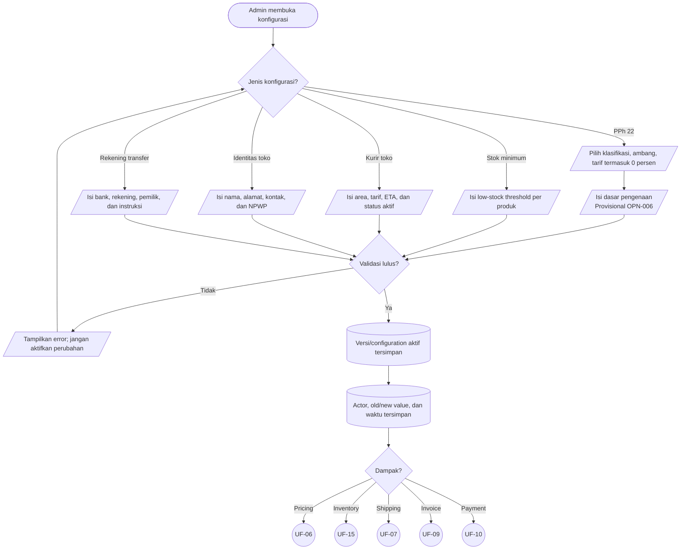
```mermaid
flowchart TD
    A(["Admin membuka konfigurasi"]) --> B{"Jenis konfigurasi?"}
    B -->|PPh 22| C[/"Pilih klasifikasi, ambang, tarif termasuk 0 persen"/]
    C --> D[/"Isi dasar pengenaan<br/>Provisional OPN-006"/]
    B -->|Stok minimum| E[/"Isi low-stock threshold per produk"/]
    B -->|Kurir toko| F[/"Isi area, tarif, ETA, dan status aktif"/]
    B -->|Identitas toko| G[/"Isi nama, alamat, kontak, dan NPWP"/]
    B -->|Rekening transfer| H[/"Isi bank, rekening, pemilik, dan instruksi"/]
    D --> I{"Validasi lulus?"}
    E --> I
    F --> I
    G --> I
    H --> I
    I -->|Tidak| J[/"Tampilkan error; jangan aktifkan perubahan"/]
    J --> B
    I -->|Ya| K[("Versi/configuration aktif tersimpan")]
    K --> L[("Actor, old/new value, dan waktu tersimpan")]
    L --> M{"Dampak?"}
    M -->|Pricing| C_UF06((UF-06))
    M -->|Inventory| C_UF15((UF-15))
    M -->|Shipping| C_UF07((UF-07))
    M -->|Invoice| C_UF09((UF-09))
    M -->|Payment| C_UF10((UF-10))

    click C_UF06 "#uf-06-rekalkulasi-harga-dan-pph-22"
    click C_UF07 "#uf-07-alamat-dan-pengiriman"
    click C_UF09 "#uf-09-sales-order-pos-dan-invoice"
    click C_UF10 "#uf-10-pengajuan-pembayaran"
    click C_UF15 "#uf-15-sinkronisasi-dan-stok-efektif"
```

Perubahan konfigurasi tidak mengubah snapshot order atau invoice lama.

### UF-18 Laporan dan Audit

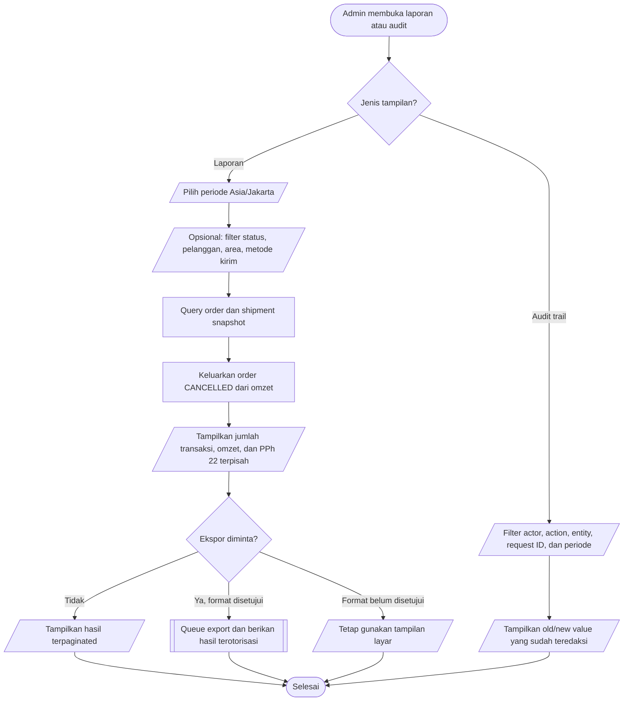
```mermaid
flowchart TD
    A(["Admin membuka laporan atau audit"]) --> A1{"Jenis tampilan?"}
    A1 -->|Laporan| B[/"Pilih periode Asia/Jakarta"/]
    A1 -->|Audit trail| L[/"Filter actor, action, entity, request ID, dan periode"/]
    B --> C[/"Opsional: filter status, pelanggan, area, metode kirim"/]
    C --> D["Query order dan shipment snapshot"]
    D --> E["Keluarkan order CANCELLED dari omzet"]
    E --> F[/"Tampilkan jumlah transaksi, omzet, dan PPh 22 terpisah"/]
    F --> G{"Ekspor diminta?"}
    G -->|Tidak| H[/"Tampilkan hasil terpaginated"/]
    G -->|Ya, format disetujui| I[["Queue export dan berikan hasil terotorisasi"]]
    G -->|Format belum disetujui| J[/"Tetap gunakan tampilan layar"/]
    L --> M[/"Tampilkan old/new value yang sudah teredaksi"/]
    H --> N(["Selesai"])
    I --> N
    J --> N
    M --> N
```

Format ekspor CSV/XLSX tetap mengikuti keputusan final. Query berat dijalankan
melalui queue dan tidak boleh memblokir transaksi.

### UF-19 Notifikasi Order Baru Admin

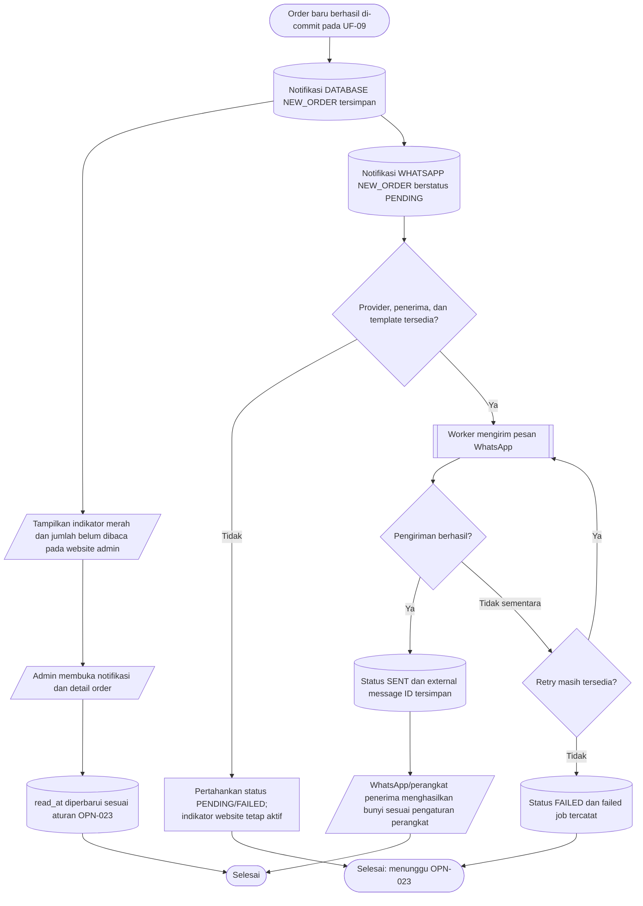
```mermaid
flowchart TD
    A(["Order baru berhasil di-commit pada UF-09"]) --> B[("Notifikasi DATABASE NEW_ORDER tersimpan")]
    B --> C[/"Tampilkan indikator merah dan jumlah belum dibaca pada website admin"/]
    B --> D[("Notifikasi WHATSAPP NEW_ORDER berstatus PENDING")]
    D --> E{"Provider, penerima, dan template tersedia?"}
    E -->|Tidak| F["Pertahankan status PENDING/FAILED;<br/>indikator website tetap aktif"]
    F --> G(["Selesai: menunggu OPN-023"])
    E -->|Ya| H[["Worker mengirim pesan WhatsApp"]]
    H --> I{"Pengiriman berhasil?"}
    I -->|Ya| J[("Status SENT dan external message ID tersimpan")]
    J --> K[/"WhatsApp/perangkat penerima menghasilkan bunyi sesuai pengaturan perangkat"/]
    K --> L(["Selesai"])
    I -->|Tidak sementara| M{"Retry masih tersedia?"}
    M -->|Ya| H
    M -->|Tidak| N[("Status FAILED dan failed job tercatat")]
    N --> G
    C --> O[/"Admin membuka notifikasi dan detail order"/]
    O --> P[("read_at diperbarui sesuai aturan OPN-023")]
    P --> L
```

Website tidak membuat audio WhatsApp sendiri. Provider, penerima, template,
retry/fallback, serta perilaku read/clear mengikuti
[OPN-023](../requirements/BRD.md#opn-023).

## 5. Traceability

| User Flow | Requirement Utama |
|---|---|
| UF-01 - UF-04 | FR-AUTH-001 - FR-AUTH-011; FR-CAT-007 - FR-CAT-008 |
| UF-05 - UF-06 | FR-CAT-001 - FR-CAT-009; FR-PRC-001 - FR-PRC-007; FR-CART-001 - FR-CART-003 |
| UF-07 | FR-CART-005; FR-SHP-001 - FR-SHP-007 |
| UF-08 | FR-CART-004 - FR-CART-007; SRS Bagian 10 |
| UF-09 | FR-POS-017, FR-POS-019 - FR-POS-020; FR-ORD-001 - FR-ORD-002 |
| UF-10 - UF-11 | FR-PAY-001 - FR-PAY-007; FR-ORD-003 |
| UF-12 | FR-ORD-004 - FR-ORD-005; FR-SHP-004 |
| UF-13 | FR-ORD-006 - FR-ORD-010; FR-POS-012, FR-POS-018 - FR-POS-020 |
| UF-14 | FR-POS-001 - FR-POS-006; FR-POS-013 - FR-POS-016 |
| UF-15 | FR-POS-003 - FR-POS-012, FR-POS-017 - FR-POS-019 |
| UF-16 | FR-CAT-002 - FR-CAT-006 |
| UF-17 | FR-PRC-003 - FR-PRC-004; FR-POS-008; FR-SHP-001; FR-PAY-001; FR-ORD-002 |
| UF-18 | FR-RPT-001 - FR-RPT-006; FR-AUD-001 - FR-AUD-004 |
| UF-19 | FR-NTF-001 - FR-NTF-002; BR-031 |

## 6. Open Decisions yang Membatasi Flow

| Referensi | Dampak pada Flow |
|---|---|
| [OPN-005](../requirements/BRD.md#opn-005) | Nama operasi laporan, payload, acknowledgement/lookup, autentikasi, error, idempotency, dan cutoff snapshot stok pada UF-09, UF-13, UF-14, UF-15. |
| [OPN-006](../requirements/BRD.md#opn-006) | Dasar pengenaan dan urutan agregasi PPh 22 pada UF-06 dan UF-17; kewajiban satu hasil gabungan sudah resolved. |
| [OPN-010](../requirements/BRD.md#opn-010) | Area, tarif, dan ETA kurir toko pada UF-07/UF-17. |
| [OPN-013](../requirements/BRD.md#opn-013) | Cakupan harga partai dan prioritas terhadap grosir pada UF-06. |
| [OPN-016](../requirements/BRD.md#opn-016) | Perilaku fallback ketika quote Biteship gagal pada UF-07. |
| [OPN-021](../requirements/BRD.md#opn-021) | Origin, sumber/default berat, penggunaan dimensi, daftar kurir, mode area ID/koordinat, akun production, dan biaya provider pada UF-07. |
| [OPN-022](../requirements/BRD.md#opn-022) | Sumber identitas toko, format nomor, PDF, dan channel invoice pada UF-09. |
| [OPN-023](../requirements/BRD.md#opn-023) | Provider, penerima, template, retry/fallback WhatsApp, dan perilaku read/clear indikator website pada UF-19. |
