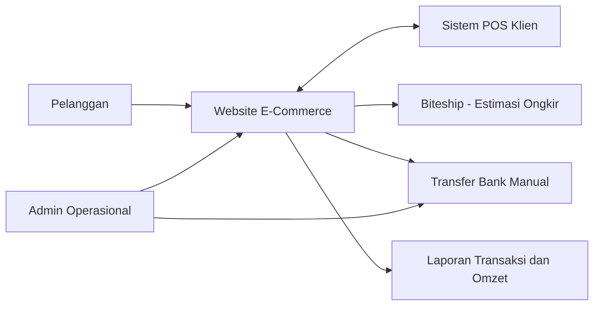
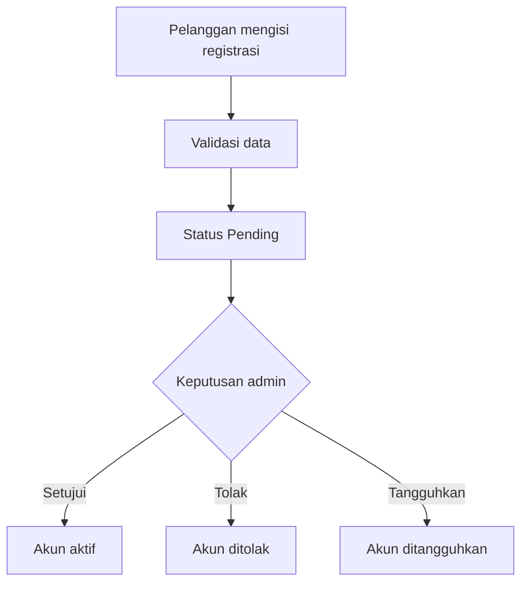
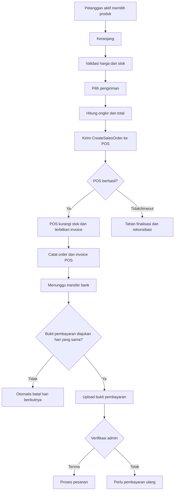
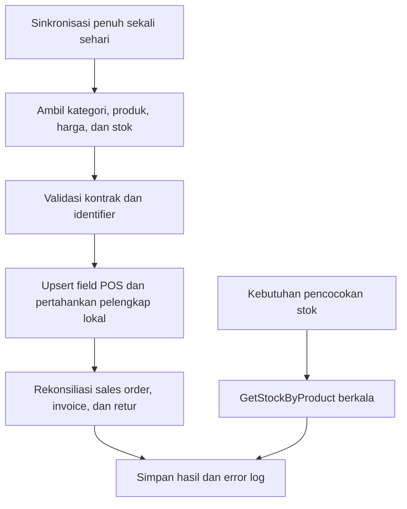

# Business Requirements Document (BRD)

## Website E-Commerce Pelanggan Terverifikasi

| Atribut | Nilai |
|---|---|
| Proyek | Website E-Commerce Custom Pixel Komunika |
| Klien | Sylvi / pihak pemilik usaha |
| Pengembang | PT Webekspres Teknologi Indonesia |
| Versi | 0.5 - POS API Working Scheme |
| Tanggal | Selasa, 28 Juli 2026 |
| Status | Approved Working Baseline - klarifikasi klien diterapkan bertahap |
| Dokumen sumber | `../references/proposal-klien-sylvi-update-1.pdf` |
| MVP delivery | `MVP.md` |

## 1. Tujuan Dokumen

Dokumen ini mendefinisikan kebutuhan bisnis, ruang lingkup, aktor, aturan bisnis,
risiko, dan ukuran keberhasilan proyek. BRD tidak menetapkan detail implementasi
teknis; detail fungsi berada di `FRD.md` dan spesifikasi teknis berada di
`SRS.md`.

## 2. Hierarki Sumber Requirement

Apabila terdapat konflik, requirement diprioritaskan dengan urutan berikut:

1. Keputusan tertulis terbaru yang telah disetujui klien.
2. Catatan klarifikasi terbaru dari stakeholder proyek.
3. Proposal penawaran versi 10 Juli 2026.
4. Asumsi analisis sistem.

Status requirement:

- **Baseline**: tertulis pada proposal atau telah dikonfirmasi stakeholder.
- **Amendment**: perubahan terhadap proposal berdasarkan catatan terbaru.
- **Proposed**: rekomendasi yang menunggu persetujuan.
- **TBD**: keputusan belum tersedia dan dapat memengaruhi desain.
- **ON_HOLD**: tidak boleh diimplementasikan sampai keputusan tertulis tersedia.

### 2.1 Riwayat Perubahan

| ID | Diterima | Sumber | Perubahan | Dampak Sementara | Status |
|---|---|---|---|---|---|
| CR-001 | Senin, 27 Juli 2026, 11.54-11.56 WIB | Pesan klien Sylvi | Klien menginformasikan perubahan pada PPh 22 dan batas maksimal penjualan; kedua poin kemungkinan besar dihilangkan, dengan rincian lanjutan menyusul. | Requirement terkait ditempatkan `ON_HOLD`; tidak dihapus dan tidak diimplementasikan sebelum klarifikasi Selasa, 28 Juli 2026. | Under clarification |
| CR-002 | Senin, 27 Juli 2026 | Klarifikasi governance proyek | Sylvi ditetapkan sebagai perwakilan klien, Sultan sebagai System Analyst Webekspres, dan Pak Endang sebagai Project Manager Webekspres. Persetujuan final berada pada klien. | OPN-017 diselesaikan dan aturan efektivitas baseline diperjelas. | Resolved |
| CR-003 | Senin, 27 Juli 2026 | Persetujuan working baseline dan fallback POS | Working baseline disetujui dan ditandatangani. Jika koneksi POS belum disediakan, pengembangan serta pengujian menggunakan data contoh. | Tanggal persetujuan ditetapkan dan data contoh non-production ditambahkan; kesiapan koneksi POS production tetap dilacak. | Approved |
| CR-004 | Selasa, 28 Juli 2026 | Pesan klien Sylvi | Klien meminta pengembangan dilanjutkan sesuai plan yang telah dibuat. Sultan mengonfirmasi interpretasi bahwa scope kembali mengikuti proposal awal. | Batas maksimal penjualan serta komponen PPh 22/surcharge tetap berada dalam MVP. Detail formula dan mapping data tetap terbuka pada OPN-006. | Approved working direction |
| CR-005 | Selasa, 28 Juli 2026, 12.42-13.43 WIB | Klarifikasi bertahap klien | Klien menjelaskan tiga jenis harga wajib dari POS, ambang nilai belanja per klasifikasi yang memicu PPh 22, master produk dari POS, pola sinkronisasi stok, kesiapan akses POS, dan masa berlaku pesanan belum dibayar. | Konsep batas maksimal dikoreksi menjadi ambang nilai belanja; OPN-003 dan OPN-007 diselesaikan, sedangkan OPN-004, OPN-005, OPN-006, OPN-013, dan OPN-019 diperbarui sebagai keputusan parsial. | Partially resolved |
| CR-006 | Selasa, 28 Juli 2026 | Diagram dan hasil meeting skema API POS | Master produk dan inventory ditarik sekali sehari; stok per produk dapat dicek berkala untuk rekonsiliasi. Setiap transaksi web membuat sales order POS yang langsung mengurangi stok dan menerbitkan invoice; pembatalan menerbitkan retur. Seluruh field yang tersedia di POS menjadi master, sedangkan website melengkapi field yang belum tersedia. | Write-back sales order/retur menjadi baseline, OPN-004 diselesaikan, OPN-005/OPN-008/OPN-019/OPN-020/OPN-022 diperbarui, dan risiko konsistensi API ditambahkan. | Approved working scheme; API contract partial |

### 2.2 Model Delivery Hybrid Agile-Waterfall

Proyek menggunakan model hybrid:

- **Waterfall/stage-gate** untuk penetapan MVP, baseline requirement,
  acceptance criteria, persetujuan UAT, dan go-live.
- **Agile** untuk pemecahan backlog, implementasi iteratif, pengujian
  berkelanjutan, demo increment, dan penyerapan feedback.

Aturan utamanya:

1. Hanya requirement `Baseline` dengan acceptance criteria yang jelas dan tidak
   berstatus `ON_HOLD` yang boleh masuk sprint.
2. `Proposed`, `TBD`, candidate scope, dan `ON_HOLD` tidak menjadi komitmen
   sprint atau MVP sampai disetujui tertulis.
3. Perubahan setelah MVP baseline harus melalui impact analysis terhadap scope,
   jadwal 45 hari kerja, biaya, data, integrasi, test, dan acceptance criteria.
4. Perubahan berdampak sedang atau tinggi harus menukar scope setara, dipindah
   ke fase berikutnya, atau mengubah jadwal/biaya melalui persetujuan tertulis.
5. Setiap increment harus didemokan dan diuji tanpa menunggu UAT akhir.

### 2.3 Change Control

| Tingkat | Contoh | Penanganan |
|---|---|---|
| Rendah | Teks, label, urutan tampilan, atau klarifikasi tanpa perubahan perilaku. | Product Owner dapat memasukkan ke backlog sprint berikutnya. |
| Sedang | Perubahan flow atau field yang memengaruhi satu modul. | Wajib impact analysis dan pertukaran scope/prioritas. |
| Tinggi | Harga, pajak, batas penjualan, stok, POS, status order, invoice, pembayaran, atau hosting. | Wajib persetujuan klien dan Webekspres; sprint terdampak tidak dimulai sebelum keputusan. |

Setiap change request minimal mencatat sumber, tanggal, requirement terdampak,
keputusan, pemilik, target keputusan, dampak, dan status implementasi.

Persetujuan final atas perubahan/ide baru berada pada klien. Perubahan baru
efektif menjadi baseline setelah klien dan Webekspres memberikan persetujuan
tertulis pada hari kerja. Diskusi atau persetujuan di luar hari kerja tidak
mengubah baseline sampai dikonfirmasi kembali pada hari kerja.

## 3. Ringkasan Eksekutif

Proyek membangun website penjualan responsif untuk pelanggan yang telah
diregistrasi dan disetujui admin. Sistem mengelola katalog, tiga jenis harga,
stok, transaksi, invoice, pembayaran transfer manual, pengiriman, dan laporan
omzet berdasarkan wilayah.

Website menggunakan koneksi data dari POS yang disediakan klien untuk
mendapatkan data produk dan stok production. Data contoh hanya digunakan untuk
development, staging, demo, dan UAT ketika koneksi tersebut belum tersedia.
Informasi pemasaran yang tidak tersedia di POS, seperti gambar, video,
deskripsi, dan metadata penayangan, dikelola di website tanpa ditimpa oleh
proses sinkronisasi data production.

## 4. Latar Belakang dan Masalah Bisnis

Proses penjualan membutuhkan kanal digital yang:

- dapat diakses melalui perangkat mobile dan desktop;
- membatasi transaksi hanya untuk pelanggan yang disetujui;
- menjaga katalog dan stok selaras dengan POS;
- mencatat transaksi dan pembayaran secara terstruktur;
- menghitung harga berdasarkan kuantitas pembelian;
- memberikan estimasi ongkir;
- menyediakan invoice dan laporan omzet per wilayah;
- mengurangi pekerjaan manual dan risiko perbedaan data.

## 5. Tujuan Bisnis

| ID | Tujuan |
|---|---|
| BO-001 | Menyediakan kanal penjualan digital yang responsif dan mudah digunakan. |
| BO-002 | Memastikan hanya pelanggan yang telah disetujui admin dapat bertransaksi. |
| BO-003 | Menyatukan katalog website dengan produk dan stok dari POS. |
| BO-004 | Menjaga data pemasaran produk yang dikelola website tetap independen dari POS. |
| BO-005 | Mengotomasi perhitungan harga, ongkir, total transaksi, dan invoice. |
| BO-006 | Mendukung pembayaran transfer bank yang diverifikasi admin. |
| BO-007 | Menyediakan visibilitas transaksi dan omzet berdasarkan periode serta wilayah. |
| BO-008 | Menyediakan fondasi yang dapat ditingkatkan ketika jumlah pengguna atau beban integrasi bertambah. |

## 6. Stakeholder

| Stakeholder | Kepentingan dan Tanggung Jawab |
|---|---|
| Pemilik usaha / klien | Memegang persetujuan final atas requirement, perubahan, UAT, dan go-live. |
| Sylvi - Perwakilan klien / Product Owner | Memprioritaskan backlog, menjawab klarifikasi bisnis, menerima increment sprint, dan menyampaikan persetujuan final klien. |
| Sultan - System Analyst Webekspres | Menjaga konsistensi BRD, FRD, SRS, acceptance criteria, traceability, dan impact analysis. |
| Pak Endang - Project Manager Webekspres | Menjaga cadence, dependency, risk, keputusan, change log, dan eskalasi hambatan tanpa mengambil alih persetujuan final klien. |
| Admin operasional | Memverifikasi pelanggan, mengelola katalog lokal, pembayaran, transaksi, pengiriman, dan laporan. |
| Pelanggan | Melakukan registrasi, melihat katalog, membuat pesanan, membayar, dan memantau transaksi. |
| Vendor / pengelola POS | Menyediakan API, kredensial, dokumentasi, dan identifier produk yang stabil. |
| Biteship | Menyediakan layanan estimasi ongkir sesuai kontrak API. |
| Webekspres | Menganalisis, mengembangkan, menguji, menerapkan, dan memelihara aplikasi sesuai scope. |
| Pixel Komunika | Penerima hasil akhir pengembangan dan pihak koordinasi proyek. |

## 7. Ruang Lingkup

### 7.1 In Scope

- Website responsif untuk mobile, tablet, dan desktop.
- Registrasi dan autentikasi pelanggan.
- Verifikasi, aktivasi, penolakan, dan penangguhan akun oleh admin.
- Katalog produk, klasifikasi/kategori, merek, SKU, deskripsi, dan media
  ([open question: lihat OPN-003](#opn-003)).
- Sinkronisasi produk dan stok dari POS, dengan data seeder sebagai fallback
  sampai API tersedia
  ([open question: lihat OPN-003](#opn-003) dan
  [OPN-005](#opn-005)).
- Pembuatan sales order POS pada setiap transaksi web, penyimpanan referensi
  invoice POS, pembatalan sales order yang menerbitkan retur, serta
  rekonsiliasi sales order ([lihat OPN-005](#opn-005)).
- Enrichment produk lokal berupa gambar, video, deskripsi pemasaran, SEO, dan
  pengaturan tampil.
- Tiga jenis harga wajib per produk: eceran, partai, dan grosir. Seluruh harga
  disinkronkan dari POS; harga eceran disiapkan tetapi tidak ditampilkan pada
  storefront fase saat ini ([keputusan parsial: lihat OPN-013](#opn-013)).
- Ambang nilai belanja yang dapat dikonfigurasi per klasifikasi produk serta
  PPh 22 persentase ketika ambang terlampaui
  ([keputusan parsial: lihat OPN-006](#opn-006) dan
  [OPN-018](#opn-018)).
- Keranjang, checkout, transaksi, invoice, dan riwayat transaksi.
- Pembayaran transfer bank dan upload bukti pembayaran
  ([open question: lihat OPN-009](#opn-009)).
- Verifikasi pembayaran oleh admin.
- Pembatalan transaksi oleh admin pada hari kalender yang sama.
- Pengiriman kurir toko
  ([open question: lihat OPN-010](#opn-010)).
- Estimasi ongkir melalui Biteship.
- Laporan transaksi dan omzet berdasarkan periode dan wilayah
  ([open question: lihat OPN-011](#opn-011)).
- Monitoring stok, batas minimum stok, dan riwayat perubahan stok.
- Log sinkronisasi dan audit aktivitas kritis.
- Backup, maintenance, SSL, hosting, serta pelatihan sesuai kesepakatan final.

### 7.2 Out of Scope Baseline

- Aplikasi mobile native.
- Pengembangan atau perubahan internal sistem POS milik klien.
- Pembuatan endpoint API di sisi POS.
- Pemesanan, pickup, atau pemanggilan kurir otomatis melalui Biteship.
- Payment gateway.
- Sistem akuntansi lengkap.
- Marketplace multivendor.
- Aplikasi khusus kurir.
- Microservices atau Kubernetes.
- Fitur promo, voucher, dan loyalty yang belum disetujui.

### 7.3 Candidate Scope

Requirement berikut belum tertulis dalam proposal dan harus disetujui sebelum
menjadi baseline:

| ID | Kandidat | Status |
|---|---|---|
| CND-001 | Segmentasi pelanggan menjadi customer biasa dan reseller. | [Open question: OPN-002](#opn-002) |
| CND-002 | Reseller tidak melihat harga dan memesan melalui WhatsApp. | [Open question: OPN-002](#opn-002) |
| CND-003 | Grouping beberapa transaksi untuk satu pengiriman. | [Open question: OPN-014](#opn-014) |
| CND-005 | Notifikasi otomatis kepada pelanggan atau admin. | [Open question: OPN-023](#opn-023) |

## 8. Konteks Bisnis

## 9. Business Requirements

| ID | Requirement | Status |
|---|---|---|
| BR-001 | Sistem harus menyediakan website penjualan responsif. | Baseline |
| BR-002 | Pelanggan harus registrasi sebelum dapat melakukan transaksi. | Baseline |
| BR-003 | Admin harus menyetujui pelanggan sebelum akses pembelian diberikan. | Baseline |
| BR-004 | Admin harus dapat mengaktifkan dan menonaktifkan akun pelanggan. | Baseline |
| BR-005 | Sistem harus menyinkronkan seluruh field produk yang tersedia di POS. Website hanya melengkapi field yang tidak disediakan POS dan tidak boleh mengganti nilai POS yang tersedia ([lihat OPN-003](#opn-003)). | Baseline |
| BR-006 | Setiap produk harus memiliki harga eceran, partai, dan grosir dari POS. Harga eceran disimpan tetapi tidak ditampilkan pada storefront fase saat ini; aturan penerapan harga partai dan grosir mengikuti [OPN-013](#opn-013). | Baseline; aturan partai partially open |
| BR-007 | Sistem harus mendukung pemilihan klasifikasi produk dan pengaturan ambang nilai belanja untuk masing-masing klasifikasi terpilih ([lihat OPN-018](#opn-018)). | Baseline |
| BR-008 | Sistem harus menambahkan PPh 22 dengan persentase yang dapat dikonfigurasi, termasuk `0%`, ketika nilai belanja pada klasifikasi terpilih melampaui ambangnya; dasar pengenaan dan rincian formula mengikuti [OPN-006](#opn-006). | Baseline; formula partially open |
| BR-009 | Website harus menarik kategori, produk, detail produk, daftar harga, dan seluruh stok dari POS sekali sehari; stok per produk dapat dipanggil berkala untuk rekonsiliasi. Data contoh hanya digunakan sebelum koneksi tersedia ([OPN-005](#opn-005), [OPN-019](#opn-019)). | Baseline; kontrak API partially open |
| BR-010 | Sinkronisasi POS tidak boleh menghapus data pelengkap website ketika field POS tidak tersedia; ketika POS menyediakan field tersebut, nilai POS menjadi sumber utama. | Amendment |
| BR-011 | Sistem harus menampilkan status stok Tersedia, Menipis, atau Habis. | Baseline |
| BR-012 | Admin harus dapat menentukan batas minimum stok. | Baseline |
| BR-013 | Sistem harus menyimpan riwayat perubahan stok beserta sumbernya: sinkronisasi penuh, pengecekan per produk, sales order, pembatalan/retur, atau koreksi. | Baseline |
| BR-014 | Setiap pesanan web harus dikirim ke POS melalui operasi pembuatan sales order. Keberhasilan POS langsung mengurangi stok dan menghasilkan invoice POS; referensi respons disimpan pada pesanan web ([lihat OPN-005](#opn-005)). | Baseline; error contract partially open |
| BR-015 | Sistem harus menghitung subtotal, ongkir, PPh 22 yang aktif, dan total transaksi. PPh 22 dihitung dari aturan klasifikasi dan ambang nilai yang disetujui pada [OPN-006](#opn-006). | Baseline; dasar pengenaan partially open |
| BR-016 | Sistem harus menyimpan referensi invoice yang diterbitkan POS ketika sales order berhasil dibuat. Kebutuhan nomor invoice lokal, format tampilan, dan penyampaiannya mengikuti [OPN-008](#opn-008) serta [OPN-022](#opn-022). | Baseline; format partially open |
| BR-017 | Satu pelanggan dapat memiliki lebih dari satu invoice. | Baseline |
| BR-018 | Pembayaran dilakukan melalui transfer bank dan diverifikasi admin. | Baseline |
| BR-019 | Pelanggan harus dapat mengunggah bukti pembayaran ([lihat OPN-009](#opn-009)). | Baseline; batas file dan retensi open |
| BR-020 | Admin harus dapat menerima atau menolak bukti pembayaran. | Baseline |
| BR-021 | Admin dapat membatalkan transaksi hanya pada tanggal kalender yang sama dengan transaksi; pembatalan sales order POS dilakukan melalui operasi pembatalan. | Baseline |
| BR-022 | Pembatalan POS harus menerbitkan retur, mengembalikan stok, serta menyimpan referensi retur dan hasil rekonsiliasi pada website. | Baseline |
| BR-023 | Sistem harus mendukung kurir toko beserta biaya berdasarkan wilayah ([lihat OPN-010](#opn-010)). | Baseline; area, tarif, dan SLA open |
| BR-024 | Biteship hanya digunakan untuk menampilkan layanan dan estimasi ongkir ([lihat OPN-021](#opn-021)). | Baseline; data origin/dimensi open |
| BR-025 | Ongkir terpilih harus masuk ke total transaksi dan invoice. | Baseline |
| BR-026 | Sistem harus menyediakan laporan transaksi dan omzet per periode dan wilayah ([lihat OPN-011](#opn-011)). | Baseline; definisi omzet open |
| BR-027 | Sistem harus mempertahankan jejak audit untuk tindakan administratif kritis. | [Proposed; lihat OPN-015](#opn-015) |
| BR-028 | Kegagalan POS atau Biteship harus dapat ditelusuri dan tidak boleh diam-diam menghasilkan data transaksi salah. | [Proposed; lihat OPN-015](#opn-015) |
| BR-029 | Sistem harus dapat ditingkatkan kapasitasnya tanpa mengubah domain bisnis utama. | [Proposed; lihat OPN-015](#opn-015) |
| BR-030 | Pesanan yang belum dibayar hanya berlaku pada hari pembuatannya dan otomatis dibatalkan pada hari kalender berikutnya dalam zona waktu `Asia/Jakarta`; jika sales order POS telah dibuat, pembatalan otomatis juga memanggil operasi pembatalan POS. | Baseline |

## 10. Business Rules

| ID | Aturan |
|---|---|
| RULE-001 | Akun yang belum disetujui tidak boleh checkout. |
| RULE-002 | SKU atau external product ID dari POS harus unik dan stabil. |
| RULE-003 | Snapshot stok awal hari berasal dari POS. Website memperbarui stok efektif setelah keberhasilan pembuatan/pembatalan sales order dan mencocokkannya melalui sinkronisasi penuh harian atau pengecekan stok per produk. |
| RULE-004 | Field produk yang tersedia di POS selalu mengikuti POS; gambar, deskripsi, atau data presentasi lain boleh dilengkapi di website hanya ketika belum tersedia dari POS. |
| RULE-005 | Setiap produk wajib memiliki tiga jenis harga dari POS: `ECERAN`, `PARTAI`, dan `GROSIR`. Harga `ECERAN` disimpan tetapi tidak ditampilkan pada storefront fase saat ini. |
| RULE-006 | Nilai harga, jenis harga terpilih, nama produk, SKU, ongkir, PPh 22, dan total disimpan sebagai snapshot transaksi; dasar pengenaan PPh 22 mengikuti [OPN-006](#opn-006). |
| RULE-007 | Upload bukti pembayaran tidak otomatis membuat transaksi berstatus lunas. |
| RULE-008 | Pembayaran dianggap sah setelah diverifikasi admin. |
| RULE-009 | Pembatalan menggunakan zona waktu `Asia/Jakarta`. |
| RULE-010 | Transaksi batal tidak dihitung sebagai omzet; status transaksi lain yang diperhitungkan masih harus disepakati ([lihat OPN-011](#opn-011)). |
| RULE-011 | Kegagalan Biteship tidak boleh otomatis menghasilkan ongkir Rp0. |
| RULE-012 | Produk yang hilang dari respons POS tidak langsung dihapus permanen. |
| RULE-013 | Sinkronisasi POS harus idempotent dan tidak membuat duplikasi. |
| RULE-014 | Pemesanan kurir dilakukan di luar website. |
| RULE-015 | Perubahan data produk setelah order tidak mengubah invoice lama. |
| RULE-016 | Data contoh harus deterministik, idempotent, menggunakan identifier stabil, tidak menimpa enrichment lokal, dan hanya aktif pada environment non-production. |
| RULE-017 | Data contoh bukan bukti bahwa koneksi POS production telah lulus; go-live mensyaratkan koneksi POS production berhasil diuji. |
| RULE-018 | Harga grosir memiliki minimum kuantitas yang dapat berbeda per produk. Aturan kelayakan dan penerapan harga partai dalam satu struk mengikuti [OPN-013](#opn-013). |
| RULE-019 | Ambang PPh 22 berbasis nilai belanja pada klasifikasi terpilih, bukan batas kuantitas maksimum dan bukan alasan untuk menolak checkout. Persentase `0%` menonaktifkan pungutan untuk aturan tersebut. |
| RULE-020 | Pesanan tanpa pembayaran yang masih aktif pada hari pembuatannya otomatis menjadi `CANCELLED` pada hari kalender berikutnya. |
| RULE-021 | Keberhasilan `CreateSalesOrder` menjadi event pengurangan stok POS dan penerbitan invoice; website harus menyimpan POS sales order ID, invoice ID/number, serta status sinkronisasinya. |
| RULE-022 | `CancelSalesOrder` harus menghasilkan retur di POS dan pengembalian stok; retry tidak boleh membuat pembatalan atau retur ganda. |
| RULE-023 | Sinkronisasi sales order/invoice/retur digunakan untuk rekonsiliasi terhadap write-back per transaksi, bukan menggantikan jalur transaksi utama. |
| RULE-024 | Operasi POS yang mengubah data wajib memiliki external reference/idempotency mechanism yang disepakati sebelum integration acceptance. |

## 11. Proses Bisnis Utama

### 11.1 Registrasi dan Persetujuan

### 11.2 Transaksi dan Pembayaran

### 11.3 Sinkronisasi POS

## 12. Ukuran Keberhasilan

Nilai target final harus disetujui pada technical kickoff
([open question: lihat OPN-012](#opn-012)).

| ID | Indikator | Target Draft |
|---|---|---|
| KPI-001 | Registrasi yang dapat diproses admin tanpa bantuan teknis | 100% alur normal |
| KPI-002 | Duplikasi produk akibat sinkronisasi | 0 |
| KPI-003 | Enrichment lokal hilang akibat sinkronisasi | 0 |
| KPI-004 | Invoice dengan perhitungan berbeda dari transaksi | 0 |
| KPI-005 | Transaksi tidak sah dari akun belum disetujui | 0 |
| KPI-006 | Aktivitas pembayaran/pembatalan tanpa audit trail | 0 |
| KPI-007 | Ketersediaan aplikasi bulanan | [Open question: OPN-012](#opn-012) |
| KPI-008 | Waktu respons halaman/API persentil ke-95 | Target di SRS |
| KPI-009 | Recovery hasil sinkronisasi gagal | Dapat di-retry tanpa duplikasi |

## 13. Asumsi dan Dependensi

- Klien menyediakan dokumentasi, kredensial, dan environment koneksi POS
  ([lihat OPN-003](#opn-003) dan [OPN-005](#opn-005)).
- Jika koneksi POS belum tersedia, Webekspres menggunakan data contoh untuk
  development, staging, demo, dan UAT; data contoh tidak digunakan pada
  production.
- POS menyediakan identifier produk yang stabil.
- Koneksi POS dapat diakses dari server production sebelum go-live.
- Kontrak data, rate limit, timeout, dan kebijakan perubahan versi akan
  diberikan sebelum integrasi dimulai.
- Klien menyediakan akun Biteship yang aktif.
- Data rekening bank dan prosedur verifikasi pembayaran diberikan klien.
- Daftar wilayah kurir toko dan tarifnya diberikan klien
  ([lihat OPN-010](#opn-010)).
- Data origin serta berat/dimensi produk untuk estimasi Biteship diberikan klien
  atau disepakati sebagai aturan operasional ([lihat OPN-021](#opn-021)).
- Keputusan lifecycle order, format/penyampaian invoice, dan notifikasi dibuat
  sebelum requirement terkait masuk sprint ([lihat OPN-020](#opn-020),
  [OPN-022](#opn-022), dan [OPN-023](#opn-023)).
- Infrastruktur production menggunakan shared hosting milik klien
  ([lihat OPN-001](#opn-001)).
- Perubahan scope setelah baseline mengikuti change control pada
  [Bagian 2.3](#23-change-control).

## 14. Risiko Bisnis

| ID | Risiko | Dampak | Mitigasi |
|---|---|---|---|
| RSK-001 | Stok penuh hanya disinkronkan sekali sehari sementara transaksi POS lain dapat mengubah stok. | Stok website stale dan terjadi overselling. | Perbarui stok efektif setelah write-back web, gunakan pengecekan stok per produk saat rekonsiliasi diperlukan, dan pantau selisih ([OPN-005](#opn-005)). |
| RSK-002 | Kontrak API POS berubah. | Sinkronisasi atau write-back transaksi gagal. | Versioning, contract test, logging, dan change request ([lihat OPN-005](#opn-005)). |
| RSK-003 | Shared hosting membatasi worker dan resource. | Sinkronisasi terlambat atau berhenti. | Gunakan cron, queue berbasis database/file, monitoring ringan, serta upgrade ke VPS bila batas resource tidak lagi mencukupi ([lihat OPN-001](#opn-001)). |
| RSK-004 | Biteship lambat/tidak tersedia. | Checkout tertunda. | Timeout dan fallback manual yang disetujui ([lihat OPN-016](#opn-016)). |
| RSK-005 | Lonjakan traffic atau bot. | Aplikasi lambat/tidak tersedia. | CDN, cache, rate limit, monitoring, dan scale-up. |
| RSK-006 | Media produk dan bukti pembayaran membesar. | Storage/bandwidth habis. | Object storage, kompresi, dan kebijakan retensi ([lihat OPN-009](#opn-009)). |
| RSK-007 | Dasar pengenaan PPh 22 dan penerapan harga partai lintas item belum final. | Perhitungan checkout, invoice, dan laporan salah atau dikerjakan ulang. | Implementasikan struktur konfigurasi minimum; finalisasi formula dan skenario harga melalui [OPN-006](#opn-006) serta [OPN-013](#opn-013). |
| RSK-008 | Koneksi POS belum tersedia selama development atau menjelang go-live. | Contract mismatch, keterlambatan integrasi, dan stok production tidak aktual. | Gunakan data contoh hanya untuk delivery non-production, definisikan kontrak koneksi, dan lakukan contract test sebelum go-live melalui OPN-019. |
| RSK-009 | Timeout/retry `CreateSalesOrder` atau `CancelSalesOrder` tidak memiliki idempotency/external reference yang jelas. | Sales order, invoice, retur, atau perubahan stok terduplikasi. | Wajibkan external reference unik, query rekonsiliasi, dan kebijakan retry berbasis status sebelum integration acceptance pada OPN-005. |

## 15. Keputusan Terbuka

Setiap penanda *open question*, `TBD`, atau requirement berstatus `Proposed`
harus merujuk ke item pada bagian ini. Jawaban yang telah disepakati kemudian
dipindahkan ke requirement atau aturan bisnis terkait.

### OPN-001

Production menggunakan shared hosting milik klien. Batasan runtime dan
operasional shared hosting menjadi baseline desain.

**Pemilik:** Klien / Webekspres · **Target:** 28 Juli 2026 · **Status:** Resolved

### OPN-002

Apakah reseller merupakan scope resmi; siapa yang dikategorikan sebagai reseller; apakah reseller dapat melihat harga; dan apakah pemesanan dilakukan melalui website atau WhatsApp.

**Pemilik:** Klien · **Target:** Sebelum backlog final · **Status:** Open

### OPN-003

Seluruh field produk yang tersedia di POS dikirim melalui API dan menjadi
sumber utama website, termasuk SKU, nama, klasifikasi/kategori, merek, harga,
dan stok. Website boleh melengkapi field yang tidak tersedia di POS, seperti
gambar atau deskripsi. Sinkronisasi mempertahankan pelengkap lokal saat payload
POS tidak menyediakan field tersebut; detail field tetap menjadi bagian
kontrak integrasi pada OPN-005.

**Pemilik:** Klien / Vendor POS · **Target:** 28 Juli 2026 · **Status:** Resolved

### OPN-004

Keberhasilan `CreateSalesOrder` langsung mengurangi stok POS dan menerbitkan
invoice. `CancelSalesOrder` menerbitkan retur dan mengembalikan stok POS.
Website memperbarui stok efektif dan menyimpan referensi hasil kedua operasi;
sinkronisasi berikutnya digunakan untuk rekonsiliasi.

**Pemilik:** Klien / Vendor POS · **Target:** 28 Juli 2026 · **Status:** Resolved

### OPN-005

Working scheme API:

- master data sekali sehari: `GetCategory`, `GetAllProducts`,
  `GetProductDetail`, dan `GetPriceList`;
- inventory sekali sehari: `GetAllStock`; `GetStockByProduct` dapat dipanggil
  berkala ketika diperlukan untuk pencocokan;
- transaksi per kejadian: `CreateSalesOrder`, `CancelSalesOrder`,
  `GetAllSalesOrder`, dan `GetSalesOrderDetail`;
- data sales order, invoice, dan retur direkonsiliasi bersama proses
  sinkronisasi.

Klien meminta alur website dibuat dahulu menggunakan data contoh dan akan
membuka akses setelah alur berjalan. Yang masih terbuka adalah tanggal/PIC
akses; bentuk URL/method/payload/response; autentikasi; external reference atau
idempotency; kode error, timeout, rate limit; arah dan tujuan tepat sinkronisasi
sales harian; serta acceptance contract test.

**Pemilik:** Vendor POS · **Target:** Sebelum integration acceptance · **Status:** Partially resolved

### OPN-006

Biaya persentase dikonfirmasi sebagai PPh 22. Admin dapat memilih klasifikasi
yang terkena aturan, menetapkan ambang nilai belanja per klasifikasi, dan
menetapkan persentase termasuk `0%`; contoh klien adalah ambang
Rp2.200.000 dan tarif `0,5%`. Yang masih terbuka adalah dasar pengenaan
(seluruh subtotal klasifikasi, nilai di atas ambang, atau total struk),
agregasi jika lebih dari satu klasifikasi terpicu, sumber konfigurasi POS atau
website, serta tampilan pada checkout, invoice, dan laporan.

**Pemilik:** Klien / System Analyst · **Target:** Sebelum Sprint 2 · **Status:** Partially resolved

### OPN-007

Pesanan yang belum dibayar hanya berlaku pada hari pembuatannya dan otomatis
dibatalkan pada hari kalender berikutnya menggunakan zona waktu
`Asia/Jakarta`.

**Pemilik:** Klien · **Target:** 28 Juli 2026 · **Status:** Resolved

### OPN-008

POS menerbitkan invoice ketika `CreateSalesOrder` berhasil. Yang masih terbuka
adalah apakah nomor invoice POS menjadi nomor resmi tunggal atau website juga
membuat nomor internal, termasuk format dan aturan pemetaannya.

**Pemilik:** Klien / Vendor POS · **Target:** Sebelum Sprint 2 · **Status:** Partially resolved

### OPN-009

Batas file dan retensi bukti pembayaran.

**Pemilik:** Klien / Webekspres · **Target:** Sebelum Sprint 3 · **Status:** Open

### OPN-010

Daftar area, tarif, dan SLA kurir toko.

**Pemilik:** Klien · **Target:** Sebelum Sprint 3 · **Status:** Open

### OPN-011

Definisi status transaksi yang dihitung sebagai omzet.

**Pemilik:** Klien · **Target:** Sebelum Sprint 3 · **Status:** Open

### OPN-012

Baseline internal pengguna bersamaan normal maksimal 50 pengguna dan dapat
lebih rendah. Volume produk/transaksi, target availability, serta skenario
lonjakan beban divalidasi Webekspres melalui pengujian proporsional shared
hosting.

**Pemilik:** Webekspres · **Target:** Sebelum performance test · **Status:** Assumption

### OPN-013

Setiap produk wajib memiliki tiga jenis harga dari POS:

1. **Eceran** untuk penjualan langsung ke konsumen; disiapkan dan disinkronkan,
   tetapi tidak ditampilkan pada storefront fase saat ini.
2. **Partai** dengan indikasi minimum lima unit dalam satu struk.
3. **Grosir** dengan minimum kuantitas dan harga yang dapat berbeda per produk;
   contoh klien adalah minimum 200 unit dengan harga Rp10.800.

Yang masih terbuka untuk harga partai adalah apakah lima unit harus berasal dari
satu produk atau boleh gabungan, serta apakah harga partai kemudian berlaku
untuk semua item dalam struk termasuk item berkuantitas satu atau hanya item
yang memenuhi syarat. Perlu dikonfirmasi pula prioritas harga jika suatu item
memenuhi syarat partai dan grosir.

**Pemilik:** Klien / System Analyst · **Target:** Sebelum Sprint 2 · **Status:** Partially resolved

### OPN-014

Apakah beberapa transaksi dapat digabungkan menjadi satu pengiriman; kriteria penggabungan; dan dampaknya terhadap ongkir, invoice, serta status transaksi.

**Pemilik:** Klien · **Target:** Sebelum backlog final · **Status:** Open

### OPN-015

Persetujuan BR-027 sampai BR-029 sebagai baseline, termasuk batas minimum audit trail, ketahanan integrasi, dan kesiapan scaling.

**Pemilik:** Klien / Webekspres · **Target:** Sebelum MVP baseline · **Status:** Open

### OPN-016

Perilaku checkout ketika Biteship tidak tersedia: menunggu, mencoba ulang, memakai tarif manual, atau meminta pelanggan menghubungi admin.

**Pemilik:** Klien · **Target:** Sebelum Sprint 3 · **Status:** Open

### OPN-017

Perwakilan klien/Product Owner: Sylvi; System Analyst Webekspres: Sultan; Project Manager Webekspres: Pak Endang. Persetujuan final berada pada klien dan perubahan efektif menjadi baseline setelah disetujui tertulis oleh klien serta Webekspres pada hari kerja.

**Pemilik:** Klien / Webekspres · **Target:** 27 Juli 2026 · **Status:** Resolved

### OPN-018

Scope PPh 22 tetap berada dalam MVP. Istilah “batas maksimal penjualan”
dikoreksi berdasarkan klarifikasi klien menjadi ambang nilai belanja pada
klasifikasi terpilih: transaksi tidak ditolak ketika melewati ambang, tetapi
PPh 22 diterapkan sesuai konfigurasi. Detail dasar pengenaan tetap mengikuti
OPN-006.

**Pemilik:** Klien · **Target:** 28 Juli 2026 · **Status:** Resolved - scope corrected and retained

### OPN-019

Data contoh hanya digunakan untuk development, staging, demo, dan UAT.
Production wajib menggunakan data dari POS. Klien akan membuka akses setelah
alur website menggunakan data contoh telah berjalan. Diagram operasi dan
cadence menjadi working scheme, tetapi tanggal/PIC akses, kontrak final, serta
penerimaan hasil uji koneksi masih wajib diselesaikan sebelum go-live.

**Pemilik:** Klien / Vendor POS / Webekspres · **Target:** Sebelum go-live · **Status:** Partially resolved

### OPN-020

Web menjadi pengelola lifecycle pesanan sampai proses pengiriman selesai.
Pembatalan baseline tetap hanya oleh admin pada hari yang sama atau otomatis
untuk pesanan belum dibayar pada hari berikutnya; keduanya memanggil
`CancelSalesOrder` dan menyimpan referensi retur POS. Status pemenuhan setelah
pembayaran dan kebutuhan nomor resi masih perlu ditetapkan. Pengembalian dana
di luar pembatalan/retur stok standar membutuhkan change request terpisah.

**Pemilik:** Klien / System Analyst · **Target:** Sebelum Sprint 2 · **Status:** Partially resolved

### OPN-021

Data operasional untuk estimasi Biteship: origin pengiriman, sumber berat/dimensi produk, nilai default bila data belum lengkap, dan mapping alamat pelanggan ke input Biteship.

**Pemilik:** Klien / Webekspres · **Target:** Sebelum integrasi Biteship · **Status:** Open

### OPN-022

POS menerbitkan invoice saat sales order dibuat. Yang masih terbuka adalah
field invoice yang harus ditampilkan kembali oleh website, kebutuhan PDF,
channel pengiriman, serta apakah website membuat dokumen invoice sendiri atau
hanya merepresentasikan invoice POS. Nomor dan pemetaan mengikuti OPN-008.

**Pemilik:** Klien / Vendor POS · **Target:** Sebelum Sprint 2 · **Status:** Partially resolved

### OPN-023

Kebutuhan notifikasi diputuskan dalam dua langkah: (1) event yang perlu
diberitahukan kepada pelanggan dan admin; lalu (2) channel, pemilik template,
dan fallback jika pengiriman notifikasi gagal.

**Pemilik:** Klien / Webekspres · **Target:** Sebelum Sprint 2 · **Status:** Open

### 15.1 Klarifikasi Klien 28 Juli 2026

Pertanyaan berstatus `Open` harus dijawab dan dicatat tertulis sebelum
requirement terdampak dipindahkan ke sprint. Q-012 dipertahankan sebagai audit
trail karena sudah dijawab pada 27 Juli 2026.

| ID | Pertanyaan | Requirement Terdampak | Status |
|---|---|---|---|
| Q-001 | Apakah PPh 22 dihapus sepenuhnya dari MVP atau hanya cara perhitungannya yang berubah? | BR-008, BR-015, RULE-006 | Resolved - PPh 22 tetap dalam MVP |
| Q-002 | Apakah istilah “biaya tambahan berbentuk persentase/surcharge” pada proposal dan dokumen saat ini merujuk pada PPh 22? | BR-008, OPN-006 | Resolved - dikonfirmasi sebagai PPh 22 |
| Q-003 | Jika PPh 22 tetap digunakan, siapa yang dikenakan, produk/transaksi apa yang terkena, berapa tarifnya, dan apa dasar perhitungannya? | BR-008, FR-PRC-004 | Partially resolved - klasifikasi, ambang, dan tarif dapat dikonfigurasi; dasar pengenaan mengikuti OPN-006 |
| Q-004 | Apakah batas maksimal penjualan dihapus sepenuhnya untuk semua produk atau hanya produk/pelanggan tertentu? | BR-007, FR-PRC-003 | Resolved - bukan batas maksimum; dikoreksi menjadi ambang nilai per klasifikasi |
| Q-005 | Jika batas dihapus, apakah kuantitas pembelian hanya dibatasi oleh stok tersedia dan tingkat harga? | BR-006, BR-007, aturan stok | Resolved - tidak ada hard limit dari aturan ini; ambang memicu PPh 22 |
| Q-006 | Apakah surcharge ketika batas terlampaui ikut dihapus jika batas maksimal penjualan dihapus? | BR-008, FR-PRC-004 | Resolved - komponen tersebut adalah PPh 22 |
| Q-007 | Apakah tiga tingkat harga berdasarkan kuantitas tetap berlaku tanpa perubahan? | BR-006, OPN-013 | Partially resolved - tiga jenis harga wajib; penerapan harga partai masih perlu dikonfirmasi |
| Q-008 | Apakah PPh 22 harus tampil sebagai baris terpisah pada cart, checkout, invoice, dan laporan? | BR-015, RULE-006, laporan | Open |
| Q-009 | Apakah konfigurasi klasifikasi, ambang, dan tarif PPh 22 berasal dari POS atau dikelola di website? | BR-008, BR-009, OPN-006 | Open |
| Q-010 | Apa saja “poin-poin yang berkenaan” yang juga ingin dihapus atau diubah oleh klien? | Seluruh traceability terkait | Resolved - tidak ada penghapusan scope berdasarkan CR-004 |
| Q-011 | Apakah perubahan ini memengaruhi nilai proposal, scope komersial, atau deadline 45 hari kerja? | MVP baseline dan change control | Resolved - mengikuti plan/proposal awal |
| Q-012 | Siapa yang memberikan persetujuan final dan kapan keputusan tersebut efektif menjadi baseline? | OPN-017 | Resolved - klien memberi persetujuan final; efektif setelah persetujuan tertulis kedua pihak pada hari kerja |
| Q-013 | Apakah data contoh boleh digunakan pada production jika koneksi POS belum tersedia saat go-live? | BR-009, OPN-019 | Resolved - tidak; data production wajib berasal dari POS |
| Q-014 | Kapan koneksi data POS ditargetkan tersedia dan siapa PIC vendor yang memvalidasi kontrak data? | OPN-005, OPN-019 | Partially resolved - akses dibuka setelah alur website berjalan; tanggal dan PIC masih open |
| Q-015 | Untuk harga partai, apakah syarat lima unit harus pada satu produk atau boleh gabungan; dan apakah harga partai berlaku untuk seluruh item dalam struk atau hanya item yang memenuhi syarat? | BR-006, OPN-013 | Open |
| Q-016 | PPh 22 dihitung dari seluruh subtotal klasifikasi, hanya nilai di atas ambang, atau total struk; dan bagaimana jika lebih dari satu klasifikasi terpicu? | BR-008, BR-015, OPN-006 | Open |
| Q-017 | Status/event apa yang dianggap sebagai penjualan untuk mengurangi stok; apakah perlu reservasi sebelumnya; dan apakah stok retur hanya masuk melalui sinkronisasi POS? | BR-011 - BR-014, OPN-004 | Resolved - `CreateSalesOrder` mengurangi stok; `CancelSalesOrder` menerbitkan retur dan mengembalikan stok |
| Q-018 | Apakah nama operasi pada diagram sudah final; bagaimana URL/method, autentikasi, payload/response, pagination, rate limit, dan kode error setiap operasi? | OPN-005, SRS 7.1 | Open - vendor POS |
| Q-019 | Apakah POS mendukung external reference/idempotency untuk mencegah sales order, invoice, atau retur ganda ketika request timeout dan di-retry? | BR-014, BR-021 - BR-022, OPN-005 | Open - vendor POS |
| Q-020 | Apakah invoice POS menjadi invoice resmi tunggal, atau website tetap membuat nomor/dokumen invoice sendiri? | BR-016, OPN-008, OPN-022 | Open |
| Q-021 | Apakah sinkronisasi sales harian hanya untuk rekonsiliasi setelah `CreateSalesOrder`/`CancelSalesOrder` per transaksi, dan data apa yang bergerak pada masing-masing arah? | BR-009, BR-014, OPN-005 | Open - vendor POS |

### 15.2 MVP Baseline dan Stage Gates

| Gate | Target | Exit Criteria |
|---|---|---|
| G0 - Clarification | Hari kerja 1-5 | Keputusan kritis dijawab, P0/MVP ditetapkan, API utama dapat diuji, dan item `ON_HOLD` dikeluarkan dari sprint. |
| G1 - Sprint Ready | Sebelum setiap sprint | Item memenuhi Definition of Ready, mempunyai acceptance criteria, dependency tersedia, dan tidak memiliki blocker keputusan. |
| G2 - Increment Accepted | Akhir setiap sprint | Implementasi, test, code review, demo, dan acceptance Sylvi sebagai Product Owner/perwakilan klien selesai. |
| G3 - MVP/UAT | Setelah seluruh P0 selesai | Seluruh acceptance criteria MVP lulus di staging; defect kritis/tinggi ditutup atau diterima tertulis. |
| G4 - Go-Live | Maksimal hari kerja ke-45 | UAT sign-off, backup/rollback, deployment checklist, training, dan persetujuan go-live selesai. |

### 15.3 Rencana Delivery 45 Hari Kerja

| Periode | Aktivitas Utama | Output |
|---|---|---|
| Hari 1-5 | Klarifikasi, API spike, prioritas P0/P1/P2, baseline MVP, dan sprint planning. | G0 lulus dan backlog Sprint 1 ready |
| Hari 6-15 | Sprint 1. | Increment 1 diterima |
| Hari 16-25 | Sprint 2. | Increment 2 diterima |
| Hari 26-35 | Sprint 3 dan system integration test. | Feature complete P0 |
| Hari 36-42 | Regression, security/performance test proporsional, UAT, dan perbaikan. | UAT sign-off |
| Hari 43-45 | Release readiness, deployment, smoke test, training, dan go-live. | Production release |

Waktu tidak otomatis bertambah karena change request. Perubahan yang tidak dapat
ditampung kapasitas harus menukar scope setara, dipindahkan ke fase berikutnya,
atau mendapat persetujuan perubahan jadwal/biaya.

### 15.4 Checklist Pra-Pengembangan

Checklist ini dipakai pada technical kickoff dan sprint planning. Item yang
berstatus blocker tidak boleh dianggap selesai hanya karena ada asumsi lisan.

| ID | Bukti yang Dibutuhkan | Owner | Gate | Status Awal |
|---|---|---|---|---|
| PRE-001 | Keputusan scope PPh 22, ambang nilai klasifikasi, dan dampak scope. | Klien | G0 | Parsial - scope dan konfigurasi dasar selesai; formula tetap OPN-006 |
| PRE-002 | Definisi tiga jenis harga, expiry pesanan, dan lifecycle order yang dapat diuji. | Klien / System Analyst | G1 Sprint 2 | Parsial - OPN-007 selesai; OPN-013 dan OPN-020 masih parsial |
| PRE-003 | Kontrak POS atau dataset seeder tervalidasi beserta pemilik data. | Klien / Vendor POS / Webekspres | G1 integrasi | Parsial - operasi/cadence/ownership tersedia; payload, auth, idempotency, akses, dan contract test pada OPN-005/OPN-019 tetap blocker |
| PRE-004 | Data Biteship dan kurir toko: origin, berat/dimensi, area, tarif, SLA. | Klien | G1 pengiriman | Blocker - OPN-010, OPN-021 |
| PRE-005 | Keputusan invoice dan notifikasi, termasuk channel serta template jika dipilih. | Klien | G1 Sprint 2 | Open - OPN-022, OPN-023 |
| PRE-006 | Hosting, domain/DNS, akun layanan, dan akses environment ditetapkan. | Klien / Webekspres | Sebelum staging | Open - OPN-001 |
| PRE-007 | Skenario UAT, data uji, perwakilan uji, dan proses sign-off disepakati. | Klien / Webekspres | Sebelum UAT | Open |

## 16. Persetujuan

Working baseline ditandatangani pada 27 Juli 2026 dengan item `ON_HOLD` dan
keputusan terbuka sebagai pengecualian eksplisit. Final MVP baseline ditetapkan
setelah keputusan kritis diberi jawaban, Webekspres menyatakan siap
melaksanakan baseline, dan klien memberikan persetujuan final. Persetujuan
harus tercatat tertulis pada hari kerja.

| Peran | Nama | Tanggal | Persetujuan |
|---|---|---|---|
| Perwakilan Klien / Product Owner | Sylvi | 27 Juli 2026 | Approved |
| System Analyst Webekspres | Sultan | 27 Juli 2026 | Approved |
| Project Manager Webekspres | Pak Endang | 27 Juli 2026 | Approved |
