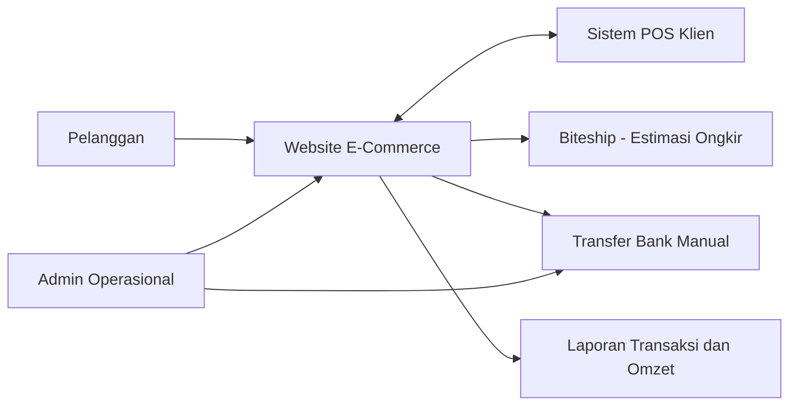
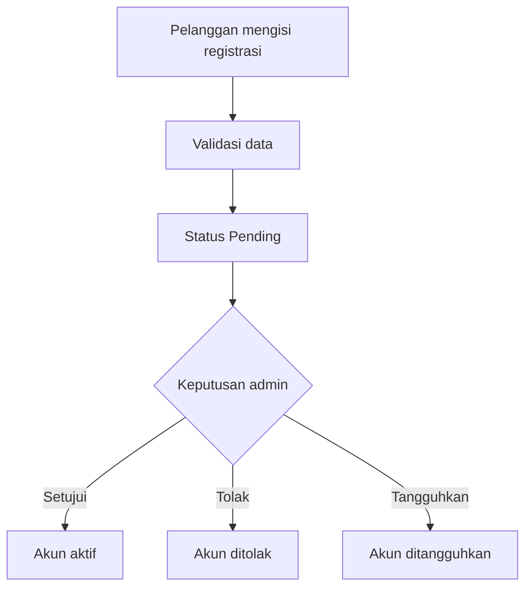
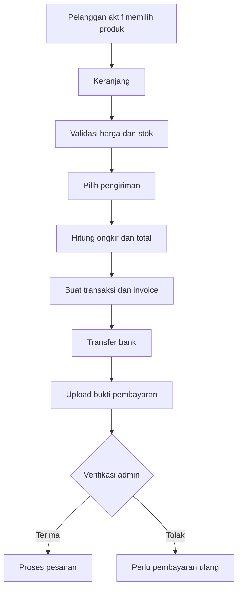
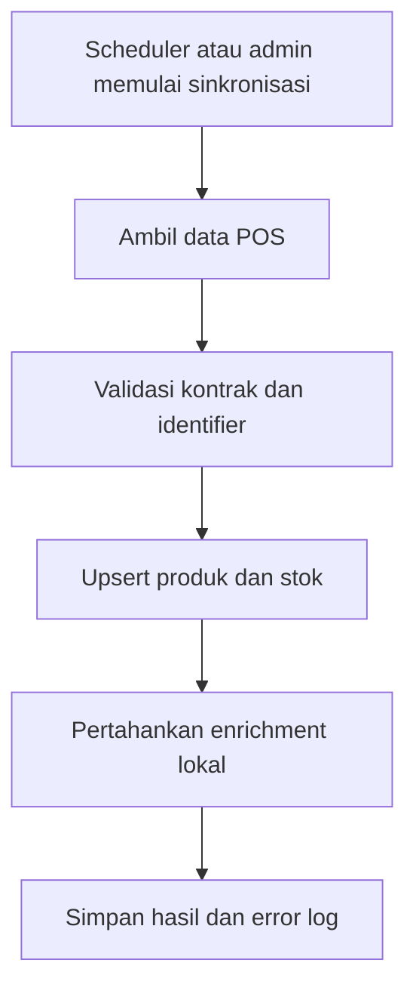

# Business Requirements Document (BRD)

## Website E-Commerce Pelanggan Terverifikasi

| Atribut | Nilai |
|---|---|
| Proyek | Website E-Commerce Custom Pixel Komunika |
| Klien | Sylvi / pihak pemilik usaha |
| Pengembang | PT Webekspres Teknologi Indonesia |
| Versi | 0.3 - Revised Working Baseline |
| Tanggal | Selasa, 28 Juli 2026 |
| Status | Approved Working Baseline - scope proposal awal diteruskan |
| Dokumen sumber | `../references/proposal-klien-sylvi-update-1.pdf` |
| MVP delivery | `MVP.md` |

## 1. Tujuan Dokumen

Dokumen ini mendefinisikan kebutuhan bisnis, ruang lingkup, aktor, aturan bisnis,
risiko, dan ukuran keberhasilan proyek. BRD tidak menetapkan detail implementasi
teknis; detail fungsi berada di `FRD.md` dan spesifikasi teknis berada di
`SRS.md`.

## 2. Hierarki Sumber Requirement

Apabila terdapat konflik, requirement diprioritaskan dengan urutan berikut:

1. Keputusan tertulis terbaru yang telah disetujui klien.
2. Catatan klarifikasi terbaru dari stakeholder proyek.
3. Proposal penawaran versi 10 Juli 2026.
4. Asumsi analisis sistem.

Status requirement:

- **Baseline**: tertulis pada proposal atau telah dikonfirmasi stakeholder.
- **Amendment**: perubahan terhadap proposal berdasarkan catatan terbaru.
- **Proposed**: rekomendasi yang menunggu persetujuan.
- **TBD**: keputusan belum tersedia dan dapat memengaruhi desain.
- **ON_HOLD**: tidak boleh diimplementasikan sampai keputusan tertulis tersedia.

### 2.1 Riwayat Perubahan

| ID | Diterima | Sumber | Perubahan | Dampak Sementara | Status |
|---|---|---|---|---|---|
| CR-001 | Senin, 27 Juli 2026, 11.54-11.56 WIB | Pesan klien Sylvi | Klien menginformasikan perubahan pada PPh 22 dan batas maksimal penjualan; kedua poin kemungkinan besar dihilangkan, dengan rincian lanjutan menyusul. | Requirement terkait ditempatkan `ON_HOLD`; tidak dihapus dan tidak diimplementasikan sebelum klarifikasi Selasa, 28 Juli 2026. | Under clarification |
| CR-002 | Senin, 27 Juli 2026 | Klarifikasi governance proyek | Sylvi ditetapkan sebagai perwakilan klien, Sultan sebagai System Analyst Webekspres, dan Pak Endang sebagai Project Manager Webekspres. Persetujuan final berada pada klien. | OPN-017 diselesaikan dan aturan efektivitas baseline diperjelas. | Resolved |
| CR-003 | Senin, 27 Juli 2026 | Persetujuan working baseline dan fallback POS | Working baseline disetujui dan ditandatangani. Jika API POS belum disediakan, pengembangan serta pengujian menggunakan data seeder. | Tanggal persetujuan ditetapkan dan fallback seeder ditambahkan; kesiapan API production tetap dilacak. | Approved |
| CR-004 | Selasa, 28 Juli 2026 | Pesan klien Sylvi | Klien meminta pengembangan dilanjutkan sesuai plan yang telah dibuat. Sultan mengonfirmasi interpretasi bahwa scope kembali mengikuti proposal awal. | Batas maksimal penjualan serta komponen PPh 22/surcharge tetap berada dalam MVP. Detail formula dan mapping data tetap terbuka pada OPN-006. | Approved working direction |

### 2.2 Model Delivery Hybrid Agile-Waterfall

Proyek menggunakan model hybrid:

- **Waterfall/stage-gate** untuk penetapan MVP, baseline requirement,
  acceptance criteria, persetujuan UAT, dan go-live.
- **Agile** untuk pemecahan backlog, implementasi iteratif, pengujian
  berkelanjutan, demo increment, dan penyerapan feedback.

Aturan utamanya:

1. Hanya requirement `Baseline` dengan acceptance criteria yang jelas dan tidak
   berstatus `ON_HOLD` yang boleh masuk sprint.
2. `Proposed`, `TBD`, candidate scope, dan `ON_HOLD` tidak menjadi komitmen
   sprint atau MVP sampai disetujui tertulis.
3. Perubahan setelah MVP baseline harus melalui impact analysis terhadap scope,
   jadwal 45 hari kerja, biaya, data, integrasi, test, dan acceptance criteria.
4. Perubahan berdampak sedang atau tinggi harus menukar scope setara, dipindah
   ke fase berikutnya, atau mengubah jadwal/biaya melalui persetujuan tertulis.
5. Setiap increment harus didemokan dan diuji tanpa menunggu UAT akhir.

### 2.3 Change Control

| Tingkat | Contoh | Penanganan |
|---|---|---|
| Rendah | Teks, label, urutan tampilan, atau klarifikasi tanpa perubahan perilaku. | Product Owner dapat memasukkan ke backlog sprint berikutnya. |
| Sedang | Perubahan flow atau field yang memengaruhi satu modul. | Wajib impact analysis dan pertukaran scope/prioritas. |
| Tinggi | Harga, pajak, batas penjualan, stok, POS, status order, invoice, pembayaran, atau hosting. | Wajib persetujuan klien dan Webekspres; sprint terdampak tidak dimulai sebelum keputusan. |

Setiap change request minimal mencatat sumber, tanggal, requirement terdampak,
keputusan, pemilik, target keputusan, dampak, dan status implementasi.

Persetujuan final atas perubahan/ide baru berada pada klien. Perubahan baru
efektif menjadi baseline setelah klien dan Webekspres memberikan persetujuan
tertulis pada hari kerja. Diskusi atau persetujuan di luar hari kerja tidak
mengubah baseline sampai dikonfirmasi kembali pada hari kerja.

## 3. Ringkasan Eksekutif

Proyek membangun website penjualan responsif untuk pelanggan yang telah
diregistrasi dan disetujui admin. Sistem mengelola katalog, harga bertingkat,
stok, transaksi, invoice, pembayaran transfer manual, pengiriman, dan laporan
omzet berdasarkan wilayah.

Website mengonsumsi endpoint POS yang disediakan klien untuk mendapatkan data
produk dan stok. Selama API belum tersedia, data seeder digunakan sebagai
fallback pengembangan, staging, dan UAT dengan kontrak data yang menyerupai
payload POS. Informasi pemasaran yang tidak tersedia di POS, seperti gambar,
video, deskripsi, dan metadata penayangan, dikelola di website tanpa ditimpa
oleh proses sinkronisasi atau seeding.

## 4. Latar Belakang dan Masalah Bisnis

Proses penjualan membutuhkan kanal digital yang:

- dapat diakses melalui perangkat mobile dan desktop;
- membatasi transaksi hanya untuk pelanggan yang disetujui;
- menjaga katalog dan stok selaras dengan POS;
- mencatat transaksi dan pembayaran secara terstruktur;
- menghitung harga berdasarkan kuantitas pembelian;
- memberikan estimasi ongkir;
- menyediakan invoice dan laporan omzet per wilayah;
- mengurangi pekerjaan manual dan risiko perbedaan data.

## 5. Tujuan Bisnis

| ID | Tujuan |
|---|---|
| BO-001 | Menyediakan kanal penjualan digital yang responsif dan mudah digunakan. |
| BO-002 | Memastikan hanya pelanggan yang telah disetujui admin dapat bertransaksi. |
| BO-003 | Menyatukan katalog website dengan produk dan stok dari POS. |
| BO-004 | Menjaga data pemasaran produk yang dikelola website tetap independen dari POS. |
| BO-005 | Mengotomasi perhitungan harga, ongkir, total transaksi, dan invoice. |
| BO-006 | Mendukung pembayaran transfer bank yang diverifikasi admin. |
| BO-007 | Menyediakan visibilitas transaksi dan omzet berdasarkan periode serta wilayah. |
| BO-008 | Menyediakan fondasi yang dapat ditingkatkan ketika jumlah pengguna atau beban integrasi bertambah. |

## 6. Stakeholder

| Stakeholder | Kepentingan dan Tanggung Jawab |
|---|---|
| Pemilik usaha / klien | Memegang persetujuan final atas requirement, perubahan, UAT, dan go-live. |
| Sylvi - Perwakilan klien / Product Owner | Memprioritaskan backlog, menjawab klarifikasi bisnis, menerima increment sprint, dan menyampaikan persetujuan final klien. |
| Sultan - System Analyst Webekspres | Menjaga konsistensi BRD, FRD, SRS, acceptance criteria, traceability, dan impact analysis. |
| Pak Endang - Project Manager Webekspres | Menjaga cadence, dependency, risk, keputusan, change log, dan eskalasi hambatan tanpa mengambil alih persetujuan final klien. |
| Admin operasional | Memverifikasi pelanggan, mengelola katalog lokal, pembayaran, transaksi, pengiriman, dan laporan. |
| Pelanggan | Melakukan registrasi, melihat katalog, membuat pesanan, membayar, dan memantau transaksi. |
| Vendor / pengelola POS | Menyediakan API, kredensial, dokumentasi, dan identifier produk yang stabil. |
| Biteship | Menyediakan layanan estimasi ongkir sesuai kontrak API. |
| Webekspres | Menganalisis, mengembangkan, menguji, menerapkan, dan memelihara aplikasi sesuai scope. |
| Pixel Komunika | Penerima hasil akhir pengembangan dan pihak koordinasi proyek. |

## 7. Ruang Lingkup

### 7.1 In Scope

- Website responsif untuk mobile, tablet, dan desktop.
- Registrasi dan autentikasi pelanggan.
- Verifikasi, aktivasi, penolakan, dan penangguhan akun oleh admin.
- Katalog produk, klasifikasi/kategori, merek, SKU, deskripsi, dan media
  ([open question: lihat OPN-003](#opn-003)).
- Sinkronisasi produk dan stok dari POS, dengan data seeder sebagai fallback
  sampai API tersedia
  ([open question: lihat OPN-003](#opn-003) dan
  [OPN-005](#opn-005)).
- Enrichment produk lokal berupa gambar, video, deskripsi pemasaran, SEO, dan
  pengaturan tampil.
- Tiga tingkat harga berdasarkan kuantitas
  ([open question: lihat OPN-013](#opn-013)).
- Batas maksimal pembelian/penjualan dan biaya tambahan yang berkaitan dengan
  PPh 22 atau pelampauan batas
  ([lihat OPN-006](#opn-006) dan [OPN-018](#opn-018)).
- Keranjang, checkout, transaksi, invoice, dan riwayat transaksi.
- Pembayaran transfer bank dan upload bukti pembayaran
  ([open question: lihat OPN-009](#opn-009)).
- Verifikasi pembayaran oleh admin.
- Pembatalan transaksi oleh admin pada hari kalender yang sama.
- Pengiriman kurir toko
  ([open question: lihat OPN-010](#opn-010)).
- Estimasi ongkir melalui Biteship.
- Laporan transaksi dan omzet berdasarkan periode dan wilayah
  ([open question: lihat OPN-011](#opn-011)).
- Monitoring stok, batas minimum stok, dan riwayat perubahan stok.
- Log sinkronisasi dan audit aktivitas kritis.
- Backup, maintenance, SSL, hosting, serta pelatihan sesuai kesepakatan final.

### 7.2 Out of Scope Baseline

- Aplikasi mobile native.
- Pengembangan atau perubahan internal sistem POS milik klien.
- Pembuatan endpoint API di sisi POS.
- Pemesanan, pickup, atau pemanggilan kurir otomatis melalui Biteship.
- Payment gateway.
- Sistem akuntansi lengkap.
- Marketplace multivendor.
- Aplikasi khusus kurir.
- Microservices atau Kubernetes.
- Fitur promo, voucher, dan loyalty yang belum disetujui.

### 7.3 Candidate Scope

Requirement berikut belum tertulis dalam proposal dan harus disetujui sebelum
menjadi baseline:

| ID | Kandidat | Status |
|---|---|---|
| CND-001 | Segmentasi pelanggan menjadi customer biasa dan reseller. | [Open question: OPN-002](#opn-002) |
| CND-002 | Reseller tidak melihat harga dan memesan melalui WhatsApp. | [Open question: OPN-002](#opn-002) |
| CND-003 | Grouping beberapa transaksi untuk satu pengiriman. | [Open question: OPN-014](#opn-014) |
| CND-004 | Write-back order atau reservasi stok ke POS. | [Open question: OPN-005](#opn-005) |
| CND-005 | Notifikasi otomatis kepada pelanggan atau admin. | [Open question: OPN-023](#opn-023) |

## 8. Konteks Bisnis

## 9. Business Requirements

| ID | Requirement | Status |
|---|---|---|
| BR-001 | Sistem harus menyediakan website penjualan responsif. | Baseline |
| BR-002 | Pelanggan harus registrasi sebelum dapat melakukan transaksi. | Baseline |
| BR-003 | Admin harus menyetujui pelanggan sebelum akses pembelian diberikan. | Baseline |
| BR-004 | Admin harus dapat mengaktifkan dan menonaktifkan akun pelanggan. | Baseline |
| BR-005 | Sistem harus mengelola produk, kategori, merek, SKU, deskripsi, dan media ([lihat OPN-003](#opn-003)). | Baseline; data ownership open |
| BR-006 | Sistem harus mendukung tiga tingkat harga berdasarkan kuantitas ([lihat OPN-013](#opn-013)). | Baseline; detail open |
| BR-007 | Sistem harus mendukung batas maksimal pembelian/penjualan pada produk tertentu ([lihat OPN-018](#opn-018)). | Baseline |
| BR-008 | Sistem harus dapat mengenakan biaya persentase ketika batas pembelian terlampaui; keterkaitannya dengan PPh 22, formula, dan kondisi penerapannya mengikuti [OPN-006](#opn-006). | Baseline; formula open |
| BR-009 | Website harus mengonsumsi produk dan stok dari API POS; selama API belum tersedia, data seeder digunakan untuk development, staging, dan UAT ([OPN-003](#opn-003), [OPN-005](#opn-005), [OPN-019](#opn-019)). | Baseline; API contract open |
| BR-010 | Sinkronisasi POS tidak boleh menghapus enrichment produk yang dikelola website. | Amendment |
| BR-011 | Sistem harus menampilkan status stok Tersedia, Menipis, atau Habis. | Baseline |
| BR-012 | Admin harus dapat menentukan batas minimum stok. | Baseline |
| BR-013 | Sistem harus menyimpan riwayat perubahan stok. | Baseline |
| BR-014 | Pelanggan terverifikasi harus dapat membuat pesanan melalui website. | Baseline |
| BR-015 | Sistem harus menghitung subtotal, ongkir, biaya tambahan yang aktif, dan total transaksi. Komponen PPh 22/surcharge terkait batas dihitung sesuai aturan yang disetujui pada [OPN-006](#opn-006). | Baseline; formula open |
| BR-016 | Sistem harus membuat invoice unik untuk setiap transaksi ([lihat OPN-008](#opn-008) dan [OPN-022](#opn-022)). | Baseline; nomor, format, dan penyampaian open |
| BR-017 | Satu pelanggan dapat memiliki lebih dari satu invoice. | Baseline |
| BR-018 | Pembayaran dilakukan melalui transfer bank dan diverifikasi admin. | Baseline |
| BR-019 | Pelanggan harus dapat mengunggah bukti pembayaran ([lihat OPN-009](#opn-009)). | Baseline; batas file dan retensi open |
| BR-020 | Admin harus dapat menerima atau menolak bukti pembayaran. | Baseline |
| BR-021 | Admin dapat membatalkan transaksi hanya pada tanggal kalender yang sama dengan transaksi. | Baseline |
| BR-022 | Pembatalan harus menyesuaikan kembali stok terkait. | Baseline |
| BR-023 | Sistem harus mendukung kurir toko beserta biaya berdasarkan wilayah ([lihat OPN-010](#opn-010)). | Baseline; area, tarif, dan SLA open |
| BR-024 | Biteship hanya digunakan untuk menampilkan layanan dan estimasi ongkir ([lihat OPN-021](#opn-021)). | Baseline; data origin/dimensi open |
| BR-025 | Ongkir terpilih harus masuk ke total transaksi dan invoice. | Baseline |
| BR-026 | Sistem harus menyediakan laporan transaksi dan omzet per periode dan wilayah ([lihat OPN-011](#opn-011)). | Baseline; definisi omzet open |
| BR-027 | Sistem harus mempertahankan jejak audit untuk tindakan administratif kritis. | [Proposed; lihat OPN-015](#opn-015) |
| BR-028 | Kegagalan POS atau Biteship harus dapat ditelusuri dan tidak boleh diam-diam menghasilkan data transaksi salah. | [Proposed; lihat OPN-015](#opn-015) |
| BR-029 | Sistem harus dapat ditingkatkan kapasitasnya tanpa mengubah domain bisnis utama. | [Proposed; lihat OPN-015](#opn-015) |

## 10. Business Rules

| ID | Aturan |
|---|---|
| RULE-001 | Akun yang belum disetujui tidak boleh checkout. |
| RULE-002 | SKU atau external product ID dari POS harus unik dan stabil. |
| RULE-003 | Data stok POS merupakan sumber kebenaran stok aktual, kecuali disepakati mekanisme stok lokal ([lihat OPN-004](#opn-004)). |
| RULE-004 | Gambar, video, deskripsi pemasaran, SEO, slug, dan urutan tampil merupakan data lokal website. |
| RULE-005 | Tingkat harga dipilih berdasarkan kuantitas pada saat checkout ([lihat OPN-013](#opn-013)). |
| RULE-006 | Nilai harga, nama produk, SKU, ongkir, komponen biaya aktif, dan total disimpan sebagai snapshot transaksi; PPh 22/surcharge terkait batas dicatat sesuai aturan yang disetujui pada [OPN-006](#opn-006). |
| RULE-007 | Upload bukti pembayaran tidak otomatis membuat transaksi berstatus lunas. |
| RULE-008 | Pembayaran dianggap sah setelah diverifikasi admin. |
| RULE-009 | Pembatalan menggunakan zona waktu `Asia/Jakarta`. |
| RULE-010 | Transaksi batal tidak dihitung sebagai omzet; status transaksi lain yang diperhitungkan masih harus disepakati ([lihat OPN-011](#opn-011)). |
| RULE-011 | Kegagalan Biteship tidak boleh otomatis menghasilkan ongkir Rp0. |
| RULE-012 | Produk yang hilang dari respons POS tidak langsung dihapus permanen. |
| RULE-013 | Sinkronisasi POS harus idempotent dan tidak membuat duplikasi. |
| RULE-014 | Pemesanan kurir dilakukan di luar website. |
| RULE-015 | Perubahan data produk setelah order tidak mengubah invoice lama. |
| RULE-016 | Seeder POS harus deterministik, idempotent, menggunakan identifier stabil, tidak menimpa enrichment lokal, dan hanya aktif pada environment yang diizinkan. |
| RULE-017 | Seeder bukan bukti bahwa kontrak API POS production telah lulus; go-live dengan seeder memerlukan persetujuan tertulis terpisah. |

## 11. Proses Bisnis Utama

### 11.1 Registrasi dan Persetujuan

### 11.2 Transaksi dan Pembayaran

### 11.3 Sinkronisasi POS

## 12. Ukuran Keberhasilan

Nilai target final harus disetujui pada technical kickoff
([open question: lihat OPN-012](#opn-012)).

| ID | Indikator | Target Draft |
|---|---|---|
| KPI-001 | Registrasi yang dapat diproses admin tanpa bantuan teknis | 100% alur normal |
| KPI-002 | Duplikasi produk akibat sinkronisasi | 0 |
| KPI-003 | Enrichment lokal hilang akibat sinkronisasi | 0 |
| KPI-004 | Invoice dengan perhitungan berbeda dari transaksi | 0 |
| KPI-005 | Transaksi tidak sah dari akun belum disetujui | 0 |
| KPI-006 | Aktivitas pembayaran/pembatalan tanpa audit trail | 0 |
| KPI-007 | Ketersediaan aplikasi bulanan | [Open question: OPN-012](#opn-012) |
| KPI-008 | Waktu respons halaman/API persentil ke-95 | Target di SRS |
| KPI-009 | Recovery hasil sinkronisasi gagal | Dapat di-retry tanpa duplikasi |

## 13. Asumsi dan Dependensi

- Klien menyediakan dokumentasi, kredensial, dan environment API POS
  ([lihat OPN-003](#opn-003) dan [OPN-005](#opn-005)).
- Jika API POS belum tersedia, Webekspres menggunakan data seeder untuk
  development, staging, demo, dan UAT.
- POS menyediakan identifier produk yang stabil.
- Endpoint POS dapat diakses dari server production.
- Kontrak field, rate limit, timeout, dan kebijakan perubahan versi API akan
  diberikan sebelum integrasi dimulai.
- Klien menyediakan akun Biteship yang aktif.
- Data rekening bank dan prosedur verifikasi pembayaran diberikan klien.
- Daftar wilayah kurir toko dan tarifnya diberikan klien
  ([lihat OPN-010](#opn-010)).
- Data origin serta berat/dimensi produk untuk estimasi Biteship diberikan klien
  atau disepakati sebagai aturan operasional ([lihat OPN-021](#opn-021)).
- Keputusan lifecycle order, format/penyampaian invoice, dan notifikasi dibuat
  sebelum requirement terkait masuk sprint ([lihat OPN-020](#opn-020),
  [OPN-022](#opn-022), dan [OPN-023](#opn-023)).
- Infrastruktur production final belum diputuskan
  ([open question: lihat OPN-001](#opn-001)); VPS direkomendasikan pada SRS,
  sementara proposal masih menyebut shared server.
- Perubahan scope setelah baseline mengikuti change control pada
  [Bagian 2.3](#23-change-control).

## 14. Risiko Bisnis

| ID | Risiko | Dampak | Mitigasi |
|---|---|---|---|
| RSK-001 | POS hanya menyediakan endpoint baca tanpa reservasi/write-back. | Overselling. | Validasi stok ulang, aturan reservasi lokal, dan rekonsiliasi ([OPN-004](#opn-004), [OPN-005](#opn-005)). |
| RSK-002 | Kontrak API POS berubah. | Sinkronisasi gagal. | Versioning, contract test, logging, dan change request ([lihat OPN-003](#opn-003)). |
| RSK-003 | Shared hosting membatasi worker dan resource. | Sinkronisasi terlambat atau berhenti. | Gunakan VPS atau terima batas operasional tertulis ([lihat OPN-001](#opn-001)). |
| RSK-004 | Biteship lambat/tidak tersedia. | Checkout tertunda. | Timeout dan fallback manual yang disetujui ([lihat OPN-016](#opn-016)). |
| RSK-005 | Lonjakan traffic atau bot. | Aplikasi lambat/tidak tersedia. | CDN, cache, rate limit, monitoring, dan scale-up. |
| RSK-006 | Media produk dan bukti pembayaran membesar. | Storage/bandwidth habis. | Object storage, kompresi, dan kebijakan retensi ([lihat OPN-009](#opn-009)). |
| RSK-007 | Formula PPh 22/surcharge dan mapping data terkait belum final. | Perhitungan checkout, invoice, dan laporan salah atau dikerjakan ulang. | Implementasi formula menunggu klarifikasi tertulis pada [OPN-006](#opn-006); scope fitur tetap baseline melalui [OPN-018](#opn-018). |
| RSK-008 | API POS belum tersedia selama development atau menjelang go-live. | Contract mismatch, keterlambatan integrasi, dan stok production tidak aktual. | Gunakan seeder untuk delivery awal, definisikan adapter contract, lakukan contract test saat API tersedia, dan putuskan production gate melalui OPN-019. |

## 15. Keputusan Terbuka

Setiap penanda *open question*, `TBD`, atau requirement berstatus `Proposed`
harus merujuk ke item pada bagian ini. Jawaban yang telah disepakati kemudian
dipindahkan ke requirement atau aturan bisnis terkait.

### OPN-001

VPS atau shared hosting sebagai production baseline.

**Pemilik:** Klien / Webekspres · **Target:** Sebelum MVP baseline · **Status:** Open

### OPN-002

Apakah reseller merupakan scope resmi; siapa yang dikategorikan sebagai reseller; apakah reseller dapat melihat harga; dan apakah pemesanan dilakukan melalui website atau WhatsApp.

**Pemilik:** Klien · **Target:** Sebelum backlog final · **Status:** Open

### OPN-003

Field produk dan harga yang menjadi master POS atau website.

**Pemilik:** Klien / Vendor POS · **Target:** Sebelum Sprint 2 · **Status:** Open

### OPN-004

Kapan stok dikurangi atau direservasi: saat checkout, pembuatan invoice, verifikasi pembayaran, atau tahap lain.

**Pemilik:** Klien / System Analyst · **Target:** Sebelum Sprint 2 · **Status:** Open

### OPN-005

Kapan API POS read tersedia; apakah tersedia endpoint order write-back/reservasi; serta apa kontrak dan batas operasionalnya. Fallback seeder telah disetujui untuk delivery sebelum API tersedia.

**Pemilik:** Vendor POS · **Target:** Sebelum integration acceptance · **Status:** Partially resolved

### OPN-006

Apakah biaya persentase/surcharge pada dokumen sebelumnya merupakan PPh 22; jika tetap ada, apa dasar, formula, produk, dan kondisi penerapannya.

**Pemilik:** Klien · **Target:** Sebelum Sprint 2 · **Status:** Open

### OPN-007

Masa berlaku transaksi yang belum dibayar.

**Pemilik:** Klien · **Target:** Sebelum Sprint 2 · **Status:** Open

### OPN-008

Format nomor invoice.

**Pemilik:** Klien · **Target:** Sebelum Sprint 2 · **Status:** Open

### OPN-009

Batas file dan retensi bukti pembayaran.

**Pemilik:** Klien / Webekspres · **Target:** Sebelum Sprint 3 · **Status:** Open

### OPN-010

Daftar area, tarif, dan SLA kurir toko.

**Pemilik:** Klien · **Target:** Sebelum Sprint 3 · **Status:** Open

### OPN-011

Definisi status transaksi yang dihitung sebagai omzet.

**Pemilik:** Klien · **Target:** Sebelum Sprint 3 · **Status:** Open

### OPN-012

Target availability, volume produk, transaksi, concurrent user normal, dan skenario lonjakan beban.

**Pemilik:** Klien · **Target:** Sebelum performance test · **Status:** Open

### OPN-013

Definisi tiga tingkat harga: rentang kuantitas per produk; apakah tiga tingkat bersifat wajib atau maksimal; apakah harga terpilih berlaku untuk seluruh unit atau progresif; serta apakah harga dikelola di POS atau website.

**Pemilik:** Klien / Vendor POS · **Target:** Sebelum Sprint 2 · **Status:** Open

### OPN-014

Apakah beberapa transaksi dapat digabungkan menjadi satu pengiriman; kriteria penggabungan; dan dampaknya terhadap ongkir, invoice, serta status transaksi.

**Pemilik:** Klien · **Target:** Sebelum backlog final · **Status:** Open

### OPN-015

Persetujuan BR-027 sampai BR-029 sebagai baseline, termasuk batas minimum audit trail, ketahanan integrasi, dan kesiapan scaling.

**Pemilik:** Klien / Webekspres · **Target:** Sebelum MVP baseline · **Status:** Open

### OPN-016

Perilaku checkout ketika Biteship tidak tersedia: menunggu, mencoba ulang, memakai tarif manual, atau meminta pelanggan menghubungi admin.

**Pemilik:** Klien · **Target:** Sebelum Sprint 3 · **Status:** Open

### OPN-017

Perwakilan klien/Product Owner: Sylvi; System Analyst Webekspres: Sultan; Project Manager Webekspres: Pak Endang. Persetujuan final berada pada klien dan perubahan efektif menjadi baseline setelah disetujui tertulis oleh klien serta Webekspres pada hari kerja.

**Pemilik:** Klien / Webekspres · **Target:** 27 Juli 2026 · **Status:** Resolved

### OPN-018

Keputusan scope PPh 22, batas maksimal penjualan, dan surcharge terkait. Scope tetap mengikuti proposal awal dan masuk MVP; detail formula, kondisi penerapan, serta mapping field tetap mengikuti OPN-006 dan OPN-003.

**Pemilik:** Klien · **Target:** 28 Juli 2026 · **Status:** Resolved - scope retained in MVP

### OPN-019

Apakah seeder hanya digunakan untuk development/staging/UAT atau juga diizinkan sementara pada production; kapan API POS ditargetkan tersedia; dan siapa yang menyetujui kesesuaian seed data dengan data bisnis.

**Pemilik:** Klien / Vendor POS / Webekspres · **Target:** Sebelum go-live · **Status:** Open

### OPN-020

Lifecycle order setelah pembayaran: status yang digunakan, actor yang boleh mengubah setiap status, bukti/nomor resi yang diperlukan, serta aturan pembatalan atau pengembalian setelah pembayaran terverifikasi.

**Pemilik:** Klien / System Analyst · **Target:** Sebelum Sprint 2 · **Status:** Open

### OPN-021

Data operasional untuk estimasi Biteship: origin pengiriman, sumber berat/dimensi produk, nilai default bila data belum lengkap, dan mapping alamat pelanggan ke input Biteship.

**Pemilik:** Klien / Webekspres · **Target:** Sebelum integrasi Biteship · **Status:** Open

### OPN-022

Format dan penyampaian invoice: field bisnis wajib, tampilan di website dan/atau PDF, serta apakah invoice perlu dikirim melalui channel tertentu. Nomor invoice tetap ditetapkan melalui OPN-008.

**Pemilik:** Klien · **Target:** Sebelum Sprint 2 · **Status:** Open

### OPN-023

Kebutuhan notifikasi: event yang perlu diberitahukan kepada pelanggan/admin, channel yang disetujui, pemilik template, serta fallback jika pengiriman notifikasi gagal.

**Pemilik:** Klien / Webekspres · **Target:** Sebelum Sprint 2 · **Status:** Open

### 15.1 Klarifikasi Klien 28 Juli 2026

Pertanyaan berstatus `Open` harus dijawab dan dicatat tertulis sebelum
requirement terdampak dipindahkan ke sprint. Q-012 dipertahankan sebagai audit
trail karena sudah dijawab pada 27 Juli 2026.

| ID | Pertanyaan | Requirement Terdampak | Status |
|---|---|---|---|
| Q-001 | Apakah PPh 22 dihapus sepenuhnya dari MVP atau hanya cara perhitungannya yang berubah? | BR-008, BR-015, RULE-006 | Resolved - tetap dalam MVP; formula mengikuti Q-003/OPN-006 |
| Q-002 | Apakah istilah “biaya tambahan berbentuk persentase/surcharge” pada proposal dan dokumen saat ini merujuk pada PPh 22? | BR-008, OPN-006 | Open |
| Q-003 | Jika PPh 22 tetap digunakan, siapa yang dikenakan, produk/transaksi apa yang terkena, berapa tarifnya, dan apa dasar perhitungannya? | BR-008, FR-PRC-004 | Open |
| Q-004 | Apakah batas maksimal penjualan dihapus sepenuhnya untuk semua produk atau hanya produk/pelanggan tertentu? | BR-007, FR-PRC-003 | Resolved - tetap dalam MVP |
| Q-005 | Jika batas dihapus, apakah kuantitas pembelian hanya dibatasi oleh stok tersedia dan tingkat harga? | BR-006, BR-007, aturan stok | Not applicable - batas tetap dalam MVP |
| Q-006 | Apakah surcharge ketika batas terlampaui ikut dihapus jika batas maksimal penjualan dihapus? | BR-008, FR-PRC-004 | Resolved - tetap dalam MVP; formula mengikuti Q-003/OPN-006 |
| Q-007 | Apakah tiga tingkat harga berdasarkan kuantitas tetap berlaku tanpa perubahan? | BR-006, OPN-013 | Resolved - tetap dalam MVP |
| Q-008 | Apakah PPh 22, batas penjualan, atau surcharge harus tampil sebagai baris terpisah pada cart, checkout, invoice, dan laporan? | BR-015, RULE-006, laporan | Open |
| Q-009 | Apakah API POS memiliki field PPh 22 atau batas penjualan; jika ada, apakah field tersebut diabaikan atau tetap disimpan? | BR-009, OPN-003 | Open |
| Q-010 | Apa saja “poin-poin yang berkenaan” yang juga ingin dihapus atau diubah oleh klien? | Seluruh traceability terkait | Resolved - tidak ada penghapusan scope berdasarkan CR-004 |
| Q-011 | Apakah perubahan ini memengaruhi nilai proposal, scope komersial, atau deadline 45 hari kerja? | MVP baseline dan change control | Resolved - mengikuti plan/proposal awal |
| Q-012 | Siapa yang memberikan persetujuan final dan kapan keputusan tersebut efektif menjadi baseline? | OPN-017 | Resolved - klien memberi persetujuan final; efektif setelah persetujuan tertulis kedua pihak pada hari kerja |
| Q-013 | Apakah fallback seeder hanya untuk development/staging/UAT atau diizinkan sementara pada production jika API POS belum tersedia saat go-live? | BR-009, OPN-019 | Open |
| Q-014 | Kapan API POS ditargetkan tersedia dan siapa yang memvalidasi field serta contoh data seeder? | OPN-003, OPN-005, OPN-019 | Open |

### 15.2 MVP Baseline dan Stage Gates

| Gate | Target | Exit Criteria |
|---|---|---|
| G0 - Clarification | Hari kerja 1-5 | Keputusan kritis dijawab, P0/MVP ditetapkan, API utama dapat diuji, dan item `ON_HOLD` dikeluarkan dari sprint. |
| G1 - Sprint Ready | Sebelum setiap sprint | Item memenuhi Definition of Ready, mempunyai acceptance criteria, dependency tersedia, dan tidak memiliki blocker keputusan. |
| G2 - Increment Accepted | Akhir setiap sprint | Implementasi, test, code review, demo, dan acceptance Sylvi sebagai Product Owner/perwakilan klien selesai. |
| G3 - MVP/UAT | Setelah seluruh P0 selesai | Seluruh acceptance criteria MVP lulus di staging; defect kritis/tinggi ditutup atau diterima tertulis. |
| G4 - Go-Live | Maksimal hari kerja ke-45 | UAT sign-off, backup/rollback, deployment checklist, training, dan persetujuan go-live selesai. |

### 15.3 Rencana Delivery 45 Hari Kerja

| Periode | Aktivitas Utama | Output |
|---|---|---|
| Hari 1-5 | Klarifikasi, API spike, prioritas P0/P1/P2, baseline MVP, dan sprint planning. | G0 lulus dan backlog Sprint 1 ready |
| Hari 6-15 | Sprint 1. | Increment 1 diterima |
| Hari 16-25 | Sprint 2. | Increment 2 diterima |
| Hari 26-35 | Sprint 3 dan system integration test. | Feature complete P0 |
| Hari 36-42 | Regression, security/performance test proporsional, UAT, dan perbaikan. | UAT sign-off |
| Hari 43-45 | Release readiness, deployment, smoke test, training, dan go-live. | Production release |

Waktu tidak otomatis bertambah karena change request. Perubahan yang tidak dapat
ditampung kapasitas harus menukar scope setara, dipindahkan ke fase berikutnya,
atau mendapat persetujuan perubahan jadwal/biaya.

### 15.4 Checklist Pra-Pengembangan

Checklist ini dipakai pada technical kickoff dan sprint planning. Item yang
berstatus blocker tidak boleh dianggap selesai hanya karena ada asumsi lisan.

| ID | Bukti yang Dibutuhkan | Owner | Gate | Status Awal |
|---|---|---|---|---|
| PRE-001 | Keputusan scope PPh 22, batas maksimal penjualan, surcharge, dan dampak scope. | Klien | G0 | Selesai - OPN-018; formula tetap OPN-006 |
| PRE-002 | Definisi harga bertingkat dan lifecycle order yang dapat diuji. | Klien / System Analyst | G1 Sprint 2 | Blocker - OPN-013, OPN-020 |
| PRE-003 | Kontrak POS atau dataset seeder tervalidasi beserta pemilik data. | Klien / Vendor POS / Webekspres | G1 integrasi | Blocker - OPN-003, OPN-005, OPN-019 |
| PRE-004 | Data Biteship dan kurir toko: origin, berat/dimensi, area, tarif, SLA. | Klien | G1 pengiriman | Blocker - OPN-010, OPN-021 |
| PRE-005 | Keputusan invoice dan notifikasi, termasuk channel serta template jika dipilih. | Klien | G1 Sprint 2 | Open - OPN-022, OPN-023 |
| PRE-006 | Hosting, domain/DNS, akun layanan, dan akses environment ditetapkan. | Klien / Webekspres | Sebelum staging | Open - OPN-001 |
| PRE-007 | Skenario UAT, data uji, perwakilan uji, dan proses sign-off disepakati. | Klien / Webekspres | Sebelum UAT | Open |

## 16. Persetujuan

Working baseline ditandatangani pada 27 Juli 2026 dengan item `ON_HOLD` dan
keputusan terbuka sebagai pengecualian eksplisit. Final MVP baseline ditetapkan
setelah keputusan kritis diberi jawaban, Webekspres menyatakan siap
melaksanakan baseline, dan klien memberikan persetujuan final. Persetujuan
harus tercatat tertulis pada hari kerja.

| Peran | Nama | Tanggal | Persetujuan |
|---|---|---|---|
| Perwakilan Klien / Product Owner | Sylvi | 27 Juli 2026 | Approved |
| System Analyst Webekspres | Sultan | 27 Juli 2026 | Approved |
| Project Manager Webekspres | Pak Endang | 27 Juli 2026 | Approved |
