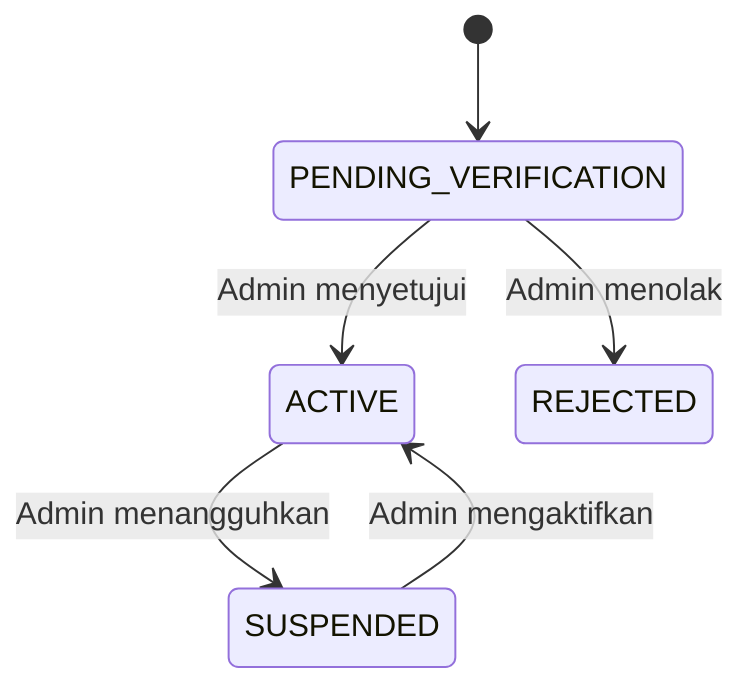
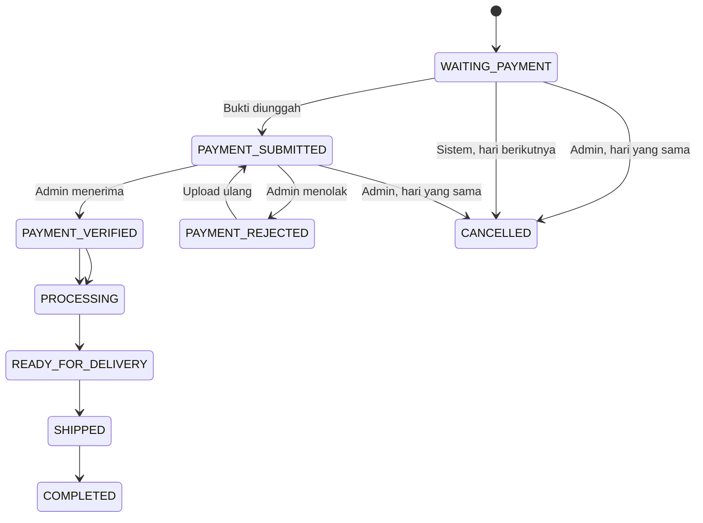

# Functional Requirements Document (FRD)

## Website E-Commerce Pelanggan Terverifikasi

| Atribut | Nilai |
|---|---|
| Versi | 0.3 - Incremental Client Clarification |
| Tanggal | Selasa, 28 Juli 2026 |
| Status | Revised Working Baseline - klarifikasi klien diterapkan bertahap |
| Persetujuan | Sylvi, Sultan, dan Pak Endang - 27 Juli 2026 |
| Dokumen induk | `BRD.md` |
| Spesifikasi teknis | `SRS.md` |
| MVP delivery | `MVP.md` |

## 1. Tujuan

FRD mendefinisikan perilaku fungsional yang harus disediakan aplikasi. Setiap
requirement memiliki ID, aktor, status, dan acceptance criteria agar dapat
diturunkan menjadi test case.

Status:

- **Baseline**: bagian scope aktif.
- **Proposed**: rekomendasi yang menunggu persetujuan.
- **TBD**: fungsi atau aturan belum cukup jelas untuk diimplementasikan.
- **ON_HOLD**: tidak boleh masuk sprint atau diimplementasikan sampai keputusan
  tertulis tersedia.

### 1.1 Tata Kelola Backlog Agile

Setiap functional requirement merupakan backlog item yang harus dapat
ditelusuri ke BRD, acceptance criteria, test case, dan increment aplikasi.

Prioritas:

- **P0 / Must Have**: wajib untuk MVP dan UAT.
- **P1 / Should Have**: dikerjakan setelah P0 aman jika kapasitas tersedia.
- **P2 / Could Have**: dapat dipindahkan ke fase berikutnya tanpa menggagalkan
  MVP.
- **ON_HOLD / Candidate**: bukan komitmen sprint.

Product Owner/perwakilan klien, Sylvi, menetapkan prioritas dari sisi bisnis.
Tim tidak boleh menganggap seluruh requirement `Proposed` sebagai scope 45
hari.

### 1.2 Definition of Ready

Backlog item boleh masuk sprint apabila:

- tujuan bisnis dan aktor jelas;
- priority dan acceptance criteria disetujui;
- dependency, desain, data, dan kontrak API yang diperlukan tersedia;
- tidak berstatus `TBD`, `ON_HOLD`, atau candidate;
- estimasi cukup kecil untuk diselesaikan dalam satu sprint;
- test scenario utama telah diidentifikasi.

### 1.3 Definition of Done

Backlog item dinyatakan selesai apabila:

- implementasi dan code review selesai;
- unit/feature/integration test yang relevan lulus;
- acceptance criteria dapat dibuktikan di staging;
- security, authorization, logging, dan migration relevan telah diperiksa;
- dokumentasi dan traceability diperbarui;
- didemokan dan diterima Product Owner/perwakilan klien, Sylvi;
- tidak memiliki defect kritis atau tinggi yang belum diterima tertulis.

### 1.4 Siklus Iterasi

Baseline delivery menggunakan sprint 10 hari kerja:

1. Sprint planning menetapkan sprint goal dan backlog sesuai kapasitas.
2. Klarifikasi harian tidak boleh mengubah sprint goal secara diam-diam.
3. Perubahan sedang/tinggi masuk impact analysis dan backlog refinement.
4. Increment diuji dan didemokan pada akhir sprint.
5. Review menghasilkan acceptance/rejection; retrospective menghasilkan
   perbaikan cara kerja.
6. UAT akhir memvalidasi keseluruhan MVP, bukan menjadi waktu pertama fitur
   diuji stakeholder.

Urutan increment draft:

| Increment | Fokus | Gate |
|---|---|---|
| Sprint 1 | Registrasi, approval akun, akses, katalog, dan visibilitas harga. | Demo dan acceptance increment |
| Sprint 2 | Tiga jenis harga, PPh 22, cart, checkout, order, dan invoice. | Demo dan acceptance increment |
| Sprint 3 | POS/stok, pembayaran, pengiriman, laporan, audit, dan hardening. | System integration test |
| UAT/Release | End-to-end MVP, perbaikan, deployment, training, dan go-live. | UAT sign-off dan release gate |

Rincian sprint difinalkan setelah item P0 dan keputusan kritis disetujui.

## 2. Aktor dan Hak Akses

### 2.1 Aktor

| Aktor | Deskripsi |
|---|---|
| Guest | Pengunjung yang belum login. |
| Pelanggan Pending | Pengguna terdaftar yang belum disetujui admin. |
| Pelanggan Aktif | Pengguna yang telah disetujui dan dapat bertransaksi. |
| Admin | Pengguna internal yang mengelola operasional website. |
| Scheduler/Worker | Proses sistem untuk sinkronisasi dan pekerjaan latar belakang. |
| Data Contoh (Seeder) | Sumber data dummy untuk development, staging, demo, dan UAT ketika koneksi POS belum tersedia; tidak digunakan pada production. |
| POS | Sistem eksternal sumber produk dan stok. |
| Biteship | Sistem eksternal penyedia estimasi ongkir. |

### 2.2 Matriks Akses

| Fungsi | Guest | Pending | Pelanggan Aktif | Admin |
|---|:---:|:---:|:---:|:---:|
| Melihat halaman publik | Ya | Ya | Ya | Ya |
| Registrasi | Ya | - | - | - |
| Login | Ya | Ya | Ya | Ya |
| Melihat katalog | Ya | Ya | Ya | Ya |
| Melihat harga | Tidak | Tidak | Ya | Ya |
| Checkout | Tidak | Tidak | Ya | Tidak |
| Upload pembayaran | Tidak | Tidak | Milik sendiri | Ya |
| Melihat riwayat transaksi | Tidak | Tidak | Milik sendiri | Semua |
| Verifikasi pelanggan | Tidak | Tidak | Tidak | Ya |
| Mengelola produk lokal | Tidak | Tidak | Tidak | Ya |
| Verifikasi pembayaran | Tidak | Tidak | Tidak | Ya |
| Membatalkan transaksi | Tidak | Tidak | Tidak | Ya |
| Menjalankan sinkronisasi | Tidak | Tidak | Tidak | Ya |
| Melihat laporan/audit | Tidak | Tidak | Tidak | Ya |

## 3. Modul Registrasi, Autentikasi, dan Pelanggan

| ID | Aktor | Requirement | Acceptance Criteria | Status |
|---|---|---|---|---|
| FR-AUTH-001 | Guest | Sistem menyediakan registrasi pelanggan. | Data wajib divalidasi; email/nomor yang harus unik ditolak jika sudah digunakan. | Baseline |
| FR-AUTH-002 | Sistem | Akun baru berstatus `PENDING_VERIFICATION`. | Pengguna dapat melihat katalog publik, tetapi tidak dapat melihat harga, checkout, atau mengakses riwayat transaksi sebelum disetujui. | Baseline |
| FR-AUTH-003 | Guest | Pengguna dapat login dengan kredensial valid. | Kredensial salah menghasilkan pesan generik dan tidak membuka informasi akun. | Baseline |
| FR-AUTH-004 | Pengguna | Pengguna dapat logout. | Session/token tidak dapat digunakan kembali setelah logout. | Baseline |
| FR-AUTH-005 | Pengguna | Pengguna dapat meminta reset password. | Tautan/token reset memiliki masa berlaku dan hanya dapat digunakan sesuai kebijakan. | Proposed |
| FR-AUTH-006 | Admin | Admin dapat melihat daftar dan detail pendaftar. | Daftar dapat dicari, difilter status, dan dipaginasi. | Baseline |
| FR-AUTH-007 | Admin | Admin dapat menyetujui akun. | Status berubah menjadi aktif dan mencatat admin serta waktu keputusan. | Baseline |
| FR-AUTH-008 | Admin | Admin dapat menolak akun dengan catatan. | Status menjadi `REJECTED`; alasan tersimpan. | Baseline |
| FR-AUTH-009 | Admin | Admin dapat menangguhkan atau mengaktifkan kembali akun. | Akun suspended tidak dapat melakukan tindakan terlindungi. | Baseline |
| FR-AUTH-010 | Pengguna | Pengguna dapat mengelola profil dan alamat. | Hanya pemilik atau admin yang dapat mengubah data terkait. | Baseline |
| FR-AUTH-011 | Sistem | Perubahan status akun dicatat dalam audit log. | Nilai sebelum/sesudah, actor, dan timestamp tersimpan. | Proposed |

### 3.1 Status Akun

## 4. Modul Produk, Kategori, Merek, dan Media

| ID | Aktor | Requirement | Acceptance Criteria | Status |
|---|---|---|---|---|
| FR-CAT-001 | Sistem | Produk memiliki external product ID dan/atau SKU yang unik. | Produk POS yang sama tidak membuat record ganda. | Amendment |
| FR-CAT-002 | Admin | Admin dapat melihat daftar produk dan status sinkronisasinya. | Daftar dapat dicari, difilter, diurutkan, dan dipaginasi. | Baseline |
| FR-CAT-003 | Sistem | Sistem menyinkronkan kategori/klasifikasi dan merek dari POS. | Perubahan master POS di-upsert tanpa membuat kategori, merek, atau relasi produk duplikat. | Baseline |
| FR-CAT-004 | Admin | Admin dapat mengelola enrichment lokal. | Gambar, video, deskripsi pemasaran, SEO, slug, label, dan urutan tampil dapat disimpan. | Amendment |
| FR-CAT-005 | Sistem | Sinkronisasi tidak menimpa enrichment lokal. | Enrichment tetap sama setelah sync produk/stok. | Amendment |
| FR-CAT-006 | Admin | Admin dapat mengaktifkan/nonaktifkan penayangan produk. | Produk nonaktif tidak dapat ditambahkan ke cart. | Baseline |
| FR-CAT-007 | Guest dan Pengguna | Guest, pelanggan pending, dan pelanggan aktif dapat membuka katalog serta detail produk. | Hanya produk aktif yang ditampilkan; harga hanya disertakan untuk pelanggan aktif dan admin. | Baseline |
| FR-CAT-008 | Guest dan Pengguna | Guest, pelanggan pending, dan pelanggan aktif dapat mencari dan memfilter katalog. | Filter minimal mencakup kategori, merek, dan ketersediaan tanpa membocorkan harga kepada guest atau pelanggan pending. | Proposed |
| FR-CAT-009 | Sistem | Perubahan nama/harga produk tidak mengubah transaksi historis. | Invoice lama tetap menampilkan snapshot transaksi. | Proposed |

## 5. Modul Harga dan PPh 22

Klarifikasi klien Selasa, 28 Juli 2026 menetapkan tiga jenis harga dari POS dan
mengoreksi istilah batas maksimal menjadi ambang nilai belanja per klasifikasi.
Ambang tidak menolak checkout; ketika terlampaui, sistem menambahkan PPh 22
sesuai konfigurasi. Detail penerapan harga partai dan dasar pengenaan PPh 22
tetap mengikuti [OPN-013](BRD.md#opn-013) dan
[OPN-006](BRD.md#opn-006).

| ID | Aktor | Requirement | Acceptance Criteria | Status |
|---|---|---|---|---|
| FR-PRC-001 | Worker | Sistem menyinkronkan harga `ECERAN`, `PARTAI`, dan `GROSIR` untuk setiap produk dari POS. | Produk hanya siap dijual setelah ketiga jenis harga lolos validasi kontrak; harga eceran disimpan tetapi tidak ditampilkan pada storefront fase saat ini. | Baseline |
| FR-PRC-002 | Sistem | Sistem memilih harga yang berlaku berdasarkan aturan jenis harga. | Minimum grosir dapat berbeda per produk; skenario harga partai dan prioritas partai/grosir diuji setelah [OPN-013](BRD.md#opn-013) diselesaikan. | Baseline; aturan partai partially open |
| FR-PRC-003 | Sistem | Sistem mendukung pemilihan klasifikasi produk serta ambang nilai belanja yang dapat dikonfigurasi per klasifikasi. | Nilai belanja di bawah atau sama dengan ambang tidak memicu PPh 22; melewati ambang tidak menolak checkout. | Baseline |
| FR-PRC-004 | Sistem | Sistem menghitung PPh 22 dengan persentase yang dapat dikonfigurasi, termasuk `0%`, ketika aturan klasifikasi terpicu. | Klasifikasi, ambang, tarif, dasar pengenaan, hasil perhitungan, dan snapshot tervalidasi; rincian yang belum final mengikuti [OPN-006](BRD.md#opn-006). | Baseline; dasar pengenaan partially open |
| FR-PRC-005 | Sistem | Sistem memvalidasi ulang harga saat checkout. | Perubahan harga setelah item masuk cart ditampilkan sebelum konfirmasi order. | Proposed |
| FR-PRC-006 | Sistem | Harga disimpan sebagai snapshot per item transaksi. | Invoice historis tidak bergantung pada harga produk terkini. | Proposed |
| FR-PRC-007 | Sistem | Sistem membatasi visibilitas harga berdasarkan status akun dan kanal penjualan. | Guest dan pelanggan pending tidak menerima nilai harga; pelanggan aktif menerima harga jual yang berlaku tanpa harga eceran, sedangkan admin dapat memeriksa data harga hasil sinkronisasi. | Baseline |

## 6. Modul POS dan Stok

Koneksi POS menjadi sumber data production. Jika koneksi belum tersedia, data
contoh menjadi fallback resmi untuk development, staging, demo, dan UAT. Data
contoh tidak digunakan pada production; production wajib menggunakan koneksi
POS sesuai [`OPN-019`](BRD.md#opn-019).

| ID | Aktor | Requirement | Acceptance Criteria | Status |
|---|---|---|---|---|
| FR-POS-001 | Worker | Sistem mengambil SKU, nama produk, kategori/klasifikasi, merek, tiga jenis harga, dan stok melalui API POS klien. | Request memakai kredensial server-side dan setiap field master mengikuti kontrak tervalidasi. | Amendment |
| FR-POS-002 | Worker | Sinkronisasi melakukan upsert berdasarkan identifier stabil. | Menjalankan payload sama berulang kali tidak membuat duplikasi. | Amendment |
| FR-POS-003 | Worker | Sinkronisasi dapat berjalan setiap pagi atau berkala sesuai jadwal konfigurasi. | Interval dapat diubah, eksekusi overlap dicegah, dan waktu keberhasilan terakhir tercatat. | Baseline |
| FR-POS-004 | Admin | Admin dapat memulai sinkronisasi manual. | Sistem menolak trigger baru jika sync yang sama masih berjalan. | Proposed |
| FR-POS-005 | Sistem | Setiap sinkronisasi memiliki log. | Waktu mulai/selesai, status, jumlah sukses/gagal, dan pesan error tersimpan. | Proposed |
| FR-POS-006 | Sistem | Produk yang tidak lagi muncul dari POS tidak langsung dihapus. | Produk ditandai untuk rekonsiliasi atau dinonaktifkan menurut aturan final. | Proposed |
| FR-POS-007 | Sistem | Sistem menentukan status `TERSEDIA`, `MENIPIS`, atau `HABIS`. | Status mengikuti stok aktual dan batas minimum produk. | Baseline |
| FR-POS-008 | Admin | Admin dapat mengatur batas minimum stok. | Status `MENIPIS` berubah sesuai nilai terbaru. | Baseline |
| FR-POS-009 | Sistem | Perubahan stok disimpan sebagai ledger/riwayat. | Setiap perubahan memiliki jumlah sebelum/sesudah, sumber, dan waktu. | Baseline |
| FR-POS-010 | Sistem | Kegagalan sementara POS dapat di-retry. | Retry tidak membuat duplikasi dan berhenti setelah batas percobaan. | Proposed |
| FR-POS-011 | Sistem | Checkout memvalidasi stok terhadap snapshot sinkronisasi terakhir dan penyesuaian lokal setelahnya. | Order tidak dibuat jika stok efektif tidak memenuhi kebutuhan; mekanisme reservasi final mengikuti [OPN-004](BRD.md#opn-004). | Baseline; reservation partially open |
| FR-POS-012 | Sistem | Penyesuaian stok pembatalan dapat ditelusuri. | Referensi transaksi dan sumber `CANCELLATION` tersimpan. | Baseline |
| FR-POS-013 | Data Seeder | Sistem dapat memuat produk, tiga jenis harga, dan stok representatif ketika API POS belum tersedia. | Setiap produk memiliki harga eceran, partai, dan grosir; dataset juga mencakup minimum grosir serta status stok tersedia/menipis/habis. | Baseline |
| FR-POS-014 | Sistem | Seeder mengikuti kontrak data internal yang juga digunakan adapter POS. | SKU/external ID stabil, field wajib tervalidasi, dan perubahan ke API tidak memerlukan perubahan domain transaksi. | Baseline |
| FR-POS-015 | Sistem | Seeder aman dijalankan berulang kali. | Eksekusi ulang tidak membuat duplikasi dan tidak menimpa enrichment lokal yang telah diedit. | Baseline |
| FR-POS-016 | Sistem | Penggunaan data contoh dibatasi berdasarkan environment. | Data contoh tersedia untuk local/staging/UAT; production selalu menolak eksekusi data contoh. | Baseline |

## 7. Modul Keranjang dan Checkout

| ID | Aktor | Requirement | Acceptance Criteria | Status |
|---|---|---|---|---|
| FR-CART-001 | Pelanggan Aktif | Pelanggan dapat menambahkan produk aktif ke keranjang. | Kuantitas divalidasi terhadap aturan produk. | Baseline |
| FR-CART-002 | Pelanggan Aktif | Pelanggan dapat mengubah kuantitas atau menghapus item. | Jenis harga yang berlaku, PPh 22 jika terpicu, dan total diperbarui. | Baseline |
| FR-CART-003 | Sistem | Keranjang hanya dapat di-checkout oleh akun aktif. | Pending, rejected, atau suspended menerima penolakan. | Baseline |
| FR-CART-004 | Sistem | Checkout memvalidasi produk, harga, stok, alamat, dan pengiriman. | Order hanya dibuat jika semua validasi lulus. | Proposed |
| FR-CART-005 | Pelanggan Aktif | Pelanggan memilih alamat dan metode pengiriman. | Hanya metode yang tersedia untuk area tersebut ditampilkan. | Baseline |
| FR-CART-006 | Sistem | Sistem menampilkan rincian subtotal, PPh 22 yang aktif, ongkir, dan grand total. | Total server-side sama dengan invoice; tampilan dan dasar pengenaan PPh 22 mengikuti [OPN-006](BRD.md#opn-006). | Baseline; dasar pengenaan partially open |
| FR-CART-007 | Sistem | Pembuatan order terlindungi idempotency. | Pengiriman request yang sama tidak membuat order ganda. | Proposed |

## 8. Modul Pengiriman dan Biteship

| ID | Aktor | Requirement | Acceptance Criteria | Status |
|---|---|---|---|---|
| FR-SHP-001 | Admin | Admin dapat mengelola wilayah dan tarif kurir toko. | Area aktif memiliki tarif dan estimasi pengiriman. | Baseline |
| FR-SHP-002 | Sistem | Sistem meminta estimasi ongkir Biteship melalui backend. | Credential tidak pernah dikirim ke browser; origin, berat/dimensi, dan alamat tervalidasi sesuai [OPN-021](BRD.md#opn-021). | Baseline; data operasional open |
| FR-SHP-003 | Pelanggan | Pelanggan dapat memilih layanan pengiriman yang tersedia. | Layanan menampilkan nama, estimasi, dan biaya. | Baseline |
| FR-SHP-004 | Sistem | Ongkir terpilih masuk ke total dan invoice. | Snapshot layanan serta biaya tersimpan pada transaksi. | Baseline |
| FR-SHP-005 | Sistem | Kegagalan Biteship tidak menghasilkan ongkir Rp0 otomatis. | Checkout dihentikan atau memakai fallback yang disetujui. | Proposed |
| FR-SHP-006 | Sistem | Website tidak membuat booking/pickup kurir Biteship. | Tidak ada request pemesanan kurir dari alur baseline. | Baseline |
| FR-SHP-007 | Sistem | Request Biteship memiliki timeout dan retry terbatas. | Error dapat dilihat pada integration log. | Proposed |

## 9. Modul Order, Invoice, dan Status

| ID | Aktor | Requirement | Acceptance Criteria | Status |
|---|---|---|---|---|
| FR-ORD-001 | Sistem | Sistem membuat nomor order dan invoice yang unik. | Constraint unik mencegah duplikasi nomor. | Baseline |
| FR-ORD-002 | Sistem | Order menyimpan snapshot item dan biaya yang telah disetujui. | Nama, SKU, jenis harga, harga, kuantitas, ongkir, PPh 22, dan total historis tersedia; dasar pengenaan mengikuti [OPN-006](BRD.md#opn-006). | Proposed |
| FR-ORD-003 | Pelanggan Aktif | Pelanggan aktif dapat melihat detail dan riwayat order sendiri. | Guest dan pelanggan pending ditolak; pelanggan aktif tidak dapat mengakses order pengguna lain. | Baseline |
| FR-ORD-004 | Admin | Admin dapat melihat dan memfilter seluruh order. | Filter minimal periode, status, pelanggan, area, dan metode kirim. | Baseline |
| FR-ORD-005 | Admin | Admin dapat memperbarui status operasional order. | Transisi tidak valid ditolak dan dicatat; status pemenuhan dan nomor resi mengikuti [OPN-020](BRD.md#opn-020). | Baseline; lifecycle partially open |
| FR-ORD-006 | Admin | Admin dapat membatalkan order pada hari yang sama. | Setelah pergantian tanggal Asia/Jakarta, tindakan ditolak. | Baseline |
| FR-ORD-007 | Sistem | Pembatalan merekonsiliasi stok terkait. | Penyesuaian stok dan audit log dibuat secara atomik. | Baseline |
| FR-ORD-008 | Sistem | Order yang sudah dibatalkan tidak dapat diproses lebih lanjut. | Transisi dari `CANCELLED` ditolak. | Proposed |

### 9.1 Status Transaksi Draft

Pembatalan standar hanya oleh admin pada hari yang sama dengan tanggal
transaksi. Lifecycle pemenuhan dan kebutuhan nomor resi masih memerlukan
keputusan bisnis ([OPN-020](BRD.md#opn-020)); pengembalian dana berada di luar
scope pembatalan standar.

| ID | Aktor | Requirement | Acceptance Criteria | Status |
|---|---|---|---|---|
| FR-ORD-009 | Pelanggan Aktif | Pelanggan dapat mengakses invoice miliknya sesuai format dan channel yang disetujui. | Tampilan, PDF, atau pengiriman invoice hanya diimplementasikan setelah [OPN-022](BRD.md#opn-022) menetapkan kebutuhan. | Proposed |
| FR-ORD-010 | Sistem | Pesanan yang tetap `WAITING_PAYMENT` pada hari kalender berikutnya otomatis dibatalkan. | Pesanan dibuat pada tanggal D tidak lagi aktif pada D+1 dalam zona waktu `Asia/Jakarta`; pembatalan idempotent dan tercatat pada audit log. | Baseline |

## 10. Modul Pembayaran Manual

| ID | Aktor | Requirement | Acceptance Criteria | Status |
|---|---|---|---|---|
| FR-PAY-001 | Sistem | Sistem menampilkan instruksi dan rekening transfer. | Informasi berasal dari konfigurasi aktif. | Baseline |
| FR-PAY-002 | Pelanggan | Pelanggan dapat mengunggah bukti pembayaran. | File divalidasi tipe, ukuran, dan kepemilikannya. | Baseline |
| FR-PAY-003 | Sistem | Upload tidak otomatis menandai transaksi lunas. | Status menjadi `PAYMENT_SUBMITTED`. | Baseline |
| FR-PAY-004 | Admin | Admin dapat menerima pembayaran. | Actor, waktu, catatan, dan status baru tersimpan. | Baseline |
| FR-PAY-005 | Admin | Admin dapat menolak pembayaran dengan alasan. | Pelanggan dapat melihat alasan dan mengunggah ulang jika diperbolehkan. | Baseline |
| FR-PAY-006 | Sistem | Bukti pembayaran hanya dapat diakses pihak berwenang. | URL publik permanen tidak tersedia. | Proposed |
| FR-PAY-007 | Sistem | Perubahan status pembayaran dicatat dalam audit log. | Nilai sebelum/sesudah dapat ditelusuri. | Proposed |

## 11. Modul Laporan

| ID | Aktor | Requirement | Acceptance Criteria | Status |
|---|---|---|---|---|
| FR-RPT-001 | Admin | Admin dapat melihat jumlah transaksi dan omzet. | Nilai mengikuti definisi status omzet yang disetujui. | Baseline |
| FR-RPT-002 | Admin | Laporan dapat difilter berdasarkan periode. | Tanggal menggunakan zona waktu Asia/Jakarta. | Baseline |
| FR-RPT-003 | Admin | Laporan dapat difilter berdasarkan area/kecamatan. | Hasil sesuai snapshot alamat transaksi. | Baseline |
| FR-RPT-004 | Admin | Laporan dapat difilter berdasarkan status dan metode pengiriman. | Filter dapat dikombinasikan. | Proposed |
| FR-RPT-005 | Sistem | Transaksi batal tidak dihitung sebagai omzet. | Nilai laporan mengecualikan `CANCELLED`. | Proposed |
| FR-RPT-006 | Admin | Admin dapat mengekspor laporan. | Format CSV/XLSX memerlukan keputusan final. | TBD |

## 12. Audit dan Monitoring

| ID | Aktor | Requirement | Acceptance Criteria | Status |
|---|---|---|---|---|
| FR-AUD-001 | Sistem | Sistem mencatat aktivitas administratif kritis. | Verifikasi akun, harga, pembayaran, pembatalan, dan sync tercatat. | Proposed |
| FR-AUD-002 | Admin | Admin berwenang dapat mencari audit log. | Filter actor, action, entity, dan periode tersedia. | Proposed |
| FR-AUD-003 | Sistem | Log menyimpan request/correlation ID. | Error aplikasi dapat dihubungkan dengan integration log. | Proposed |
| FR-AUD-004 | Sistem | Data rahasia tidak ditulis mentah ke log. | Password, token, dan credential termask/redacted. | Proposed |

## 13. Candidate: Notifikasi

Bagian ini mencegah asumsi bahwa queue `notifications` berarti channel atau
event bisnis tertentu sudah disetujui.

| ID | Aktor | Candidate Requirement | Status |
|---|---|---|---|
| FR-NTF-001 | Sistem | Sistem dapat mengirim notifikasi untuk event yang disetujui, misalnya approval akun, invoice, pembayaran, dan status order. | [Open question: OPN-023](BRD.md#opn-023) |
| FR-NTF-002 | Admin | Admin dapat melihat kegagalan notifikasi operasional yang memerlukan tindak lanjut. | [Open question: OPN-023](BRD.md#opn-023) |

## 14. Candidate: Reseller

Bagian ini tidak boleh diimplementasikan sebelum `CND-001` dan `CND-002`
disetujui.

| ID | Aktor | Candidate Requirement | Status |
|---|---|---|---|
| FR-RSL-001 | Admin | Admin dapat mengklasifikasikan pelanggan sebagai reseller. | TBD |
| FR-RSL-002 | Reseller | Reseller dapat melihat katalog tetapi tidak melihat harga. | TBD |
| FR-RSL-003 | Reseller | Reseller tidak menggunakan checkout website. | TBD |
| FR-RSL-004 | Reseller | Tombol pemesanan membuka WhatsApp dengan template produk/SKU/jumlah. | TBD |

## 15. Penanganan Error Fungsional

| Kondisi | Perilaku yang Diharapkan |
|---|---|
| POS timeout | Sync ditandai gagal/parsial, di-retry terbatas, dan tidak menghapus data lama. |
| Payload POS tidak valid | Record terkait ditolak, error dicatat, proses lain dapat dilanjutkan sesuai kebijakan. |
| Payload POS memuat PPh 22/batas penjualan | Field hanya memengaruhi harga atau checkout setelah mapping disetujui melalui OPN-003 dan OPN-006; payload serta keputusan mapping dicatat. |
| Seeder dijalankan ulang | Data inti di-upsert secara idempotent dan enrichment lokal dipertahankan. |
| Biteship gagal | Checkout tidak memakai ongkir nol; pelanggan mendapat pesan yang dapat ditindaklanjuti. |
| Stok berubah saat checkout | Checkout dihentikan dan keranjang diperbarui. |
| Upload tidak valid | File ditolak tanpa disimpan sebagai bukti aktif. |
| Order request dikirim ulang | Idempotency mencegah order ganda. |
| Transisi status tidak valid | Perubahan ditolak dan dicatat. |
| Notifikasi gagal | Kegagalan dicatat; retry/fallback mengikuti keputusan pada OPN-023. |

## 16. Traceability BRD ke FRD

| Business Requirement | Functional Requirements |
|---|---|
| BR-002 - BR-004 | FR-AUTH-001 - FR-AUTH-011 |
| BR-005 | FR-CAT-001 - FR-CAT-009 |
| BR-006 | FR-PRC-001, FR-PRC-002, FR-PRC-005 - FR-PRC-007 |
| BR-007 - BR-008 | FR-PRC-003 - FR-PRC-004, FR-CART-006, FR-ORD-002 |
| BR-009 - BR-013 | FR-POS-001 - FR-POS-016 |
| BR-014 - BR-017, BR-030 | FR-CART-001 - FR-CART-007, FR-ORD-001 - FR-ORD-010 |
| BR-018 - BR-020 | FR-PAY-001 - FR-PAY-007 |
| BR-021 - BR-022 | FR-ORD-006 - FR-ORD-008, FR-POS-012 |
| BR-023 - BR-025 | FR-SHP-001 - FR-SHP-007 |
| BR-026 | FR-RPT-001 - FR-RPT-006 |
| BR-027 - BR-028 | FR-AUD-001 - FR-AUD-004 |
| CND-001 - CND-002 | FR-RSL-001 - FR-RSL-004 |
| CND-005 | FR-NTF-001 - FR-NTF-002 |

## 17. Acceptance Gate

FRD dapat dibaseline setelah:

- seluruh item `TBD` kritis mendapat keputusan;
- seluruh item `ON_HOLD` dikeluarkan tertulis dari MVP atau dikembalikan menjadi
  requirement aktif dengan acceptance criteria;
- API POS dapat diuji atau fallback seeder lulus acceptance test; contract test
  koneksi POS production tersedia dan lulus contract test;
- API Biteship dapat diuji;
- status/transisi order disetujui;
- aturan harga partai dan prioritas terhadap harga grosir disetujui melalui
  [OPN-013](BRD.md#opn-013);
- konfigurasi ambang klasifikasi dan PPh 22 dikonfirmasi melalui
  [OPN-018](BRD.md#opn-018), sedangkan dasar pengenaan disetujui melalui
  [OPN-006](BRD.md#opn-006);
- event pengurangan/reservasi stok disetujui melalui
  [OPN-004](BRD.md#opn-004);
- lifecycle order dan bukti fulfillment disetujui melalui
  [OPN-020](BRD.md#opn-020); pembatalan standar tetap oleh admin pada hari
  yang sama;
- data origin, berat/dimensi, serta mapping alamat Biteship tersedia melalui
  [OPN-021](BRD.md#opn-021);
- format/penyampaian invoice dan kebutuhan notifikasi diputuskan atau eksplisit
  dikeluarkan dari MVP melalui [OPN-022](BRD.md#opn-022) dan
  [OPN-023](BRD.md#opn-023);
- hak akses katalog dan harga sebelum approval disetujui;
- setiap item P0 memenuhi Definition of Ready;
- acceptance criteria P0 diturunkan menjadi test case dan skenario UAT;
- MVP baseline, perubahan, dan pengecualian mendapat persetujuan tertulis.

Acceptance criteria MVP dibekukan pada baseline. Perubahan setelah baseline
harus memperbarui BRD, FRD, SRS, test case, traceability, estimasi, dan keputusan
scope sesuai change control BRD.
