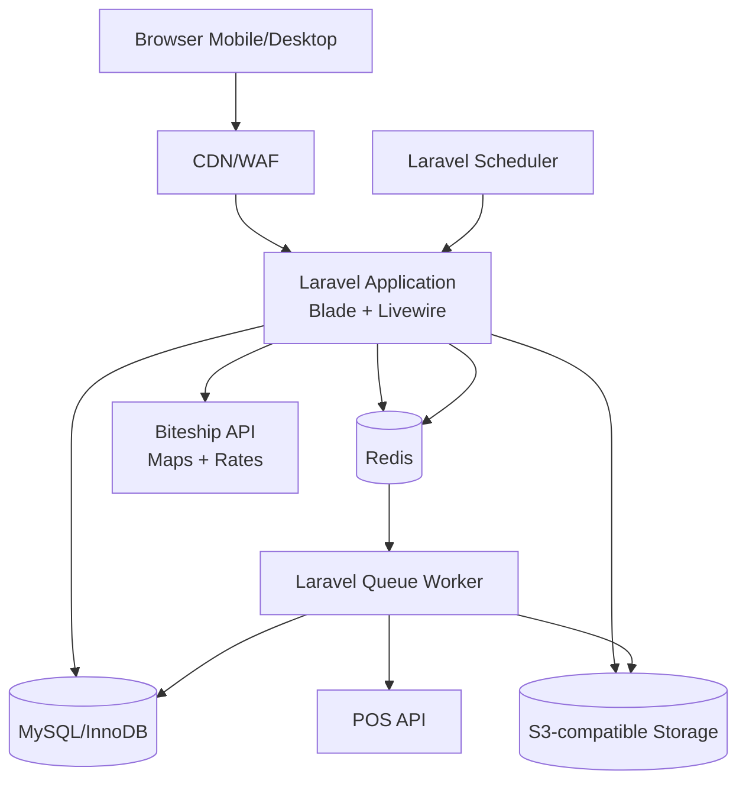
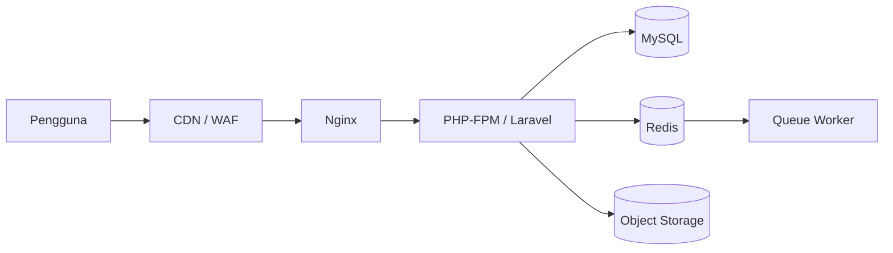
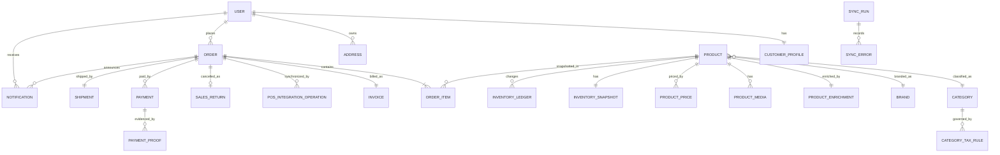

# Software Requirements Specification (SRS)

## Website E-Commerce Pelanggan Terverifikasi

| Atribut | Nilai |
|---|---|
| Versi | 0.14 - Fulfillment Transition Clarification |
| Tanggal | Rabu, 29 Juli 2026 |
| Status | Revised Working Baseline - klarifikasi klien diterapkan bertahap |
| Persetujuan | Sylvi, Sultan, dan Pak Endang - 27 Juli 2026 |
| Kebutuhan bisnis | `BRD.md` |
| Kebutuhan fungsional | `FRD.md` |
| MVP delivery | `MVP.md` |

## 1. Tujuan

SRS mendefinisikan arsitektur, stack, interface, model data konseptual,
non-functional requirements, keamanan, deployment, observability, dan
ketentuan operasional aplikasi.

## 2. Prinsip Desain

- Satu aplikasi modular monolith.
- Satu repository untuk backend, frontend, worker, migration, dan test.
- Laravel menjadi source of truth untuk business logic.
- Blade/Livewire digunakan untuk UI; tidak dibangun SPA terpisah.
- Node.js hanya digunakan pada tahap build aset, bukan runtime production.
- Database relasional menjadi source of truth transaksi.
- Redis tidak menyimpan data transaksi utama.
- Integrasi eksternal dijalankan melalui backend dan queue.
- Seeder menggunakan kontrak import internal yang sama dengan adapter POS agar
  perpindahan sumber data tidak mengubah domain transaksi.
- Implementasi dimulai sederhana, tetapi aplikasi dibuat stateless sejauh
  praktis agar dapat ditingkatkan kapasitasnya.
- Microservices, Kubernetes, dan event streaming tidak digunakan pada fase
  awal.

### 2.1 Engineering Governance Hybrid

SRS menjadi technical baseline untuk MVP melalui stage-gate, sedangkan
implementasi dilakukan iteratif per sprint.

- Arsitektur, kontrak data, keamanan minimum, acceptance criteria P0, dan
  release gate dibekukan pada MVP baseline.
- Setiap sprint menghasilkan increment yang dapat diuji di staging.
- Perubahan teknis yang memengaruhi kontrak API, database, transaksi, security,
  atau deployment wajib memiliki impact analysis dan Architecture Decision
  Record (ADR) ringkas.
- CI dijalankan pada setiap pull request; UAT akhir bukan waktu pertama fitur
  diuji.
- Fitur `TBD`, `ON_HOLD`, atau candidate tidak boleh dibuat secara spekulatif.
- Perubahan tetap harus menjaga backward compatibility, migration safety, test,
  observability, dan rollback.

### 2.2 Change Notice dan Klarifikasi 27-28 Juli 2026

Klarifikasi klien pada 28 Juli 2026 menetapkan:

- setiap produk memiliki harga eceran, partai, dan grosir dari POS;
- harga eceran disimpan tetapi tidak ditampilkan pada storefront fase saat ini;
- harga partai eligible jika sedikitnya satu produk/SKU dalam struk berjumlah
  minimal lima unit dan kuantitas antar-SKU tidak dijumlahkan; cakupan item yang
  mendapat harga partai dan prioritas terhadap harga grosir masih menunggu
  OPN-013;
- istilah batas maksimal dikoreksi menjadi ambang nilai belanja per klasifikasi;
  melewati ambang tidak menolak checkout;
- PPh 22 menggunakan tarif configurable, termasuk `0%`, dan dipicu ketika
  ambang klasifikasi terlampaui; klasifikasi, ambang, dan tarif dikelola melalui
  website, sedangkan dasar pengenaan menunggu OPN-006;
- PPh 22 ditampilkan sebagai komponen terpisah pada cart, checkout, invoice,
  dan laporan;
- perhitungan PPh 22 dari lebih dari satu klasifikasi terpicu digabungkan
  menjadi satu total transaksi; dasar pengenaan dan urutan agregasi tetap
  menunggu OPN-006;
- SKU, nama produk, kategori/klasifikasi, merek, harga, dan stok bersumber dari
  POS;
- master data dan inventory disinkronkan penuh sekali sehari; stok per produk
  dapat dicek berkala untuk rekonsiliasi;
- website menjadi source of truth transaksi, invoice, dan lifecycle order;
- commit penjualan website membuat invoice serta mengurangi stok efektif,
  kemudian worker mengirim laporan penjualan ke POS untuk mencatat transaksi
  dan mengurangi stok POS;
- retur website menambah stok efektif, kemudian worker mengirim laporan retur
  ke POS untuk mencatat retur dan menambah stok POS;
- acknowledgement/lookup laporan digunakan untuk rekonsiliasi tanpa membatalkan
  transaksi website yang sah;
- field POS menjadi sumber utama ketika tersedia, sedangkan website hanya
  melengkapi field yang belum tersedia;
- invoice wajib memuat identitas toko, rincian item, total pembelian
  keseluruhan, dan nilai rupiah PPh 22 jika berlaku;
- setelah pembayaran diverifikasi, order berlanjut melalui `PROCESSING`,
  `PACKED`, `SHIPPED`, dan `COMPLETED`; nomor resi ditampilkan ketika tersedia.
  Urutan status telah disetujui, sedangkan trigger operasional dan konfirmasi
  penerimaan mengikuti OPN-020;
- order baru memicu indikator merah pada website admin dan pesan WhatsApp;
  template/provider/penerima/fallback WhatsApp masih menunggu OPN-023;
- development memakai data contoh sampai akses POS dibuka setelah alur website
  berjalan; koordinasi akses dilakukan dengan Kak Rio sebagai PIC POS;
- pesanan `WAITING_PAYMENT` otomatis dibatalkan pada hari kalender berikutnya.

Nilai harga, jenis harga, aturan PPh 22 yang terpakai, dasar perhitungan, tarif,
dan hasilnya harus disimpan sebagai snapshot transaksi.

### 2.3 Design Artifacts

- [ERD](../design/ERD.md) menetapkan relasi dan cardinality working baseline.
- [Data Dictionary](../design/DATA_DICTIONARY.md) menetapkan field, tipe,
  constraint, index, dan penanda `Provisional`.
- [User Flows](../design/USER_FLOWS.md) memecah alur MVP menjadi flow granular
  berkode `UF-01` sampai `UF-19` dengan konektor lintas-flow.

Perubahan pada artifact desain yang memengaruhi requirement, kontrak data,
acceptance criteria, atau open question mengikuti change control yang sama
dengan SRS.

## 3. Keputusan Arsitektur

### 3.1 Pola

**Rekomendasi: modular monolith dengan worker terpisah sebagai process.**

Alasan:

- seluruh scope masih berada dalam satu domain e-commerce;
- target awal concurrent user belum besar;
- transaksi, stok, invoice, dan pembayaran membutuhkan konsistensi kuat;
- satu codebase mempercepat pengembangan dan debugging;
- worker dapat ditambah tanpa memisahkan service bisnis;
- modul dapat diekstraksi di masa depan hanya jika terdapat bukti kebutuhan.

### 3.2 Modul Aplikasi

- Identity and Access
- Customer Management
- Catalog
- Product Enrichment
- Pricing
- Inventory
- POS Integration
- Seed Data Support
- Cart
- Order
- Invoice
- Payment
- Shipping
- Biteship Integration
- Reporting
- Audit
- Background Jobs

### 3.3 Component Diagram

Diagram ini adalah **component/dependency diagram**, bukan urutan proses.
Panah menunjukkan dependensi komunikasi antarkomponen.



## 4. Technology Stack

| Area | Pilihan | Keterangan |
|---|---|---|
| Language | PHP 8.4 | Runtime utama |
| Framework | Laravel 13 | Modular monolith |
| View | Blade | SSR untuk storefront dan halaman umum |
| Reactive UI | Livewire | Form, cart, checkout, filter, dan admin |
| Client interaction | Alpine.js | Modal, dropdown, preview, dan interaksi ringan |
| Styling | Tailwind CSS | Dibangun menjadi aset statis |
| Asset bundler | Vite | Build-time; bukan production backbone |
| Database | MySQL 8.4 / InnoDB | Transaksi ACID dan row-level locking |
| Cache/Queue | Redis | Profil VPS |
| Queue monitor | Supervisor | Menjaga worker tetap hidup |
| Web server | Nginx + PHP-FPM | Profil VPS |
| File storage | S3-compatible object storage | Media dan bukti pembayaran |
| Testing | PHPUnit atau Pest | Unit, feature, integration |
| CI/CD | GitHub Actions | Lint, test, build, dan deployment |
| Edge | Cloudflare atau ekuivalen | CDN, WAF, dan rate limiting |

### 4.1 Dependency Policy

- Gunakan fitur Laravel/PHP sebelum menambah package.
- Package baru harus memiliki fungsi jelas, maintenance aktif, dan lisensi
  yang sesuai.
- Hindari abstraction layer untuk satu implementasi kecuali diperlukan pada
  trust boundary atau integrasi eksternal.
- Versi dependency dikunci melalui `composer.lock` dan lockfile frontend.

## 5. Deployment Profile

### 5.1 Profil A - VPS (Opsi Upgrade)

Baseline awal:

- 2 vCPU;
- 4 GB RAM;
- SSD 40-80 GB;
- Ubuntu LTS;
- Nginx, PHP-FPM, MySQL, Redis, dan Supervisor;
- backup database ke lokasi eksternal;
- object storage di luar disk aplikasi;
- CDN/WAF di depan aplikasi.

Ukuran tersebut merupakan titik awal dan wajib divalidasi dengan load test.

Diagram berikut adalah **deployment topology**. Panah menunjukkan jalur request
atau komunikasi infrastruktur, bukan status proses bisnis.



### 5.2 Profil B - Shared Hosting (Production Baseline)

Jika shared hosting dipilih:

- runtime hanya PHP + MySQL/MariaDB;
- aset frontend dibangun di CI/developer lalu di-deploy sebagai file statis;
- cache dan queue menggunakan database/file;
- scheduler menggunakan cron;
- queue diproses periodik dengan proses yang berhenti setelah antrean kosong;
- tidak ada Redis lokal, Supervisor, persistent worker, Octane, WebSocket
  server, Docker runtime, Node runtime, atau PM2.

Keterbatasan shared hosting diterima sebagai baseline production. Desain harus
menjaga sinkronisasi, retry, dan monitoring tetap ringan serta memindahkan
kebutuhan persistent worker atau resource lebih besar ke opsi upgrade VPS.

### 5.3 Keputusan Hosting

Status final: **shared hosting milik klien**. Aplikasi memakai runtime PHP dan
database yang disediakan hosting; VPS hanya menjadi opsi upgrade jika batas
resource shared hosting tidak lagi mencukupi.

## 6. Scalability Strategy

Tahapan peningkatan:

1. Shared hosting dengan cache/queue berbasis database atau file, cron, dan
   aset statis hasil build.
2. Vertical scaling CPU/RAM berdasarkan metrics.
3. Pindahkan database dan Redis ke resource terpisah.
4. Jalankan beberapa application node di belakang load balancer.
5. Terapkan autoscaling hanya setelah pola beban terbukti.

Sejak fase pertama:

- file user tidak bergantung pada local disk;
- session dapat dipindahkan ke Redis/database;
- job harus idempotent;
- nomor order/invoice memiliki constraint unik;
- application node tidak menyimpan state bisnis di memory;
- konfigurasi berasal dari environment;
- cache boleh dihapus tanpa kehilangan transaksi.

## 7. External Interfaces

### 7.1 POS API

Working scheme dari klien:

| Domain | Operasi Kerja | Arah | Cadence | Tujuan |
|---|---|---|---|---|
| Master Data | `GetCategory` | POS -> Web | Sekali sehari | Sinkronisasi klasifikasi/kategori. |
| Master Data | `GetAllProducts` | POS -> Web | Sekali sehari | Sinkronisasi daftar produk. |
| Master Data | `GetProductDetail` | POS -> Web | Sekali sehari/ketika diperlukan | Melengkapi detail produk dari POS. |
| Master Data | `GetPriceList` | POS -> Web | Sekali sehari | Sinkronisasi harga eceran, partai, dan grosir. |
| Inventory | `GetAllStock` | POS -> Web | Sekali sehari | Membentuk snapshot stok awal hari. |
| Inventory | `GetStockByProduct` | POS -> Web | Berkala/ketika diperlukan | Mencocokkan stok produk tertentu. |
| Sales Reporting | Laporan penjualan - nama final TBD | Web -> POS | Setiap transaksi website | Mencatat penjualan web dan mengurangi stok POS; invoice tetap diterbitkan website. |
| Return Reporting | Laporan retur - nama final TBD | Web -> POS | Setiap retur website | Mencatat retur web dan menambah stok POS setelah laporan penjualan asal diterima atau direkonsiliasi. |
| Reporting Status | Acknowledgement/lookup - nama final TBD | POS <-> Web | Rekonsiliasi/ketika diperlukan | Mencocokkan penerimaan laporan penjualan/retur berdasarkan external reference. |

Label pelaporan di atas bersifat konseptual, bukan nama endpoint atau kontrak
HTTP final.
Kak Rio menjadi PIC untuk koordinasi POS. Akses dibuka setelah alur website
berbasis data contoh sudah berjalan; keputusan ini menetapkan pemilik dan
readiness trigger, bukan kontrak HTTP final. Kak Rio/vendor POS masih harus
menyediakan:

- base URL dan environment sandbox/production;
- autentikasi dan mekanisme rotasi credential;
- contoh request/response;
- daftar field dan tipe data;
- stable product identifier;
- pagination;
- rate limit;
- timeout yang disarankan;
- daftar error;
- versi API dan kebijakan perubahan;
- kontrak final seluruh operasi yang tercantum pada working scheme;
- dukungan external reference/idempotency untuk operasi pelaporan;
- aturan pencarian berdasarkan external reference;
- mapping payload laporan penjualan dan laporan retur;
- timestamp/cutoff snapshot inventory dan cara mengaitkannya dengan laporan
  penjualan/retur yang sudah tercakup;
- perilaku transaksi ketika request timeout tetapi sudah diproses POS.

Website:

- memanggil API hanya dari backend/worker;
- menyimpan external ID;
- memvalidasi payload sebelum upsert;
- menggunakan timeout, retry dengan backoff, dan idempotency;
- mencegah overlapping sync;
- mencatat hasil setiap proses;
- menerapkan field POS ketika tersedia dan mempertahankan pelengkap lokal hanya
  untuk field yang tidak tersedia;
- menyimpan external reference unik untuk setiap laporan penjualan/retur;
- tidak melakukan retry buta setelah timeout operasi pelaporan;
- menandai operasi ambigu sebagai `RECONCILIATION_REQUIRED`;
- menyimpan response/acknowledgement reference, payload hash, status, attempt
  count, dan correlation ID tanpa menyimpan secret;
- menahan laporan retur sampai laporan penjualan order asal berstatus
  `SUCCEEDED` atau telah direkonsiliasi;
- menghitung stok efektif dari snapshot POS dan delta web yang belum tercakup,
  berdasarkan cutoff/source timestamp yang disepakati; full sync tidak boleh
  menghitung delta dua kali atau menghapus delta lokal yang belum terserap POS.

#### 7.1.1 Data Contoh Non-Production

Jika koneksi POS belum tersedia:

- development, staging, demo, dan UAT menggunakan data contoh deterministik;
- setelah alur website berbasis data contoh berjalan, Webekspres
  mengoordinasikan pembukaan akses POS dengan Kak Rio;
- data contoh memanggil jalur import/upsert yang sama dengan adapter POS, bukan
  menulis langsung dengan aturan bisnis berbeda;
- dataset memakai SKU/external ID stabil dan mencakup skenario harga serta stok
  representatif, termasuk harga eceran, partai, grosir, minimum grosir, dan
  aturan ambang klasifikasi;
- eksekusi ulang bersifat idempotent;
- pelengkap lokal dipertahankan ketika field POS tidak tersedia; nilai POS
  menjadi sumber utama ketika field tersebut tersedia;
- data contoh tidak menyimpan credential atau data pribadi production;
- production tidak menjalankan data contoh; produk dan stok production wajib
  berasal dari koneksi POS yang telah diuji.

Data contoh memungkinkan pengembangan dan UAT berlanjut, tetapi tidak
menggantikan pengujian koneksi terhadap POS asli sebelum go-live.

### 7.2 Data Ownership

| Data | Master Default | Status |
|---|---|---|
| External product ID | POS | Amendment |
| SKU | POS | Baseline |
| Nama dasar produk | POS | Baseline |
| Stok aktual | POS | Baseline |
| Produk/stok contoh sebelum POS tersedia | Data contoh | Baseline non-production |
| Status ketersediaan | Dihitung website dari stok POS | Draft |
| Harga eceran, partai, dan grosir | POS | Baseline |
| Minimum kuantitas grosir | POS | Baseline |
| Kategori/klasifikasi dan merek | POS | Baseline |
| Konfigurasi klasifikasi, ambang, dan tarif PPh 22 | Website | Baseline |
| Order, retur, lifecycle, dan invoice | Website | Baseline |
| Pencatatan penjualan/retur web dan stok POS | POS dari laporan website | Baseline downstream |
| Gambar/video | POS ketika tersedia; fallback website | Baseline |
| Deskripsi pemasaran | POS ketika tersedia; fallback website | Baseline |
| SEO/slug/label/urutan | POS ketika tersedia; fallback website | Baseline |
| Area ID dan pilihan rate sementara | Biteship | Baseline external/transient |
| Pilihan pengiriman dan harga final saat checkout | Snapshot website | Baseline |

### 7.3 Biteship API

Biteship diidentifikasi sebagai **external multi-carrier shipping API**. Dalam
sistem ini perannya dibatasi sebagai **location/rate provider**, bukan system of
record produk, stok, order, invoice, pembayaran, atau fulfillment. Website
menyimpan snapshot pilihan pengiriman yang disetujui pelanggan.

#### 7.3.1 Endpoint Baseline

| Fungsi | Method dan Path | Penggunaan |
|---|---|---|
| Standardisasi/pencarian area | `GET /v1/maps/areas` | Mencari area tujuan dan menyimpan Biteship area ID bersama alamat pelanggan. Pemanggilan dari input pencarian harus di-debounce. |
| Pilihan layanan dan ongkir | `POST /v1/rates/couriers` | Mengambil layanan, estimasi durasi, dan harga final berdasarkan origin, destination, kurir, dan item. |

Base URL production/test adalah `https://api.biteship.com` melalui HTTPS.
Secret key hanya disimpan pada backend/environment dan tidak pernah dikirim ke
browser atau log. Key test dan live harus dipisahkan; mode ditentukan oleh key.

#### 7.3.2 Kontrak Request Rates

Origin dan destination dapat dikirim sebagai area ID, kode pos, koordinat, atau
kombinasi yang didukung Biteship. Area ID menjadi default yang disarankan untuk
layanan reguler karena merepresentasikan area sampai kecamatan. Koordinat harus
tersedia jika kurir instan masuk scope.

Request minimum memuat:

- origin dan destination dalam format lokasi yang disepakati;
- daftar kode kurir yang diizinkan;
- `items`, dengan setiap item memiliki nama, nilai, kuantitas, dan berat dalam
  gram;
- panjang, lebar, dan tinggi hanya bila tersedia atau diperlukan layanan,
  karena dimensi dapat memengaruhi biaya.

Nilai origin, sumber/default berat, penggunaan dimensi, daftar kurir, dan mode
lokasi tidak boleh diasumsikan dalam kode; keputusan operasionalnya mengikuti
[OPN-021](BRD.md#opn-021).

#### 7.3.3 Kontrak Response dan Snapshot

Sistem hanya menawarkan rate yang lolos validasi. Snapshot minimum memuat:

- provider `BITESHIP`;
- kode dan nama kurir;
- kode/tipe dan nama layanan;
- estimasi durasi beserta unitnya;
- mata uang;
- area ID origin/destination yang digunakan;
- harga final dari field `price`;
- waktu quote dan hash request teredaksi.

`price` dipakai sebagai ongkir final karena telah mencerminkan komponen harga
aktif dari Biteship; sistem tidak menghitung ulang dari `shipping_fee`. Respons
rate tidak diperlakukan sebagai reservasi, booking, atau jaminan ketersediaan
kurir sampai fulfillment.

#### 7.3.4 Scope, Error, dan Environment

- API Draft Orders/Orders, booking/pickup, label, Tracking, Webhooks, dan
  Locations Biteship tidak dipanggil dalam baseline.
- Response dan tipe data divalidasi sebelum ditampilkan atau disimpan.
- Gangguan jaringan dan respons 5xx dapat dicoba ulang secara terbatas dengan
  backoff; respons 4xx autentikasi/validasi tidak diulang tanpa koreksi.
- Error dicatat dengan correlation ID dan payload teredaksi.
- Kegagalan tidak menghasilkan ongkir nol; fallback mengikuti
  [OPN-016](BRD.md#opn-016).
- Sandbox/test digunakan sebelum live, tetapi penggunaan Maps/Rates tetap perlu
  memperhatikan akun, aktivasi, dan biaya provider.

## 8. API Internal

Jika endpoint JSON diperlukan untuk Livewire, admin, atau integrasi internal:

- prefix `/api/v1`;
- autentikasi dan authorization pada backend;
- resource menggunakan kata benda;
- pagination untuk collection;
- error mempunyai `code`, `message`, `details`, dan `request_id`;
- request order menggunakan idempotency key;
- endpoint admin dan pelanggan memakai policy berbeda;
- credential eksternal tidak pernah dikirim ke frontend.

Contoh error:

```json
{
  "code": "STOCK_NOT_AVAILABLE",
  "message": "Stok produk tidak mencukupi.",
  "details": {
    "sku": "SKU-001"
  },
  "request_id": "req_..."
}
```

## 9. Conceptual Data Model

### 9.1 Entity Utama

| Entity | Tujuan |
|---|---|
| users | Identitas dan kredensial pengguna. |
| customer_profiles | Data bisnis pelanggan dan status verifikasi. |
| addresses | Alamat pelanggan dan snapshot sumber alamat. |
| roles / permissions | Hak akses admin dan pelanggan. |
| products | Data inti produk serta external identifier. |
| product_enrichments | Deskripsi pemasaran, SEO, label, dan status tampil. |
| product_media | Metadata gambar/video dan object key. |
| categories | Klasifikasi produk. |
| brands | Merek produk. |
| product_prices | Tiga jenis harga dari POS, minimum kuantitas grosir per produk, dan metadata penerapannya; kelayakan partai dihitung pada struk dari kuantitas per SKU. |
| category_tax_rules | Klasifikasi terpilih, ambang nilai belanja, tarif PPh 22, status aktif, serta metadata pembuat/perubah konfigurasi website. |
| inventory_snapshots | Nilai stok terbaru per produk. |
| inventory_ledger | Riwayat perubahan stok. |
| carts / cart_items | Keranjang aktif. |
| orders | Header transaksi dan status. |
| order_items | Snapshot nama produk, SKU, kuantitas, harga satuan, dan total harga item. |
| order_charge_components | Snapshot komponen biaya aktif, dasar perhitungan, tarif/nilai, dan total. |
| invoices | Nomor invoice website, snapshot nama/alamat/kontak/NPWP toko, total pembelian keseluruhan, dan nilai rupiah PPh 22 kondisional. |
| pos_integration_operations | External reference, operasi, payload hash, status, attempt, correlation ID, dan hasil rekonsiliasi. |
| sales_returns | Retur website, alasan pembatalan, perubahan stok efektif, dan status pelaporan ke POS. |
| payments | Pengajuan dan verifikasi pembayaran. |
| payment_proofs | Metadata file bukti pembayaran. |
| shipments | Metode, layanan, area, ongkir, dan status. |
| notifications | Notifikasi admin berbasis database untuk order baru dan status baca. |
| store_courier_rates | Tarif kurir toko per wilayah. |
| sync_runs | Ringkasan eksekusi sinkronisasi. |
| sync_errors | Detail item yang gagal. |
| audit_logs | Jejak tindakan kritis. |

Model data menyimpan konfigurasi PPh 22 yang dikelola melalui website secara
terpisah dari snapshot biaya order. Perubahan konfigurasi klasifikasi, ambang,
atau tarif tidak boleh mengubah invoice lama. Dasar pengenaan tetap menunggu
[`OPN-006`](BRD.md#opn-006). Perubahan skema harus melalui migration, data
dictionary, test, dan ADR.

Kontrak tampilan invoice minimum:

- identitas toko: nama, alamat, nomor kontak, dan NPWP;
- setiap item: jumlah, nama barang, SKU, harga satuan, dan total harga item;
- ringkasan: total pembelian keseluruhan serta nilai rupiah PPh 22 jika
  transaksi terkena PPh 22;
- seluruh nilai disimpan sebagai snapshot agar invoice historis tidak berubah
  ketika data toko, produk, atau harga diperbarui.

Website adalah penerbit invoice resmi untuk transaksi web. Sumber/mapping
identitas toko, format nomor, kebutuhan PDF, dan channel penyampaian tetap
mengikuti [`OPN-008`](BRD.md#opn-008) serta
[`OPN-022`](BRD.md#opn-022).

### 9.2 Relasi Konseptual



ERD detail, field, index, dan constraint working baseline ditetapkan pada
[ERD](../design/ERD.md) dan
[Data Dictionary](../design/DATA_DICTIONARY.md). Bagian yang bergantung pada
keputusan terbuka diberi label `Provisional` dan diperbarui melalui migration
serta change control setelah keputusan disetujui.

## 10. Transaction and Concurrency

Operasi berikut harus atomik:

- pembuatan draft order, order item, snapshot biaya, dan external reference;
- pembuatan order, item, invoice website, pengurangan stok efektif, serta
  pencatatan operasi laporan penjualan;
- verifikasi pembayaran dan perubahan status;
- pembuatan retur website, pengembalian stok efektif, serta pencatatan operasi
  laporan retur.

Ketentuan:

- gunakan database transaction;
- gunakan row-level locking atau optimistic concurrency sesuai flow;
- urutan locking konsisten untuk mengurangi deadlock;
- deadlock/transient error dapat di-retry terbatas;
- constraint database mencegah duplicate invoice, SKU, dan external ID;
- validasi stok dilakukan kembali sebelum commit order.

Remote API tidak dapat berada dalam database transaction yang sama. Alur
pelaporan minimum:

1. dalam satu database transaction, simpan order, item, invoice, kurangi stok
   efektif, dan buat operasi laporan penjualan `PENDING`;
2. aktifkan order tanpa menunggu POS;
3. worker mengirim laporan penjualan berdasarkan external reference unik;
4. jika timeout atau hasil ambigu, tandai `RECONCILIATION_REQUIRED` dan cari
   status berdasarkan external reference sebelum retry;
5. pembatalan membuat retur, menambah stok efektif, dan membuat operasi laporan
   retur `PENDING` secara atomik;
6. worker hanya mengirim laporan retur setelah laporan penjualan asal
   `SUCCEEDED` atau sudah direkonsiliasi.

## 11. Queue and Scheduler

Queue minimum:

- `critical`: proses yang memengaruhi transaksi;
- `pos-sync`: sinkronisasi dan rekonsiliasi POS;
- `notifications`: notifikasi database dan pesan WhatsApp;
- `reports`: export atau agregasi berat.

Ketentuan job:

- idempotent;
- mempunyai timeout;
- mempunyai jumlah retry dan backoff;
- error permanen masuk failed job;
- payload tidak berisi credential mentah;
- status dapat dimonitor;
- deploy me-restart worker secara graceful.

Event minimum queue `notifications` adalah order baru. Notifikasi database
website dibuat pada commit order; pesan WhatsApp dikirim asynchronous setelah
commit. Bunyi berasal dari aplikasi/perangkat WhatsApp. Provider, penerima,
template, aturan retry/fallback, dan perilaku read/clear mengikuti
[OPN-023](BRD.md#opn-023).

Scheduler minimum:

- sinkronisasi penuh master data dan inventory sekali sehari;
- pencocokan stok produk tertentu secara berkala/ketika diperlukan;
- rekonsiliasi laporan penjualan dan retur;
- pembatalan idempotent untuk order `WAITING_PAYMENT` dari hari kalender
  sebelumnya;
- retry/reconciliation;
- pembersihan temporary upload;
- pruning log sesuai retention;
- backup/health check sesuai platform.

## 12. Non-Functional Requirements

### 12.1 Performance

| ID | Requirement | Target Draft |
|---|---|---|
| NFR-PERF-001 | Response internal untuk request baca normal | p95 <= 800 ms, di luar latency eksternal |
| NFR-PERF-002 | Halaman storefront utama | LCP p75 <= 2,5 detik pada kondisi target |
| NFR-PERF-003 | Endpoint collection | Wajib pagination dan batas maksimum page size |
| NFR-PERF-004 | Query laporan berat | Tidak memblokir request transaksi; gunakan queue/export |
| NFR-PERF-005 | Kapasitas | Baseline pengguna bersamaan normal maksimal 50 pengguna dan divalidasi melalui load test proporsional shared hosting |

### 12.2 Availability and Resilience

| ID | Requirement |
|---|---|
| NFR-AVL-001 | Health check tersedia untuk aplikasi, database, cache, dan worker. |
| NFR-AVL-002 | Kegagalan POS tidak menghapus data katalog terakhir yang valid. |
| NFR-AVL-003 | Kegagalan Biteship tidak membuat ongkir salah. |
| NFR-AVL-004 | Retry hanya untuk kegagalan sementara. |
| NFR-AVL-005 | Queue backlog dan failed job menghasilkan alert. |
| NFR-AVL-006 | Target availability bulanan ditetapkan sebelum go-live. |
| NFR-AVL-007 | Kegagalan pelaporan POS atau WhatsApp tidak menghapus order/invoice website; status kegagalan dapat di-retry dan ditindaklanjuti. |

### 12.3 Security

| ID | Requirement |
|---|---|
| NFR-SEC-001 | Password memakai adaptive hashing bawaan Laravel. |
| NFR-SEC-002 | Session cookie menggunakan Secure, HttpOnly, dan SameSite yang sesuai. |
| NFR-SEC-003 | Authorization diperiksa server-side melalui middleware/policy. |
| NFR-SEC-004 | Form dilindungi CSRF dan input divalidasi. |
| NFR-SEC-005 | Login, registrasi, upload, checkout, dan sync memiliki rate limit. |
| NFR-SEC-006 | File upload divalidasi MIME, ukuran, nama, dan aksesnya. |
| NFR-SEC-007 | Bukti pembayaran disimpan privat dan diberikan melalui signed URL sementara. |
| NFR-SEC-008 | Credential disimpan di environment/secret store, bukan repository. |
| NFR-SEC-009 | Log tidak memuat password, token, atau data finansial sensitif mentah. |
| NFR-SEC-010 | Dependency vulnerability scan dijalankan di CI. |

### 12.4 Data and Time

- Database menyimpan timestamp dalam UTC.
- UI dan business rule pembatalan menggunakan `Asia/Jakarta`.
- Uang disimpan sebagai integer rupiah atau decimal fixed precision; tidak
  menggunakan floating point.
- Snapshot order tidak bergantung pada data produk terkini.
- Data pribadi mengikuti retention dan kebijakan penghapusan yang disetujui.

### 12.5 Browser and Accessibility

- Mendukung dua versi mayor terbaru Chrome, Edge, Firefox, dan Safari pada UAT.
- Layout responsif untuk mobile, tablet, dan desktop.
- Form memiliki label, pesan error, keyboard navigation, dan focus state.
- Kontras, heading, serta semantic HTML mengikuti baseline WCAG 2.1 AA sejauh
  relevan dengan scope.

## 13. File and Media Handling

- Database menyimpan metadata/object key, bukan binary.
- Gambar produk dibuatkan varian ukuran/thumbnail.
- Video tidak diproses sinkron di request pengguna.
- Bukti pembayaran tidak diletakkan pada public directory.
- Upload memiliki batas ukuran dan allowlist MIME.
- Nama file client tidak digunakan sebagai object key final.
- Malware scanning ditambahkan jika risk assessment mewajibkan.
- Retention bukti pembayaran dan orphan upload masih `TBD`.

## 14. Caching and Traffic Spike Protection

- Cache katalog, kategori, merek, dan konfigurasi yang sering dibaca.
- Jangan cache data stok/harga tanpa TTL dan invalidation yang jelas.
- Gunakan cache stampede protection/lock untuk data mahal.
- Static asset dan media publik dilayani melalui CDN.
- Terapkan edge dan application rate limiting.
- Bot dan brute-force dilindungi WAF/challenge sesuai kebutuhan.
- Queue menyerap lonjakan pekerjaan integrasi.
- Laporan dan export besar dijalankan asynchronous.

Metrics yang dipantau:

- request rate dan concurrent request;
- p50/p95/p99 response time;
- error rate;
- CPU, memory, disk, dan network;
- database connection, slow query, dan lock wait;
- Redis memory dan eviction;
- queue depth, queue lag, dan failed job;
- latency/error POS dan Biteship;
- storage growth.

Threshold alert awal harus dituning setelah load test. Contoh draft:

- CPU > 70% selama 10 menit;
- memory > 80%;
- disk > 75%;
- error rate > 1% selama 5 menit;
- p95 > 1,5 detik selama 10 menit;
- queue lag critical > 60 detik;
- kegagalan sinkronisasi berulang >= 3 kali.

## 15. Logging, Audit, and Observability

Application log menggunakan structured log dengan:

- timestamp;
- level;
- environment;
- request/correlation ID;
- actor ID jika tersedia;
- module/action;
- error code;
- exception tanpa secret.

Audit log minimum:

- verifikasi dan perubahan status akun;
- perubahan harga dan kebijakan pembelian yang telah disetujui;
- verifikasi/penolakan pembayaran;
- perubahan status dan pembatalan order;
- sinkronisasi manual;
- perubahan konfigurasi kurir.

Audit log tidak boleh dapat diubah melalui UI operasional biasa.

## 16. Backup and Disaster Recovery

Baseline proposal menyebut backup mingguan. Untuk data transaksi,
direkomendasikan:

- backup database harian;
- backup file/object sesuai versioning/retention;
- salinan backup di lokasi berbeda;
- enkripsi backup;
- pengujian restore berkala;
- dokumentasi recovery procedure.

Target final:

| Parameter | Target |
|---|---|
| RPO | TBD |
| RTO | TBD |
| Retention backup | TBD |
| Frekuensi restore test | Minimal berkala; final TBD |

## 17. Development and Deployment

### 17.1 Environment

- local development;
- staging/UAT;
- production.

Staging menggunakan kontrak konfigurasi yang sama dengan production dan tidak
memakai credential production.

### 17.2 CI Gate

Pipeline minimal:

1. Composer install dari lockfile.
2. Static analysis/lint.
3. Unit dan feature test.
4. Migration check.
5. Frontend install/build dari lockfile.
6. Security audit dependency.
7. Verifikasi traceability requirement dan test untuk item sprint.
8. Build deployment artifact.

### 17.3 Deployment

- maintenance mode hanya jika diperlukan;
- backup/migration plan sebelum perubahan skema berisiko;
- migration bersifat backward-compatible sejauh praktis;
- cache konfigurasi/route/view dibangun;
- worker di-restart graceful;
- smoke test dijalankan;
- rollback procedure tersedia.

Docker bersifat opsional untuk local development. Kubernetes tidak digunakan.

### 17.4 Increment dan Release Gate

Setiap increment:

- berasal dari backlog yang memenuhi Definition of Ready pada FRD;
- dikembangkan melalui branch/pull request yang dapat direview;
- lulus CI, test relevan, migration check, dan security review proporsional;
- di-deploy ke staging;
- didemokan dan diverifikasi terhadap acceptance criteria;
- hanya dianggap selesai jika memenuhi Definition of Done pada FRD.

Release production hanya dilakukan dari artifact yang sama dengan artifact UAT
dan setelah:

- seluruh P0/MVP diterima;
- item `ON_HOLD` telah dikeluarkan dari MVP atau diaktifkan secara tertulis;
- defect kritis/tinggi ditutup atau diterima sebagai risiko tertulis;
- backup, migration, rollback, smoke test, monitoring, dan sign-off tersedia.

Jika API POS belum tersedia saat release, production gate harus mencatat
keputusan `OPN-019`. Tanpa persetujuan tersebut, seeder tidak boleh diperlakukan
sebagai sumber stok production.

## 18. Testing Requirements

| Level | Cakupan Minimum |
|---|---|
| Unit | Kelayakan harga partai untuk satu SKU minimal lima unit, penolakan agregasi kuantitas antar-SKU, pemilihan harga partai/grosir, visibilitas harga eceran, konfigurasi website untuk ambang/tarif PPh 22, perhitungan dan tampilan komponen PPh 22, status stok, serta auto-cancel D+1. |
| Feature | Registrasi, approval, cart, checkout, invoice beserta field wajib, pembayaran, pembatalan, dan laporan. |
| Integration | Laporan penjualan/retur POS, ordering laporan, external reference/idempotency, timeout ambigu, acknowledgement/rekonsiliasi, transisi seeder-ke-API, WhatsApp order baru, serta kontrak Biteship Maps/Rates, validasi `price`, 4xx/5xx, dan pemisahan key test/live. |
| Security | Authorization, IDOR, CSRF, rate limit, dan upload. |
| Concurrency | Double checkout, duplicate request, dan stock race. |
| Performance | Katalog, checkout, laporan, dan traffic spike. |
| Increment acceptance | Acceptance criteria backlog sprint diverifikasi di staging pada akhir setiap sprint. |
| UAT | Seluruh acceptance criteria P0/MVP berstatus baseline dan tidak `ON_HOLD`. |
| Recovery | Restore backup dan retry failed sync. |

## 19. Traceability FRD ke SRS

| Functional Area | SRS Section |
|---|---|
| FR-AUTH | Security, Data Model, API Internal |
| FR-CAT / FR-PRC | Data Ownership, Data Model, Caching |
| FR-POS | POS API, Queue, Observability, Resilience |
| FR-CART / FR-ORD | Transaction and Concurrency, Data Model |
| FR-SHP | Biteship API, Resilience |
| FR-PAY | Security, File Handling, Audit |
| FR-RPT | Performance, Queue, Data Model |
| FR-AUD | Logging, Audit, Observability |
| FR-NTF | Queue, Data Model, Resilience |

## 20. Technical Decisions and Open Items

Teks `~~dicoret~~` menandakan keputusan yang sudah final dan dipertahankan
untuk audit trail. Baris dengan kontrak atau detail yang masih terbuka tidak
dicoret meskipun sebagian keputusan bisnisnya sudah selesai.

| ID | Decision | Referensi BRD | Status |
|---|---|---|---|
| TD-001 | ~~Shared hosting milik klien sebagai production baseline.~~ | OPN-001 | Resolved |
| TD-002 | MySQL/MariaDB mengikuti versi yang tersedia pada shared hosting. | OPN-001 | Confirm during setup |
| TD-003 | Working operation POS tersedia; Kak Rio menjadi PIC dan akses dibuka setelah alur website berbasis data contoh berjalan. URL/method/payload/auth/error/idempotency belum final; data contoh hanya dipakai di non-production. | OPN-005, OPN-019 | PIC/access trigger resolved; connection contract open |
| TD-004 | Website membuat transaksi/invoice dan memperbarui stok efektif; POS menerima laporan penjualan/retur untuk pencatatan transaksi serta perubahan stok POS. | OPN-004, OPN-005 | Business flow resolved; technical contract open |
| TD-005 | ~~Master tiga jenis harga, kategori, merek, nama produk, dan SKU.~~ | OPN-003, OPN-013 | Resolved - POS |
| TD-006 | Full master/inventory sync sekali sehari; stock-by-product berkala bila diperlukan. | OPN-005 | Resolved working cadence; SLA/trigger final open |
| TD-007 | Object storage provider dan kebijakan retensi. | OPN-009 | Open |
| TD-008 | Baseline pengguna bersamaan normal maksimal 50 pengguna. | OPN-012 | Assumption; validate by load test |
| TD-009 | RPO, RTO, availability, dan monitoring provider. | OPN-012 | Open |
| TD-010 | Dasar pengenaan PPh 22 dan expiry order belum dibayar. Konfigurasi klasifikasi, ambang, dan tarif ditetapkan melalui website; multi-klasifikasi menghasilkan satu total gabungan. | OPN-006, OPN-007 | Hasil gabungan and expiry resolved; dasar/urutan agregasi partially open |
| TD-011 | Web mengelola lifecycle `PROCESSING` -> `PACKED` -> `SHIPPED` -> `COMPLETED`; nomor resi ditampilkan ketika tersedia dan tidak memicu `COMPLETED`. Kondisi setiap transisi, pihak yang mengonfirmasi penerimaan, serta kebijakan penyelesaian otomatis mengikuti OPN-020. | OPN-020 | Sequence resolved; transition triggers open |
| TD-012 | Biteship berperan sebagai external location/rate provider melalui Maps dan Rates; endpoint serta field teknis dasar sudah teridentifikasi. Origin, sumber/default berat, penggunaan dimensi, daftar kurir, mode area ID/koordinat, akun production, dan biaya masih perlu keputusan operasional. | OPN-021 | Technical contract resolved; operations open |
| TD-013 | Field wajib invoice ditetapkan; event order baru dan channel website/WhatsApp disetujui. Sumber identitas toko, format/penyampaian invoice, serta kontrak WhatsApp belum final. | OPN-022, OPN-023 | Business behavior resolved; data/provider contract open |
| TD-014 | Website menerbitkan invoice transaksi web; format/awalan nomor invoice masih perlu ditetapkan. | OPN-008, OPN-022 | Ownership resolved; number/delivery format open |

## 21. Referensi Teknis

- Laravel 13 documentation: <https://laravel.com/docs/13.x>
- Laravel queue: <https://laravel.com/docs/13.x/queues>
- Laravel scheduler: <https://laravel.com/docs/13.x/scheduling>
- Laravel Livewire: <https://livewire.laravel.com/>
- MySQL InnoDB: <https://dev.mysql.com/doc/refman/8.4/en/innodb-introduction.html>
- Biteship introduction: <https://biteship.com/en/docs/intro>
- Biteship authentication: <https://biteship.com/en/docs/api/authentication>
- Biteship base URL: <https://biteship.com/en/docs/api/base_url>
- Biteship Maps - Search Area: <https://biteship.com/en/docs/api/maps/search_area>
- Biteship Rates - Retrieve Rates: <https://biteship.com/en/docs/api/rates/retrieve>
- Biteship error handling: <https://biteship.com/en/docs/errors>
- Biteship sandbox: <https://biteship.com/en/docs/sandbox>
