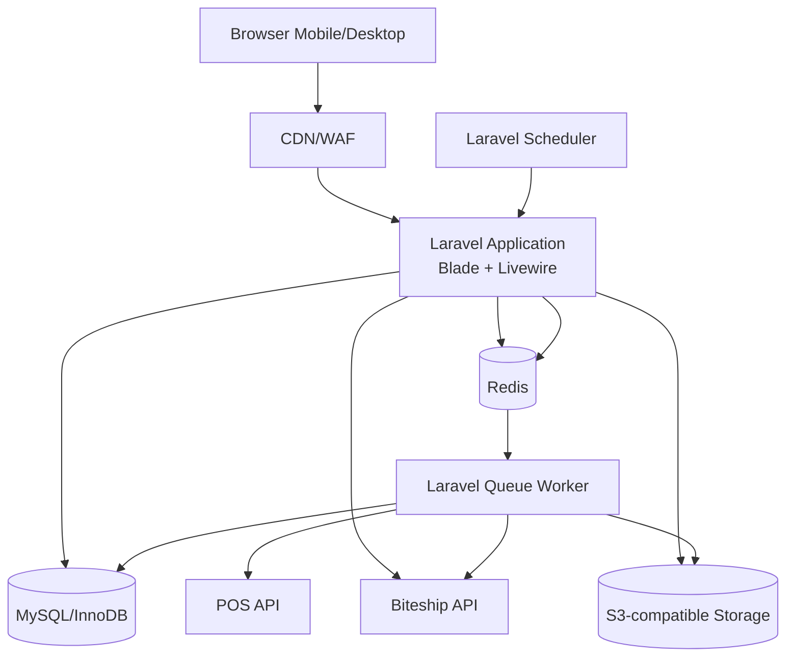
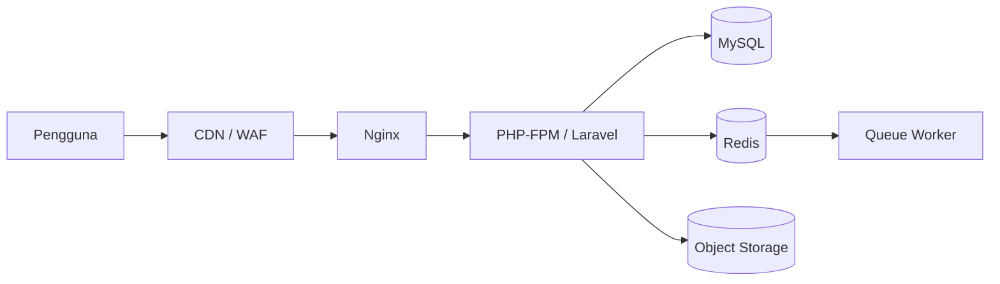
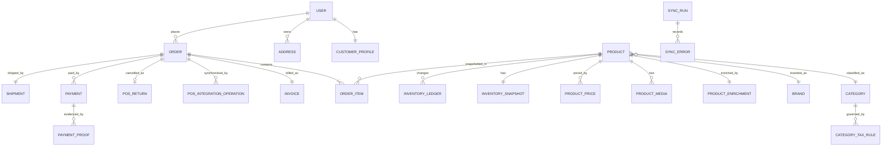

# Software Requirements Specification (SRS)

## Website E-Commerce Pelanggan Terverifikasi

| Atribut | Nilai |
|---|---|
| Versi | 0.5 - POS API Working Scheme |
| Tanggal | Selasa, 28 Juli 2026 |
| Status | Revised Working Baseline - klarifikasi klien diterapkan bertahap |
| Persetujuan | Sylvi, Sultan, dan Pak Endang - 27 Juli 2026 |
| Kebutuhan bisnis | `BRD.md` |
| Kebutuhan fungsional | `FRD.md` |
| MVP delivery | `MVP.md` |

## 1. Tujuan

SRS mendefinisikan arsitektur, stack, interface, model data konseptual,
non-functional requirements, keamanan, deployment, observability, dan
ketentuan operasional aplikasi.

## 2. Prinsip Desain

- Satu aplikasi modular monolith.
- Satu repository untuk backend, frontend, worker, migration, dan test.
- Laravel menjadi source of truth untuk business logic.
- Blade/Livewire digunakan untuk UI; tidak dibangun SPA terpisah.
- Node.js hanya digunakan pada tahap build aset, bukan runtime production.
- Database relasional menjadi source of truth transaksi.
- Redis tidak menyimpan data transaksi utama.
- Integrasi eksternal dijalankan melalui backend dan queue.
- Seeder menggunakan kontrak import internal yang sama dengan adapter POS agar
  perpindahan sumber data tidak mengubah domain transaksi.
- Implementasi dimulai sederhana, tetapi aplikasi dibuat stateless sejauh
  praktis agar dapat ditingkatkan kapasitasnya.
- Microservices, Kubernetes, dan event streaming tidak digunakan pada fase
  awal.

### 2.1 Engineering Governance Hybrid

SRS menjadi technical baseline untuk MVP melalui stage-gate, sedangkan
implementasi dilakukan iteratif per sprint.

- Arsitektur, kontrak data, keamanan minimum, acceptance criteria P0, dan
  release gate dibekukan pada MVP baseline.
- Setiap sprint menghasilkan increment yang dapat diuji di staging.
- Perubahan teknis yang memengaruhi kontrak API, database, transaksi, security,
  atau deployment wajib memiliki impact analysis dan Architecture Decision
  Record (ADR) ringkas.
- CI dijalankan pada setiap pull request; UAT akhir bukan waktu pertama fitur
  diuji.
- Fitur `TBD`, `ON_HOLD`, atau candidate tidak boleh dibuat secara spekulatif.
- Perubahan tetap harus menjaga backward compatibility, migration safety, test,
  observability, dan rollback.

### 2.2 Change Notice dan Klarifikasi 27-28 Juli 2026

Klarifikasi klien pada 28 Juli 2026 menetapkan:

- setiap produk memiliki harga eceran, partai, dan grosir dari POS;
- harga eceran disimpan tetapi tidak ditampilkan pada storefront fase saat ini;
- harga grosir memiliki minimum kuantitas per produk, sedangkan penerapan harga
  partai lintas item masih menunggu OPN-013;
- istilah batas maksimal dikoreksi menjadi ambang nilai belanja per klasifikasi;
  melewati ambang tidak menolak checkout;
- PPh 22 menggunakan tarif configurable, termasuk `0%`, dan dipicu ketika
  ambang klasifikasi terlampaui; dasar pengenaan menunggu OPN-006;
- SKU, nama produk, kategori/klasifikasi, merek, harga, dan stok bersumber dari
  POS;
- master data dan inventory disinkronkan penuh sekali sehari; stok per produk
  dapat dicek berkala untuk rekonsiliasi;
- `CreateSalesOrder` dipanggil per transaksi dan langsung mengurangi stok POS
  serta menerbitkan invoice;
- `CancelSalesOrder` menerbitkan retur dan mengembalikan stok POS;
- lookup sales order digunakan untuk rekonsiliasi invoice, retur, dan status;
- field POS menjadi sumber utama ketika tersedia, sedangkan website hanya
  melengkapi field yang belum tersedia;
- development memakai data contoh sampai akses POS dibuka setelah alur website
  berjalan;
- pesanan `WAITING_PAYMENT` otomatis dibatalkan pada hari kalender berikutnya.

Nilai harga, jenis harga, aturan PPh 22 yang terpakai, dasar perhitungan, tarif,
dan hasilnya harus disimpan sebagai snapshot transaksi.

## 3. Keputusan Arsitektur

### 3.1 Pola

**Rekomendasi: modular monolith dengan worker terpisah sebagai process.**

Alasan:

- seluruh scope masih berada dalam satu domain e-commerce;
- target awal concurrent user belum besar;
- transaksi, stok, invoice, dan pembayaran membutuhkan konsistensi kuat;
- satu codebase mempercepat pengembangan dan debugging;
- worker dapat ditambah tanpa memisahkan service bisnis;
- modul dapat diekstraksi di masa depan hanya jika terdapat bukti kebutuhan.

### 3.2 Modul Aplikasi

- Identity and Access
- Customer Management
- Catalog
- Product Enrichment
- Pricing
- Inventory
- POS Integration
- Seed Data Support
- Cart
- Order
- Invoice
- Payment
- Shipping
- Biteship Integration
- Reporting
- Audit
- Background Jobs

### 3.3 Component Diagram



## 4. Technology Stack

| Area | Pilihan | Keterangan |
|---|---|---|
| Language | PHP 8.4 | Runtime utama |
| Framework | Laravel 13 | Modular monolith |
| View | Blade | SSR untuk storefront dan halaman umum |
| Reactive UI | Livewire | Form, cart, checkout, filter, dan admin |
| Client interaction | Alpine.js | Modal, dropdown, preview, dan interaksi ringan |
| Styling | Tailwind CSS | Dibangun menjadi aset statis |
| Asset bundler | Vite | Build-time; bukan production backbone |
| Database | MySQL 8.4 / InnoDB | Transaksi ACID dan row-level locking |
| Cache/Queue | Redis | Profil VPS |
| Queue monitor | Supervisor | Menjaga worker tetap hidup |
| Web server | Nginx + PHP-FPM | Profil VPS |
| File storage | S3-compatible object storage | Media dan bukti pembayaran |
| Testing | PHPUnit atau Pest | Unit, feature, integration |
| CI/CD | GitHub Actions | Lint, test, build, dan deployment |
| Edge | Cloudflare atau ekuivalen | CDN, WAF, dan rate limiting |

### 4.1 Dependency Policy

- Gunakan fitur Laravel/PHP sebelum menambah package.
- Package baru harus memiliki fungsi jelas, maintenance aktif, dan lisensi
  yang sesuai.
- Hindari abstraction layer untuk satu implementasi kecuali diperlukan pada
  trust boundary atau integrasi eksternal.
- Versi dependency dikunci melalui `composer.lock` dan lockfile frontend.

## 5. Deployment Profile

### 5.1 Profil A - VPS (Opsi Upgrade)

Baseline awal:

- 2 vCPU;
- 4 GB RAM;
- SSD 40-80 GB;
- Ubuntu LTS;
- Nginx, PHP-FPM, MySQL, Redis, dan Supervisor;
- backup database ke lokasi eksternal;
- object storage di luar disk aplikasi;
- CDN/WAF di depan aplikasi.

Ukuran tersebut merupakan titik awal dan wajib divalidasi dengan load test.



### 5.2 Profil B - Shared Hosting (Production Baseline)

Jika shared hosting dipilih:

- runtime hanya PHP + MySQL/MariaDB;
- aset frontend dibangun di CI/developer lalu di-deploy sebagai file statis;
- cache dan queue menggunakan database/file;
- scheduler menggunakan cron;
- queue diproses periodik dengan proses yang berhenti setelah antrean kosong;
- tidak ada Redis lokal, Supervisor, persistent worker, Octane, WebSocket
  server, Docker runtime, Node runtime, atau PM2.

Keterbatasan shared hosting diterima sebagai baseline production. Desain harus
menjaga sinkronisasi, retry, dan monitoring tetap ringan serta memindahkan
kebutuhan persistent worker atau resource lebih besar ke opsi upgrade VPS.

### 5.3 Keputusan Hosting

Status final: **shared hosting milik klien**. Aplikasi memakai runtime PHP dan
database yang disediakan hosting; VPS hanya menjadi opsi upgrade jika batas
resource shared hosting tidak lagi mencukupi.

## 6. Scalability Strategy

Tahapan peningkatan:

1. Shared hosting dengan cache/queue berbasis database atau file, cron, dan
   aset statis hasil build.
2. Vertical scaling CPU/RAM berdasarkan metrics.
3. Pindahkan database dan Redis ke resource terpisah.
4. Jalankan beberapa application node di belakang load balancer.
5. Terapkan autoscaling hanya setelah pola beban terbukti.

Sejak fase pertama:

- file user tidak bergantung pada local disk;
- session dapat dipindahkan ke Redis/database;
- job harus idempotent;
- nomor order/invoice memiliki constraint unik;
- application node tidak menyimpan state bisnis di memory;
- konfigurasi berasal dari environment;
- cache boleh dihapus tanpa kehilangan transaksi.

## 7. External Interfaces

### 7.1 POS API

Working scheme dari klien:

| Domain | Operasi Kerja | Arah | Cadence | Tujuan |
|---|---|---|---|---|
| Master Data | `GetCategory` | POS -> Web | Sekali sehari | Sinkronisasi klasifikasi/kategori. |
| Master Data | `GetAllProducts` | POS -> Web | Sekali sehari | Sinkronisasi daftar produk. |
| Master Data | `GetProductDetail` | POS -> Web | Sekali sehari/ketika diperlukan | Melengkapi detail produk dari POS. |
| Master Data | `GetPriceList` | POS -> Web | Sekali sehari | Sinkronisasi harga eceran, partai, dan grosir. |
| Inventory | `GetAllStock` | POS -> Web | Sekali sehari | Membentuk snapshot stok awal hari. |
| Inventory | `GetStockByProduct` | POS -> Web | Berkala/ketika diperlukan | Mencocokkan stok produk tertentu. |
| Sales Order | `CreateSalesOrder` | Web -> POS | Setiap transaksi | Membuat sales order, mengurangi stok POS, dan menerbitkan invoice. |
| Sales Order | `CancelSalesOrder` | Web -> POS | Setiap pembatalan | Membatalkan sales order, menerbitkan retur, dan mengembalikan stok. |
| Sales Order | `GetAllSalesOrder` | POS -> Web | Rekonsiliasi | Mencocokkan daftar sales order/invoice/retur. |
| Sales Order | `GetSalesOrderDetail` | POS -> Web | Rekonsiliasi/ketika diperlukan | Mencocokkan detail transaksi dan referensi POS. |

Nama di atas adalah nama operasi pada diagram, bukan kontrak HTTP final.
Klien/vendor POS masih harus menyediakan:

- base URL dan environment sandbox/production;
- autentikasi dan mekanisme rotasi credential;
- contoh request/response;
- daftar field dan tipe data;
- stable product identifier;
- pagination;
- rate limit;
- timeout yang disarankan;
- daftar error;
- versi API dan kebijakan perubahan;
- kontrak final seluruh operasi yang tercantum pada working scheme;
- dukungan external reference/idempotency untuk operasi write-back;
- aturan pencarian berdasarkan external reference;
- skema invoice dan retur;
- perilaku transaksi ketika request timeout tetapi sudah diproses POS.

Website:

- memanggil API hanya dari backend/worker;
- menyimpan external ID;
- memvalidasi payload sebelum upsert;
- menggunakan timeout, retry dengan backoff, dan idempotency;
- mencegah overlapping sync;
- mencatat hasil setiap proses;
- menerapkan field POS ketika tersedia dan mempertahankan pelengkap lokal hanya
  untuk field yang tidak tersedia;
- menyimpan external reference unik untuk setiap write-back;
- tidak melakukan retry buta setelah timeout `CreateSalesOrder` atau
  `CancelSalesOrder`;
- menandai operasi ambigu sebagai `RECONCILIATION_REQUIRED`;
- menyimpan POS sales order ID, invoice ID/number, return ID, payload hash,
  status, attempt count, dan correlation ID tanpa menyimpan secret.

#### 7.1.1 Data Contoh Non-Production

Jika koneksi POS belum tersedia:

- development, staging, demo, dan UAT menggunakan data contoh deterministik;
- data contoh memanggil jalur import/upsert yang sama dengan adapter POS, bukan
  menulis langsung dengan aturan bisnis berbeda;
- dataset memakai SKU/external ID stabil dan mencakup skenario harga serta stok
  representatif, termasuk harga eceran, partai, grosir, minimum grosir, dan
  aturan ambang klasifikasi;
- eksekusi ulang bersifat idempotent;
- pelengkap lokal dipertahankan ketika field POS tidak tersedia; nilai POS
  menjadi sumber utama ketika field tersebut tersedia;
- data contoh tidak menyimpan credential atau data pribadi production;
- production tidak menjalankan data contoh; produk dan stok production wajib
  berasal dari koneksi POS yang telah diuji.

Data contoh memungkinkan pengembangan dan UAT berlanjut, tetapi tidak
menggantikan pengujian koneksi terhadap POS asli sebelum go-live.

### 7.2 Data Ownership

| Data | Master Default | Status |
|---|---|---|
| External product ID | POS | Amendment |
| SKU | POS | Baseline |
| Nama dasar produk | POS | Baseline |
| Stok aktual | POS | Baseline |
| Produk/stok contoh sebelum POS tersedia | Data contoh | Baseline non-production |
| Status ketersediaan | Dihitung website dari stok POS | Draft |
| Harga eceran, partai, dan grosir | POS | Baseline |
| Minimum kuantitas grosir | POS | Baseline |
| Kategori/klasifikasi dan merek | POS | Baseline |
| Konfigurasi ambang klasifikasi dan tarif PPh 22 | POS atau website | Open decision - OPN-006 |
| Gambar/video | POS ketika tersedia; fallback website | Baseline |
| Deskripsi pemasaran | POS ketika tersedia; fallback website | Baseline |
| SEO/slug/label/urutan | POS ketika tersedia; fallback website | Baseline |

### 7.3 Biteship API

Input minimum:

- origin;
- destination;
- berat/dimensi sesuai kontrak;
- kurir atau preferensi layanan.

Nilai origin, berat/dimensi, dan mapping alamat tidak boleh diasumsikan dalam
kode; sumber serta nilai defaultnya menunggu
[OPN-021](BRD.md#opn-021).

Output yang digunakan:

- kode layanan;
- nama layanan;
- estimasi waktu;
- biaya.

Ketentuan:

- tidak melakukan booking/pickup;
- credential hanya di backend;
- response tervalidasi;
- timeout dan error dicatat;
- kegagalan tidak menghasilkan ongkir nol.

## 8. API Internal

Jika endpoint JSON diperlukan untuk Livewire, admin, atau integrasi internal:

- prefix `/api/v1`;
- autentikasi dan authorization pada backend;
- resource menggunakan kata benda;
- pagination untuk collection;
- error mempunyai `code`, `message`, `details`, dan `request_id`;
- request order menggunakan idempotency key;
- endpoint admin dan pelanggan memakai policy berbeda;
- credential eksternal tidak pernah dikirim ke frontend.

Contoh error:

```json
{
  "code": "STOCK_NOT_AVAILABLE",
  "message": "Stok produk tidak mencukupi.",
  "details": {
    "sku": "SKU-001"
  },
  "request_id": "req_..."
}
```

## 9. Conceptual Data Model

### 9.1 Entity Utama

| Entity | Tujuan |
|---|---|
| users | Identitas dan kredensial pengguna. |
| customer_profiles | Data bisnis pelanggan dan status verifikasi. |
| addresses | Alamat pelanggan dan snapshot sumber alamat. |
| roles / permissions | Hak akses admin dan pelanggan. |
| products | Data inti produk serta external identifier. |
| product_enrichments | Deskripsi pemasaran, SEO, label, dan status tampil. |
| product_media | Metadata gambar/video dan object key. |
| categories | Klasifikasi produk. |
| brands | Merek produk. |
| product_prices | Tiga jenis harga dari POS, minimum kuantitas, dan metadata penerapannya. |
| category_tax_rules | Klasifikasi terpilih, ambang nilai belanja, tarif PPh 22, status aktif, dan sumber konfigurasi. |
| inventory_snapshots | Nilai stok terbaru per produk. |
| inventory_ledger | Riwayat perubahan stok. |
| carts / cart_items | Keranjang aktif. |
| orders | Header transaksi dan status. |
| order_items | Snapshot produk, kuantitas, dan harga. |
| order_charge_components | Snapshot komponen biaya aktif, dasar perhitungan, tarif/nilai, dan total. |
| invoices | Referensi invoice POS, nomor lokal jika disetujui, dan snapshot total. |
| pos_integration_operations | External reference, operasi, payload hash, status, attempt, correlation ID, dan hasil rekonsiliasi. |
| pos_returns | Referensi retur POS, sales order asal, alasan pembatalan, dan perubahan stok. |
| payments | Pengajuan dan verifikasi pembayaran. |
| payment_proofs | Metadata file bukti pembayaran. |
| shipments | Metode, layanan, area, ongkir, dan status. |
| store_courier_rates | Tarif kurir toko per wilayah. |
| sync_runs | Ringkasan eksekusi sinkronisasi. |
| sync_errors | Detail item yang gagal. |
| audit_logs | Jejak tindakan kritis. |

Model data menyimpan konfigurasi PPh 22 terpisah dari snapshot biaya order.
Perubahan konfigurasi klasifikasi, ambang, atau tarif tidak boleh mengubah
invoice lama. Dasar pengenaan dan sumber konfigurasi tetap menunggu
[`OPN-006`](BRD.md#opn-006). Perubahan skema harus melalui migration, data
dictionary, test, dan ADR.

### 9.2 Relasi Konseptual



ERD detail, cardinality final, field, index, dan constraint akan ditetapkan pada
dokumen ERD/Data Dictionary setelah keputusan terbuka diselesaikan.

## 10. Transaction and Concurrency

Operasi berikut harus atomik:

- pembuatan draft order, order item, snapshot biaya, dan external reference;
- penerapan respons sukses POS ke order, invoice reference, dan stok efektif;
- verifikasi pembayaran dan perubahan status;
- penerapan respons pembatalan/retur ke status order dan stok efektif.

Ketentuan:

- gunakan database transaction;
- gunakan row-level locking atau optimistic concurrency sesuai flow;
- urutan locking konsisten untuk mengurangi deadlock;
- deadlock/transient error dapat di-retry terbatas;
- constraint database mencegah duplicate invoice, SKU, dan external ID;
- validasi stok dilakukan kembali sebelum commit order.

Remote API tidak dapat berada dalam database transaction yang sama. Alur
write-back minimum:

1. simpan draft order dan external reference unik;
2. kirim `CreateSalesOrder`;
3. jika sukses, simpan POS sales order/invoice reference, kurangi stok efektif,
   lalu aktifkan order;
4. jika timeout atau hasil ambigu, tandai `RECONCILIATION_REQUIRED` dan cari
   transaksi berdasarkan external reference sebelum retry;
5. pembatalan memakai pola yang sama dengan `CancelSalesOrder`; respons sukses
   menyimpan return reference dan menambah stok efektif.

## 11. Queue and Scheduler

Queue minimum:

- `critical`: proses yang memengaruhi transaksi;
- `pos-sync`: sinkronisasi dan rekonsiliasi POS;
- `notifications`: email/pesan operasional;
- `reports`: export atau agregasi berat.

Ketentuan job:

- idempotent;
- mempunyai timeout;
- mempunyai jumlah retry dan backoff;
- error permanen masuk failed job;
- payload tidak berisi credential mentah;
- status dapat dimonitor;
- deploy me-restart worker secara graceful.

Queue `notifications` hanya diaktifkan untuk event dan channel yang telah
disetujui pada [OPN-023](BRD.md#opn-023); keberadaan queue bukan persetujuan
untuk mengirim email, WhatsApp, atau channel lain.

Scheduler minimum:

- sinkronisasi penuh master data dan inventory sekali sehari;
- pencocokan stok produk tertentu secara berkala/ketika diperlukan;
- rekonsiliasi sales order, invoice, dan retur;
- pembatalan idempotent untuk order `WAITING_PAYMENT` dari hari kalender
  sebelumnya;
- retry/reconciliation;
- pembersihan temporary upload;
- pruning log sesuai retention;
- backup/health check sesuai platform.

## 12. Non-Functional Requirements

### 12.1 Performance

| ID | Requirement | Target Draft |
|---|---|---|
| NFR-PERF-001 | Response internal untuk request baca normal | p95 <= 800 ms, di luar latency eksternal |
| NFR-PERF-002 | Halaman storefront utama | LCP p75 <= 2,5 detik pada kondisi target |
| NFR-PERF-003 | Endpoint collection | Wajib pagination dan batas maksimum page size |
| NFR-PERF-004 | Query laporan berat | Tidak memblokir request transaksi; gunakan queue/export |
| NFR-PERF-005 | Kapasitas | Baseline pengguna bersamaan normal maksimal 50 pengguna dan divalidasi melalui load test proporsional shared hosting |

### 12.2 Availability and Resilience

| ID | Requirement |
|---|---|
| NFR-AVL-001 | Health check tersedia untuk aplikasi, database, cache, dan worker. |
| NFR-AVL-002 | Kegagalan POS tidak menghapus data katalog terakhir yang valid. |
| NFR-AVL-003 | Kegagalan Biteship tidak membuat ongkir salah. |
| NFR-AVL-004 | Retry hanya untuk kegagalan sementara. |
| NFR-AVL-005 | Queue backlog dan failed job menghasilkan alert. |
| NFR-AVL-006 | Target availability bulanan ditetapkan sebelum go-live. |

### 12.3 Security

| ID | Requirement |
|---|---|
| NFR-SEC-001 | Password memakai adaptive hashing bawaan Laravel. |
| NFR-SEC-002 | Session cookie menggunakan Secure, HttpOnly, dan SameSite yang sesuai. |
| NFR-SEC-003 | Authorization diperiksa server-side melalui middleware/policy. |
| NFR-SEC-004 | Form dilindungi CSRF dan input divalidasi. |
| NFR-SEC-005 | Login, registrasi, upload, checkout, dan sync memiliki rate limit. |
| NFR-SEC-006 | File upload divalidasi MIME, ukuran, nama, dan aksesnya. |
| NFR-SEC-007 | Bukti pembayaran disimpan privat dan diberikan melalui signed URL sementara. |
| NFR-SEC-008 | Credential disimpan di environment/secret store, bukan repository. |
| NFR-SEC-009 | Log tidak memuat password, token, atau data finansial sensitif mentah. |
| NFR-SEC-010 | Dependency vulnerability scan dijalankan di CI. |

### 12.4 Data and Time

- Database menyimpan timestamp dalam UTC.
- UI dan business rule pembatalan menggunakan `Asia/Jakarta`.
- Uang disimpan sebagai integer rupiah atau decimal fixed precision; tidak
  menggunakan floating point.
- Snapshot order tidak bergantung pada data produk terkini.
- Data pribadi mengikuti retention dan kebijakan penghapusan yang disetujui.

### 12.5 Browser and Accessibility

- Mendukung dua versi mayor terbaru Chrome, Edge, Firefox, dan Safari pada UAT.
- Layout responsif untuk mobile, tablet, dan desktop.
- Form memiliki label, pesan error, keyboard navigation, dan focus state.
- Kontras, heading, serta semantic HTML mengikuti baseline WCAG 2.1 AA sejauh
  relevan dengan scope.

## 13. File and Media Handling

- Database menyimpan metadata/object key, bukan binary.
- Gambar produk dibuatkan varian ukuran/thumbnail.
- Video tidak diproses sinkron di request pengguna.
- Bukti pembayaran tidak diletakkan pada public directory.
- Upload memiliki batas ukuran dan allowlist MIME.
- Nama file client tidak digunakan sebagai object key final.
- Malware scanning ditambahkan jika risk assessment mewajibkan.
- Retention bukti pembayaran dan orphan upload masih `TBD`.

## 14. Caching and Traffic Spike Protection

- Cache katalog, kategori, merek, dan konfigurasi yang sering dibaca.
- Jangan cache data stok/harga tanpa TTL dan invalidation yang jelas.
- Gunakan cache stampede protection/lock untuk data mahal.
- Static asset dan media publik dilayani melalui CDN.
- Terapkan edge dan application rate limiting.
- Bot dan brute-force dilindungi WAF/challenge sesuai kebutuhan.
- Queue menyerap lonjakan pekerjaan integrasi.
- Laporan dan export besar dijalankan asynchronous.

Metrics yang dipantau:

- request rate dan concurrent request;
- p50/p95/p99 response time;
- error rate;
- CPU, memory, disk, dan network;
- database connection, slow query, dan lock wait;
- Redis memory dan eviction;
- queue depth, queue lag, dan failed job;
- latency/error POS dan Biteship;
- storage growth.

Threshold alert awal harus dituning setelah load test. Contoh draft:

- CPU > 70% selama 10 menit;
- memory > 80%;
- disk > 75%;
- error rate > 1% selama 5 menit;
- p95 > 1,5 detik selama 10 menit;
- queue lag critical > 60 detik;
- kegagalan sinkronisasi berulang >= 3 kali.

## 15. Logging, Audit, and Observability

Application log menggunakan structured log dengan:

- timestamp;
- level;
- environment;
- request/correlation ID;
- actor ID jika tersedia;
- module/action;
- error code;
- exception tanpa secret.

Audit log minimum:

- verifikasi dan perubahan status akun;
- perubahan harga dan kebijakan pembelian yang telah disetujui;
- verifikasi/penolakan pembayaran;
- perubahan status dan pembatalan order;
- sinkronisasi manual;
- perubahan konfigurasi kurir.

Audit log tidak boleh dapat diubah melalui UI operasional biasa.

## 16. Backup and Disaster Recovery

Baseline proposal menyebut backup mingguan. Untuk data transaksi,
direkomendasikan:

- backup database harian;
- backup file/object sesuai versioning/retention;
- salinan backup di lokasi berbeda;
- enkripsi backup;
- pengujian restore berkala;
- dokumentasi recovery procedure.

Target final:

| Parameter | Target |
|---|---|
| RPO | TBD |
| RTO | TBD |
| Retention backup | TBD |
| Frekuensi restore test | Minimal berkala; final TBD |

## 17. Development and Deployment

### 17.1 Environment

- local development;
- staging/UAT;
- production.

Staging menggunakan kontrak konfigurasi yang sama dengan production dan tidak
memakai credential production.

### 17.2 CI Gate

Pipeline minimal:

1. Composer install dari lockfile.
2. Static analysis/lint.
3. Unit dan feature test.
4. Migration check.
5. Frontend install/build dari lockfile.
6. Security audit dependency.
7. Verifikasi traceability requirement dan test untuk item sprint.
8. Build deployment artifact.

### 17.3 Deployment

- maintenance mode hanya jika diperlukan;
- backup/migration plan sebelum perubahan skema berisiko;
- migration bersifat backward-compatible sejauh praktis;
- cache konfigurasi/route/view dibangun;
- worker di-restart graceful;
- smoke test dijalankan;
- rollback procedure tersedia.

Docker bersifat opsional untuk local development. Kubernetes tidak digunakan.

### 17.4 Increment dan Release Gate

Setiap increment:

- berasal dari backlog yang memenuhi Definition of Ready pada FRD;
- dikembangkan melalui branch/pull request yang dapat direview;
- lulus CI, test relevan, migration check, dan security review proporsional;
- di-deploy ke staging;
- didemokan dan diverifikasi terhadap acceptance criteria;
- hanya dianggap selesai jika memenuhi Definition of Done pada FRD.

Release production hanya dilakukan dari artifact yang sama dengan artifact UAT
dan setelah:

- seluruh P0/MVP diterima;
- item `ON_HOLD` telah dikeluarkan dari MVP atau diaktifkan secara tertulis;
- defect kritis/tinggi ditutup atau diterima sebagai risiko tertulis;
- backup, migration, rollback, smoke test, monitoring, dan sign-off tersedia.

Jika API POS belum tersedia saat release, production gate harus mencatat
keputusan `OPN-019`. Tanpa persetujuan tersebut, seeder tidak boleh diperlakukan
sebagai sumber stok production.

## 18. Testing Requirements

| Level | Cakupan Minimum |
|---|---|
| Unit | Pemilihan harga partai/grosir, visibilitas harga eceran, ambang klasifikasi, PPh 22, status stok, dan auto-cancel D+1. |
| Feature | Registrasi, approval, cart, checkout, pembayaran, pembatalan, laporan. |
| Integration | Seluruh operasi POS kerja, external reference/idempotency, timeout ambigu, rekonsiliasi invoice/retur, transisi seeder-ke-API, dan Biteship quote. |
| Security | Authorization, IDOR, CSRF, rate limit, dan upload. |
| Concurrency | Double checkout, duplicate request, dan stock race. |
| Performance | Katalog, checkout, laporan, dan traffic spike. |
| Increment acceptance | Acceptance criteria backlog sprint diverifikasi di staging pada akhir setiap sprint. |
| UAT | Seluruh acceptance criteria P0/MVP berstatus baseline dan tidak `ON_HOLD`. |
| Recovery | Restore backup dan retry failed sync. |

## 19. Traceability FRD ke SRS

| Functional Area | SRS Section |
|---|---|
| FR-AUTH | Security, Data Model, API Internal |
| FR-CAT / FR-PRC | Data Ownership, Data Model, Caching |
| FR-POS | POS API, Queue, Observability, Resilience |
| FR-CART / FR-ORD | Transaction and Concurrency, Data Model |
| FR-SHP | Biteship API, Resilience |
| FR-PAY | Security, File Handling, Audit |
| FR-RPT | Performance, Queue, Data Model |
| FR-AUD | Logging, Audit, Observability |

## 20. Technical Decisions Open

| ID | Decision | Referensi BRD | Status |
|---|---|---|---|
| TD-001 | Shared hosting milik klien sebagai production baseline. | OPN-001 | Resolved |
| TD-002 | MySQL/MariaDB mengikuti versi yang tersedia pada shared hosting. | OPN-001 | Confirm during setup |
| TD-003 | Working operation POS tersedia; URL/method/payload/auth/error/idempotency belum final. Data contoh hanya dipakai di non-production. | OPN-005, OPN-019 | Partially resolved; connection contract open |
| TD-004 | `CreateSalesOrder` mengurangi stok dan menerbitkan invoice; `CancelSalesOrder` membuat retur dan mengembalikan stok. | OPN-004, OPN-005 | Business flow resolved; technical contract open |
| TD-005 | Master tiga jenis harga, kategori, merek, nama produk, dan SKU. | OPN-003, OPN-013 | Resolved - POS |
| TD-006 | Full master/inventory sync sekali sehari; stock-by-product berkala bila diperlukan. | OPN-005 | Resolved working cadence; SLA/trigger final open |
| TD-007 | Object storage provider dan kebijakan retensi. | OPN-009 | Open |
| TD-008 | Baseline pengguna bersamaan normal maksimal 50 pengguna. | OPN-012 | Assumption; validate by load test |
| TD-009 | RPO, RTO, availability, dan monitoring provider. | OPN-012 | Open |
| TD-010 | Dasar pengenaan PPh 22, sumber konfigurasinya, dan expiry order belum dibayar. | OPN-006, OPN-007 | PPh 22 partially open; expiry D+1 resolved |
| TD-011 | Web mengelola lifecycle sampai pengiriman; pembatalan memanggil POS dan menghasilkan retur. Status fulfillment/resi tetap terbuka. | OPN-020 | Partially resolved |
| TD-012 | Origin, berat/dimensi produk, dan mapping alamat untuk Biteship. | OPN-021 | Open |
| TD-013 | Format/penyampaian invoice serta event/channel notifikasi. | OPN-022, OPN-023 | Open |
| TD-014 | POS menerbitkan invoice saat create sales order; status invoice POS sebagai dokumen resmi tunggal atau referensi website belum final. | OPN-008, OPN-022 | Partially resolved |

## 21. Referensi Teknis

- Laravel 13 documentation: <https://laravel.com/docs/13.x>
- Laravel queue: <https://laravel.com/docs/13.x/queues>
- Laravel scheduler: <https://laravel.com/docs/13.x/scheduling>
- Laravel Livewire: <https://livewire.laravel.com/>
- MySQL InnoDB: <https://dev.mysql.com/doc/refman/8.4/en/innodb-introduction.html>
